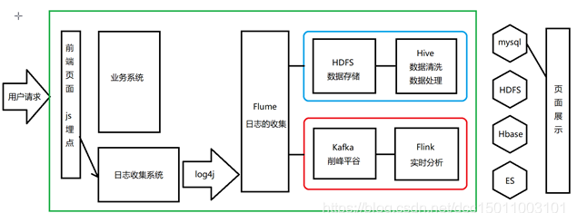

# 1.课前资料


# 2.课程整体介绍




# 3.大数据介绍

### 什么是大数据？

简单来说大数据就是海量数据及其处理。

大数据（big data），指无法在一定时间范围内用常规软件工具进行捕捉、管理和处理的数据集合，是需要新处理模式才能具有更强的决策力、洞察发现力和流程优化能力的海量、高增长率和多样化的信息资产（资源）。

在维克托·迈尔-舍恩伯格及肯尼斯·库克耶编写的《大数据时代》 [2]  中大数据指不用随机分析法（抽样调查）这样的捷径，而采用所有数据进行分析处理。大数据的5V特点（IBM提出）：Volume（大量）、Velocity（高速）、Variety（多样）、Value（低价值密度）、Veracity（真实性）。——摘自百度百科

 

### 为什么要学习大数据?

拓宽发展面

大数据已经成为基础技术，现在最火的人工智能，物联网等就建立在大数据的基础上。

面向面试，提高认知深度，拓宽知识广度，增加面试筹码，提高薪资。

 

### 大数据相关技术

海量数据获取
爬虫（分析别人家的事）：Python，java…

日志（分析自己的事）：log4j、flume（数据的收集聚集加载）

历史数据（分析以前的事）：mysql、oracle、ETL（数据的提取转化加载）hdfs、

实时数据（分析现在的事）:hbase、spark、flink

 

### 海量数据存储

HDFS（Hive、Hbase、Spark依赖存储都是HDFS）Hadoop distributed file system

S3（亚马逊）

NFS(sun公司)


### 海量数据清洗

数据清洗没有我们想的那么复杂，方式有很多：

过程中可以用代码直接清洗，flume可以清洗，Hive可以清洗，flink可以清洗。整个流程中几乎每个步骤都可以做到数据的清洗。

 

### 海量数据处理

离线数据处理：MapReduce（hadoop的一部分）、Hive（底层是MR，业界主流）、SparkSQL、FlinkDataSet

流式数据处理：Flink（全面高效）、Storm（速度快，亚秒级）、SparkStreaming（速度没有Storm快，但是吞吐量高）

# 4.集群环境准备

## 4.1准备虚拟机

克隆三个虚拟机hadoop01、hadoop02、hadoop03均为NAT模式，其中hadoop01内存设置为1G（16G内存以上建议设置为2G），hadoop02和hadoop03为512M。

注：虚拟机登录的用户名和密码都是root


## 4.2修改为静态IP


修改IP地址，将：

第一台hadoop01的虚拟机ip地址改为：192.168.65.101

第二台hadoop02的虚拟机ip地址改为：192.168.65.102

第三台hadoop03的虚拟机ip地址改为：192.168.65.103

### 4.2.1配置文件

```shell
cd /etc/sysconfig/network-scripts   #进入网络配置目录
 
dir ifcfg*                         #找到网卡配置文件
 
ifcfg-ens33                         #找到版本最新的文件并修改
 
vim ifcfg-ens33
 
或者
 
vim /etc/sysconfig/network-scripts/ifcfg-ens33

```

### 4.2.2配置文件内容

注意不要写注释部分

```shell
TYPE=Ethernet
 
BOOTPROTO=static                              #改成static，针对NAT
 
NAME=eno16777736
 
UUID=4cc9c89b-cf9e-4847-b9ea-ac713baf4cc8
 
DEVICE=eno16777736
 
DNS1=114.114.114.114     #和网关相同
 
ONBOOT=yes               #开机启动此网卡
 
IPADDR=192.168.65.101    #固定IP地址
 
NETMASK=255.255.255.0    #子网掩码
 
GATEWAY=192.168.65.2     #网关和NAT自动配置的相同，不同则无法登录
```

### 4.2.3重启网络

以下两种方式任选其一

```shell
service network restart   #重启网络
 
systemctl restart network.service   #重启网络centos7

```

### 4.2.4查看IP

```shell
ip addr                  #查看IP地址 ip add
```

## 4.3mobaxTerm的使用

                                                  

 

登录成功后，弹出对话框点yes 保存密码。

补充：mobaxTerm远程连接慢的问题

在使用shell连接虚拟机时连接等待时间太长，ssh的服务端在连接时会自动检测dns环境是否一致导致的，修改为不检测即可。

```
1、打开sshd服务的配置文件
vim /etc/ssh/sshd_config
把UseDNS yes改为UseDNS no（如果没有，自行编写在文件末尾加入）
2、重启sshd服务
systemctl restart sshd.service 或者 /etc/init.d/sshd restart
```

## 4.4关闭防火墙

```shell
systemctl stop firewalld.service        #关闭防火墙服务
 
systemctl disable firewalld.service     #禁止防火墙开启启动
 
 
systemctl restart firewalld.service      #重启防火墙使配置生效

systemctl enable firewalld.service       #设置防火墙开机启动
 
```

检查防火墙状态

```shell
[root@hadoop01 ~]# firewall-cmd --state		#检查防火墙状态
false							#返回值，未运行
```

## 4.5修改主机名

```shell
vi /etc/hostname
```

## 4.6修改hosts文件

```shell
vi /etc/hosts
```

在配置文件中增加ip地址映射

```shell
192.168.65.101 hadoop01
 
192.168.65.102 hadoop02
 
192.168.65.103 hadoop03
```

## 4.7三台机器重启

```
reboot
```


## 4.8设置免密登录

### 4.8.1三台机器生成公钥与私钥

```
ssh-keygen
```

执行该命令之后，按下三个回车即可


### 4.8.2拷贝公钥到同一台机器

三台机器执行命令：

```
ssh-copy-id hadoop01
```

### 4.8.3复制第一台机器的认证到其他机器

将第一台机器的公钥拷贝到其他机器上

在第一台机器上面执行以下命令

```
scp /root/.ssh/authorized_keys hadoop02:/root/.ssh
scp /root/.ssh/authorized_keys hadoop03:/root/.ssh
```

### 4.8.4测试

在hadoop01上进行远程登录测试

```
ssh hadoop02
```

不需要输入密码直接进入说明成功，exit退出

## 4.9三台机器时钟同步

通过网络进行时钟同步
通过网络连接外网进行时钟同步,必须保证虚拟机连上外网

```
ntpdate us.pool.ntp.org;
```

阿里云时钟同步服务器

```
ntpdate ntp4.aliyun.com
```

三台机器定时任务

```
crontab  -e   

*/1 * * * * /usr/sbin/ntpdate us.pool.ntp.org;
```

或者直接与阿里云服务器进行时钟同步

```
crontab -e

*/1 * * * * /usr/sbin/ntpdate ntp4.aliyun.com;
```

## 4.10三台机器安装jdk

查看自带的openjdk

```
rpm -qa | grep java
```

如果有，请卸载系统自带的openjdk，方式如下（注：目前系统已经卸载）

```
rpm -e java-1.6.0-openjdk-1.6.0.41-1.13.13.1.el6_8.x86_64 tzdata-java-2016j-1.el6.noarch java-1.7.0-openjdk-1.7.0.131-2.6.9.0.el6_8.x86_64 --nodeps
```

三台机器创建目录

所有软件的安装路径

```
mkdir -p /opt/servers
```

所有软件压缩包的存放路径

```
mkdir -p /opt/softwares
```

上传jdk到/export/softwares路径下去，并解压

```
 tar -xvzf jdk-8u65-linux-x64.tar.gz -C ../servers/
```

配置环境变量

```
vim /etc/profile
```

```
export JAVA_HOME=/opt/servers/jdk1.8.0_65
export PATH=:$JAVA_HOME/bin:$PATH
```

修改完成之后记得  source /etc/profile生效

```
source /etc/profile
```

发送文件到hadoop02和hadoop03

```
scp -r /opt/servers/jdk1.8.0_65/ hadoop02:/opt/servers/
scp -r /opt/servers/jdk1.8.0_65/ hadoop03:/opt/servers/
```

注意：发送完成后要配置环境变量并生效。

测试

```
java -version
```

出现JDK版本号即为成功。

## 4.11修改windows中的hosts文件

在windows中的hosts文件里添加如下映射

```
192.168.65.101 hadoop01
```

# 5.Hadoop介绍

hadoop的定义：hadoop是一个分布式存储和分布式计算的框架。

分布式存储:是一个数据存储技术,将数据存储在多个服务上的(存储单元)磁盘空间中.目前解决的是大量数据存储的问题

分布式计算:是一个计算科学技术,将一个大量的计算过程拆分成若干个小的任务,由多个节点执行,然后进行数据汇总

## 5.2 hadoop的核心组件

HDFS：分布式存储组件

MapReduce：分布式计算组件

Yarn：资源调度管理器

## 5.2 hadoop的介绍及发展历史

1. Hadoop最早起源于Nutch。Nutch的设计目标是构建一个大型的全网搜索引擎，包括网页抓取、索引、查询等功能，但随着抓取网页数量的增加，遇到了严重的可扩展性问题——如何解决数十亿网页的存储和索引问题。
2. 2003年、2004年谷歌发表的两篇论文为该问题提供了可行的解决方案。
    ——分布式文件系统（GFS），可用于处理海量网页的存储
    ——分布式计算框架MAPREDUCE，可用于处理海量网页的索引计算问题。
3. Nutch的开发人员完成了相应的开源实现HDFS和MAPREDUCE，并从Nutch中剥离成为独立项目HADOOP，到2008年1月，HADOOP成为Apache顶级项目(同年，cloudera公司成立)，迎来了它的快速发展期。
    狭义上来说，hadoop就是单独指代hadoop这个软件，
    广义上来说，hadoop指代大数据的一个生态圈，包括很多其他的软件。

## 5.2 hadoop的历史版本介绍

0.x系列版本：hadoop当中最早的一个开源版本，在此基础上演变而来的1.x以及2.x的版本

1.x版本系列：hadoop版本当中的第二代开源版本，主要修复0.x版本的一些bug等

2.x版本系列：架构产生重大变化，引入了yarn平台等许多新特性

3.x版本系列：基于2.x的版本进行多层优化（新特性），主要的是改变MapReduce的数据计算方式。


## 5.3 hadoop2.x架构模型


**文件系统核心模块**：

**NameNode**：集群当中的主节点，主要用于管理集群当中的各种元数据

**secondaryNameNode**：主要能用于hadoop当中元数据信息的辅助管理

**DataNode**：集群当中的从节点，主要用于存储集群当中的各种数据

**数据计算核心模块：**

**ResourceManager**：接收用户的计算请求任务，并负责集群的资源分配

**NodeManager**：负责执行主节点APPmaster分配的任务

## 5.4Hadoop 的安装有三种方式

单机模式：直接解压，只支持MapReduce的测试，不支持HDFS，一般不用。

伪分布式模式：单机通过多进程模拟集群方式安装，支持Hadoop所有功能。

​		优点：功能完整。

​		缺点：性能低下。学习测试用。

完全分布式模式：集群方式安装，生产级别。

HA：高可用。

### 5.4.1 伪分布式部署

需要环境：

JDK，JAVA_HOME，配置hosts，关闭防火墙，配置免密登录等。

注意：我们只将其安装在hadoop01节点上。

#### 进入目录

```
cd /opt/servers
```

#### 上传安装包并解压

```
tar -xvzf hadoop-2.7.7.tar.gz -C ../servers/
```

#### 修改配置文件

位置：/opt/servers/hadoop-2.7.7/etc/hadoop

##### 1.修改hadoop-env.sh

```
vim /opt/servers/hadoop-2.7.7/etc/hadoop/hadoop-env.sh
```

修改

```
export JAVA_HOME=/opt/servers/jdk1.8.0_65
export HADOOP_CONF_DIR=/opt/servers/hadoop-2.7.7/etc/hadoop
```

##### 2.修改 core-site.xml

```
vim /opt/servers/hadoop-2.7.7/etc/hadoop/core-site.xml
```

增加namenode配置、文件存储位置配置：粘贴代码部分到<configuration>标签内

```xml
<property>
 
<!--用来指定hdfs的老大，namenode的地址-->
 
<name>fs.default.name</name>
 
<value>hdfs://hadoop01:8020</value>
 
</property> 
 
<property>
 
<!--用来指定hadoop运行时产生文件的存放目录-->  
 
<name>hadoop.tmp.dir</name>
 
<value>/opt/servers/hadoop-2.7.7/tmp</value>
 
</property>

```

##### 3.修改 hdfs-site.xml

```
vim /opt/servers/hadoop-2.7.7/etc/hadoop/hdfs-site.xml
```

- 配置包括自身在内的备份副本数量到<configuration>标签内

```xml
<property>
 
<!--指定hdfs保存数据副本的数量，包括自己，默认为3-->
 
<!--伪分布式模式，此值必须为1-->
 
<name>dfs.replication</name>
 
<value>1</value>
 
</property>
 
<!--设置hdfs操作权限，false表示任何用户都可以在hdfs上操作文件-->
 
<property>
 
<name>dfs.permissions</name>
 
<value>false</value>
 
</property>

```

##### 4.修改 mapred-site.xml

说明：在/opt/servers/hadoop-2.7.7/etc/hadoop的目录下，只有一个mapred-site.xml.template文件，复制一个。

```
cp mapred-site.xml.template mapred-site.xml
```

```
vim /opt/servers/hadoop-2.7.7/etc/hadoop/mapred-site.xml
```

配置mapreduce运行在yarn上：粘贴高亮部分到<configuration>标签内

```xml
<property> 
 
<!--指定mapreduce运行在yarn上-->
 
<name>mapreduce.framework.name</name>
 
<value>yarn</value>
 
</property>
```

##### 5.修改 yarn-site.xml

```
vim /opt/servers/hadoop-2.7.7/etc/hadoop/yarn-site.xml
```

- 配置：粘贴高亮部分到<configuration>标签内

```xml
<property>
 
<!--指定yarn的老大resourcemanager的地址-->
 
<name>yarn.resourcemanager.hostname</name>
 
<value>hadoop01</value>
 
</property>
 
<property>
 
<!--NodeManager获取数据的方式-->
 
<name>yarn.nodemanager.aux-services</name>
 
<value>mapreduce_shuffle</value>
 
</property>

```

##### 6.修改slaves

```
vim /opt/servers/hadoop-2.7.7/etc/hadoop/slaves
```

修改

```
hadoop01
```

##### 7.配置hadoop的环境变量

```
vim /etc/profile
```

```
export HADOOP_HOME=/opt/servers/hadoop-2.7.7
export PATH=:$HADOOP_HOME/bin:$HADOOP_HOME/sbin:$PATH
```

配置完成之后生效

```
source /etc/profile
```

环境变量配置完成，测试环境变量是否生效

```
echo $HADOOP_HOME
```

#### 启动

##### 1.初始化

```
hdfs namenode -format
```

##### 2.启动

```
start-all.sh
```

##### 3.停止

```
stop-all.sh
```

##### 4.测试

```
jps
```

##### 5.停止服务

```
stop-all.sh
```

##### 6.访问浏览器

windows的浏览器中访问hadoop01:50070

安装成功！

##### 7.如果没有安装成功

如果没有成功（进程数不够）

1.stop-all.sh   停掉hadoop所有进程

2.删掉hadoop2.7.7下的tmp文件

3.hdfs namenode -format   重新初始化（出现successfully证明成功），如果配置文件报错，安装报错信息修改相应位置后重新执行第二步。

4.start-all.sh  启动hadoop

### 5.4.2 完全分布式部署

安装环境服务部署规划

| 服务器IP  | 192.168.65.101       | 192.168.65.102 | 192.168.65.103 |
| --------- | -------------------- | -------------- | -------------- |
|           | NameNode             |                |                |
| HDFS      | Secondary   NameNode |                |                |
|           | DataNode             | DataNode       | DataNode       |
| YARN      | ResourceManager      |                |                |
|           | NodeManager          | NodeManager    | NodeManager    |
| MapReduce | JobHistoryServer     |                |                |

先在第一台机器hadoop01进行部署

注意：如果已安装伪分布模式，先删除格式化后生成的数据文件，其他请略过。

```
rm -rf /opt/servers/hadoop-2.7.7/tmp
```

#### 进入目录

```
cd /opt/servers
```

#### 上传安装包并解压

```
tar -xvzf hadoop-2.7.7.tar.gz -C ../servers/
```

#### 修改配置文件

位置：/opt/servers/hadoop-2.7.7/etc/hadoop

##### 1.修改hadoop-env.sh

```
vim /opt/servers/hadoop-2.7.7/etc/hadoop/hadoop-env.sh
```

修改

```
export JAVA_HOME=/opt/servers/jdk1.8.0_65
export HADOOP_CONF_DIR=/opt/servers/hadoop-2.7.7/etc/hadoop
```

##### 2.修改 core-site.xml

```
vim /opt/servers/hadoop-2.7.7/etc/hadoop/core-site.xml
```

增加namenode配置、文件存储位置配置：粘贴代码部分到<configuration>标签内

```xml
<property>
 
<!--用来指定hdfs的老大，namenode的地址-->
 
<name>fs.default.name</name>
 
<value>hdfs://hadoop01:8020</value>
 
</property> 
 
<property>
 
<!--用来指定hadoop运行时产生文件的存放目录-->  
 
<name>hadoop.tmp.dir</name>
 
<value>/opt/servers/hadoop-2.7.7/tmp</value>
 
</property>

```

##### 3.修改 hdfs-site.xml

```
vim /opt/servers/hadoop-2.7.7/etc/hadoop/hdfs-site.xml
```

- 配置包括自身在内的备份副本数量到<configuration>标签内

```xml
<property>
 
<!--指定hdfs保存数据副本的数量，包括自己，默认为3-->
 
<!--伪分布式模式，此值必须为1-->
 
<name>dfs.replication</name>
 
<value>2</value>
 
</property>
 
<!--设置hdfs操作权限，false表示任何用户都可以在hdfs上操作文件-->
 
<property>
 
<name>dfs.permissions</name>
 
<value>false</value>
 
</property>

```

##### 4.修改 mapred-site.xml

说明：在/opt/servers/hadoop-2.7.7/etc/hadoop的目录下，只有一个mapred-site.xml.template文件，复制一个。

```
cp mapred-site.xml.template mapred-site.xml
```

```
vim /opt/servers/hadoop-2.7.7/etc/hadoop/mapred-site.xml
```

配置mapreduce运行在yarn上：粘贴高亮部分到<configuration>标签内

```xml
<property> 
 
<!--指定mapreduce运行在yarn上-->
 
<name>mapreduce.framework.name</name>
 
<value>yarn</value>
 
</property>
```

##### 5.修改 yarn-site.xml

```
vim /opt/servers/hadoop-2.7.7/etc/hadoop/yarn-site.xml
```

- 配置：粘贴高亮部分到<configuration>标签内

```
<property>
 
<!--指定yarn的老大resourcemanager的地址-->
 
<name>yarn.resourcemanager.hostname</name>
 
<value>hadoop01</value>
 
</property>
 
<property>
 
<!--NodeManager获取数据的方式-->
 
<name>yarn.nodemanager.aux-services</name>
 
<value>mapreduce_shuffle</value>
 
</property>

```

##### 6.修改slaves

```
vim /opt/servers/hadoop-2.7.7/etc/hadoop/slaves
```

修改

```
hadoop01
hadoop02
hadoop03
```

##### 7.配置hadoop的环境变量

```
vim /etc/profile
```

```
export HADOOP_HOME=/opt/servers/hadoop-2.7.7
export PATH=:$HADOOP_HOME/bin:$HADOOP_HOME/sbin:$PATH
```

配置完成之后生效

```
source /etc/profile
```

环境变量配置完成，测试环境变量是否生效

```
echo $HADOOP_HOME
```

##### 8.分发文件到hadoop02、hadoop03服务器

```
cd /opt/servers/
scp -r hadoop-2.7.7/ hadoop02:$PWD
scp -r hadoop-2.7.7/ hadoop03:$PWD
```

##### 9.hadoop02、hadoop03服务器配置hadoop的环境变量

```
vim /etc/profile
```

```
export HADOOP_HOME=/opt/servers/hadoop-2.7.7
export PATH=:$HADOOP_HOME/bin:$HADOOP_HOME/sbin:$PATH
```

配置完成之后生效

```
source /etc/profile
```

环境变量配置完成，测试环境变量是否生效

```
echo $HADOOP_HOME
```

#### 启动

##### 1.初始化

```
hdfs namenode -format
```

##### 2.启动

```
start-all.sh
```

##### 3.停止

```
stop-all.sh
```

##### 4.测试

```
jps
```

##### 5.停止服务

```
stop-all.sh
```

##### 6.访问浏览器

windows的浏览器中访问

hdfs集群访问地址

http://hadoop01:50070/

yarn集群访问地址

<http://hadoop01:8088/>

安装成功！

##### 补充：可以按照组件启动服务

```
start-dfs.sh
start-yarn.sh
```

也可以单独启动一个服务

```
在主节点上使用以下命令启动 HDFS NameNode：
hadoop-daemon.sh start namenode 
在每个从节点上使用以下命令启动 HDFS DataNode： 
hadoop-daemon.sh start datanode 
在主节点上使用以下命令启动 YARN ResourceManager： 
yarn-daemon.sh  start resourcemanager 
在每个从节点上使用以下命令启动 YARN nodemanager： 
yarn-daemon.sh start nodemanager 
```


# 6.hadoop集群初体验

## 6.1、HDFS 使用初体验

从Linux 本地上传一个文本文件到 hdfs 的/test/input 目录下 

hadoop fs -mkdir -p /test/input 

hadoop fs -put /root/install.log  /test/input 	

## 6.2、mapreduce程序初体验 

在 Hadoop 安装包的 

hadoop2.7.7/share/hadoop/mapreduce 下有官方自带的mapreduce 程序。我们可以使用如下的命令进行运行测试。 

示例程序jar: 

```
 hadoop-mapreduce-examples-2.7.7.jar
```

计算圆周率:

```
hadoop jar /opt/servers/hadoop-2.7.7/share/hadoop/mapreduce/hadoop-mapreduce-examples-2.7.7.jar pi 2 5
```

关于圆周率的估算，感兴趣的可以查询资料 Monte Carlo 方法来计算 Pi 值。


# 7 HDFS入门介绍

## 7.1 HDFS 介绍 

HDFS 是 Hadoop Distribute File System 的简称，意为：Hadoop 分布式文件系统。是 Hadoop 核心组件之一，作为最底层的分布式存储服务而存在。 

分布式文件系统解决的问题就是大数据存储。它们是横跨在多台计算机上的存储系统。分布式文件系统在大数据时代有着广泛的应用前景，它们为存储和处理超大规模数据提供所需的扩展能力。

​                                                  

## 7.2 HDFS的特性

首先，它是一个文件系统，用于存储文件，通过统一的命名空间目录树来定位文件； 

其次，它是分布式的，由很多服务器联合起来实现其功能，集群中的服务器有各自的角色。 

### 7.2.1 master/slave 架构 

HDFS 采用 master/slave 架构。一般一个 HDFS 集群是有一个 Namenode 和一定数目的Datanode 组成。Namenode 是 HDFS 集群主节点，Datanode 是 HDFS 集群从节点，两种角色各司其职，共同协调完成分布式的文件存储服务。 

### 7.2.2 分块存储 

HDFS 中的文件在物理上是分块存储（block）的，块的大小可以通过配置参数来规定，默认大小在 hadoop2.x 版本中是 128M。 

### 7.2.3 名字空间（NameSpace） 

HDFS 支持传统的层次型文件组织结构。用户或者应用程序可以创建目录，然后将文件保存在这些目录里。文件系统名字空间的层次结构和大多数现有的文件系统类似：用户可以创建、删除、移动或重命名文件。 

Namenode 负责维护文件系统的名字空间，任何对文件系统名字空间或属性的修改都将被Namenode 记录下来。 

HDFS 会给客户端提供一个统一的抽象目录树，客户端通过路径来访问文件，形如：hdfs://namenode:port/dir-a/dir-b/dir-c/file.data。 

### 7.2.4 namenode 元数据管理 

我们把目录结构及文件分块位置信息叫做元数据。Namenode 负责维护整个hdfs文件系统的目录树结构，以及每一个文件所对应的 block 块信息（block 的id，及所在的datanode 服务器）。

### 7.2.5 Datanode 数据存储 

文件的各个 block 的具体存储管理由 datanode 节点承担。每一个 block 都可以在多个datanode 上。Datanode 需要定时向 Namenode 汇报自己持有的 block信息。 存储多个副本（副本数量也可以通过参数设置 dfs.replication，默认是 3）。 

### 7.2.6 副本机制 

为了容错，文件的所有 block 都会有副本。每个文件的 block 大小和副本系数都是可配置的。应用程序可以指定某个文件的副本数目。副本系数可以在文件创建的时候指定，也可以在之后改变。 

### 7.2.7 一次写入，多次读出 

HDFS 是设计成适应一次写入，多次读出的场景，且不支持文件的修改。 

正因为如此，HDFS 适合用来做大数据分析的底层存储服务，并不适合用来做.网盘等应用，因为，修改不方便，延迟大，网络开销大，成本太高。