# 1.分布式文件系统HDFS

## 1.HDFS的来源

HDFS:Hadoop  Distributed  File  system(hadoop分布式文件系统)

HDFS起源于Google的GFS论文（GFS，Mapreduce，BigTable为google的旧的三驾马车）HBASE

（1） 发表于2003年10月

（2）HDFS是GFS的克隆版

（3）易于扩展的分布式文件系统

（4）运行在大量普通廉价机器上，提供容错机制

（5）为大量用户提供性能不错的文件存取服务

## 2.HDFS的架构图之基础架构

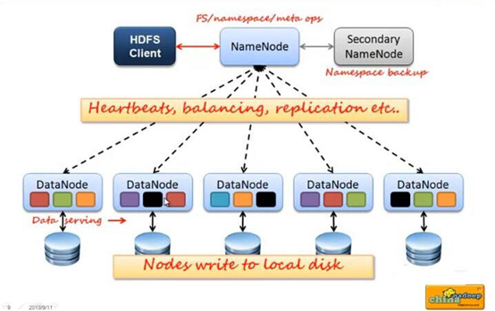

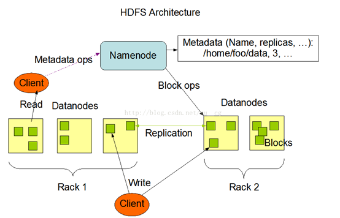

### 2.1 master/slave 架构 

NameNode是一个中心服务器，单一节点（简化系统的设计和实现），负责管理文件系统的名字空间（namespace）以及客户端对文件的访问

### 2.2 名字空间（NameSpace） 

HDFS 支持传统的层次型文件组织结构。用户或者应用程序可以创建目录，然后将文件保存在这些目录里。文件系统名字空间的层次结构和大多数现有的文件系统类似：用户可以创建、删除、移动或重命名文件。 

Namenode 负责维护文件系统的名字空间，任何对文件系统名字空间或属性的修改都将被Namenode 记录下来。 

HDFS 会给客户端提供一个统一的抽象目录树，客户端通过路径来访问文件，

形如：hdfs://namenode:port/dir-a/dir-b/dir-c/file.data。 

### 2.3 文件操作

namenode是负责文件元数据的操作，datanode负责处理文件内容的读写请求，跟文件内容相关的数据流不经过Namenode，只询问它跟哪个dataNode联系，否则NameNode会成为系统的瓶颈

### 2.4副本机制

为了容错，文件的所有 block 都会有副本。每个文件的 block 大小和副本系数都是可配置的。应用程序可以指定某个文件的副本数目。副本系数可以在文件创建的时候指定，也可以在之后改变。

### 2.5心跳机制

NameNode全权管理数据的复制，它周期性的从集群中的每个DataNode接收心跳信合和状态报告，接收到心跳信号意味着DataNode节点工作正常，块状态报告包含了一个该DataNode上所有的数据列表

### 2.6 一次写入，多次读出 

HDFS 是设计成适应一次写入，多次读出的场景，且不支持文件的修改。 

正因为如此，HDFS 适合用来做大数据分析的底层存储服务，并不适合用来做.网盘等应用，因为，修改不方便，延迟大，网络开销大，成本太高。

## 3.NameNode与Datanode的总结概述

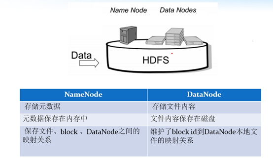

### 3.1namenode 元数据管理 

我们把目录结构及文件分块位置信息叫做元数据。Namenode 负责维护整个hdfs文件系统的目录树结构，以及每一个文件所对应的 block 块信息（block 的id，及所在的datanode 服务器）。

### 3.2 Datanode 数据存储 

文件的各个 block 的具体存储管理由 datanode 节点承担。每一个 block 都可以在多个datanode 上。Datanode 需要定时向 Namenode 汇报自己持有的 block信息。 存储多个副本（副本数量也可以通过参数设置 dfs.replication，默认是 3）。 

## 4.文件副本机制以及block块存储

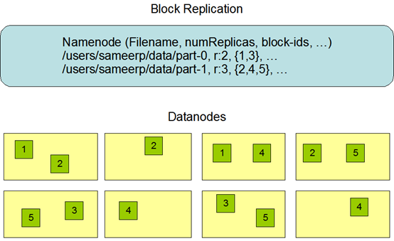

所有的文件都是以block块的方式存放在HDFS文件系统当中，在hadoop1当中，文件的block块默认大小是64M，hadoop2当中，文件的block块大小默认是128M，block块的大小可以通过hdfs-site.xml当中的配置文件进行指定

## 5.元文件FSImage与edits

FSimage是一个镜像文件，是一个完整的元数据文件

edits是每隔一个小时生成

客户端对hdfs进行写文件时会首先被记录在edits文件中。

edits修改时元数据也会更新。

每次hdfs更新时edits先更新后客户端才会看到最新信息。

fsimage:是namenode中关于元数据的镜像，一般称为@检查点。

**一般开始时对namenode的操作都放在edits中，为什么不放在fsimage中呢？**
因为fsimage是namenode的完整的镜像，内容很大，如果每次都加载到内存的话生成树状拓扑结构，这是非常耗内存和CPU。
fsimage内容包含了namenode管理下的所有datanode中文件及文件block及block所在的datanode的元数据信息。随着edits内容增大，就需要在一定时间点和fsimage合并。


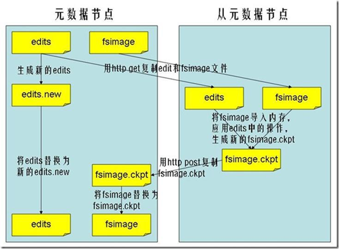

**2.x的hadoop元数据合并条件**

dfs.namenode.checkpoint.period: 默认是一个小时（3600s)

dfs.namenode.checkpoint.txns：默认为1000000条edits记录

**FSimage文件当中的文件信息查看：**

```
cd  /opt/servers/hadoop-2.7.7/tmp/dfs/name/current
hdfs oiv -i fsimage_0000000000000000864 -p XML -o hello.xml
```

**edits当中的文件信息查看：**

```
cd  /opt/servers/hadoop-2.7.7/tmp/dfs/nn/edits
hdfs oev -i  edits_0000000000000000865-0000000000000000866 -o myedit.xml -p XML
```


## 6、HDFS的文件写入过程

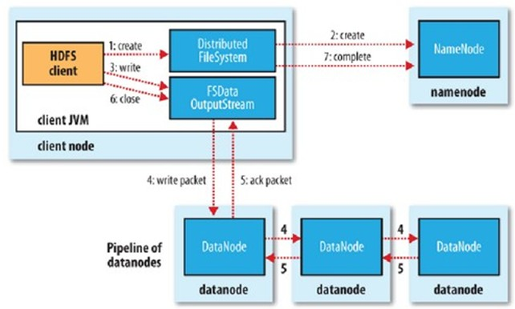


详细步骤解析：

1、 client发起文件上传请求，通过RPC与NameNode建立通讯，NameNode检查目标文件是否已存在，父目录是否存在，返回是否可以上传；

2、 client请求第一个block该传输到哪些DataNode服务器上；

3、 NameNode根据配置文件中指定的备份数量及机架感知原理进行文件分配，返回可用的DataNode的地址如：A，B，C；

 

注：Hadoop在设计时考虑到数据的安全与高效，数据文件默认在HDFS上存放三份，存储策略为本地一份，同机架内其它某一节点上一份，不同机架的某一节点上一份。

4、 client请求3台DataNode中的一台A上传数据（本质上是一个RPC调用，建立pipeline），A收到请求会继续调用B，然后B调用C，将整个pipeline建立完成，后逐级返回client；

5、 client开始往A上传第一个block（先从磁盘读取数据放到一个本地内存缓存），以packet为单位（默认64K），A收到一个packet就会传给B，B传给C；A每传一个packet会放入一个应答队列等待应答。

6、 数据被分割成一个个packet数据包在pipeline上依次传输，在pipeline反方向上，逐个发送ack（命令正确应答），最终由pipeline中第一个DataNode节点A将pipelineack发送给client;

7、 当一个block传输完成之后，client再次请求NameNode上传第二个block到服务器。

## 7、HDFS的文件读取过程

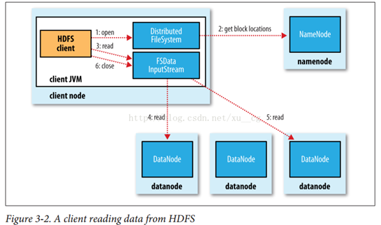

详细步骤解析

1、 Client向NameNode发起RPC请求，来确定请求文件block所在的位置； 

2、 NameNode会视情况返回文件的部分或者全部block列表，对于每个block，NameNode 都会返回含有该 block 副本的 DataNode 地址；  这些返回的 DN 地址，会按照集群拓扑结构得出 DataNode 与客户端的距离，然后进行排序，排序两个规则：网络拓扑结构中距离 Client 近的排靠前；心跳机制中超时汇报的 DN 状态为 STALE，这样的排靠后； 

3、 Client 选取排序靠前的 DataNode 来读取 block，如果客户端本身就是DataNode,那么将从本地直接获取数据(短路读取特性)； 

4、 底层上本质是建立 Socket Stream（FSDataInputStream），重复的调用父类 DataInputStream 的 read 方法，直到这个块上的数据读取完毕； 

5、 当读完列表的 block 后，若文件读取还没有结束，客户端会继续向NameNode 获取下一批的 block 列表； 

6、 读取完一个 block 都会进行 checksum 验证，如果读取 DataNode 时出现错误，客户端会通知 NameNode，然后再从下一个拥有该 block 副本的DataNode 继续读。 

7、 read 方法是并行的读取 block 信息，不是一块一块的读取；NameNode 只是返回Client请求包含块的DataNode地址，并不是返回请求块的数据；

 8、 最终读取来所有的 block 会合并成一个完整的最终文件。

## 8.HDFS基本Shell操作

创建文件夹（支持多级创建）：

```
hadoop fs -mkdir -p /xxx
```


查看目录：

```
hadoop fs -ls /xxx
```


递归查看多级目录：

```
hadoop fs -lsr /xxx
```


上传文件到HDFS：

```
hadoop fs -put xxx.txt /xxx
```


下载文件到本地当前目录：

```
hadoop fs -get /xxx/xxx/xxx.txt
```


删除文件：

```
hadoop fs -rm /xxx/xxx/xxx.txt
```


删除文件夹(文件夹必须为空)：

```
hadoop fs -rmdir /xxx/xxx
```


强制删除文件夹或文件

```
Hadoop fs -rm -r /xxx
```

## 9.HDFS的api操作

### 9.1前期准备

1.解决winutils.exe的问题

​	1）把hadoop2.7.7(windows版)文件目录放到一个没有中文没有空格的路径下

​	2）在window中配置handoop的环境变量，并且加入path中。

### 9.2 创建maven工程并导入jar包

```xml
<dependency>
  <groupId>org.apache.hadoop</groupId>
  <artifactId>hadoop-common</artifactId>
  <version>2.7.7</version>
</dependency>
<dependency>
  <groupId>org.apache.hadoop</groupId>
  <artifactId>hadoop-hdfs</artifactId>
  <version>2.7.7</version>
</dependency>
<dependency>
  <groupId>org.apache.hadoop</groupId>
  <artifactId>hadoop-client</artifactId>
  <version>2.7.7</version>
</dependency>
```

### 9.2使用文件系统方式访问数据

在 java 中操作 HDFS，主要涉及以下 Class： 

Configuration：该类的对象封转了客户端或者服务器的配置; 

FileSystem：该类的对象是一个文件系统对象，可以用该对象的一些方法来对文件进行操作，通过 FileSystem 的静态方法 get 获得该对象。 

```
FileSystem fs = FileSystem.get(conf)
```

get 方法从 conf 中的一个参数 fs.defaultFS 的配置值判断具体是什么类型的文件系统。如果我们的代码中没有指定 fs.defaultFS，并且工程 classpath下也没有给定相应的配置，conf中的默认值就来自于hadoop的jar包中的core-default.xml ， 默 认 值 为 ： file:/// ， 则 获 取 的 将 不 是 一 个DistributedFileSystem 的实例，而是一个本地文件系统的客户端对象

### 9.3获取FileSystem的方式

```java
Configuration configuration=new Configuration();
configuration.set("fs.defaultFS","hdfs://192.168.65.101:8020");
FileSystem fileSystem=FileSystem.get(configuration);
System.out.println(fileSystem.toString());
```

### 9.4创建文件夹

```java
@Test
public void mkdirs() throws  Exception{
    FileSystem fileSystem = FileSystem.get(new URI("hdfs://192.168.65.101:8020"), new Configuration());
    boolean mkdirs = fileSystem.mkdirs(new Path("/hello/mydir/test"));
    fileSystem.close();
}
```

### 9.4下载文件

```java
@Test
public void getFileToLocal()throws  Exception{
   Configuration configuration=new Configuration();
		configuration.set("fs.defaultFS","hdfs://192.168.65.101:8020");
	FileSystem fileSystem=FileSystem.get(configuration);
    FSDataInputStream open = fileSystem.open(new Path("/test/input/install.log"));
    FileOutputStream fileOutputStream = new FileOutputStream(new File("c:\\install.log"));
    IOUtils.copy(open,fileOutputStream );
    IOUtils.closeQuietly(open);
    IOUtils.closeQuietly(fileOutputStream);
    fileSystem.close();
}

```

### 9.5上传文件

```java
@Test
public void putData() throws  Exception{
  	Configuration configuration=new Configuration();
		configuration.set("fs.defaultFS","hdfs://192.168.65.101:8020");
	FileSystem fileSystem=FileSystem.get(configuration);
    fileSystem.copyFromLocalFile(new Path("file:///c:\\install.log"),new Path("/hello/mydir/test"));
    fileSystem.close();
}
```

# 2.MapReduce介绍

## 1.理解MapReduce思想

​	MapReduce思想在生活中处处可见。或多或少都曾接触过这种思想。MapReduce的思想核心是“**分而治之**”，适用于大量复杂的任务处理场景（大规模数据处理场景）。即使是发布过论文实现分布式计算的谷歌也只是实现了这种思想，而不是自己原创。

Map负责“分”，即把复杂的任务分解为若干个“简单的任务”来并行处理。可以进行拆分的前提是这些小任务可以并行计算，彼此间几乎没有依赖关系。

Reduce(规约)负责“合”，即对map阶段的结果进行全局汇总。

这两个阶段合起来正是MapReduce思想的体现。

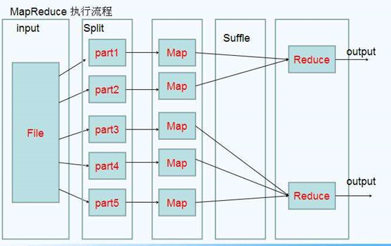

还有一个比较形象的语言解释MapReduce：　　

我们要数图书馆中的所有书。你数1号书架，我数2号书架。这就是“**Map**”。我们人越多，数书就更快。

现在我们到一起，把所有人的统计数加在一起。这就是“**Reduce**”。

## 2.Hadoop MapReduce设计构思

MapReduce是一个分布式运算程序的编程框架，核心功能是将用户编写的业务逻辑代码和自带默认组件整合成一个完整的分布式运算程序，并发运行在Hadoop集群上。

既然是做计算的框架，那么表现形式就是有个输入（input），MapReduce操作这个输入（input），通过本身定义好的计算模型，得到一个输出（output）。

如何对付大数据处理：分而治之

l  构建抽象模型：Map和Reduce

MapReduce借鉴了函数式语言中的思想，用Map和Reduce两个函数提供了高层的并行编程抽象模型。

Map: 对一组数据元素进行某种重复式的处理；

Reduce: 对Map的中间结果进行某种进一步的结果整理。

MapReduce中定义了如下的Map和Reduce两个抽象的编程接口，由用户去编程实现:

```
map: (k1; v1) → [(k2; v2)]

reduce: (k2; [v2]) → [(k3; v3)]
```

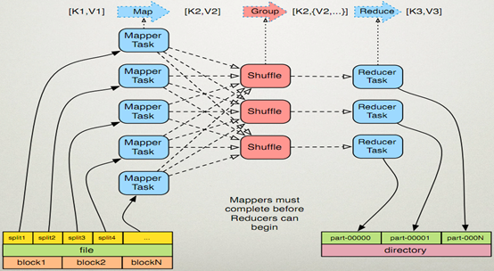

## 3.MapReduce编程规范及示例编写

#### 编程规范

mapReduce编程模型的总结：

MapReduce的开发一共有八个步骤其中map阶段分为2个步骤，shuffle阶段4个步骤，reduce阶段分为2个步骤

##### Map阶段2个步骤

第一步：设置inputFormat类，将我们的数据切分成key，value对，输入到第二步

第二步：自定义map逻辑，处理我们第一步的输入数据，然后转换成新的key，value对进行输出


##### shuffle阶段4个步骤（了解，可以全部不用管）

第三步：对输出的key，value对进行分区

第四步：对不同分区的数据按照相同的key进行排序

第五步：对分组后的数据进行规约(combine操作)，降低数据的网络拷贝（可选步骤）

第六步：对排序后的额数据进行分组，分组的过程中，将相同key的value放到一个集合当中

 

##### reduce阶段2个步骤

第七步：对多个map的任务进行合并，排序，写reduce函数自己的逻辑，对输入的key，value对进行处理，转换成新的key，value对进行输出

第八步：设置outputformat将输出的key，value对数据进行保存到文件中

 

## 4.WordCount实例

### 4.1准备数据并上传

```
cd /opt/servers
vim wordcount.txt

hello,world,hadoop
hive,sqoop,flume,hello
kitty,tom,jerry,world
hadoop

hdfs dfs -mkdir -p /wordcount/input
hdfs dfs -put wordcount.txt /wordcount/input
```

### 4.2测试官方案例

```
hadoop jar /opt/servers/hadoop-2.7.7/share/hadoop/mapreduce/hadoop-mapreduce-examples-2.7.7.jar wordcount /wordcount/input /wordcount/output
```

### 4.3定义一个mapper类

```java
public class WordCountMapper extends Mapper<LongWritable,Text,Text,LongWritable> {
     @Override
     public void map(LongWritable key, Text value, Context context) throws IOException, InterruptedException {
         String line = value.toString();
         String[] split = line.split(",");
         for (String word : split) {
             context.write(new Text(word),new LongWritable(1));
         }
 
     }
 }
```

### 4.4定义一个reducer类

```java
public class WordCountReducer extends Reducer<Text,LongWritable,Text,LongWritable> {
    /**
     * 自定义我们的reduce逻辑
     * 所有的key都是我们的单词，所有的values都是我们单词出现的次数
     * @param key
     * @param values
     * @param context
     * @throws IOException
     * @throws InterruptedException
     */
    @Override
    protected void reduce(Text key, Iterable<LongWritable> values, Context context) throws IOException, InterruptedException {
        long count = 0;
        for (LongWritable value : values) {
            count += value.get();
        }
        context.write(key,new LongWritable(count));
    }
}
```

### 4.5定义一个主类，并提交job

```java
public class JobMain {
     /**
     * 程序main函数的入口类
     * @param args
     * @throws Exception
     */
    public static void main(String[] args) throws Exception {
        Configuration configuration = new Configuration();
         Job job = Job.getInstance(configuration, JobMain.class.getSimpleName());
        //打包到集群上面运行时候，必须要添加以下配置，指定程序的main函数
        job.setJarByClass(JobMain.class);
        //第一步：读取输入文件解析成key，value对
        job.setInputFormatClass(TextInputFormat.class);
        TextInputFormat.addInputPath(job,new Path("hdfs://192.168.65.101:8020/wordcount"));

        //第二步：设置我们的mapper类
        job.setMapperClass(WordCountMapper.class);
        //设置我们map阶段完成之后的输出类型
        job.setMapOutputKeyClass(Text.class);
        job.setMapOutputValueClass(LongWritable.class);
        //第三步，第四步，第五步，第六步，省略
        //第七步：设置我们的reduce类
        job.setReducerClass(WordCountReducer.class);
        //设置我们reduce阶段完成之后的输出类型
        job.setOutputKeyClass(Text.class);
        job.setOutputValueClass(LongWritable.class);
        //第八步：设置输出类以及输出路径
        job.setOutputFormatClass(TextOutputFormat.class);
        TextOutputFormat.setOutputPath(job,new Path("hdfs://192.168.65.101:8020/wordcount_out"));
        job.waitForCompletion(true);
        
    }
}

```

### 5.hadoop中分片

split，默认情况下一个块对应一个片。

400m ，128 128 44      128 1个map   128  1个map   44 1个map

130m      128    2            130 1个map

## 3.Yarn资源调度

### 1.yarn集群的监控管理界面：

<http://192.168.65.101:8088/cluster>

## 2.Yarn介绍

yarn是hadoop集群当中的资源管理系统模块，从hadoop2.x开始引入yarn来进行管理集群当中的资源（主要是服务器的各种硬件资源，包括CPU，内存，磁盘，网络IO等）以及运行在yarn上面的各种任务。

总结一句话就是说：yarn主要就是为了调度资源，管理任务等

```
一级调度管理：
计算资源管理(CPU,内存，网络IO，磁盘)
App生命周期管理 （每一个应用执行的情况，都需要汇报给ResourceManager）
二级调度管理：
	任务内部的计算模型管理  (AppMaster的任务精细化管理)
	多样化的计算模型 
```

## 3.yarn当中的调度器介绍：

#### 第一种调度器：FIFO Scheduler  （队列调度器）

把应用按提交的顺序排成一个队列，这是一个先进先出队列，在进行资源分配的时候，先给队列中最头上的应用进行分配资源，待最头上的应用需求满足后再给下一个分配，以此类推。

FIFO Scheduler是最简单也是最容易理解的调度器，也不需要任何配置，但它并不适用于共享集群。大的应用可能会占用所有集群资源，这就导致其它应用被阻塞。在共享集群中，更适合采用Capacity Scheduler或Fair Scheduler，这两个调度器都允许大任务和小任务在提交的同时获得一定的系统资源。

 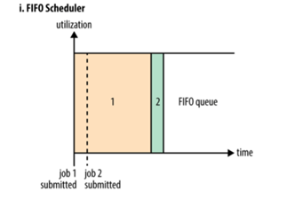

​                                                  

#### 第二种调度器：capacity  scheduler（容量调度器，apache版本默认使用的调度器）

Capacity 调度器允许多个组织共享整个集群，每个组织可以获得集群的一部分计算能力。通过为每个组织分配专门的队列，然后再为每个队列分配一定的集群资源，这样整个集群就可以通过设置多个队列的方式给多个组织提供服务了。除此之外，队列内部又可以垂直划分，这样一个组织内部的多个成员就可以共享这个队列资源了，在一个队列内部，资源的调度是采用的是先进先出(FIFO)策略。

   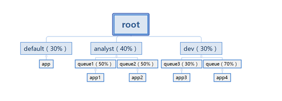

#### 第三种调度器：Fair Scheduler（公平调度器，CDH版本的hadoop默认使用的调度器）

Fair调度器的设计目标是为所有的应用分配公平的资源（对公平的定义可以通过参数来设置）。公平调度在也可以在多个队列间工作。举个例子，假设有两个用户A和B，他们分别拥有一个队列。当A启动一个job而B没有任务时，A会获得全部集群资源；当B启动一个job后，A的job会继续运行，不过一会儿之后两个任务会各自获得一半的集群资源。如果此时B再启动第二个job并且其它job还在运行，则它将会和B的第一个job共享B这个队列的资源，也就是B的两个job会用于四分之一的集群资源，而A的job仍然用于集群一半的资源，结果就是资源最终在两个用户之间平等的共享

   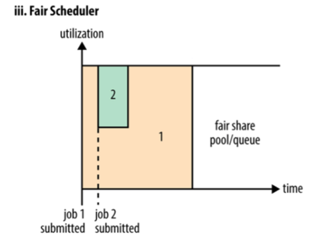

 

使用哪种调度器取决于yarn-site.xml当中的

yarn.resourcemanager.scheduler.class  这个属性的配置