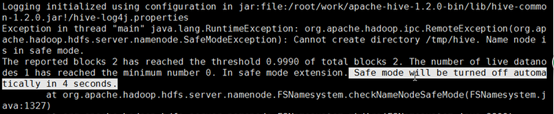
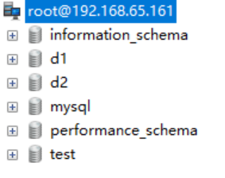

# 1.Hive简介

## 1.1什么是Hive

Hive是基于Hadoop的一个数据仓库工具，可以将结构化的数据文件映射为一张数据库表，并提供类SQL查询功能（HQL）。

其本质是将SQL转换为MapReduce的任务进行运算，底层由HDFS来提供数据的存储，说白了hive可以理解为一个将SQL转换为MapReduce的任务的工具，甚至更进一步可以说hive就是一个MapReduce的客户端。

## 1.2为什么使用Hive

- 直接使用hadoop所面临的问题 

  人员学习成本太高 

  项目周期要求太短 

  MapReduce实现复杂查询逻辑开发难度太大 

  

- 为什么要使用Hive 

  操作接口采用类SQL语法，提供快速开发的能力。 

  避免了去写MapReduce，减少开发人员的学习成本。 

  功能扩展很方便。

## 1.3Hive的特点

-  可扩展 

  Hive可以自由的扩展集群的规模，一般情况下不需要重启服务。

- 延展性 

  Hive支持用户自定义函数，用户可以根据自己的需求来实现自己的函数。

- 容错 

  良好的容错性，节点出现问题SQL仍可完成执行。

## 1.4Hive架构图


## 1.5Hive与Hadoop的关系 

Hive利用HDFS存储数据，利用MapReduce查询分析数据

                                                          

##  1.6Hive与传统数据库对比

hive用于海量数据的离线数据分析


```
总结：hive具有sql数据库的外表，但应用场景完全不同，hive只适合用来做批量数据统计分析
```

#  2.HIVE的安装部署

## 1.derby版hive直接使用

前提：Hive安装非常简单，解压之后即可直接运行，不需要太多配置，前提是要配置JAVA_HOME和HADOOP_HOME。并且Hadoop要全量启动（五个进程）

##### 1、解压hive

```
cd /opt/softwares

tar -xvzf apache-hive-2.3.6-bin.tar.gz -C ../servers/

```

##### 2.修改目录名称

```
cd ../servers/
mv apache-hive-2.3.6-bin hive-2.3.6
```

##### 3.初始化元数据库

```
cd hive-2.3.6
bin/schematool -dbType derby -initSchema
```

##### 4.启动

在hive-2.3.6目录下执行

```
bin/hive
```

##### 5.创建数据库

```
create database jtdb;
```

##### 6.创建表

```
use jtdb;
create table tb_user(id int,name string);
```

##### 7.插入数据

```
insert into table tb_user values(1,"zhangfei");
```

Hive在必要的时候会将HQL编译为MR来执行。


##### 8.可能遇到的问题

Hive启动不了
检查JAVA_HOME和HADOOP_HOME是否配置成功。如果没有问题并报错：Cannot find hadoop installation: $HADOOP_HOME or $HADOOP_PREFIX must be set or hadoop must be in the path

解决办法：

指定HADOOP_HOME路径

```
cd /opt/servers/hive-2.3.6/conf
 
cp hive-env.sh.template hive-env.sh

vim hive-env.sh
```

增加HADOOP_HOME

```
HADOOP_HOME=/opt/servers/hadoop-2.7.7
```

##### 9.Hive启动报错Safe mode



Hadoop在启动时有个安全模式，其在启动时有些工作要做，元数据的处理，DataNode的等待等过程。需要一段时间，遇到时需要等一段时间，耐心稍微等一会。过会自动就会好。

如果长时间还报错，还在安全模式。可以手工设置退出安全模式。

```
hadoop dfsadmin -safemode leave
```

参数value的说明如下：

1. enter - 进入安全模式
2. leave - 强制NameNode离开安全模式
3. get - 返回安全模式是否开启的信息
4. wait - 等待，一直到安全模式结束

## 2.基于mysql管理元数据版hive

Hive没有将描述数据库、表、数据之间关系的元数据直接存放在HDFS中，而是存放在了传统的关系型数据库中，这样保证了元数据可以快速的进行增删改查。

Hive原生的将元数据保存在了内置的Derby数据库中。

Derby存在的问题：过于轻量级，性能较低，安全性不高，不适合生产。

这种情况我们是无法忍受的，实际开发中不会使用Derby来做Hive的元数据库。所以我们要将他替换掉。以mysql为例。

##### 1、解压hive

```
cd /opt/softwares
tar -xvzf apache-hive-2.3.6-bin.tar.gz -C ../servers/
```

##### 2.修改目录名称

```
cd ../servers/
mv apache-hive-2.3.6-bin hive-2.3.6
```

##### 3.检测服务器mysql数据库

```
mysql
show databases;
```

##### 4.配置mysql允许外网访问

```
grant all privileges on *.* to 'root'@'%' identified by 'root' with grant option; 
flush privileges;
```

##### 5.退出mysql

```
exit;
```

##### 6.使用sqlyog连接mysql



##### 7.修改配置文件hive-site.xml

创建hive-site.xml

```
touch hive-site.xml
```

添加以下内容

```xml
<?xml version="1.0" encoding="UTF-8" standalone="no"?>
 
<?xml-stylesheet type="text/xsl" href="configuration.xsl"?>
 
<configuration>
 
  <property>
 
  <name>hive.default.fileformat</name>
 
  <value>TextFile</value>
 
</property>
 
<property>
 
  <!--端口改为你自己的端口，这里是连接数据库中hive数据库-->
 
  <name>javax.jdo.option.ConnectionURL</name>
 
  <value>jdbc:mysql://hadoop01:3306/hive?createDatabaseIfNotExist=true</value>
 
  <description>JDBC connect string for a JDBC metastore</description>
 
</property>
 
<property>
 
  <name>javax.jdo.option.ConnectionDriverName</name>
 
  <value>com.mysql.jdbc.Driver</value>
 
  <description>Driver class name for a JDBC metastore</description>
 
</property>
 
<property>
 
  <!--连接MySQL的用户名-->
 
  <name>javax.jdo.option.ConnectionUserName</name>
 
  <value>root</value>
 
  <description>username to use against metastore database</description>
 
</property>
 
<property>
 
  <!--连接MySQL的密码-->
 
  <name>javax.jdo.option.ConnectionPassword</name>
 
  <value>root</value>
 
  <description>password to use against metastore database</description>
 
</property>
 
</configuration>
```


##### 8.上传mysql驱动

将资料中mysql-connector-java-5.1.38-bin.jar上传到hive的lib目录中。

##### 9.初始化

```
bin/schematool -dbType mysql -initSchema
```

显示schemaTool completed，表示执行成功。

重复上述创建表的操作。

注意：先删除之前在hdfs上的目录。

DBS：数据库信息


TBLS：表信息


SDS：表详细信息


COLUMNS_V2：列信息


##  3.创建数据库与创建数据库表

### 3.1管理表（内部表）

#### 3.1.1创建数据库操作

##### 创建数据库

```
create database if not exists myhive;

use  myhive;
```

说明：hive的表存放位置模式是由hive-site.xml当中的一个属性指定的

```
<name>hive.metastore.warehouse.dir</name>

<value>/user/hive/warehouse</value>
```

##### 创建数据库并指定hdfs存储位置

```
create database myhive2 location '/myhive2';   
```

##### 修改数据库

可以使用alter  database  命令来修改数据库的一些属性。但是数据库的元数据信息是不可更改的，包括数据库的名称以及数据库所在的位置

```
alter  database  myhive2  set  dbproperties('createtime'='20210611');
```

##### 查看数据库详细信息

查看数据库基本信息

```
desc  database  myhive2;
```

查看数据库更多详细信息

```
desc database extended  myhive2; 
```

##### 删除数据库

删除一个空数据库，如果数据库下面有数据表，那么就会报错

```
drop  database  myhive2;
```

强制删除数据库，包含数据库下面的表一起删除

```
drop  database  myhive  cascade;   //不要执行了
```

#### 3.1.2创建数据库表操作

##### 创建数据库表

```
use myhive;

create table stu(id int,name string);

insert into stu values (1,"zhangsan");
select * from stu;
```

##### Hive建表时候的字段类型

| **分类** | **类型**                                                     | **描述**                                       | **字面量示例**                                               |
| -------- | ------------------------------------------------------------ | ---------------------------------------------- | ------------------------------------------------------------ |
| 原始类型 | BOOLEAN                                                      | true/false                                     | TRUE                                                         |
|          | TINYINT                                                      | 1字节的有符号整数 -128~127                     | 1Y                                                           |
|          | SMALLINT                                                     | 2个字节的有符号整数，-32768~32767              | 1S                                                           |
|          | INT                                                          | 4个字节的带符号整数                            | 1                                                            |
|          | BIGINT                                                       | 8字节带符号整数                                | 1L                                                           |
|          | FLOAT                                                        | 4字节单精度浮点数1.0                           |                                                              |
|          | DOUBLE                                                       | 8字节双精度浮点数                              | 1.0                                                          |
|          | DEICIMAL                                                     | 任意精度的带符号小数                           | 1.0                                                          |
|          | STRING                                                       | 字符串，变长                                   | “a”,’b’                                                      |
|          | VARCHAR                                                      | 变长字符串                                     | “a”,’b’                                                      |
|          | CHAR                                                         | 固定长度字符串                                 | “a”,’b’                                                      |
|          | BINARY                                                       | 字节数组                                       | 无法表示                                                     |
|          | TIMESTAMP                                                    | 时间戳，毫秒值精度                             | 122327493795                                                 |
|          | DATE                                                         | 日期                                           | ‘2016-03-29’                                                 |
|          | [INTERVAL](https://cwiki.apache.org/confluence/display/Hive/LanguageManual+Types#LanguageManualTypes-Intervals) | 时间频率间隔                                   |                                                              |
| 复杂类型 | ARRAY                                                        | 有序的的同类型的集合                           | array(1,2)                                                   |
|          | MAP                                                          | key-value,key必须为原始类型，value可以任意类型 | map(‘a’,1,’b’,2)                                             |
|          | STRUCT                                                       | 字段集合,类型可以不同                          | struct(‘1’,1,1.0),   named_stract(‘col1’,’1’,’col2’,1,’clo3’,1.0) |
|          | UNION                                                        | 在有限取值范围内的一个值                       | create_union(1,’a’,63)                                       |

##### 创建表并指定字段之间的分隔符

```
create  table if not exists stu2(id int ,name string) row format delimited fields terminated by '\t'  stored as textfile location '/user/stu2';
```

### 3.2外部表：

#### 外部表说明：

外部表因为是指定其他的hdfs路径的数据加载到表当中来，所以hive表会认为自己不完全独占这份数据，所以删除hive表的时候，数据仍然存放在hdfs当中，不会删掉。

内部表：当删除表的时候，表结构和表数据全部都会删除掉。

外部表：当删除表的时候，认为表的数据会被其他人使用，自己没有独享数据的权利，所以只会删除掉表的结构（元数据），不会删除表的数据。

###### 操作案例

分别创建老师与学生表外部表，并向表中加载数据

创建老师表：

```
create external table teacher (t_id string,t_name string) row format delimited fields terminated by '\t';
```

创建学生表：

```
create external table student (s_id string,s_name string,s_birth string , s_sex string ) row format delimited fields terminated by '\t';
```

从本地文件系统向表中加载数据

```
load data local inpath '/opt/servers/hivedatas/student.csv' into table student;
```

加载数据并覆盖已有数据

```
load data local inpath '/opt/servers/hivedatas/student.csv' overwrite  into table student;
```

从hdfs文件系统向表中加载数据（需要提前将数据上传到hdfs文件系统，其实就是一个移动文件的操作）

```
cd /opt/servers/hivedatas
hdfs dfs -mkdir -p /hivedatas
hdfs dfs -put teacher.csv /hivedatas/
load data inpath '/hivedatas/teacher.csv' into table teacher;
```

如果删掉student表，hdfs的数据仍然存在，并且重新创建表之后，表中就直接存在数据了,因为我们的student表使用的是外部表，drop table之后，表当中的数据依然保留在hdfs上面了。

### 3.3分区表

在大数据中，最常用的一种思想就是分治，我们可以把大的文件切割划分成一个个的小的文件，这样每次操作一个小的文件就会很容易了，同样的道理，在hive当中也是支持这种思想的，就是我们可以把大的数据，按照每天，或者每小时进行切分成一个个的小的文件，这样去操作小的文件就会容易得多了

##### 创建分区表语法

```
create table score(s_id string,c_id string, s_score int) partitioned by (month string) row format delimited fields terminated by '\t';
```

##### 创建一个表带多个分区

```
create table score2 (s_id string,c_id string, s_score int) partitioned by (year string,month string,day string) row format delimited fields terminated by '\t';
```

##### 加载数据到分区表中

```
load data local inpath '/opt/servers/hivedatas/score.csv' into table score partition (month='201806');
```

##### 加载数据到一个多分区的表中去

```
load data local inpath '/opt/servers/hivedatas/score.csv' into table score2 partition(year='2018',month='06',day='01');
```

##### 查看分区

```
show  partitions  score;
```

##### 添加一个分区

```
alter table score add partition(month='201805');
```

##### 同时添加多个分区

```
alter table score add partition(month='201804') partition(month = '201803');
```

注意：添加分区之后就可以在hdfs文件系统当中看到表下面多了一个文件夹

#####  删除分区

```
alter table score drop partition(month = '201806');
```

### 3.4分桶表

将数据按照指定的字段进行分成多个桶中去，说白了就是将数据按照字段进行划分，可以将数据按照字段划分到多个文件当中去

开启hive的桶表功能

```
set hive.enforce.bucketing=true;
```

设置reduce的个数

```
set mapreduce.job.reduces=3;
```

创建通表

```
create table course (c_id string,c_name string,t_id string) clustered by(c_id) into 3 buckets row format delimited fields terminated by '\t';
```

桶表的数据加载，由于桶表的数据加载通过hdfs  dfs  -put文件或者通过load  data均不好使，只能通过insert  overwrite

创建普通表，并通过insert  overwrite的方式将普通表的数据通过查询的方式加载到桶表当中去

##### 创建普通表：

```
create table course_common (c_id string,c_name string,t_id string) row format delimited fields terminated by '\t'; 
```

##### 普通表中加载数据

```
load data local inpath '/opt/servers/hivedatas/course.csv' into table course_common;
```

通过insert  overwrite给桶表中加载数据

```
insert overwrite table course select * from course_common cluster by(c_id);
```

按百分比取样：整表数据的百分之三十

```
select * from course tablesample(30 percent);
```

## 4.hive查询方法

### 4.1select

#### 全表查询

```
select * from score;
```

##### 选择特定列查询

```
select s_id ,c_id from score;
```

##### 列别名

1）重命名一个列。

2）便于计算。

3）紧跟列名，也可以在列名和别名之间加入关键字‘AS’ 

```
select s_id as myid ,c_id from score;
```

### 4.2常用函数

1）求总行数（count）

```
select count(1) from score;
```

2）求分数的最大值（max）

   

```
select max(s_score) from score;
```

3）求分数的最小值（min）

```
select min(s_score) from score;
```

4）求分数的总和（sum）

```
select sum(s_score) from score;
```

5）求分数的平均值（avg）

```
select avg(s_score) from score;
```

### 4.3、LIMIT语句

典型的查询会返回多行数据。LIMIT子句用于限制返回的行数。

```
select * from score limit 3;
```

### 4.4、WHERE语句

```
select * from score where s_score > 60;
```

### 4.5、分组

#### GROUP BY语句

GROUP BY语句通常会和聚合函数一起使用，按照一个或者多个列队结果进行分组，然后对每个组执行聚合操作。

案例实操：

​       （1）计算每个学生的平均分数

```
select s_id ,avg(s_score) from score group by s_id;
```

​       （2）计算每个学生最高成绩

```
select s_id ,max(s_score) from score group by s_id;
```

#### HAVING语句

1）having与where不同点

（1）where针对表中的列发挥作用，查询数据；having针对查询结果中的列发挥作用，筛选数据。

（2）where后面不能写分组函数，而having后面可以使用分组函数。

（3）having只用于group by分组统计语句。

2）案例实操：

​       求每个学生的平均分数

```
select s_id ,avg(s_score) from score group by s_id;
```

​       求每个学生平均分数大于85的人

```
select s_id ,avg(s_score) avgscore from score group by s_id having avgscore > 85;
```

## 5.hive的FAQ

所有的离线数据处理场景都适用hive吗？

    并不是所有场景都适合，逻辑简单又要求快速出结果的场景Hive优势更大。但是在业务逻辑非常复杂的情况下还是需要开发MapReduce程序更加直接有效。

Hive能作为业务系统的数据库使用吗？

    不能。传统数据库要求能够为系统提供实时的增删改查，而Hive不支持行级别的增删改，查询的速度也不比传统关系型数据库，而是胜在吞吐量高，所以不能作为关系型数据库来使用。

Hive与传统MR方式处理数据相比能够提高运行效率吗？

    Hive的使用中需要将HQL编译为MR来运行，所以在执行效率上要低于直接运行MR程序。但是对于我们来说，由于只需要编写调试HQL，而不用开发调试复杂的MR程序，所以工作效率能够大大提高。

Hive为什么不支持行级别的增删改？

```
Hive不支持行级别的增删改的根本原因在于他的底层HDFS本身不支持。在HDFS中如果对整个文件的某一段或某一行内容进行增删改，势必会影响整个文件在集群中的存放布局。需要对整个集群中的数据进行汇总，重新切块，重新发送数据到每个节点，并备份，这样的情况是得不偿失的。所以HDFS的设计模式使他天生不适合做这个事
```

```javascript
//  
          // console.log(result)
          // if (result.status !== 200) return this.$message.error("用户登录失败")
          // this.$message.success("用户登录成功")
          //
          // //获取用户token信息
          // let token = result.data
          // window.sessionStorage.setItem("token", token)
          //
          // //用户登录成功之后,跳转到home页面
          // await this.$router.push("/")
```


