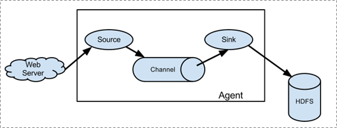
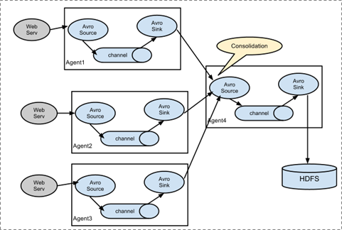

#  Apache Flume

## 1． 概述

Flume是Cloudera提供的一个高可用的，高可靠的，分布式的海量日志采集、聚合和传输的软件。

Flume的核心是把数据从数据源(source)收集过来，再将收集到的数据送到指定的目的地(sink)。为了保证输送的过程一定成功，在送到目的地(sink)之前，会先缓存数据(channel),待数据真正到达目的地(sink)后，flume在删除自己缓存的数据。

Flume支持定制各类数据发送方，用于收集各类型数据；同时，Flume支持定制各种数据接受方，用于最终存储数据。一般的采集需求，通过对flume的简单配置即可实现。针对特殊场景也具备良好的自定义扩展能力。因此，flume可以适用于大部分的日常数据采集场景。

当前Flume有两个版本。Flume 0.9X版本的统称Flume OG（original generation），Flume1.X版本的统称Flume NG（next generation）。由于Flume NG经过核心组件、核心配置以及代码架构重构，与Flume OG有很大不同，使用时请注意区分。改动的另一原因是将Flume纳入 apache 旗下，Cloudera Flume 改名为 Apache Flume。

## 2．运行机制

Flume系统中核心的角色是**agent**，agent本身是一个Java进程，一般运行在日志收集节点。​             

**Agent**：代理，flume集群中，每个节点都是一个agent，包含了flume单节点：接受、封装、承载、传输event到目的地的过程。这个过程中包含三部分（source、channel、sink）。                 

每一个agent相当于一个数据传递员，内部有三个组件：

**Source**：采集源，用于跟数据源对接，以获取数据；

**Sink**：下沉地，采集数据的传送目的，用于往下一级agent传递数据或者往 最终存储系统传递数据；

**Channel**：agent内部的数据传输通道，用于从source将数据传递到sink；

在整个数据的传输的过程中，流动的是**event**，它是Flume内部数据传输的最基本单元。event将传输的数据进行封装。如果是文本文件，通常是一行记录，event也是事务的基本单位。event从source，流向channel，再到sink，本身为一个字节数组，并可携带headers(头信息)信息。event代表着一个数据的最小完整单元，从外部数据源来，向外部的目的地去。

一个完整的event包括：event headers、event body、event信息，其中event信息就是flume收集到的日记记录。

### 1.1． 简单结构

  单个agent采集数据



### 1.2． 复杂结构

多级agent之间串联

​       

 

## 4. Flume安装部署

上传安装包到数据源所在节点上

然后解压  tar -zxvf apache-flume-1.9.0-bin.tar.gz

然后进入flume的目录，修改conf下的flume-env.sh，在里面配置JAVA_HOME

## 5.flume初体验

进入conf目录下，

```
vim http_logger.properties
```

配置如下内容：

```properties
a1.sources  =  r1
a1.sinks  =  k1
a1.channels  =  c1
 
a1.sources.r1.type  =  http
a1.sources.r1.bind  =  0.0.0.0
a1.sources.r1.port  =  22222
 
a1.sinks.k1.type  =  logger
 
a1.channels.c1.type  =  memory
a1.channels.c1.capacity  =  1000
a1.channels.c1.transactionCapacity  =  100
 
a1.sources.r1.channels  =  c1
a1.sinks.k1.channel  =  c1

```

启动服务

在/opt/servers/flume-1.9.0/目录下执行

```
bin/flume-ng agent -c conf -f conf/http_logger.properties -n a1 -Dflume.root.logger=INFO,console
```

注：

-c conf   指定flume自身的配置文件所在目录

-f conf/netcat-logger.con  指定我们所描述的采集方案

-n a1  指定我们这个agent的名字

flume启动后占用当前窗口，复制一个新的窗口在任意目录下执行以下

```
curl -X POST -d '[{"headers":{"tester":"tony"},"body":"hello http flume"}]' http://hadoop01:22222
```

 配置文件详解

```properties
#a1为自定义的agent名字，与启动命令中的-n属性对应
 
a1.sources  =  r1     #定义agent的数据源source，可以有多个。
a1.sinks  =  k1       #定义agent的数据出处，可以有多个。
a1.channels  =  c1    #定义agent的通道，一般有多少个sink就有多少个channel
 
 
a1.sources.r1.type  =  http   #指定source的类型http
a1.sources.r1.bind  =  0.0.0.0  #指定source的来源。一般为本机，被动接收
a1.sources.r1.port  =  22222    #指定端口
 
a1.sinks.k1.type  =  logger  //前端日志打印输出
 

  
a1.channels.c1.type  =  memory       #指定channel的类型为 内存
a1.channels.c1.capacity  =  1000     #指定存储容量，避免强制抢占内存影响其他进程的正常运行
a1.channels.c1.transactionCapacity  =  100  #指定事务容量
 
a1.sources.r1.channels  =  c1    #绑定source
a1.sinks.k1.channel  =  c1       #绑定sink

```

# 练习案例

## Source练习 

### 1.avro

```
vim avro_logger.conf
```

```properties
a1.sources  =  r1
a1.sinks  =  k1
a1.channels  =  c1
 
a1.sources.r1.type  =  avro
a1.sources.r1.bind  =  0.0.0.0
a1.sources.r1.port  =  22222
 
a1.sinks.k1.type  =  logger
 
a1.channels.c1.type  =  memory
a1.channels.c1.capacity  =  1000
a1.channels.c1.transactionCapacity  =  100
 
a1.sources.r1.channels  =  c1
a1.sinks.k1.channel  =  c1
```

1.在/opt/data/flumedata下创建文件log.txt并编辑添加数据

2.在flume安装目录下的conf目录下执行命令启动agent

```
bin/flume-ng agent -c conf -f conf/avro_logger.conf -n a1 -Dflume.root.logger=INFO,console
```

3.模拟发送avro在flume的bin目录下执行：

```
bin/flume-ng avro-client -c conf -H hadoop01 -p 22222 -F /opt/data/flumedata/log.txt
```


### 2.Spooldir

spooldir：source源，用于监控文件目录

注意：

1）对于文件中要源源不断写入的这情况，不适合使用spooldir。

2）对于已经监控的文件，如果有相同文件名再次放入到监控目录中，此时服务会报错，并不再进行监控。

```properties
a1.sources  =  r1
a1.sinks  =  k1
a1.channels  =  c1
 
a1.sources.r1.type  =  spooldir 
a1.sources.r1.spoolDir = /opt/data/spooldir
 
a1.sinks.k1.type  =  logger
 
a1.channels.c1.type  =  memory
a1.channels.c1.capacity  =  1000
a1.channels.c1.transactionCapacity  =  100
 
a1.sources.r1.channels  =  c1
a1.sinks.k1.channel  =  c1

```

1. 在/home/data目录下创建文件夹spooldir
2. 启动
3. 在spooldir中vim文件并添加内容并保存。发现flume日志中打印编辑内容。


### 3.采集目录到HDFS

```
# Name the components on this agent
a1.sources = r1
a1.sinks = k1
a1.channels = c1

# Describe/configure the source
##注意：不能往监控目中重复丢同名文件
a1.sources.r1.type = spooldir
a1.sources.r1.spoolDir = /opt/data/spooldir
#a1.sources.r1.fileHeader = true

# Describe the sink
a1.sinks.k1.type = hdfs
a1.sinks.k1.hdfs.path = /flume/events/%y-%m-%d/%H%M/
a1.sinks.k1.hdfs.filePrefix = events-
a1.sinks.k1.hdfs.round = true
a1.sinks.k1.hdfs.roundValue = 10
a1.sinks.k1.hdfs.roundUnit = minute
a1.sinks.k1.hdfs.rollInterval = 3
a1.sinks.k1.hdfs.rollSize = 20
a1.sinks.k1.hdfs.rollCount = 5
a1.sinks.k1.hdfs.batchSize = 1
#获取时间
a1.sinks.k1.hdfs.useLocalTimeStamp = true
#生成的文件类型，默认是Sequencefile，可用DataStream，则为普通文本
a1.sinks.k1.hdfs.fileType = DataStream

# Use a channel which buffers events in memory
a1.channels.c1.type = memory
a1.channels.c1.capacity = 1000
a1.channels.c1.transactionCapacity = 100

# Bind the source and sink to the channel
a1.sources.r1.channels = c1
a1.sinks.k1.channel = c1

```

**参数解析：**

·      **rollInterval**

默认值：30

hdfs sink间隔多长将临时文件滚动成最终目标文件，单位：秒；

如果设置成0，则表示不根据时间来滚动文件；

注：滚动（roll）指的是，hdfs sink将临时文件重命名成最终目标文件，并新打开一个临时文件来写入数据；

·      **rollSize**

默认值：1024

当临时文件达到该大小（单位：bytes）时，滚动成目标文件；

如果设置成0，则表示不根据临时文件大小来滚动文件；

·      **rollCount**

默认值：10

当events数据达到该数量时候，将临时文件滚动成目标文件；

如果设置成0，则表示不根据events数据来滚动文件；

·      **round**

默认值：false

对文件目录进行滚动。

是否启用时间上的“舍弃”，这里的“舍弃”，类似于“四舍五入”。

·      **roundValue**

默认值：1

时间上进行“舍弃”的值；

·      **roundUnit**

默认值：seconds

时间上进行“舍弃”的单位，包含：second,minute,hour


### 4.采集文件到HDFS

exec只能指定一个文件进行监控，监控的是源源不断写入的文件。

```
# Name the components on this agent
a1.sources = r1 r2 r3
a1.sinks = k1
a1.channels = c1

# Describe/configure the source
a1.sources.r1.type = exec
a1.sources.r1.command = tail -F /opt/data/exec/test.log

a1.sources.r2.type = exec
a1.sources.r2.command = tail -F /opt/data/exec/test1.log

a1.sources.r3.type = exec
a1.sources.r3.command = tail -F /opt/data/exec/test2.log

# Describe the sink
a1.sinks.k1.type = hdfs
a1.sinks.k1.hdfs.path = /flume/exec/%y-%m-%d/%H%M/
a1.sinks.k1.hdfs.filePrefix = events-
a1.sinks.k1.hdfs.round = true
a1.sinks.k1.hdfs.roundValue = 10
a1.sinks.k1.hdfs.roundUnit = minute
a1.sinks.k1.hdfs.rollInterval = 3
a1.sinks.k1.hdfs.rollSize = 20
a1.sinks.k1.hdfs.rollCount = 5
a1.sinks.k1.hdfs.batchSize = 1
a1.sinks.k1.hdfs.useLocalTimeStamp = true
#生成的文件类型，默认是Sequencefile，可用DataStream，则为普通文本
a1.sinks.k1.hdfs.fileType = DataStream

# Use a channel which buffers events in memory
a1.channels.c1.type = memory
a1.channels.c1.capacity = 1000
a1.channels.c1.transactionCapacity = 100

# Bind the source and sink to the channel
a1.sources.r1.channels = c1
a1.sources.r2.channels = c1
a1.sources.r3.channels = c1
a1.sinks.k1.channel = c1

```

##### 开发shell脚本定时追加文件内容

```
mkdir -p /opt/servers/shells/

cd  /opt/servers/shells/

vim exec.sh
```

 

```shell
#!/bin/bash

while true

do

 date >> /opt/data/exec/test.log;

  sleep 0.5;

done
```

 

启动脚本

```
sh /opt/servers/shells/exec.sh
```

### 5.TailDir的使用

同时监控多个文件的持续写入

固定文件：1.txt 2.txt 

持续写入文件：test.log  3.txt

source:taildir

sink:hdfs

channel:memory

```properties
#source channel sink
# 定义核心组件
a1.sources = r1
a1.sinks = k1
a1.channels = c1

#定义source
a1.sources.r1.type = TAILDIR
a1.sources.r1.filegroups = f1 f2
a1.sources.r1.filegroups.f1 = /opt/data/taildir/log1/.*txt.*
a1.sources.r1.filegroups.f2 = /opt/data/taildir/log2/.*log.*
a1.sources.r1.positionFile = /opt/data/taildir/taildir_position.json
a1.sources.r1.fileHeader = true
a1.sources.r1.headers.f1.key1 = value1

#定义sink
a1.sinks.k1.type = hdfs
a1.sinks.k1.hdfs.path = /flume/taildir/%y-%m-%d/%H%M/
a1.sinks.k1.hdfs.round = true
a1.sinks.k1.hdfs.roundValue = 10
a1.sinks.k1.hdfs.roundUnit = minute
a1.sinks.k1.hdfs.useLocalTimeStamp = false
a1.sinks.k1.hdfs.rollInterval = 3
a1.sinks.k1.hdfs.rollSize = 20
a1.sinks.k1.hdfs.rollCount = 5
a1.sinks.k1.hdfs.batchSize = 1
a1.sinks.k1.hdfs.fileType = DataStream

#定义channel
a1.channels.c1.type = memory
a1.channels.c1.capacity = 1000
a1.channels.c1.transactionCapacity = 100

#将channel和source、sink关联起来
a1.sources.r1.channels = c1
a1.sinks.k1.channel = c1
```


# 集群部署

Hadoop01：JDK、Hadoop、Flume

Hadoop02：JDK、Flume

Hadoop03：JDK、Flume

只需要将hadoop01安装好的Flume文件夹发送到02 03两个节点相应的位置即可。

## 案例练习

### 多级

Hadoop01

```
a1.sources  =  r1
a1.sinks  =  k1
a1.channels  =  c1
 
a1.sources.r1.type  =  http
a1.sources.r1.bind  =  0.0.0.0
a1.sources.r1.port  =  22222
 
a1.sinks.k1.type  =  avro
a1.sinks.k1.hostname  =  hadoop02
a1.sinks.k1.port  =  22222
 
a1.channels.c1.type  =  memory
a1.channels.c1.capacity  =  1000
a1.channels.c1.transactionCapacity  =  100
 
a1.sources.r1.channels  =  c1
a1.sinks.k1.channel  =  c1

```

hadoop02

```
a1.sources  =  r1
a1.sinks  =  k1 
a1.channels  =  c1
 
a1.sources.r1.type  =  avro
a1.sources.r1.bind  =  0.0.0.0
a1.sources.r1.port  =  22222

a1.sinks.k1.type  =  avro
a1.sinks.k1.hostname  =  hadoop03
a1.sinks.k1.port  =  22222

 
a1.channels.c1.type  =  memory 
a1.channels.c1.capacity  =  1000
a1.channels.c1.transactionCapacity  =  100

 
a1.sources.r1.channels  =  c1
a1.sinks.k1.channel  =  c1

```

hadoop03

```
a1.sources  =  r1
a1.sinks  =  k1
a1.channels  =  c1

a1.sources.r1.type  =  avro
a1.sources.r1.bind  =  0.0.0.0
a1.sources.r1.port  =  22222

a1.sinks.k1.type  =  logger

a1.channels.c1.type  =  memory
a1.channels.c1.capacity  =  1000
a1.channels.c1.transactionCapacity  =  100
 
a1.sources.r1.channels  =  c1
a1.sinks.k1.channel  =  c1

```

按照顺序从hadoop03启动节点

### 扇入(fan-in)

Hadoop01

```
a1.sources  =  r1
a1.sinks  =  k1
a1.channels  =  c1
 

a1.sources.r1.type  =  http
a1.sources.r1.bind  =  0.0.0.0
a1.sources.r1.port  =  22222
  
a1.sinks.k1.type  =  avro
a1.sinks.k1.hostname  =  hadoop03
a1.sinks.k1.port  =  22222

a1.channels.c1.type  =  memory
a1.channels.c1.capacity  =  1000
a1.channels.c1.transactionCapacity  =  100

a1.sources.r1.channels  =  c1
a1.sinks.k1.channel  =  c1

```

Hadoop02

```
a1.sources  =  r1
 
a1.sinks  =  k1
 
a1.channels  =  c1
 
 
 
a1.sources.r1.type  =  http
a1.sources.r1.bind  =  0.0.0.0
a1.sources.r1.port  =  22222
 
a1.sinks.k1.type  =  avro
a1.sinks.k1.hostname  =  hadoop03
a1.sinks.k1.port  =  22222
 
 
 
a1.channels.c1.type  =  memory
 
a1.channels.c1.capacity  =  1000
 
a1.channels.c1.transactionCapacity  =  100
 
 
 
a1.sources.r1.channels  =  c1
 
a1.sinks.k1.channel  =  c1

```

Hadoop03

```
a1.sources  =  r1 
a1.sinks  =  k1 
a1.channels  =  c1
 

a1.sources.r1.type  =  avro
a1.sources.r1.bind  =  0.0.0.0
a1.sources.r1.port  =  22222
 
a1.sinks.k1.type  =  logger
 
a1.channels.c1.type  =  memory
a1.channels.c1.capacity  =  1000
a1.channels.c1.transactionCapacity  =  100
 
 
a1.sources.r1.channels  =  c1
a1.sinks.k1.channel  =  c1

```


### 扇出(fanout)

Hadoop01

```
a1.sources  =  r1
a1.sinks  =  k1 k2
a1.channels  =  c1 c2
 
a1.sources.r1.type  =  http
a1.sources.r1.bind  =  0.0.0.0
a1.sources.r1.port  =  22222

a1.sinks.k1.type  =  avro
a1.sinks.k1.hostname  =  hadoop02
a1.sinks.k1.port  =  22222
 
a1.sinks.k2.type  =  avro
a1.sinks.k2.hostname  =  hadoop03
a1.sinks.k2.port  =  22222
 
 
a1.channels.c1.type  =  memory
a1.channels.c1.capacity  =  1000
a1.channels.c1.transactionCapacity  =  100
 
a1.channels.c2.type  =  memory
a1.channels.c2.capacity  =  1000
a1.channels.c2.transactionCapacity  =  100
 
 
 
a1.sources.r1.channels  =  c1 c2
a1.sinks.k1.channel  =  c1
a1.sinks.k2.channel  =  c2

```

Hadoop02

```
a1.sources  =  r1
a1.sinks  =  k1
a1.channels  =  c1
 
 
 
a1.sources.r1.type  =  avro
a1.sources.r1.bind  =  0.0.0.0
a1.sources.r1.port  =  22222
 
 
a1.sinks.k1.type  =  logger
 
 
 
a1.channels.c1.type  =  memory
a1.channels.c1.capacity  =  1000
a1.channels.c1.transactionCapacity  =  100
 
 
 
a1.sources.r1.channels  =  c1
a1.sinks.k1.channel  =  c1

```

Hadoop03

```
a1.sources  =  r1
a1.sinks  =  k1
a1.channels  =  c1
 
 
 
a1.sources.r1.type  =  avro
a1.sources.r1.bind  =  0.0.0.0
a1.sources.r1.port  =  22222
 
 
 
a1.sinks.k1.type  =  logger
 
 
 
a1.channels.c1.type  =  memory
a1.channels.c1.capacity  =  1000
a1.channels.c1.transactionCapacity  =  100
 
 
 
a1.sources.r1.channels  =  c1
a1.sinks.k1.channel  =  c1

```

