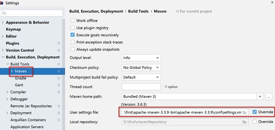
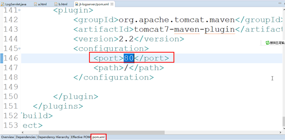
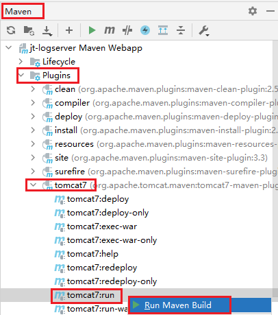
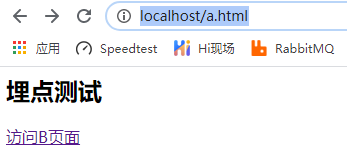
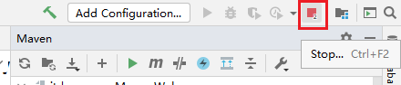
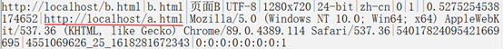
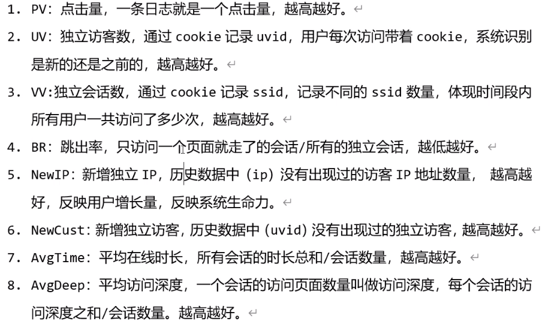

# 网站日志分析系统

## 1.数据收集：JS埋点


传统埋点方式的缺点：

直接嵌入业务系统，代码不好维护，影响业务系统性能。


JS埋点优点：

日志收集系统与业务系统相互独立，互不影响，不占用业务系统性能,能收集到更多更详细的用户信息。


### 2.日志数据的提交方式

Get请求：https://www.jd.com/?cu=true&utm_source=baidu-pinzhuan&utm_medium=cpc&utm_campaign=t_288551095_baidupinzhuan&utm_term=0f3d30c8dba7459bb52f2eb5eba8ac7d_0_bd79f916377147b6aef8164d97d9abac

### 3.在哪里发起Get请求？

跨域请求

img标签中src实现跨域访问，将该图片插入到真个页面最后，像素1，边框0，用户看不到。

## 4.系统架构设计


离线分析：js埋点——日志收集系统（log4j）——flume——HDFS——Hive

实时分析：js埋点——日志收集系统（log4j）——flume——Kafka——Flink

## 5. 运行jt-logserver

### 5.1 Idea中打开项目

Idea中open 课前资料\bigDataProject

File->settings->build->build tools->maven中修改maven配置文件位置。

​                                                  

 

### 5.2    查看tomcat插件配置

   

### 5.3    启动

打开maven窗口，选中tomcat7:run右键 run maven build

   

 

### 5.4   测试

   

### 5.5     关闭

点红色按钮关闭tomcat

   

### 5.6   访问网页产生日志

从localhost/a.html跳到b.html页面

   

 

直接访问localhost/b.html

   

##  6.指标说明



### 7.项目的整合

7.1修改jt-server中的log4j配置

```
log4j.rootLogger = info,stdout  #注释掉此配置
#log4j.rootLogger = info,stdout,flume  #打开此配置
```

7.2创建接收数据的flume的配置文件

设定source ：avro

sink：hdfs

```properties
a1.sources  =  r1
a1.sinks  =  k1
a1.channels  =  c1

a1.sources.r1.type  =  avro
a1.sources.r1.bind  =  0.0.0.0
a1.sources.r1.port  =  22222

a1.sinks.k1.type = hdfs
a1.sinks.k1.hdfs.path = /flume/jtlog/
a1.sinks.k1.hdfs.fileType = DataStream

a1.channels.c1.type  =  memory
a1.channels.c1.capacity  =  1000
a1.channels.c1.transactionCapacity  =  100
 
a1.sources.r1.channels  =  c1
a1.sinks.k1.channel  =  c1
```

