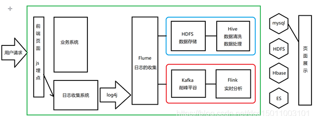
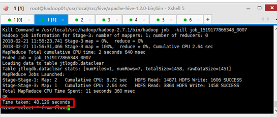
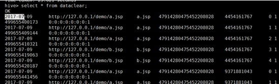
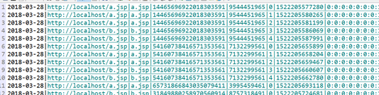
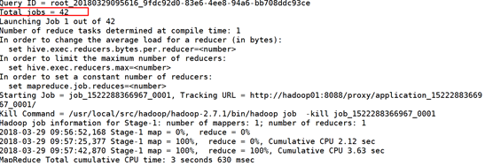
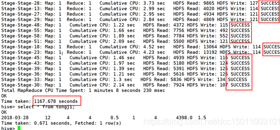

# Hive离线分析

## 回顾业务流程




# 准备

## 搭建环境

### 1.启动Hadoop

```
start-all.sh
```

### 2.修改flume配置文件


```properties
a1.sources  =  r1
a1.sinks  =  k1
a1.channels  =  c1

a1.sources.r1.type  =  avro
a1.sources.r1.bind  =  0.0.0.0
a1.sources.r1.port  =  22222


a1.sinks.k1.type = hdfs
a1.sinks.k1.hdfs.path = hdfs://hadoop01:8020/flux/reportTime=%Y-%m-%d
a1.sinks.k1.hdfs.fileType=DataStream
a1.sinks.k1.serializer = text
a1.sinks.k1.serializer.appendNewline = false
a1.sinks.k1.hdfs.useLocalTimeStamp = true

a1.channels.c1.type  =  memory
a1.channels.c1.capacity  =  1000
a1.channels.c1.transactionCapacity  =  100

 

a1.sources.r1.channels  =  c1
a1.sinks.k1.channel  =  c1
```

### 3.启动flume

进入flume的根目录

```
/bin/flume-ng agent -c conf/ -f conf/jtlog_hdfs.conf -n a1 -Dflume.root.logger=INFO,console
```

### 4.启动jt-logserver

### 5.测试

访问locahost/a.jsp和locahost/b.jsp


## 准备数据

以下方式只做参考，可以自己随意访问产生数据，注意，关闭浏览器代表一个会话终结，清除cookie或者更换浏览器模拟不同用户。

浏览器A：访问3次a.jsp，2次b.jsp关闭浏览器

浏览器B：访问3次a.jsp，2次b.jsp关闭浏览器

浏览器A：访问1次a.jps

浏览器B：访问1次b.jps

注意，flume输出的数据不是一条一个单独文件，而是根据我们的配置及自身的策略来决定何时生成一个完整的文件。离线数据处理

# 离线数据处理

## Hive管理数据

创建flux外部表，管理HDFS中的日志信息。

```sql
hive> create database jtlogdb;
 
hive> use jtlogdb;
 
hive> create external table flux (url string,urlname string,title string,chset string,src string,col string,lg string, je string,ec string,fv string,cn string,ref string,uagent string,stat_uv string,stat_ss string,cip string) partitioned by (reportTime string) row format delimited fields terminated by '|' location '/flux';

```

create external table flux：创建外部表

partitioned by (reportTime string)：根据日期分区

row format delimited fields terminated by '|'：通过 | 分割数据

location '/flux'：管理HDFS中/flux文件夹

**url string**

**urlname string**

title string

chset string

src string

col string

lg string

je string

ec string

fv string

cn string

ref string

uagent string

**stat_uv string**

**stat_ss string**

**cip string**

原始数据很多，但并不是所有的数据都跟我们的业务有关。所以。在正式处理之前我们还会对flux表做一次清洗。去除不相干的数据。

查询flux表

```
select * from flux;
```

发现并没有数据，这是为什么？---没有添加分区信息。

添加分区信息：

```
alter table flux add partition (reportTime='2021-09-13') location '/flux/reportTime=2021-09-13';

```

再次查看整表，发现数据已经被正确管理了。

## 数据清洗

明细宽表：将原始表按照业务需求拆分成更细粒度的表。

需要的数据字段

reportTime 产生日期

url        访问路径

urlname    页面名称

uvid       访客id

ssid       会话id

sscount    会话编号

sstime     会话时间戳

cip        访客ip

创建数据清洗表：

```
create table dataclear(reportTime string,url string,urlname string,uvid string,ssid string,sscount string,sstime string,cip string) row format delimited fields terminated by '|';
```

需要注意的是，在hive中将一个表内的数据导入另一个表中时，两个表的创建结构必须相同，包括分隔符！否则可能会发生数据错乱。

清洗并导入数据：

```
insert overwrite table dataclear select reportTime,url,urlname,stat_uv,split(stat_ss,"_")[0],split(stat_ss,"_")[1],split(stat_ss,"_")[2],cip from flux where url!='';

```

这个过程执行较慢。




导入数据成功之后查询该表：

```sql
select * from dataclear;
```



HDFS中下载查看数据：



# 数据处理

## PV：访问量

```
select count(*) as pv from dataclear where reportTime='2020-11-19';
```

实际就是有效日志条数

## UV：独立访客数

```
select count(distinct uvid) as uv from dataclear where reportTime='2020-11-19';
```

记录不同用户的20位随机数（uvid），去重后进行计数。

## SV：独立会话数

```
select count(distinct ssid) as sv from dataclear where reportTime='2020-11-19';
```


session即会话，浏览器用cookie存储sessionid所以不同的cookie就代表不同的会话，其中我们使用了两个浏览器，清除了两次cookie，来模拟不同的会话。


## BR：跳出率

跳出率就是，只访问了一个页面就走了的会话/会话总数。

为了控制结果的精确度，我们应用round函数来对结果进行处理，取小数点后四位（四舍五入）

设置

```
set hive.mapred.mode=nonstrict;
```

```
select br_taba.a/br_tabb.b as br from
 
(
 
  select count(*) as a from
 
    (
 
      select ssid from dataclear
 
       where reportTime='2020-11-19'
 
       group by ssid having count(ssid)=1
 
    ) as br_tab
 
) as br_taba,
 
(
 
  select count(distinct ssid) as b from dataclear
 
   where reportTime='2020-11-19'
 
) as br_tabb;

```


```
select round(br_taba.a/br_tabb.b,4) as br from (select count(*) as a from (select ssid from dataclear where reportTime='2020-11-19' group by ssid having count(ssid)=1) as br_tab) as br_taba,(select count(distinct ssid) as b from dataclear where reportTime='2020-11-19') as br_tabb;
```

## NewIP：新增IP数

新增ip数就是当天来访的所有ip中之前从来没有访问过的ip数量。

比如：我们的系统昨天上线，昨天访客有：张飞、关羽、赵云、吕布

今天的访客有：张飞、关羽、貂蝉、孙尚香、吕布。那么新增访客就是貂蝉、孙尚香，对应的新增ip数就是2。

```
select count(distinct dataclear.cip) from dataclear
 
 where dataclear.reportTime='2020-11-19'
 
 and cip not in
 
 (select distinct dc2.cip from dataclear as dc2
 
 where dc2.reportTime<'2020-11-19');

```

```
select count(distinct dataclear.cip) from dataclear where dataclear.reportTime='2020-11-19' and cip not in (select dc2.cip from dataclear as dc2 where dc2.reportTime<'2020-11-19');
```


## NewCust：新增访客数

原理与NewIP一样。只不过指标变为uvid

```
select count(distinct dataclear.uvid) from dataclear
 
 where dataclear.reportTime='2021-09-13'
 
 and uvid not in
 
 (select distinct dc2.uvid from dataclear as dc2 where
 
 dc2.reportTime < '2021-09-13');

```

```
select count(distinct dataclear.uvid) from dataclear where dataclear.reportTime='2020-11-19' and uvid not in (select dc2.uvid from dataclear as dc2 where dc2.reportTime < '2019-11-19');
```


## AvgTime：平均访问时长

平均访问时长指的是所有会话的时长的平均数。

```
select round(avg(atTab.usetime),4) as avgtime from
 
(
 
 select max(sstime) - min(sstime) as usetime from dataclear
 
  where reportTime='2020-11-19'
 
  group by ssid
 
) as atTab;

```

```
select round(avg(atTab.usetime),4) as avgtime from (select max(sstime) -min(sstime) as usetime from dataclear where reportTime='2020-11-19' group by ssid) as atTab;
```


## AvgDeep：平均访问深度

访问深度，指一个会话中浏览的页面个数。

```
select round(avg(deep),2) as viewdeep from
 
(
 
  select count(distinct urlname) as deep from flux
 
   where reportTime='2020-11-19'
 
   group by split(stat_ss,'_')[0]
 
) as tviewdeep;
 
```

```
select round(avg(deep),2) as viewdeep from (select count(distinct urlname) as deep from flux where reportTime='2020-11-19' group by split(stat_ss,'_')[0]) as tviewdeep;
```

## 分析结果表

创建业务表并插入数据

```
create table statistics(reportTime string,pv int,uv int,vv int, br double,newip int, newcust int, avgtime double,avgdeep double) row format delimited fields terminated by '|';

```

计算结果并插入结果表中保存

```
insert overwrite table statistics select '2021-09-13',tab1.pv,tab2.uv,tab3.vv,tab4.br,tab5.newip,tab6.newcust,tab7.avgtime,tab8.avgdeep from
 
(select count(*) as pv from dataclear where reportTime = '2021-09-13') as tab1,
 
(select count(distinct uvid) as uv from dataclear where reportTime = '2021-09-13') as tab2,
 
(select count(distinct ssid) as vv from dataclear where reportTime = '2021-09-13') as tab3,
 
(select round(br_taba.a/br_tabb.b,4)as br from (select count(*) as a from (select ssid from dataclear where reportTime='2021-09-13' group by ssid
 
having count(ssid) = 1) as br_tab) as br_taba,
 
(select count(distinct ssid) as b from dataclear where reportTime='2021-09-13') as br_tabb) as tab4,
 
(select count(distinct dataclear.cip) as newip from dataclear where dataclear.reportTime = '2021-09-13' and cip not in (select dc2.cip from dataclear
 
as dc2 where dc2.reportTime < '2021-09-13')) as tab5,
 
(select count(distinct dataclear.uvid) as newcust from dataclear where dataclear.reportTime='2021-09-13' and uvid not in (select dc2.uvid from
 
dataclear as dc2 where dc2.reportTime < '2021-09-13')) as tab6,
 
(select round(avg(atTab.usetime),4) as avgtime from (select max(sstime) - min(sstime) as usetime from dataclear where reportTime='2021-09-13'
 
group by ssid) as atTab) as tab7,
 
(select round(avg(deep),4) as avgdeep from (select count(distinct urlname) as deep from dataclear where reportTime='2021-09-13' group by ssid) as
 
adTab) as tab8;

```





 

# 通过sqoop将数据导入mysql

## 概念

sqoop 沟通hdfs和关系型数据库的桥梁，可以从hdfs导出数据

 

到关系型数据库，也可以从关系型数据库导入数据到hdfs

## 下载

Apache 提供的工具

## 安装

要求必须有jdk 和 hadoop的支持，并且有版本要求。

上传到linux中，进行解压

sqoop可以通过JAVA_HOME找到jdk 可以通过HADOOP_HOME找到hadoop所以不需要做任何配置就可以工作。

  需要将要连接的数据库的驱动包加入sqoop的lib目录下

## 使用

在mysql中创建jtlog数据库

```
create database jtlog;
```

```
CREATE TABLE jtdata (
 
  reportTime varchar(100),
 
  pv bigint(20),
 
  uv bigint(20),
 
  vv bigint(20),
 
  br double,
 
  newip bigint(20),
 
  newcust bigint(20),
 
  avgtime double,
 
  avgdeep double
 
);
```

从关系型数据库导入数据到hdfs:

在sqoop的bin目录下执行

```
./sqoop import --connect jdbc:mysql://192.168.65.101:3306/jtlog --username root --password root --table jtdata -m 1 --target-dir '/sqoop/jtlog' --fields-terminated-by '|';
```

从hdfs导出数据到关系型数据库:

```
./sqoop export --connect jdbc:mysql://192.168.65.101:3306/jtlog --username root --password root --export-dir '/user/hive/warehouse/jtlogdb.db/statistics' --table jtdata -m 1 --fields-terminated-by '|';

```

# Echarts学习使用

1. 下载js文件
2. 页面引入js
3. 创建一个div作为图表的容器，要求必须设置宽高，并定义id
4. 初始化echarts环境（在div中）
5. 找到合适的图例
6. 将图例和初始化好的echarts环境进行绑定
7. 调整测试