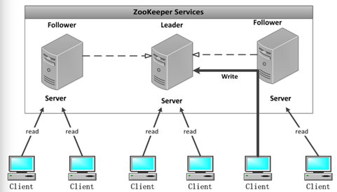
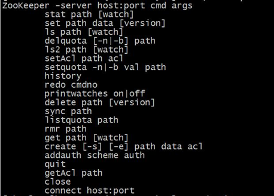
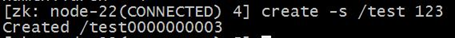
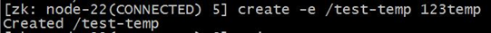
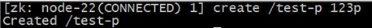
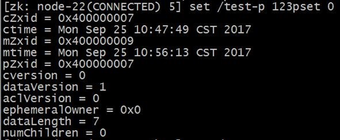
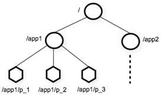
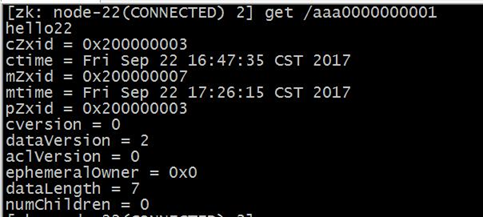

# 1.Zookeeper

## 1.1、zookeeper介绍

Zookeeper 是一个分布式协调服务的开源框架。 主要用来解决分布式集群中应用系统的一致性问题，例如怎样避免同时操作同一数据造成脏读的问题。

ZooKeeper 本质上是一个分布式的小文件存储系统。提供基于类似于文件系统的目录树方式的数据存储，并且可以对树中的节点进行有效管理。从而用来维护和监控存储的数据的状态变化。通过监控这些数据状态的变化，从而可以达到基于数据的集群管理。 诸如： 统一命名服务(dubbo)、分布式配置管理(solr的配置集中管理)、分布式消息队列（sub/pub）、分布式锁、分布式协调等功能。

## 1.2、zookeeper的架构图




### Leader:

 Zookeeper 集群工作的核心事务请求（写操作） 的唯一调度和处理者，保证集群事务处理的顺序性；集群内部各个服务器的调度者。

对于 create， setData， delete 等有写操作的请求，则需要统一转发给leader 处理， leader 需要决定编号、执行操作，这个过程称为一个事务。

###  Follower:

 处理客户端非事务（读操作） 请求，转发事务请求给 Leader；

参与集群 Leader 选举投票 2n-1台可以做集群投票。

此外，针对访问量比较大的 zookeeper 集群， 还可新增观察者角色。

###  Observer:

观察者角色，观察 Zookeeper 集群的最新状态变化并将这些状态同步过来，其对于非事务请求可以进行独立处理，对于事务请求，则会转发给 Leader 服务器进行处理。 

不会参与任何形式的投票只提供非事务服务，通常用于在不影响集群事务处理能力的前提下提升集群的非事务处理能力。

题外话：说白了就是增加并发的读请求

## 1.3、zookeeper的特性

1.全局数据一致：每个server 保存一份相同的数据副本， client 无论连接到哪个 server，展示的数据都是一致的，这是最重要的特征；

2.可靠性：如果消息被其中一台服务器接受，那么将被所有的服务器接受。

3.顺序性：包括全局有序和偏序两种：全局有序是指如果在一台服务器上消息 a 在消息 b 前发布，则在所有 Server 上消息 a 都将在消息b 前被发布；偏序是指如果一个消息 b 在消息 a 后被同一个发送者发布， a 必将排在 b 前面。

4.数据更新原子性：一次数据更新要么成功（半数以上节点成功），要么失败，不存在中间状态；

5.实时性： Zookeeper 保证客户端将在一个时间间隔范围内获得服务器的更新信息，或者服务器失效的信息。

## 1.4、Zookeeper 集群搭建

Zookeeper 集群搭建指的是 ZooKeeper 分布式模式安装。通常由 2n+1台 servers 组成。 这是因为为了保证 Leader 选举（基于 Paxos 算法的实现） 能过得到多数的支持，所以 ZooKeeper 集群的数量一般为奇数。
Zookeeper 运行需要 java 环境， 所以需要提前安装 jdk。 

对于安装leader+follower 模式的集群， 大致过程如下：

- 配置主机名称到 IP 地址映射配置
- 修改ZooKeeper 配置文件
- 远程复制分发安装文件
- 设置myid
- 启动ZooKeeper 集群

服务器配置如下：

| 服务器IP       | 主机名   | myid的值 |
| -------------- | -------- | -------- |
| 192.168.65.101 | hadoop01 | 1        |
| 192.168.65.102 | hadoop02 | 2        |
| 192.168.65.103 | hadoop03 | 3        |

#### 第一步：下载zookeeeper的压缩包，下载网址如下

<http://archive.apache.org/dist/zookeeper/>

我们在这个网址下载我们使用的zk版本为3.4.8

下载完成之后，上传到我们的linux的/opt/softwares路径下准备进行安装

#### 第二步：解压

解压zookeeper的压缩包到/opt/servers路径下去，然后准备进行安装

```
cd /opt/softwares
tar -zxvf zookeeper-3.4.8.tar.gz -C ../servers/
```

​                                                  

#### 第三步：修改配置文件

第一台机器修改配置文件

```
cd /opt/servers/zookeeper-3.4.8/conf/

cp zoo_sample.cfg zoo.cfg

mkdir -p /opt/servers/zookeeper-3.4.8/zkdatas/

vim  zoo.cfg
```

修改配置文件

```
dataDir=/opt/servers/zookeeper-3.4.8/zkdatas

server.1=hadoop01:2888:3888
server.2=hadoop02:2888:3888
server.3=hadoop03:2888:3888
```

#### 第四步：添加myid配置

在第一台机器的

/opt/servers/zookeeper-3.4.8/zkdatas/这个路径下创建一个文件，文件名为myid ,文件内容为1

```
echo 1 > /opt/servers/zookeeper-3.4.8/zkdatas/myid
```

#### 第五步：安装包分发并修改myid的值

安装包分发到其他机器

第一台机器上面执行以下两个命令

```
scp -r  /opt/servers/zookeeper-3.4.8/ hadoop02:/opt/servers/

scp -r  /opt/servers/zookeeper-3.4.8/ hadoop03:/opt/servers/
```

第二台机器上修改myid的值为2

```
echo 2 > /opt/servers/zookeeper-3.4.8/zkdatas/myid             
```

第三台机器上修改myid的值为3

```
echo 3 > /opt/servers/zookeeper-3.4.8/zkdatas/myid
```

#### 第六步：三台机器启动zookeeper服务

三台机器启动zookeeper服务

这个命令三台机器都要执行

```
/opt/servers/zookeeper-3.4.8/bin/zkServer.sh start
```

查看启动状态

```
/opt/servers/zookeeper-3.4.8/bin/zkServer.sh  status
```

## 1.5、zookeeper的shell操作

### 1.5.1、客户端连接

运行 zkCli.sh –server ip 进入命令行工具。

输入 help，输出 zk shell 提示：



### 1.5.2、shell操作

#### 创建节点

```
create [-s] [-e] path data acl
```

 其中，-s 或-e 分别指定节点特性，顺序或临时节点，若不指定，则表示持 久节点；acl 用来进行权限控制。

创建顺序节点：

                

创建临时节点：

 

创建永久节点：

 

####  读取节点

与读取相关的命令有 ls  命令和 get  命令:

ls 命令可以列出 Zookeeper 指定节点下的所有子节点，只能查看指定节点下的第一级的所有子节点；

get 命令可以获取 Zookeeper指定节点的数据内容和属性信息。 

```
ls path [watch]

get path [watch] 
```

####  更新节点

```
set path data [version]
```

data 就是要更新的新内容，version 表示数据版本。



现在 dataVersion 已经变为 1 了，表示进行了更新。

#### 删除节点

```
delete path [version]
```

 若删除节点存在子节点，那么无法删除该节点，必须先删除子节点，再删除父节点。

```
rmr path
```

可以递归删除节点。

## 1.6、zookeeper的数据模型

ZooKeeper 的数据模型，在结构上和标准文件系统的非常相似，拥有一个层次的命名空间，都是采用树形层次结构，ZooKeeper 树中的每个节点被称为—Znode。和文件系统的目录树一样，ZooKeeper 树中的每个节点可以拥有子节点。

 但也有不同之处：

1. Znode 兼具文件和目录两种特点。既像文件一样维护着数据、元信息、ACL、 时间戳等数据结构，又像目录一样可以作为路径标识的一部分，并可以具有 子 Znode。用户对 Znode 具有增、删、改、查等操作（权限允许的情况下）。

2. Znode 具有原子性操作，读操作将获取与节点相关的所有数据，写操作也将 替换掉节点的所有数据。另外，每一个节点都拥有自己的 ACL(访问控制列表)，这个列表规定了用户的权限，即限定了特定用户对目标节点可以执行的操作。

3. Znode 存储数据大小有限制。ZooKeeper 虽然可以关联一些数据，但并没有 被设计为常规的数据库或者大数据存储，相反的是，它用来管理调度数据， 比如分布式应用中的配置文件信息、状态信息、汇集位置等等。这些数据的 共同特性就是它们都是很小的数据，通常以 KB 为大小单位。ZooKeeper 的服 务器和客户端都被设计为严格检查并限制每个 Znode 的数据大小至多 1M，常规使用中应该远小于此值。

4. Znode 通过路径引用，如同 Unix 中的文件路径。路径必须是绝对的，因此他 们必须由斜杠字符来开头。除此以外，他们必须是唯一的，也就是说每一个 路径只有一个表示，因此这些路径不能改变。在 ZooKeeper 中，路径由 Unicode 字符串组成，并且有一些限制。字符串"/zookeeper"用以保存管理 信息，比如关键配额信息。

### 1.6.1、数据结构



图中的每个节点称为一个 Znode。 每个 Znode 由 3 部分组成:

① stat：此为状态信息, 描述该 Znode 的版本, 权限等信息

② data：与该 Znode 关联的数据

③ children：该 Znode 下的子节点

### 1.6.2、节点类型

Znode 有两种，分别为临时节点和永久节点。

节点的类型在创建时即被确定，并且不能改变。

临时节点：该节点的生命周期依赖于创建它们的会话。一旦会话结束，临时 节点将被自动删除，当然可以也可以手动删除。临时节点不允许拥有子节点。

永久节点：该节点的生命周期不依赖于会话，并且只有在客户端显示执行删除操作的时候，他们才能被删除。

 Znode 还有一个序列化的特性，如果创建的时候指定的话，该 Znode 的名字后面会自动追加一个不断增加的序列号。序列号对于此节点的父节点来说是唯一的，这样便会记录每个子节点创建的先后顺序。它的格式为“%10d”(10 位数字，没有数值的数位用 0补充，例如“0000000001”)。

### 1.6.3、节点属性

每个 znode 都包含了一系列的属性，通过命令 get，可以获得节点的属性。



dataVersion：数据版本号，每次对节点进行 set 操作，dataVersion 的值都会增加 1（即使设置的是相同的数据），可有效避免了数据更新时出现的先后顺序问题。

 cversion ：子节点的版本号。当 znode 的子节点有变化时，cversion 的值就会增加 1。

 aclVersion ：ACL 的版本号。

 cZxid ：Znode 创建的事务 id。

 mZxid  ：Znode 被修改的事务 id，即每次对 znode 的修改都会更新 mZxid。对于 zk 来说，每次的变化都会产生一个唯一的事务 id，zxid（ZooKeeper Transaction Id）。通过 zxid，可以确定更新操作的先后顺序。例如，如果 zxid1小于 zxid2，说明 zxid1 操作先于 zxid2 发生，zxid 对于整个 zk 都是唯一的，即使操作的是不同的 znode。

 ctime：节点创建时的时间戳.

 mtime：节点最新一次更新发生时的时间戳.

 ephemeralOwner:如果该节点为临时节点, ephemeralOwner 值表示与该节点绑定的 session id. 如果不是, ephemeralOwner 值为 0。在 client 和 server 通信之前,首先需要建立连接,该连接称为 session。连接建立后,如果发生连接超时、授权失败,或者显式关闭连接,连接便处于 CLOSED状态, 此时 session 结束。