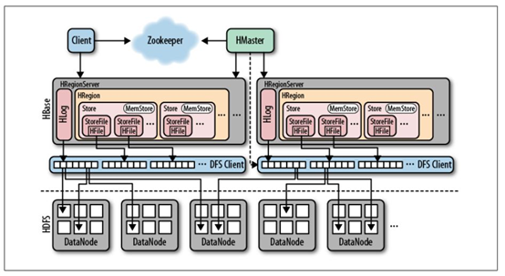
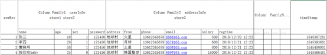

# 1、HBase基本介绍

hbase是bigtable的开源java版本。是建立在hdfs之上，提供高可靠性、高性能、列存储、可伸缩、实时读写nosql的数据库系统。

它介于nosql和RDBMS之间，仅能通过主键(row key)和主键的range来检索数据，仅支持单行事务(可通过hive支持来实现多表join等复杂操作)。


主要用来存储结构化和半结构化的松散数据。

Hbase查询数据功能很简单，不支持join等复杂操作，不支持复杂的事务（行级的事务）

Hbase中支持的数据类型：byte[]

与hadoop一样，Hbase目标主要依靠横向扩展，通过不断增加廉价的商用服务器，来增加计算和存储能力。

HBase中的表一般有这样的特点：

- 大：一个表可以有上十亿行，上百万列
- 面向列:面向列(族)的存储和权限控制，列(族)独立检索。
- 稀疏:对于为空(null)的列，并不占用存储空间，因此，表可以设计的非常稀疏。

#### HBase的发展历程

HBase的原型是Google的BigTable论文，受到了该论文思想的启发，目前作为Hadoop的子项目来开发维护，用于支持结构化的数据存储。

官方网站：<http://hbase.apache.org>

\* 2006年Google发表BigTable白皮书

\* 2006年开始开发HBase

\* 2008  HBase成为了 Hadoop的子项目

\* 2010年HBase成为Apache顶级项目

# 2、HBase与Hadoop的关系

## 2.1、HDFS

\* 为分布式存储提供文件系统

\* 针对存储大尺寸的文件进行优化，不需要对HDFS上的文件进行随机读写

\* 直接使用文件

\* 数据模型不灵活

\* 使用文件系统和处理框架

\* 优化一次写入，多次读取的方式

## 2.2、HBase

\* 提供表状的面向列的数据存储

\* 针对表状数据的随机读写进行优化

\* 使用key-value操作数据

\* 提供灵活的数据模型

\* 使用表状存储，支持MapReduce，依赖HDFS

\* 优化了多次读，以及多次写

# 3、HBase特征简要

## 1）海量存储

Hbase适合存储PB级别的海量数据，在PB级别的数据以及采用廉价PC存储的情况下，能在几十到百毫秒内返回数据。这与Hbase的极易扩展性息息相关。正式因为Hbase良好的扩展性，才为海量数据的存储提供了便利。

## 2）列式存储

这里的列式存储其实说的是列族存储，Hbase是根据列族来存储数据的。列族下面可以有非常多的列，列族在创建表的时候就必须指定。

## 3）极易扩展

Hbase的扩展性主要体现在两个方面，一个是基于上层处理能力（RegionServer）的扩展，一个是基于存储的扩展（HDFS）。
 通过横向添加RegionSever的机器，进行水平扩展，提升Hbase上层的处理能力，提升Hbsae服务更多Region的能力。

备注：RegionServer的作用是管理region、承接业务的访问，这个后面会详细的介绍通过横向添加Datanode的机器，进行存储层扩容，提升Hbase的数据存储能力和提升后端存储的读写能力。

## 4）高并发

由于目前大部分使用Hbase的架构，都是采用的廉价PC，因此单个IO的延迟其实并不小，一般在几十到上百ms之间。这里说的高并发，主要是在并发的情况下，Hbase的单个IO延迟下降并不多。能获得高并发、低延迟的服务。

## 5）稀疏

稀疏主要是针对Hbase列的灵活性，在列族中，你可以指定任意多的列，在列数据为空的情况下，是不会占用存储空间的。

# 4、HBase的基础架构



## 1、HMaster

**功能：**

1) 监控RegionServer

2) 处理RegionServer故障转移

3) 处理元数据的变更

4) 处理region的分配或移除

5) 在空闲时间进行数据的负载均衡

6) 通过Zookeeper发布自己的位置给客户端

## 2、RegionServer

**功能：**

1) 负责存储HBase的实际数据

2) 处理分配给它的Region

3) 刷新缓存到HDFS

4) 维护HLog

5) 执行压缩

6) 负责处理Region分片

**组件：**

**1) Write-Ahead logs**

HBase的修改记录，当对HBase读写数据的时候，数据不是直接写进磁盘，它会在内存中保留一段时间（时间以及数据量阈值可以设定）。但把数据保存在内存中可能有更高的概率引起数据丢失，为了解决这个问题，数据会先写在一个叫做Write-Ahead logfile的文件中，然后再写入内存中。所以在系统出现故障的时候，数据可以通过这个日志文件重建。

**2) HFile**

这是在磁盘上保存原始数据的实际的物理文件，是实际的存储文件。

**3) Store**

HFile存储在Store中，一个Store对应HBase表中的一个列族。

**4) MemStore**

顾名思义，就是内存存储，位于内存中，用来保存当前的数据操作，所以当数据保存在WAL中之后，RegsionServer会在内存中存储键值对。

**5) Region**

Hbase表的分片，HBase表会根据RowKey值被切分成不同的region存储在RegionServer中，在一个RegionServer中可以有多个不同的region。

# 5、HBase的集群环境搭建

**注意事项：HBase强依赖zookeeper和hadoop，安装HBase之前一定要保证zookeeper和hadoop启动成功，且服务正常运行**

## 5.1、下载对应的HBase的安装包

HBase对应的版本下载地址如下

http://archive.apache.org/dist/hbase/2.2.4/

## 5.2、压缩包上传并解压

将我们的压缩包上传到hadoop01服务器的/export/softwares路径下并解压

```
cd /opt/softwares/

tar -xvzf hbase-2.2.4-bin.tar.gz -C ../servers/
```

## 5.3、修改配置文件

第一台机器进行修改配置文件

```
cd /opt/servers/hbase-2.2.4/conf
```

### 修改第一个配置文件hbase-env.sh

注释掉HBase使用内部zk

```
vim hbase-env.sh
```

```
export JAVA_HOME=/opt/servers/jdk1.8.0_65
export HBASE_MANAGES_ZK=false
```

### 修改第二个配置文件hbase-site.xml

修改hbase-site.xml

```
vim hbase-site.xml
```

```
<configuration>
        <property>
                <name>hbase.rootdir</name>
                <value>hdfs://hadoop01:8020/hbase</value>  
        </property>

        <property>
                <name>hbase.cluster.distributed</name>
                <value>true</value>
        </property>

   <!-- 0.98后的新变动，之前版本没有.port,默认端口为60000 -->
        <property>
                <name>hbase.master.port</name>
                <value>16000</value>
        </property>

        <property>
                <name>hbase.zookeeper.quorum</name>
                <value>hadoop01:2181,hadoop02:2181,hadoop03:2181</value>
        </property>

        <property>
                <name>hbase.zookeeper.property.dataDir</name>
         		<value>/opt/servers/zookeeper-3.4.8/zkdatas</value>
        </property>
</configuration>

```

### 修改第三个配置文件regionservers

```
vim regionservers 
```

```
hadoop01
hadoop02
hadoop03
```

### 创建back-masters配置文件，实现HMaster的高可用

```
cd /opt/servers/hbase-2.2.4/conf
```

```
vim backup-masters 
```

```
hadoop02
```

## 5.4、安装包分发到其他机器

将我们第一台机器的hbase的安装包拷贝到其他机器上面去

```
cd /opt/servers/

scp -r hbase-2.2.4/ hadoop02:$PWD

scp -r hbase-2.2.4/ hadoop03:$PWD
```

## 5.5三台机器添加HBASE_HOME的环境变量

```
vim /etc/profile
```

```
export HBASE_HOME=/opt/servers/hbase-2.2.4
export PATH=:$HBASE_HOME/bin:$PATH
```

## 5.6、HBase集群启动

第一台机器执行以下命令进行启动

```
start-hbase.sh
```

我们也可以执行以下命令单节点进行启动

启动HMaster命令

```
bin/hbase-daemon.sh start master
```

启动HRegionServer命令

```
bin/hbase-daemon.sh start regionserver
```

# 6、HBASE的表模型基本介绍



# 7、HBase常用shell操作

## 1、进入HBase客户端命令操作界面

```
$ bin/hbase shell
```

## 2、查看帮助命令

```
hbase(main):001:0> help
```

## 3、查看当前数据库中有哪些表

```
hbase(main):002:0> list
```

## 4、创建一张表

创建user表，包含info、data两个列族

```
hbase(main):010:0> create 'user', 'info', 'data'
```

或者

```
hbase(main):010:0> create 'user', {NAME => 'info', VERSIONS => '3'},{NAME => 'data'}
```

## 5、添加数据操作

向user表中插入信息，row key为rk0001，列族info中添加name列标示符，值为zhangsan

```
hbase(main):011:0> put 'user', 'rk0001', 'info:name', 'zhangsan'
```

向user表中插入信息，row key为rk0001，列族info中添加gender列标示符，值为female

```
hbase(main):012:0> put 'user', 'rk0001', 'info:gender', 'female'
```

向user表中插入信息，row key为rk0001，列族info中添加age列标示符，值为20

```
hbase(main):013:0> put 'user', 'rk0001', 'info:age', 20
```

向user表中插入信息，row key为rk0001，列族data中添加pic列标示符，值为picture

```
hbase(main):014:0> put 'user', 'rk0001', 'data:pic', 'picture'
```

## 6、查询数据操作

### 1、通过rowkey进行查询

获取user表中row key为rk0001的所有信息

```
hbase(main):015:0> get 'user', 'rk0001'
```

 2、查看rowkey下面的某个列族的信息

获取user表中row key为rk0001，info列族的所有信息

```
hbase(main):016:0> get 'user', 'rk0001', 'info'
```

 3、查看rowkey指定列族指定字段的值

获取user表中row key为rk0001，info列族的name、age列标示符的信息

```
hbase(main):017:0> get 'user', 'rk0001', 'info:name', 'info:age'
```

### 4、查看rowkey指定多个列族的信息

获取user表中row key为rk0001，info、data列族的信息

```
hbase(main):018:0> get 'user', 'rk0001', 'info', 'data'
```

或者你也可以这样写

```
hbase(main):019:0> get 'user', 'rk0001', {COLUMN => ['info', 'data']}
```

或者你也可以这样写，也行

```
hbase(main):020:0> get 'user', 'rk0001', {COLUMN => ['info:name', 'data:pic']}
```

### 5、指定rowkey与列值查询

获取user表中row key为rk0001，cell的值为zhangsan的信息

```
hbase(main):030:0> get 'user', 'rk0001', {FILTER => "ValueFilter(=, 'binary:zhangsan')"}
```

### 6、指定rowkey与列值模糊查询

获取user表中row key为rk0001，列标示符中含有a的信息

```
hbase(main):031:0> get 'user', 'rk0001', {FILTER => "(QualifierFilter(=,'substring:a'))"}
```

继续插入一批数据

```
hbase(main):032:0> put 'user', 'rk0002', 'info:name', 'fanbingbing'
hbase(main):033:0> put 'user', 'rk0002', 'info:gender', 'female'
hbase(main):034:0> put 'user', 'rk0002', 'info:nationality', '中国'
hbase(main):035:0> get 'user', 'rk0002', {FILTER => "ValueFilter(=, 'binary:中国')"}
```

### 7、查询所有数据

查询user表中的所有信息

```
scan 'user'
```

### 8、列族查询

查询user表中列族为info的信息

```
scan 'user', {COLUMNS => 'info'}
scan 'user', {COLUMNS => 'info', RAW => true, VERSIONS => 5}
scan 'user', {COLUMNS => 'info', RAW => true, VERSIONS => 3}
```

### 9、多列族查询

查询user表中列族为info和data的信息

```
scan 'user', {COLUMNS => ['info', 'data']}

scan 'user', {COLUMNS => ['info:name', 'data:pic']}
```

### 10、指定列族与某个列名查询

查询user表中列族为info、列标示符为name的信息

```
scan 'user', {COLUMNS => 'info:name'}
```

### 11、指定列族与列名以及限定版本查询

查询user表中列族为info、列标示符为name的信息,并且版本最新的5个

```
scan 'user', {COLUMNS => 'info:name', VERSIONS => 5}
```

### 12、指定多个列族与按照数据值模糊查询

查询user表中列族为info和data且列标示符中含有a字符的信息

```
scan 'user', {COLUMNS => ['info', 'data'], FILTER => "(QualifierFilter(=,'substring:a'))"}
```

### 13、rowkey的范围值查询

查询user表中列族为info，rk范围是[rk0001, rk0003)的数据

```
scan 'user', {COLUMNS => 'info', STARTROW => 'rk0001', ENDROW => 'rk0003'}
```

### 14、指定rowkey模糊查询

查询user表中row key以rk字符开头的

```
scan 'user',{FILTER=>"PrefixFilter('rk')"}
```

### 15、指定数据范围值查询

查询user表中指定范围的数据

```
scan 'user', {TIMERANGE => [1392368783980, 1392380169184]}
```


## 7、更新数据操作

### 1、更新数据值

更新操作同插入操作一模一样，只不过有数据就更新，没数据就添加

### 2、更新版本号

将user表的info列族版本号改为5

```
hbase(main):050:0> alter 'user', NAME => 'info', VERSIONS => 5
```


## 8、删除数据以及删除表操作

### 1、指定rowkey以及列名进行删除

删除user表row key为rk0001，列标示符为info:name的数据

```
hbase(main):045:0> delete 'user', 'rk0001', 'info:name'
```


### 2、指定rowkey，列名以及字段值进行删除

删除user表row key为rk0001，列标示符为info:name，timestamp为1392383705316的数据

```
delete 'user', 'rk0001', 'info:name', 1392383705316
```

###  3、删除一个列族

删除一个列族：

```
alter 'user', NAME => 'info', METHOD => 'delete' 

或 alter 'user', 'delete' => 'info'
```

###  4、清空表数据

```
hbase(main):017:0> truncate 'user'
```

###  5、删除表

首先需要先让该表为disable状态，使用命令：

```
hbase(main):049:0> disable 'user'
```

然后才能drop这个表，使用命令：

```
 hbase(main):050:0> drop 'user'
```

 (注意：如果直接drop表，会报错：Drop the named table. Table must first be disabled)

## 9、统计一张表有多少行数据

```
hbase(main):053:0> count 'user'
```

## 10、查看表结构信息

```
hbase(main):053:0> describe 'user'
```

# 8、HBase的java代码开发

熟练掌握通过使用java代码实现HBase数据库当中的数据增删改查的操作，特别是各种查询，熟练运用

## 8.1、创建maven工程，导入jar包

```
  		<dependency>
            <groupId>org.apache.hadoop</groupId>
            <artifactId>hadoop-client</artifactId>
            <version>2.7.7</version>
        </dependency>

        <dependency>
            <groupId>org.apache.hbase</groupId>
            <artifactId>hbase-client</artifactId>
            <version>2.2.4</version>
        </dependency>
        <dependency>
            <groupId>org.apache.hbase</groupId>
            <artifactId>hbase-server</artifactId>
            <version>2.2.4</version>
        </dependency>
```

## 8.2、开发javaAPI操作HBase表数据

### 1、创建表myuser

```java
 @Test
    public void createTable() throws IOException {
        //创建配置文件对象，并指定zookeeper的连接地址
        Configuration configuration = HBaseConfiguration.create();
        configuration.set("hbase.zookeeper.property.clientPort", "2181");
        configuration.set("hbase.zookeeper.quorum", "hadoop01,hadoop02,hadoop03");
        //集群配置
        //configuration.set("hbase.zookeeper.quorum", "101.236.39.141,101.236.46.114,101.236.46.113");

        Connection connection = ConnectionFactory.createConnection(configuration);
        Admin admin = connection.getAdmin();

        //添加列族
        ColumnFamilyDescriptor f1 = ColumnFamilyDescriptorBuilder.newBuilder("f1".getBytes()).build();
        ColumnFamilyDescriptor f2 = ColumnFamilyDescriptorBuilder.newBuilder("f2".getBytes()).build();
        //通过TableDescriptorBuilder来实现我们表的参数设置，包括表名，列族等等
        TableDescriptor tb = TableDescriptorBuilder.newBuilder(TableName.valueOf("myuser"))
                .setColumnFamily(f1)
                .setColumnFamily(f2)
                .build();

        //创建表
        boolean myuser = admin.tableExists(TableName.valueOf("myuser"));
        if(!myuser){
            admin.createTable(tb);
        }
        //关闭客户端连接
        admin.close();
    }

```

### 2、向表中添加数据

```java
	/**
     * 插入数据
     */
    @Test
    public  void  addDatas() throws IOException {
        //获取连接
        Configuration configuration = HBaseConfiguration.create();
        configuration.set("hbase.zookeeper.quorum", "hadoop01:2181,hadoop02:2181");
        Connection connection = ConnectionFactory.createConnection(configuration);
        //获取表
        Table myuser = connection.getTable(TableName.valueOf("myuser"));
        //创建put对象，并指定rowkey
        Put put = new Put("0001".getBytes());
        put.addColumn("f1".getBytes(),"id".getBytes(), Bytes.toBytes(1));
        put.addColumn("f1".getBytes(),"name".getBytes(), Bytes.toBytes("张三"));
        put.addColumn("f1".getBytes(),"age".getBytes(), Bytes.toBytes(18));

        put.addColumn("f2".getBytes(),"address".getBytes(), Bytes.toBytes("地球人"));
        put.addColumn("f2".getBytes(),"phone".getBytes(), Bytes.toBytes("15874102589"));
        //插入数据
        myuser.put(put);
        //关闭表
        myuser.close();

    }

```

### 3、查询数据

初始化一批数据到HBase当中用于查询

```java
@Test
    public void insertBatchData() throws IOException {

        //获取连接
        Configuration configuration = HBaseConfiguration.create();
        configuration.set("hbase.zookeeper.quorum", "hadoop01:2181,hadoop02:2181");
        Connection connection = ConnectionFactory.createConnection(configuration);
        //获取表
        Table myuser = connection.getTable(TableName.valueOf("myuser"));
        //创建put对象，并指定rowkey
        Put put = new Put("0002".getBytes());
        put.addColumn("f1".getBytes(),"id".getBytes(),Bytes.toBytes(1));
        put.addColumn("f1".getBytes(),"name".getBytes(),Bytes.toBytes("曹操"));
        put.addColumn("f1".getBytes(),"age".getBytes(),Bytes.toBytes(30));
        put.addColumn("f2".getBytes(),"sex".getBytes(),Bytes.toBytes("1"));
        put.addColumn("f2".getBytes(),"address".getBytes(),Bytes.toBytes("沛国谯县"));
        put.addColumn("f2".getBytes(),"phone".getBytes(),Bytes.toBytes("16888888888"));
        put.addColumn("f2".getBytes(),"say".getBytes(),Bytes.toBytes("helloworld"));

        Put put2 = new Put("0003".getBytes());
        put2.addColumn("f1".getBytes(),"id".getBytes(),Bytes.toBytes(2));
        put2.addColumn("f1".getBytes(),"name".getBytes(),Bytes.toBytes("刘备"));
        put2.addColumn("f1".getBytes(),"age".getBytes(),Bytes.toBytes(32));
        put2.addColumn("f2".getBytes(),"sex".getBytes(),Bytes.toBytes("1"));
        put2.addColumn("f2".getBytes(),"address".getBytes(),Bytes.toBytes("幽州涿郡涿县"));
        put2.addColumn("f2".getBytes(),"phone".getBytes(),Bytes.toBytes("17888888888"));
        put2.addColumn("f2".getBytes(),"say".getBytes(),Bytes.toBytes("talk is cheap , show me the code"));


        Put put3 = new Put("0004".getBytes());
        put3.addColumn("f1".getBytes(),"id".getBytes(),Bytes.toBytes(3));
        put3.addColumn("f1".getBytes(),"name".getBytes(),Bytes.toBytes("孙权"));
        put3.addColumn("f1".getBytes(),"age".getBytes(),Bytes.toBytes(35));
        put3.addColumn("f2".getBytes(),"sex".getBytes(),Bytes.toBytes("1"));
        put3.addColumn("f2".getBytes(),"address".getBytes(),Bytes.toBytes("下邳"));
        put3.addColumn("f2".getBytes(),"phone".getBytes(),Bytes.toBytes("12888888888"));
        put3.addColumn("f2".getBytes(),"say".getBytes(),Bytes.toBytes("what are you 弄啥嘞！"));

        Put put4 = new Put("0005".getBytes());
        put4.addColumn("f1".getBytes(),"id".getBytes(),Bytes.toBytes(4));
        put4.addColumn("f1".getBytes(),"name".getBytes(),Bytes.toBytes("诸葛亮"));
        put4.addColumn("f1".getBytes(),"age".getBytes(),Bytes.toBytes(28));
        put4.addColumn("f2".getBytes(),"sex".getBytes(),Bytes.toBytes("1"));
        put4.addColumn("f2".getBytes(),"address".getBytes(),Bytes.toBytes("四川隆中"));
        put4.addColumn("f2".getBytes(),"phone".getBytes(),Bytes.toBytes("14888888888"));
        put4.addColumn("f2".getBytes(),"say".getBytes(),Bytes.toBytes("出师表你背了嘛"));

        Put put5 = new Put("0005".getBytes());
        put5.addColumn("f1".getBytes(),"id".getBytes(),Bytes.toBytes(5));
        put5.addColumn("f1".getBytes(),"name".getBytes(),Bytes.toBytes("司马懿"));
        put5.addColumn("f1".getBytes(),"age".getBytes(),Bytes.toBytes(27));
        put5.addColumn("f2".getBytes(),"sex".getBytes(),Bytes.toBytes("1"));
        put5.addColumn("f2".getBytes(),"address".getBytes(),Bytes.toBytes("哪里人有待考究"));
        put5.addColumn("f2".getBytes(),"phone".getBytes(),Bytes.toBytes("15888888888"));
        put5.addColumn("f2".getBytes(),"say".getBytes(),Bytes.toBytes("跟诸葛亮死掐"));


        Put put6 = new Put("0006".getBytes());
        put6.addColumn("f1".getBytes(),"id".getBytes(),Bytes.toBytes(5));
        put6.addColumn("f1".getBytes(),"name".getBytes(),Bytes.toBytes("xiaobubu—吕布"));
        put6.addColumn("f1".getBytes(),"age".getBytes(),Bytes.toBytes(28));
        put6.addColumn("f2".getBytes(),"sex".getBytes(),Bytes.toBytes("1"));
        put6.addColumn("f2".getBytes(),"address".getBytes(),Bytes.toBytes("内蒙人"));
        put6.addColumn("f2".getBytes(),"phone".getBytes(),Bytes.toBytes("15788888888"));
        put6.addColumn("f2".getBytes(),"say".getBytes(),Bytes.toBytes("貂蝉去哪了"));

        List<Put> listPut = new ArrayList<Put>();
        listPut.add(put);
        listPut.add(put2);
        listPut.add(put3);
        listPut.add(put4);
        listPut.add(put5);
        listPut.add(put6);

        myuser.put(listPut);
        myuser.close();
    }

```

#### 按照rowkey进行查询获取所有列的所有值

查询主键rowkey为0003的人

```java
/**
     * 查询数据，按照主键id进行查询
     */
    @Test
    public  void searchData() throws IOException {
        Configuration configuration = HBaseConfiguration.create();
       	configuration.set("hbase.zookeeper.quorum", "hadoop01:2181,hadoop02:2181");
        Connection connection = ConnectionFactory.createConnection(configuration);
        Table myuser = connection.getTable(TableName.valueOf("myuser"));

        Get get = new Get(Bytes.toBytes("0003"));
        Result result = myuser.get(get);
        Cell[] cells = result.rawCells();
        //获取所有的列名称以及列的值
        for (Cell cell : cells) {
            //注意，如果列属性是int类型，那么这里就不会显示
            System.out.println(Bytes.toString(cell.getQualifierArray(),cell.getQualifierOffset(),cell.getQualifierLength()));
            System.out.println(Bytes.toString(cell.getValueArray(),cell.getValueOffset(),cell.getValueLength()));
        }

        myuser.close();
}

```

#### 按照rowkey查询指定列族下面的指定列的值

```java
/**
     * 通过rowkey查询指定列族下面的指定列的值
     */
    @Test
    public void searchData2() throws IOException {
        //获取连接
        Configuration configuration = HBaseConfiguration.create();
        configuration.set("hbase.zookeeper.quorum", "hadoop01:2181,hadoop02:2181");
        Connection connection = ConnectionFactory.createConnection(configuration);
        Table myuser = connection.getTable(TableName.valueOf("myuser"));
        //通过rowKey进行查询
        Get get = new Get("0003".getBytes());
get.addColumn("f1".getBytes(),"id".getBytes());

        Result result = myuser.get(get);
        System.out.println(Bytes.toInt(result.getValue("f1".getBytes(), "id".getBytes())));
        System.out.println(Bytes.toInt(result.getValue("f1".getBytes(), "age".getBytes())));
        System.out.println(Bytes.toString(result.getValue("f1".getBytes(), "name".getBytes())));
        myuser.close();

}


```

#### 通过startRowKey和endRowKey进行扫描

```java
	/**
     * 通过startRowKey和endRowKey进行扫描查询
     */
    @Test
    public  void scanRowKey() throws IOException {
        //获取连接
        Configuration configuration = HBaseConfiguration.create();
        configuration.set("hbase.zookeeper.quorum", "hadoop01:2181,hadoop02:2181");
        Connection connection = ConnectionFactory.createConnection(configuration);
        Table myuser = connection.getTable(TableName.valueOf("myuser"));
        Scan scan = new Scan();
        scan.setStartRow("0004".getBytes());
        scan.setStopRow("0006".getBytes());
        ResultScanner resultScanner = myuser.getScanner(scan);
        for (Result result : resultScanner) {
            //获取rowkey
            System.out.println(Bytes.toString(result.getRow()));

            //指定列族以及列打印列当中的数据出来
            System.out.println(Bytes.toInt(result.getValue("f1".getBytes(), "id".getBytes())));
            System.out.println(Bytes.toInt(result.getValue("f1".getBytes(), "age".getBytes())));
            System.out.println(Bytes.toString(result.getValue("f1".getBytes(), "name".getBytes())));
        }
        myuser.close();
    }
```

#### 通过scan进行全表扫描

```java
/**
     * 全表扫描
     */
    @Test
    public void scanAllData() throws IOException {
        //获取连接
        Configuration configuration = HBaseConfiguration.create();
       configuration.set("hbase.zookeeper.quorum", "hadoop01:2181,hadoop02:2181");
        Connection connection = ConnectionFactory.createConnection(configuration);
        Table myuser = connection.getTable(TableName.valueOf("myuser"));

        Scan scan = new Scan();
        ResultScanner resultScanner = myuser.getScanner(scan);
        for (Result result : resultScanner) {
            //获取rowkey
            System.out.println(Bytes.toString(result.getRow()));

            //指定列族以及列打印列当中的数据出来
            System.out.println(Bytes.toInt(result.getValue("f1".getBytes(), "id".getBytes())));
            System.out.println(Bytes.toInt(result.getValue("f1".getBytes(), "age".getBytes())));
            System.out.println(Bytes.toString(result.getValue("f1".getBytes(), "name".getBytes())));
        }
        myuser.close();
    }

```

### 4、根据rowkey删除数据

```java
	/**
     * 删除数据
     */
    @Test
    public  void  deleteByRowKey() throws IOException {
        //获取连接
        Configuration configuration = HBaseConfiguration.create();
        configuration.set("hbase.zookeeper.quorum", "hadoop01:2181,hadoop02:2181");
        Connection connection = ConnectionFactory.createConnection(configuration);
        Table myuser = connection.getTable(TableName.valueOf("myuser"));
        Delete delete = new Delete("0001".getBytes());
        myuser.delete(delete);
        myuser.close();
    }

```

### 5、删除表操作

```java
	@Test
    public void  deleteTable() throws IOException {
        //获取连接
        Configuration configuration = HBaseConfiguration.create();
        configuration.set("hbase.zookeeper.quorum", "hadoop01:2181,hadoop02:2181");
        Connection connection = ConnectionFactory.createConnection(configuration);
        Admin admin = connection.getAdmin();
        admin.disableTable(TableName.valueOf("myuser"));
        admin.deleteTable(TableName.valueOf("myuser"));
        admin.close();
    }

```

# 9、HBase的表数据模型

 

### Row Key

与nosql数据库们一样,row key是用来检索记录的主键。访问hbase table中的行，只有三种方式：

1 通过单个row key访问

2 通过row key的range

3 全表扫描

Row key行键 (Row key)可以是任意字符串(最大长度是 64KB，实际应用中长度一般为 10-100bytes)，在hbase内部，row key保存为字节数组。

**Hbase**会对表中的数据按照rowkey排序(字典顺序)

 

存储时，数据按照Row key的字典序(byte order)排序存储。设计key时，要充分排序存储这个特性，将经常一起读取的行存储放到一起。(位置相关性)

注意：

字典序对int排序的结果是

1,10,100,11,12,13,14,15,16,17,18,19,2,20,21,…,9,91,92,93,94,95,96,97,98,99。要保持整形的自然序，行键必须用0作左填充。

行的一次读写是原子操作 (不论一次读写多少列)。这个设计决策能够使用户很容易的理解程序在对同一个行进行并发更新操作时的行为。

 

### 列族Column Family

hbase表中的每个列，都归属与某个列族。列族是表的schema的一部分(而列不是)，必须在使用表之前定义。

列名都以列族作为前缀。例如courses:history ， courses:math 都属于 courses 这个列族。

访问控制、磁盘和内存的使用统计都是在列族层面进行的。

列族越多，在取一行数据时所要参与IO、搜寻的文件就越多，所以，如果没有必要，不要设置太多的列族

 

### 列 Column

列族下面的具体列，属于某一个ColumnFamily,类似于我们mysql当中创建的具体的列

 

### 时间戳

HBase中通过row和columns确定的为一个存贮单元称为cell。每个 cell都保存着同一份数据的多个版本。版本通过时间戳来索引。时间戳的类型是 64位整型。时间戳可以由hbase(在数据写入时自动 )赋值，此时时间戳是精确到毫秒的当前系统时间。时间戳也可以由客户显式赋值。如果应用程序要避免数据版本冲突，就必须自己生成具有唯一性的时间戳。每个 cell中，不同版本的数据按照时间倒序排序，即最新的数据排在最前面。

 

为了避免数据存在过多版本造成的的管理 (包括存贮和索引)负担，hbase提供了两种数据版本回收方式：

- 保存数据的最后n个版本

- 保存最近一段时间内的版本（设置数据的生命周期TTL）。

用户可以针对每个列族进行设置。

 

### Cell

由{row key, column( =<family> + <label>), version} 唯一确定的单元。

cell中的数据是没有类型的，全部是字节码形式存贮。

 

### VersionNum

数据的版本号，每条数据可以有多个版本号，默认值为系统时间戳，类型为Long