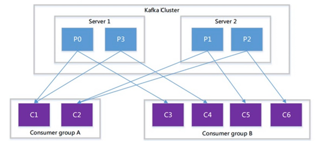

# 1、消息队列的介绍

消息（Message）是指在应用之间传送的数据，消息可以非常简单，比如只包含文本字符串，也可以更复杂，可能包含嵌入对象。 

消息队列（Message Queue）是一种应用间的通信方式，消息发送后可以立即返回，有消息系统来确保信息的可靠专递，消息发布者只管把消息发布到MQ中而不管谁来取，消息使用者只管从MQ中取消息而不管谁发布的，这样发布者和使用者都不用知道对方的存在。

# 2、常用的消息队列介绍

## 1、RabbitMQ

[RabbitMQ](https://www.rabbitmq.com/) 2007年发布，是一个在[AMQP](http://www.amqp.org/)(高级消息队列协议)基础上完成的，可复用的企业消息系统，是当前最主流的消息中间件之一。

## 2、ActiveMQ

[ActiveMQ](http://activemq.apache.org/)是由Apache出品，ActiveMQ 是一个完全支持JMS1.1和J2EE 1.4规范的 JMS Provider实现。它非常快速，支持多种语言的客户端和协议，而且可以非常容易的嵌入到企业的应用环境中，并有许多高级功能。

## 3、RocketMQ

[RocketMQ](https://github.com/alibaba/RocketMQ)出自 阿里公司的开源产品，用 Java 语言实现，在设计时参考了 Kafka，并做出了自己的一些改进，消息可靠性上比 Kafka 更好。RocketMQ在阿里集团被广泛应用在订单，交易，充值，流计算，消息推送，日志流式处理等。

## 4、Kafka

[Apache Kafka](http://kafka.apache.org/)是一个分布式消息发布订阅系统。它最初由LinkedIn公司基于独特的设计实现为一个分布式的提交日志系统( a distributed commit log)，，之后成为Apache项目的一部分。Kafka系统快速、可扩展并且可持久化。它的分区特性，可复制和可容错都是其不错的特性。

##  5、各种常用消息队列对比


#  3、消息队列的应用场景

消息队列在实际应用中包括如下四个场景：

应用耦合：多应用间通过消息队列对同一消息进行处理，避免调用接口失败导致整个过程失败；

异步处理：多应用对消息队列中同一消息进行处理，应用间并发处理消息，相比串行处理，减少处理时间；

限流削峰：广泛应用于秒杀或抢购活动中，避免流量过大导致应用系统挂掉的情况；

消息驱动的系统：系统分为消息队列、消息生产者、消息消费者，生产者负责产生消息，消费者(可能有多个)负责对消息进行处理；


# 4、kafka的基本介绍

## 1、kafka的基本介绍

官网：<http://kafka.apache.org/>

kafka是最初由linkedin公司开发的，使用scala语言编写，kafka是一个分布式，分区的，多副本的，多订阅者的日志系统（分布式MQ系统），可以用于搜索日志，监控日志，访问日志等。

Kafka is a distributed,partitioned,replicated commit logservice。它提供了类似于JMS的特性，但是在[设计](http://cpro.baidu.com/cpro/ui/uijs.php?rs=1&u=http%3A%2F%2Fwww%2Eaboutyun%2Ecom%2Fthread%2D9341%2D1%2D1%2Ehtml&p=baidu&c=news&n=10&t=tpclicked3_hc&q=92051019_cpr&k=%C9%E8%BC%C6&k0=java&kdi0=8&k1=%B1%E0%B3%CC&kdi1=8&k2=%BF%CD%BB%A7%B6%CB&kdi2=8&k3=%C9%E8%BC%C6&kdi3=8&k4=server&kdi4=1&sid=4ebca4a25f27e407&ch=0&tu=u1692056&jk=fb2f0911808fa875&cf=29&fv=14&stid=9&urlid=0&luki=4&seller_id=1&di=128)实现上完全不同，此外它并不是JMS规范的实现。kafka对消息保存时根据Topic进行归类，发送消息者成为Producer,消息接受者成为Consumer,此外kafka集群有多个kafka实例组成，每个实例([server](http://cpro.baidu.com/cpro/ui/uijs.php?rs=1&u=http%3A%2F%2Fwww%2Eaboutyun%2Ecom%2Fthread%2D9341%2D1%2D1%2Ehtml&p=baidu&c=news&n=10&t=tpclicked3_hc&q=92051019_cpr&k=server&k0=java&kdi0=8&k1=%B1%E0%B3%CC&kdi1=8&k2=%BF%CD%BB%A7%B6%CB&kdi2=8&k3=%C9%E8%BC%C6&kdi3=8&k4=server&kdi4=1&sid=4ebca4a25f27e407&ch=0&tu=u1692056&jk=fb2f0911808fa875&cf=29&fv=14&stid=9&urlid=0&luki=5&seller_id=1&di=128))成为broker。无论是kafka集群，还是producer和consumer都依赖于zookeeper来保证系统可用性集群保存一些meta信息。

## 2、kafka的好处

可靠性：分布式的，分区，复制和容错的。

可扩展性：kafka消息传递系统轻松缩放，无需停机。

耐用性：kafka使用分布式提交日志，这意味着消息会尽可能快速的保存在磁盘上，因此它是持久的。 

性能：kafka对于发布和定于消息都具有高吞吐量。即使存储了许多TB的消息，他也爆出稳定的性能。 

kafka非常快：保证零停机和零数据丢失。

## 3、分布式的发布与订阅系统

apache kafka是一个分布式发布-订阅消息系统和一个强大的队列，可以处理大量的数据，并使能够将消息从一个端点传递到另一个端点，kafka适合离线和在线消息消费。kafka消息保留在磁盘上，并在集群内复制以防止数据丢失。kafka构建在zookeeper同步服务之上。它与apache和spark非常好的集成，应用于实时流式数据分析。

## 4、kafka的主要应用场景

### 指标分析

kafka通常用于操作监控数据。这设计聚合来自分布式应用程序的统计信息，用以产生操作的数据集中反馈

### 日志聚合解决方法

kafka可用于跨组织从多个服务器收集日志，并使他们以标准的合适提供给多个服务器。

### 流式处理

流式处理框架（spark，storm，flink）重主题中读取数据，对其进行处理，并将处理后的数据写入新的主题，供 用户和应用程序使用，kafka的强耐久性在流处理的上下文中也非常的有用。

# 5、kafka架构内部细节剖析


 

 

 

说明：kafka支持消息持久化，消费端为拉模型来拉取数据，消费状态和订阅关系有客户端负责维护，消息消费完 后，不会立即删除，会保留历史消息。因此支持多订阅时，消息只会存储一份就可以了。

 

Broker：kafka集群中包含一个或者多个服务实例，这种服务实例被称为Broker

Topic：每条发布到kafka集群的消息都有一个类别，这个类别就叫做Topic 

Partition：Partition是一个物理上的概念，每个Topic包含一个或者多个Partition 

segment：一个partition当中存在多个segment文件段，每个segment分为两部分，.log文件和.index文件，其中.index文件是索引文件，主要用于快速查询.log文件当中数据的偏移量位置

Producer：负责发布消息到kafka的Broker中。

Consumer：消息消费者,向kafka的broker中读取消息的客户端

Consumer Group：每一个Consumer属于一个特定的Consumer Group（可以为每个Consumer指定 groupName）

.log:存放数据文件

.index：存放.log文件的索引数据

# 6、kafka主要组件说明

## 1、kafka当中的producer说明

producer主要是用于生产消息，是kafka当中的消息生产者，生产的消息通过topic进行归类，保存到kafka的broker里面去

 

## 2、kafka当中的topic说明

1、kafka将消息以topic为单位进行归类

2、topic特指kafka处理的消息源（feeds of messages）的不同分类。

3、topic是一种分类或者发布的一些列记录的名义上的名字。kafka主题始终是支持多用户订阅的；也就是说，一 个主题可以有零个，一个或者多个消费者订阅写入的数据。

4、在kafka集群中，可以有无数的主题。

5生产者和消费者消费数据一般以主题为单位。更细粒度可以到分区级别。

## 3、kafka当中的partition说明

kafka当中，topic是消息的归类，一个topic可以有多个分区，每个分区保存部分topic的数据，所有的partition当中的数据全部合并起来，就是一个topic当中的所有的数据，

一个broker服务下，是否可以创建多个分区？

可以的，broker数与分区数没有关系； 在kafka中，每一个分区会有一个编号：编号从0开始

每一个分区的数据是有序的

说明-数据是有序 如何保证一个主题下的数据是有序的？（生产是什么样的顺序，那么消费的时候也是什么样的顺序）


说明-数据是有序 如何保证一个主题下的数据是有序的？（生产是什么样的顺序，那么消费的时候也是什么样的顺序）

 

topic的Partition数量在创建topic时配置。

 

Partition数量决定了每个Consumer group中并发消费者的最大数量。

 

Consumer group A 有两个消费者来读取4个partition中数据；Consumer group B有四个消费者来读取4个 partition中的数据

 



## 4、kafka当中partition的副本数说明

kafka分区副本数（kafka Partition Replicas)


副本数（replication-factor）

 

副本数（replication-factor）：控制消息保存在几个broker（服务器）上，一般情况下等于broker的个数

 

一个broker服务下，是否可以创建多个副本因子？

不可以；创建主题时，副本因子应该小于等于可用的broker数。 副本因子过程图


副本因子操作以分区为单位的。每个分区都有各自的主副本和从副本；

主副本叫做leader，从副本叫做 follower（在有多个副本的情况下，kafka会为同一个分区下的所有分区，设定角色关系：一个leader和N个 follower），处于同步状态的副本叫做in-sync-replicas(ISR);

follower通过拉的方式从leader同步数据。

消费 者和生产者都是从leader读写数据，不与follower交互。

 

副本因子的作用：让kafka读取数据和写入数据时的可靠性。

 

副本因子是包含本身，同一个副本因子不能放在同一个Broker中。

 

如果某一个分区有三个副本因子，就算其中一个挂掉，那么只会剩下的两个中，选择一个leader，但不会在其 他的broker中，另启动一个副本（因为在另一台启动的话，存在数据传递，只要在机器之间有数据传递，就会长时间占用网络IO，kafka是一个高吞吐量的消息系统，这个情况不允许发生）所以不会在零个broker中启动。

 

如果所有的副本都挂了，生产者如果生产数据到指定分区的话，将写入不成功。

 

lsr表示：当前可用的副本

 

## 5、kafka当中的segment说明

一个partition当中由多个segment文件组成，每个segment文件，包含两部分，一个是.log文件，另外一个是.index文件，其中.log文件包含了我们发送的数据存储，.index文件，记录的是我们.log文件的数据索引值，以便于我们加快数据的查询速度

 

### 索引文件与数据文件的关系

既然它们是一一对应成对出现，必然有关系。索引文件中元数据指向对应数据文件中message的物理偏移地址

比如索引文件中3,497代表：数据文件中的第三个message,它的偏移地址为497。再来看数据文件中，Message 368772表示：在全局partiton中是第368772个message。

 注：segment index file采取稀疏索引存储方式，它减少索引文件大小，通过mmap可以直接内存操作，稀疏索引为数据文件的每个对应message设置一个元数据指针,它比稠密索引节省了更多的存储空间，但查找起来需要消耗更多的时间。


## 6、kafka当中的partition的offset

 

任何发布到此partition的消息都会被直接追加到log文件的尾部，每条消息在文件中的位置称为offset（偏移量），

offset是一个long类型数字，它唯一标识了一条消息，消费者通过（offset，partition，topic）跟踪记录。

 

## 7、kafka分区与消费组的关系

消费组： 由一个或者多个消费者组成，同一个组中的消费者对于同一条消息只消费一次。

某一个主题，对于消费组来说，其中的消费者应该小于等于该主题下的分区数。如下所示：

如：某一个主题有4个分区，那么消费组中的消费者应该小于4，而且最好与分区数成整数倍

1     2     4

同一个分区下的数据，在同一时刻，不能被同一个消费组的不同消费者消费

总结：分区数越多，同一时间可以有越多的消费者来进行消费，消费数据的速度就会越快，提高消费的性能


## 8、kafka当中的consumer

consumer是kafka当中的消费者，主要用于消费kafka当中的数据，任何一个消费者都必定需要属于某一个消费组当中，任意时刻，一个分区当中的数据，只能被kafka当中同一个消费组下面的一个线程消费。


# 7、kafka集群环境搭建

## 1、初始化环境准备

安装jdk，安装zookeeper并保证zk服务正常启动

## 2、下载安装包并上传解压

通过以下地址进行下载安装包

hadoop01执行以下命令，上传并解压

```
cd /opt/softwares
tar -xvzf kafka_2.12-2.2.0.tgz -C ../servers/
```

## 3、hadoop01服务器修改kafka配置文件

hadoop01执行以下命令进入到kafka的配置文件目录，修改配置文件

hadoop01执行以下命令创建数据文件存放目录

```
mkdir -p  /opt/servers/kafka_2.12-2.2.0/logs 

cd /opt/servers/kafka_2.12-2.2.0/config

vim server.properties
```

```
broker.id=0
log.dirs=/opt/servers/kafka_2.12-2.2.0/logs
zookeeper.connect=hadoop01:2181,hadoop02:2181,hadoop03:2181
delete.topic.enable=true
```

## 4、安装包分发到其他服务器

hadoop01执行以下命令，将hadoop01服务器的kafka安装包发送到hadoop02和hadoop03服务器

```
cd /opt/servers/

scp -r kafka_2.12-2.2.0/ hadoop02:$PWD
scp -r kafka_2.12-2.2.0/ hadoop03:$PWD
```

## 5、hadoop02与hadoop03服务器修改配置文件

hadoop02与hadoop03服务器修改kafka配置文件

hadoop02使用以下命令修改kafka配置文件

```
cd /opt/servers/kafka_2.12-2.2.0/config

vim server.properties
```

```
broker.id=1
log.dirs=/opt/servers/kafka_2.12-2.2.0/logs
zookeeper.connect=hadoop01:2181,hadoop02:2181,hadoop03:2181
delete.topic.enable=true
```

hadoop03使用以下命令修改kafka配置文件

```
cd /opt/servers/kafka_2.12-2.2.0/config

vim server.properties
```

```
broker.id=2
log.dirs=/opt/servers/kafka_2.12-2.2.0/logs
zookeeper.connect=hadoop01:2181,hadoop02:2181,hadoop03:2181
delete.topic.enable=true
```

## 6、kafka集群启动与停止

注意事项：在kafka启动前，一定要让zookeeper启动起来。

hadoop01执行以下命令将kafka进程启动在后台

```
cd /opt/servers/kafka_2.12-2.2.0

nohup bin/kafka-server-start.sh config/server.properties 2>&1 &
```

 

hadoop02执行以下命令将kafka进程启动在后台

```
cd/opt/servers/kafka_2.12-2.2.0

nohup bin/kafka-server-start.sh config/server.properties 2>&1 &
```

 

hadoop执行以下命令将kafka进程启动在后台

```
cd /opt/servers/kafka_2.12-2.2.0

nohup bin/kafka-server-start.sh config/server.properties 2>&1 &
```

 

三台机器也可以执行以下命令停止kafka集群

```
cd /opt/servers/kafka_2.12-2.2.0

bin/kafka-server-stop.sh
```


#  8、Kafka集群操作

## 1、创建topic

创建一个名字为test的主题， 有三个分区，有两个副本

hadoop01执行以下命令来创建topic     

```
cd /opt/servers/kafka_2.12-2.2.0

bin/kafka-topics.sh --create --bootstrap-server hadoop01:9092 --replication-factor 2 --partitions 3 --topic test
```


## 2、查看主题命令

查看kafka当中存在的主题

hadoop01使用以下命令来查看kafka当中存在的topic主题

```
cd /opt/servers/kafka_2.12-2.2.0

bin/kafka-topics.sh --list --bootstrap-server hadoop01:9092,hadoop02:9092,hadoop03:9092
```

 

## 3、生产者生产数据

模拟生产者来生产数据

hadoop01服务器执行以下命令来模拟生产者进行生产数据

```
cd /opt/servers/kafka_2.12-2.2.0

bin/kafka-console-producer.sh --broker-list hadoop01:9092,hadoop02:9092,hadoop03:9092 --topic test
```

 

## 4、消费者消费数据

hadoop02服务器执行以下命令来模拟消费者进行消费数据

```
cd /opt/servers/kafka_2.12-2.2.0

bin/kafka-console-consumer.sh --from-beginning --topic test  --bootstrap-server hadoop01:9092,hadoop02:9092,hadoop03:9092
```

 

## 5、运行describe  topics命令

 

hadoop01执行以下命令运行describe查看topic的相关信息

```
cd /opt/servers/kafka_2.12-2.2.0

bin/kafka-topics.sh --describe  --bootstrap-server hadoop01:9092 --topic test
```

结果说明：

这是输出的解释。第一行给出了所有分区的摘要，每个附加行提供有关一个分区的信息。

“leader”是负责给定分区的所有读取和写入的节点。每个节点将成为随机选择的分区部分的领导者。（因为在kafka中 如果有多个副本的话，就会存在leader和follower的关系，表示当前这个副本为leader所在的broker是哪一个） 

“replicas”是复制此分区日志的节点列表，无论它们是否为领导者，或者即使它们当前处于活动状态。（所有副本列表    0 ，1,2） 

“isr”是“同步”复制品的集合。这是副本列表的子集，该列表当前处于活跃状态并且已经被领导者捕获。（可用的列表数）

## 6、增加topic分区数

任意kafka服务器执行以下命令可以增加topic分区数

```
cd /opt/servers/kafka_2.12-2.2.0

bin/kafka-topics.sh --bootstrap-server hadoop01:9092 --alter --topic test --partitions 5
```


## 7、增加配置

动态修改kakfa的配置

任意kafka服务器执行以下命令可以修改topic配置信息

```
cd /opt/servers/kafka_2.12-2.2.0

bin/kafka-topics.sh --zookeeper hadoop01:2181 --alter --topic test --config flush.messages=1
```


## 8、删除配置

动态删除kafka集群配置

```
cd /opt/servers/kafka_2.12-2.2.0

bin/kafka-topics.sh --zookeeper hadoop01:2181 --alter --topic test --delete-config flush.messages
```


## 9、删除topic

目前删除topic在默认情况下知识打上一个删除的标记，在重新启动kafka后才删除。如果需要立即删除，则需要在

server.properties中配置：

```
delete.topic.enable=true
```

然后执行以下命令进行删除topic

```
kafka-topics.sh –bootstrap-server brokerip:port --delete --topic topicName
```

# 9、kafka的JavaAPI操作

## 1、创建maven工程并添加jar包

创建maven工程并添加以下依赖jar包的坐标到pom.xml

```

    <dependency>
        <groupId>org.apache.kafka</groupId>
        <artifactId>kafka-clients</artifactId>
        <version>2.2.0</version>
    </dependency>    
    <dependency>
        <groupId>org.apache.kafka</groupId>
        <artifactId>kafka-streams</artifactId>
        <version>2.2.0</version>
    </dependency>


```

## 2、生产者代码

```java
/**
 * 订单的生产者代码，
 */
public class OrderProducer {
    public static void main(String[] args) throws InterruptedException {
        /* 1、连接集群，通过配置文件的方式
         * 2、发送数据-topic:order，value
         */
        Properties props = new Properties();
        props.put("bootstrap.servers", "hadoop01:9092");
        props.put("acks", "all");
        props.put("retries", 0);
        props.put("batch.size", 16384);
        props.put("linger.ms", 1);
        props.put("buffer.memory", 33554432);
        props.put("key.serializer",
                "org.apache.kafka.common.serialization.StringSerializer");
        props.put("value.serializer",
                "org.apache.kafka.common.serialization.StringSerializer");
        KafkaProducer<String, String> kafkaProducer = new KafkaProducer<String, String>
                (props);
        for (int i = 0; i < 1000; i++) {
            // 发送数据 ,需要一个producerRecord对象,
            // 最少参数 String topic, V value
            kafkaProducer.send(new ProducerRecord<String, String>("test", "订单信息！"+i));
            Thread.sleep(100);
        }
    }
}

```

## 3、消费者代码

### 1、	自动提交offset

消费完成之后，自动提交offset

```java
/**
 * 消费订单数据
 */
public class OrderConsumer {
    public static void main(String[] args) {
        // 1连接集群
        Properties props = new Properties();
        props.put("bootstrap.servers", "hadoop01:9092");
        props.put("group.id", "test");
        //以下两行代码 ---消费者自动提交offset值
        props.put("enable.auto.commit", "true");
        props.put("auto.commit.interval.ms",  "1000");
        props.put("key.deserializer", "org.apache.kafka.common.serialization.StringDeserializer");
        props.put("value.deserializer", "org.apache.kafka.common.serialization.StringDeserializer");
        KafkaConsumer<String, String> kafkaConsumer = new KafkaConsumer<String, String>
                (props);
		 //2、发送数据 发送数据需要，订阅下要消费的topic。	order
		 kafkaConsumer.subscribe(Arrays.asList("test"));
        while (true) {
            ConsumerRecords<String, String> consumerRecords = kafkaConsumer.poll(Duration.ofMillis(100));
            // jdk queue offer插入、poll获取元素
            for (ConsumerRecord<String, String> record : consumerRecords) {
                System.out.println("消费的数据为：" + record.value());
            }
        }
    }
}
```

### 2、手动提交offset

如果Consumer在获取数据后，需要加入处理，数据完毕后才确认offset，需要程序来控制offset的确认？ 关闭自动提交确认选项

```java
public class MyConsumerByHand {

    public static void main(String[] args) {

        Properties props = new Properties();
        //broker节点
        props.put("bootstrap.servers", "hadoop01:9092,hadoop02:9092");
        //消费者组
        props.put("group.id", "tedu");
        //是否自动提交offset偏移量
        props.put("enable.auto.commit", "false");
        //500ms
        //每次自动提交偏移量的时间间隔
        //props.put("auto.commit.interval.ms", "1000");
        //将数据进行反序列化
        props.put("key.deserializer", "org.apache.kafka.common.serialization.StringDeserializer");
        props.put("value.deserializer", "org.apache.kafka.common.serialization.StringDeserializer");
        //创建消费者对象
        KafkaConsumer<String, String> consumer = new KafkaConsumer<String, String>(props);
        //订阅主题
        consumer.subscribe(Arrays.asList("test"));

        while (true){
            //获取到消费的数据集合
            ConsumerRecords<String, String> records = consumer.poll(3000);
            for (ConsumerRecord<String, String> record : records) {
                //获取每一条记录
                String topic = record.topic();
                long offset = record.offset();
                String value = record.value();
                int partition = record.partition();
                System.out.println("topic:"+topic+",partition:"+partition+",offset:"+offset+",value:"+value);
            }
            //完成同步的手动提交 可能产生阻塞
            consumer.commitSync();
            //完成异步的手动提交
            //consumer.commitAsync();

        }

    }
}
```


### 3、重复消费与数据丢失

消息的消费语义：

1.exactly at once：消费且消费一次

2.at most once：至多消费一次   数据的丢失

3.at least once：至少消费一次  数据重复的消费（实际工作中的情况）

最终控制好offset。

一般业界都是将offset保存到redis或者hbase的数据库中。

目前offset保存在__consumer_offsets的主题中，默认50个分区，默认采用的是低阶API完成offset的存储。


# 10、kafka当中的数据不丢失机制

## 1.从生产者的角度考虑

同步：发送一批数据给kafka后，等待kafka返回结果

```
1、生产者等待10s，如果broker没有给出ack相应，就认为失败。

2、生产者重试3次，如果还没有响应，就报错
```

异步：发送一批数据给kafka，只是提供一个回调函数。

```
1、先将数据保存在生产者端的buffer中。buffer大小是2万条 
2、满足数据阈值或者数量阈值其中的一个条件就可以发送数据。
3、发送一批数据的大小是500条
```

说明：如果broker迟迟不给ack，而buffer又满了，开发者可以设置是否直接清空buffer中的数据。

ack确认机制：

```
0：生产者只负责发送数据，不关心数据是否丢失，响应的状态码为0（丢失的数据，需要再次发送）
1：partition的leader收到数据，响应的状态码为1
-1：所有的从节点都收到数据，响应的状态码为-1
```

## 2.从broker节点的角度考虑

​	在broker中，保证数据不丢失主要是通过副本因子（冗余），防止数据丢失

## 3.从消费者的角度考虑

​	在消费者消费数据的时候，只要每个消费者记录好offset值即可，就能保证数据不丢失。


# 11、flume整合kafka

1.配置flume的配置文件

```
#为我们的source channel  sink起名
a1.sources = r1
a1.channels = c1
a1.sinks = k1

#指定我们的source数据收集策略
a1.sources.r1.type = spooldir
a1.sources.r1.spoolDir = /opt/servers/flumedata
a1.sources.r1.fileSuffix = .COMPLETED
a1.sources.r1.ignorePattern = ^(.)*\\.tmp$
a1.sources.r1.inputCharset = GBK

#指定我们的channel为memory,即表示所有的数据都装进memory当中
a1.channels.c1.type = memory

#指定我们的sink为kafka  sink，并指定我们的sink从哪个channel当中读取数据
a1.sinks.k1.type = org.apache.flume.sink.kafka.KafkaSink
a1.sinks.k1.kafka.topic = test
a1.sinks.k1.kafka.bootstrap.servers = hadoop01:9092,hadoop02:9092,hadoop03:9092
a1.sinks.k1.kafka.flumeBatchSize = 20
a1.sinks.k1.kafka.producer.acks = 1


a1.sources.r1.channels = c1
a1.sinks.k1.channel = c1

```

2.启动flume

```
bin/flume-ng agent -c conf -f conf/spooldir_kafka.conf -n a1 -Dflume.root.logger=INFO,console
```

