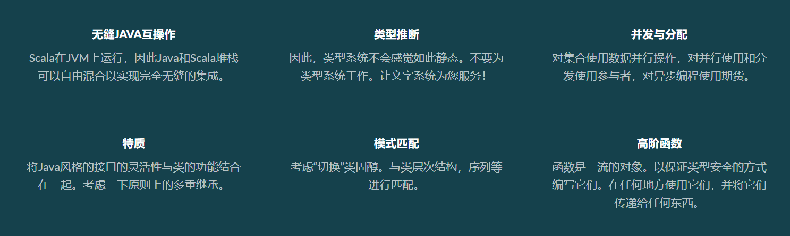
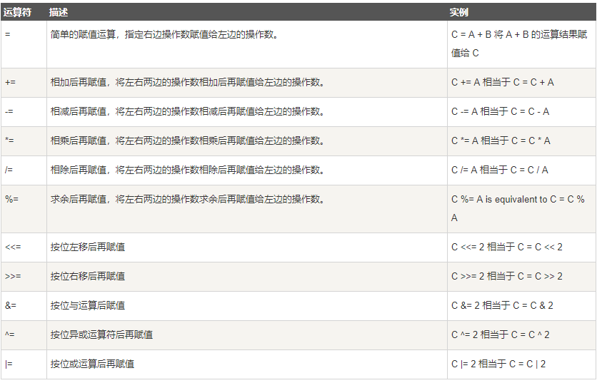
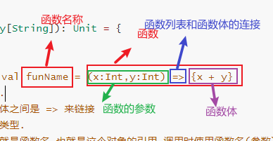

## 1.前言

### 为什么要学习Scala

分布式高并发语言Go、R、Erlang等等为何选择Scala？
Spark是大数据处理的核心方式，用scala语言编写！
Kafka分布式发布订阅消息系统，由LinkedIn捐给Apache，以极高的吞吐量著称，是目前最火爆的MQ，用scala语言编写！

Flink最新一代分布式海量数据计算框架，Alibaba收购并开源，自己开发Blink分支，Scala语言编写！

```
为什么学习scala
1.基于强大的java基础。（.class文件）
2.大数据以及分布式的开发项目中（服务）都是基于java开发的
3.目前主流的大数据框架，比如：spark，kafka，Flink都是有scala语言写的
```

### 学前寄语

在我个人看来，Scala是一门非常优雅的语言，但优雅的背后要付出的辛苦也很多，比如学习Scala的人都会说，Scala语法非常简洁，但这也意味着抽象级别比较高，对初学者而言不好理解。也会有人说，Scala语法非常灵活，一个功能可以有非常多的实现方法，可以说条条大路通罗马，那么代价就是对于初学者来说，路多了反而不好选择。
所以在这里我对初学者的忠告是：在学习Scala前期，先走通一条路，屏蔽掉多余的干扰项，可能我们第一次使用Scala实现的项目看起来是非常笨拙的，但是没关系，任何的学习都是循序渐进的，不要追求一蹴而就。走通之后再回头，去寻找更好的替代方案。这样才能享受学习。

### Scala简介


Scala combines object-oriented and functional programming in one concise, high-level language. Scala’s static types help avoid bugs in complex applications, and its JVM and JavaScript runtimes let you build high-performance systems with easy access to huge ecosystems of libraries.
Scala是一个将面向对象和函数式编程结合在一起的简洁的高级语言。Scala的静态类型有助于避免复杂应用程序中的错误，其可以运行在JVM和JavaScript的特点使您可以轻松访问庞大的生态系统库来构建高性能系统。

```
scala是一个语法简洁的面向对象的，函数式编程语言的特点，同时是一门强类型的语言。（多范式的编程语言）
```


### Scala的诞生


Martin OrderSky马丁 奥德斯基 是JVM开发团队核心成员,是JDK1.5泛型,增强for循环,自动类型转换，JDK1.8Lambda等重要特性的作者.

在对JAVA的维护过程中,马丁非常推崇JAVA的面向对象及垃圾回收,是James Gosling的小迷弟. 但作为编辑器开发的狂热爱好者的他,又觉得JAVA的语法过于繁琐.所以相继自己开发了另外两种语言Pizza和Scala.其中Scala被用于实验室科研后推广开源.在上边提到JDK1.5和1.8的两个版本中的新特性就是从Pizza和Scala中迁移而来.

Scala诞生于2001年,但真正被人们所熟知并广泛应用于大数据开发是在十多年之后.可以说是Spark和Kafka带火了Scala.
James Gosling曾在采访中说，如果让他选择“今天使用的语言不是Java，那就是Scala”。

### 函数式编程

C：面向过程编程
Java：面向对象编程
Scala：面向函数编程
函数式编程：将所有复杂的问题的解决拆分为若干函数的处理，每一个函数可以去实现一部分功能，利用很多次函数的处理最终解决问题。函数式编程相对于面向对象编程更加的抽象，好处是代码可以非常的简洁，更多的采用常量而不是变量来解决问题，这样额外带来的好处是在线程并发时可以减少甚至杜绝多线程并发安全问题，特别适合于应用在处理高并发场景、分布式场景下的问题。函数式编程可以使用高阶函数，函数在scala中是一等公民，可以更加灵活的进行程序的编写。
函数式编程并不是面向对象编程的发展，而是另外一种解决问题的思路，两者之间也并没有绝对的好坏之分，在不同的场景中各有各的优缺点。
总结:Scala是一个面向对象的函数式编程语言.

### Scala和java的关系

java是由C语言开发，scala基于java，现在看来大部分情况下，青出于蓝而胜于蓝！

分布式开发中会面对很多棘手的问题，如面临服务器之间的通信、远程调用、序列化、反序列化等等。但有了scala这一切变得轻松，它全部都做了内部实现。让我们访问分布式集群环境就和访问单机一样简单。

同时Scala无缝集成Java，Scala编译器会先把源文件编译成.class文件再运行。Scala可以调用几乎所有的Java类库，也可以从Java应用程序中调用Scala的代码。它也可以访问现存的数之不尽的Java类库，这让用户（潜在地）迁移到Scala更加容易。

Java => 编译 => .class => JVM
Scala => 编译 => .class => JVM

Scala => JVM(支持,但不推荐,不是解释执行)
扩展：groovy、clojure（storm）都可以编译成.class，利用JVM。

### Scala的特点



### Scala环境搭建

#### SDK下载安装及测试

**提示:Scala基于Java,需要提前安装JDK并配置环境变量**
官网:<https://www.scala-lang.org/>

说明: 编写本篇教程时,Scala的最新版本为2.13.3,但是基于后续Spark\Kafka\Flink三个主流框架的版本及对Scala的版本要求.我们最终选择Scala-2.12.7这个版本作为基础环境. 2.11版本之后差别并不大,所以该文所有代码预计在2.11\2.12\2.13版本环境中都可以正常运行.

1.访问Scala官网,找到所需安装包进行下载.https://www.scala-lang.org/download/all.html
在这里,我们选择的是2.12.7这个版本进行下载.


2.进入2.12.7版本下载页后,在尾部找到对应系统安装包进行下载.


3.安装Scala,双击msi包,一路下一步即可.注意中间在安装目录选择时,路径不要有中文或空格.


选择合适的目录


4.检查环境


5.Hello World


## 2.IDEA插件安装

在IDEA的File菜单中打开Settings窗口
选择Plugins在Marketplace中搜索Scala,找到Scala插件后点击Install.


等待插件下载完成,点击重启IEDA


## 3.第一个Scala工程

创建一个新的工程


创建一个Object（至于什么是Object之后会详细解释）

命名为: cn.tedu.scalabasic.HelloWorld
选择Object选项

编写代码

```
package cn.tedu.scalabasic

/**
 * 这是我们的第一个Scala程序!
 */
object HelloWorld {
  def main(args: Array[String]): Unit = {
    print("Hello World!!!")
  }
}
```

右键运行

结果

主方法


## 4.Scala基础语法

### 注释

Scala中注释的写法与Java一致

```scala
package cn.tedu.scalabasic
/**
 * Scala基础语法
 */
object ScalaGrammar {
  def main(args: Array[String]): Unit = {
    /*
    1.注释
    Scala中的注释形式与Java中一致.包括文档注释,多行注释,单行注释
     */
    /**
     * 这是一个文档注释
     */
    /*
    这是一个多行注释
     */
    //这是一个单行注释
  }
}


```

### 代码分隔

在Scala代码中每行代码的结尾不需要分号";"作为结束符(自动推断),也可以加分号.

```scala
package cn.tedu.scalabasic
/**
 * Scala基础语法
 */
object ScalaGrammar {
  def main(args: Array[String]): Unit = {
    /*
    2.代码分隔符
    在Scala中,代码行与行之间的分隔符与Java相同,使用分号;,但是一般不需要写,Scala实现了自动推断.
     */
    println("再见,貂蝉");
    println("你好,西施")
    println("么么哒,上官婉儿")
  }
}

```

### 变量和常量定义

在Scala中变量和常量分别使用var和val来定义.可以声明类型但不必要(类型自动推断).
其中,官方建议尽量不要使用var而是使用val来定义,有利于内存回收.和线程的安全.

```scala
package cn.tedu.scalabasic
/**
 * Scala基础语法
 */
object ScalaGrammar {
  def main(args: Array[String]): Unit = {
    /*
    3.常量变量
    在Scala中,变量使用var来定义,常量使用val定义
    并且在定义变量和常量时一般都不写类型.Scala按照上下文可以自动推断
    **重要**:在Scala中我们更推荐大家尽可能的使用常量来定义属性,这更利于内存回收.
     */
    var a = 12
    val b = 10
    val c: Int = 11
    a += 1
    //    b += 2  //编译报错,常量不可变
    println(a)
    println(b)
  }
}

```

### 标识符

Scala 可以使用两种形式的标志符，字符数字和符号。
字符数字使用字母或是下划线开头，后面可以接字母或是数字，符号"$“在 Scala 中也看作为字母。然而以”$“开头的标识符为保留的 Scala 编译器产生的标志符使用，应用程序应该避免使用”$"开始的标识符，以免造成冲突。
同时,Scala与Java相同的是同样建议使用驼峰规则命名.

```scala
package cn.tedu.scalabasic
/**
 * Scala基础语法
 */
object ScalaGrammar {
  def main(args: Array[String]): Unit = {
    /*
    4.标识符
    Scala标识符规则与Java大致相同.不能以符号和数字开头(_和$可以).
    其中以$例外一般不作为标识符的开头使用,暂时不必深究.
    命名格式推荐使用驼峰命名法:AaaBbb,aaaBbb,AAA_BBB
    不能使用关键字和保留字命名
     */
    val userName = "张飞"
    //    val if = 12 //编译报错,关键字和保留字不能用作标识符

  }
}


```

### 关键字保留字


### 方法和操作符

在Scala中有这样一句话:操作符即方法,方法即操作符
意思是方法可以按照操作符的使用规则来使用,操作符也可以按照方法的方式使用

```scala
package cn.tedu.scalabasic
/**
 * Scala基础语法
 */
object ScalaGrammar {
  def main(args: Array[String]): Unit = {
    /*
    5.操作符和方法
    在Scala中有这样一句话:操作符即方法,方法即操作符
    意思是方法可以按照操作符的使用规则来使用,操作符也可以按照方法的方式使用
     */
    val str = "123_456_789"
    val strs = str split "_" //这里以操作符的形式(1 + 2)使用split方法
    for (s <- strs) {
      println(s)
    }

    println(2.*(4)) //这里以方法的形式(a.split("_"))使用+操作符

    //对于没有参数的方法,也可以不写括号
    val num: Int = 123
    println(num.toString())
    println(num.toString)
  }
}
```

## 5.Scala数据类型

在Java中,分为基本数据类型(8种) 和 引用类型(继承自Object).其中基本数据类型直接以字面量的形式赋值,没有属性和方法.
在Scala中数据类型与Java的设计类似,并且针对面向对象和函数式编程做了更进一步的优化.


其中:

Scala中有两种类型,AnyVal(值类型)和AnyRef(引用类型)都继承自Any(顶级父类).
AnyVal类型也是以"对象"形式存在,有属性和方法.声明时以字面量的形式声明.其中包含了类似Java中的8大基本类型:Byte\Short\Int\Long\Float\Double\Boolean\Char.除此之外还有一个特殊的Unit类型,表示空值(类似Java中的void).
AnyRef类型中包括所有的Scala内置对象和自定义的Scala对象,集合等,以及所有引用的Java对象.还定义了一个Null类型来表示空对象,他的默认值为null.
在Scala中还有一个非常特殊的Nothing类型.他是所有Scala类型的子类.被定义为abstract

### AnyVal

值类型的定义

```
package cn.tedu.scalabasic

import scala.collection.immutable.StringOps

/**
 * AnyVal值类型的声明
 */
object DataTypes {

  def main(args: Array[String]): Unit = {
    val a: Byte = 123
    println(a,a.getClass)

    val b: Short = 123
    println(b,b.getClass)

    val c: Int = 123
    println(c,c.getClass)

    val d: Long = 123L  //此处加不加L都可以
    println(d,d.getClass)

    val e: Float = 1.23f  //为区别Double,Float类型后加f
    println(e,e.getClass)

    val f: Double = 1.23
    println(f,f.getClass)

    val g: Char = '@'
    println(g,g.getClass)

    val h: Boolean = false
    println(h,h.getClass)

    val i: Unit = "123" //不管这里赋值什么,他的值始终是()这是Unit的默认值.
    println(i,i.getClass)

    /*
      特殊说明
      虽然String是java.lang.String.在Scala中属于AnyRef类型,
      但是在实际操作是会被隐式转换为StringOps类型属于AnyVal
      通过以下实验可以证明
     */
    val j: String = "123"
    println(j,j.getClass) //(123,class java.lang.String)

    val k: StringOps = "123"
    println(k,k.getClass) //(123,class scala.collection.immutable.StringOps)
  }
}

```

## 值类型的转换

### 自动类型转换

在Scala中类型的转换包括两种,一种是值类型转换,另外一种是引用类型转换,这里我们先重点讲解值类型的转换.
值类型可以通过以下方式进行转换：


### 强制类型转换

范围大的数据类型通过 .toxxx 实现向范围小的数据类型强制转换,注意可能会造成精度的缺失.

```scala
package cn.tedu.scalabasic

/**
 * 类型转换
 */
object TypeTrans {
  def main(args: Array[String]): Unit = {
    /*
    强制类型转换
    范围大的数据类型通过 .toxxx 实现向范围小的数据类型强制转换,注意可能会造成精度的缺失.
     */
    val h: Int = 12
    val i: Double = 2.12
    val j: Int = (h + i).toInt
    println(j)
  }
}

```

### 值类型和String类型之间的相互转换

1. 值类型转换为String类型有两种方式,分别是a+"" 和 a.toString
2. String类型数据转换为值类型的前提是可转,使用.toXxx

```scala
package cn.tedu.scalabasic

/**
 * 类型转换
 */
object TypeTrans {
  def main(args: Array[String]): Unit = {
    /*
    值类型和String类型之间的相互转换
     */
    //值类型转换为String类型有两种方式,分别是a+"" 和 a.toString
    val k:Int = 12
    println(k+"",(k+"").getClass)

    val l:Int = 12
    println(l.toString,(l.toString).getClass)

    //String类型数据转换为值类型的前提是可转,使用.toXxx
    val m:String = "123"
//    val m:String = "12a"  //报错:java.lang.NumberFormatException
    println(m.toInt,m.toInt.getClass)
  }
}

```

## 6、运算符

### 算数运算符

Scala中的算数运算符与Java基本一致,唯一不同是没有++和–-.


### 赋值运算符

Scala中的赋值运算符与Java基本一致



### 关系运算符

Scala中的关系运算符与Java基本一致


### 逻辑运算符

Scala中的逻辑运算符与Java基本一致,但是在取反操作时不能像Java一样多层取反.


### 位运算符

Scala中的位运算符与Java基本一致,了解即可.


## 7、流程控制

程序的执行顺序需要根据需求进行相应的控制,比如执行的顺序,执行条件,执行次数等.

### 顺序结构

Scala像大部分语言一样,代码一般按照从上到下的顺序执行.
一行代码中安装从左到右的顺序执行,同一行内如果有括号,先算括号里.
数学计算中遵循先乘除后加减.

### 分支结构

在Scala分支结构中,只有if…else if…else 没有Java中的switch…case(模式匹配)
需要注意的是if分支结构是可以有返回值的.所以可以使用if语句替代Scala中没有的三元运算符.
与Java一致的是,分支结构可以多层嵌套.

```scala
package cn.tedu.scalabasic

/**
 * 流程控制
 */
object ProcessControl {
  def main(args: Array[String]): Unit = {
    /*
    分支结构
     */
    val age = 19
    if (age >= 18 && age < 500) {
      println("你已经成年了")
    } else if (age >= 500) {
      println("你已经成精了")
    } else {
      println("你还是个孩子")
    }
    //在Scala中没有三元运算符 a?b:c,使用if...else代替
    var result = if (age >= 18) "你已经成年了" else "你还是个孩子"
    println(result)
  }
}


```

### 循环结构

#### for循环

在Scala中for循环用于控制程序执行次数,与Java一致,同时具备了更加丰富的功能.

1. for循环表达式可以同时定义多个.
2. for循环内可以加条件.
3. for循环可以有返回值.
4. for循环有返回值,返回每次执行的结果.

```scala
package cn.tedu.scalabasic

/**
 * 流程控制
 */
object ProcessControl {
  def main(args: Array[String]): Unit = {
    /*
    循环结构-for
     */
    for (i <- 1 to 10) {
      println(i)
    }
    //九九乘法表
	for (i <- 1 to 9) {
      for (j <- 1 to i) {
		//print(j + "*" + i + "=" + i * j + "\t")
        //在Scala中变量和字符串的拼接可以简化为占位符
        print(s"${j} * ${i} = ${i*j}\t")
      }
      println()
    }

    //简写
    for (i <- 1 to 9; j <- 1 to i) {
      print(s"${j} * ${i} = ${i*j}\t")
      if (i == j) println()
    }

    //循环条件,守卫,步长
    for(i <- 1 to 10 if i % 2 == 0) println(i)

    //推导式:生成一个2到10的偶数集合
    var nums = for(i <- 1 to 10 if i % 2 == 0) yield i
    println(nums)
  }
}

```

#### while循环

Scala中while与Java中写法和用法都一致.但是更推荐使用for,因为for更加简洁.

```scala
package cn.tedu.scalabasic

/**
 * 流程控制
 */
object ProcessControl {
  def main(args: Array[String]): Unit = {
    /*
    循环结构-while
     */
    var num1 = 0
    while (num1 <= 10) {
      num1 += 1
    }
    println(num1)

    var num2 = 0
    do {
      num2 += 1
    } while (num2 <= 10)
    println(num2)
  }
}

```

## 8、方法

```
总结：
方法属于对象，所以严格意义上讲属于OOP，但是在函数式编程语言中，也会调用方法，所以scala并不是纯粹的函数式编程语言。
函数也是以一个对象，在OOP的编程思想中，有的时候在定义方法中也需要传入函数作为参数使用。

方法本身属于对象，直接以对象.方法的方式调用
函数，本身最高的抽象就是一个对象，可以直接当对象使用
```


在Scala中方法和函数是不一样的.一般情况下在使用时并不需要特殊区分.

### 方法


Scala中的方法定义与Java不同更加简洁.
1.一般情况下返回值类型可以省略.递归方法除外.
2.return可以省略,默认方法体中最后一行被返回.
3.只有一行代码的时候大括号也可以省略.
4.当返回值类型为Unit(没有返回值)时,=也可以省略不写,也就是说如果不写等号该方法不会返回任何数据.这种形式在Scala中叫做"过程",此时就算方法体中声明了return,不管return后返回的是什么,最终默认返回()
5.在省略return的情况下,方法的返回值类型可以不写(自动推断),但是如果写了return代表不希望编译器自动推断返回值类型,此时必须定义返回值类型.
6.方法的内部还可以定义方法(灵活)
7.方法的参数默认是val修饰所以在方法内部不能修改形参的值.

```scala
package cn.tedu.scalafunction

/**
 * 方法
 */
object Method {
  def main(args: Array[String]): Unit = {
    /*
    方法的定义
     */
    def getSum1(a:Int,b:Int):Int = {
      return a+b
    }
    //返回值类型可以省略(自动推断)
    //return可以省略(默认返回最后一行)
    //{}可以省略(只有一行代码)
    def getSum2(a:Int,b:Int)= a + b
    
    val sum1 = getSum1(1,2)
    val sum2 = getSum2(3,4)
    
    println(sum1)
    println(sum2)

    //没有返回值时,=等号可以不写.这种形式在Scala中叫做:过程
    def sayHello() {
      println("Hello,World")
      return 1  //即使写了返回1,因为没有等号= 方法也不会返回任何数据.
    }
    val hello = sayHello()
    println(hello)
  }
}

```

### 递归

方法内部调用自己,即为递归
递归方法定义时不能省略返回值类型

```scala
package cn.tedu.scalafunction

/**
 * 方法
 */
object Method {
  def main(args: Array[String]): Unit = {
    //递归方法定义时必须声明返回值
    def getFactorial(n: Int): Int = {
      if (n == 1) n else n * getFactorial(n - 1)
    }

    val factorial = getFactorial(5)

    println(factorial)
  }
}

```

### 方法的参数

#### 默认参数

在方法的定义时,我们有时会遇到这样的需求: 某些参数通常是不变的数据只有少数情况下才会变化.如果大多数情况下都需要手动传入同样值不符合编程中复用的原则.默认参数就可以解决这类问题.

```scala
package cn.tedu.scalafunction

/**
 * 方法
 */
object Method {
  def main(args: Array[String]): Unit = {
    /*
    默认参数
     */
    def getUserInfo(name:String,age:Int,addr:String = "张家口"):String = {
      s"${name}来自${addr},今年${age}岁了"
    }
    val info1 = getUserInfo("董长春",12)
    val info2 = getUserInfo("马梦诗",12)
    val info3 = getUserInfo("刘沛霞",12,"天津")

    println(info1)
    println(info2)
    println(info3)
  }
}

```

#### 指定参数

指定参数时指,在调用方法是通过指定参数名来改变参数传递的前后顺序.

```scala
package cn.tedu.scalafunction

/**
 * 方法
 */
object Method {
  def main(args: Array[String]): Unit = {
    /*
    指定参数
     */

    def getProduct(a: Int = 5, b: Int = 10) = (a + 3) * b
    //改变参数传入的顺序
    println(getProduct(b = 4, a = 3))
    //避免在参数有默认值时错传
    println(getProduct(b = 1))
  }
}


```

#### 可变参数

当方法的参数列表中有多个不确定的参数时,可以使用可变参数,与Java类似.
可变参数用数组来保存,可以直接调用数组的方法.
如果参数列表中既有普通参数,也有可变参数,可变参数必须写在最后.

```scala
package cn.tedu.scalafunction

/**
 * 方法
 */
object Method {
  def main(args: Array[String]): Unit = {
    /*
    可变参数
     */
    def getSum4(nums:Int*) = nums.sum //可变参数是用数组保存的,可以直接使用数组的方法.
    //需要注意的是,如果参数列表中既有普通参数,也有可变参数,可变参数需要写在最后.
    //def getLogs(logs:String*,id:Int) = {} //编译错误:*-parameter must come last
  }
}


```

## 9、函数

在Scala中函数与方法是不同的.方法依附于对象,而函数本身就是对象.
函数的定义方式也与方法不同



```scala
object Function {
  def main(args: Array[String]): Unit = {
    /*
    函数的定义
    0.函数的定义方式为: val funName = (x:Int,y:Int) => {x + y}
    1.函数本身是一个对象.
    2.函数参数列表和函数体之间是 => 来链接
    3.函数不需要写返回值类型.
    4.函数定义时的变量名就是函数名,也就是这个对象的引用,调用时使用函数名(参数)的形式调用.
    5.函数可以直接用lazy修饰作为惰性函数.
     */
    val getSum = (a:Int,b:Int) => {a + b}
    println(getSum(1,2))

    val printMsg = () => {println("Hello")}
    printMsg()

    lazy val getMax = (v1:Int,v2:Int) => {if (v1>v2) v1 else v2}
    println(getMax(2, 3))
    
    /*
    方法转函数
    有时候我们需要将一段逻辑作为参数传递,但是方法不支持传递,可以将其转化为函数.
    通过本案例的输出结果,我们也可验证,函数是对象,而方法不是.
     */
    
    def getInfo() = {println("我叫刘备")}
    println(getInfo)
    val toFunction = getInfo _
    println(toFunction)
  }
}


```

### 匿名函数

在Scala中匿名函数在生产中是非常常用的,也是我们需要非常熟悉的编码方式.
所谓匿名函数,与Java中lambda表达式是类似的,表现形式类似,功能也类似.都是以简洁的方式定义一段逻辑.常常作为参数传入其他的方法

```scala
package cn.tedu.scalafunction

/**
 * 函数
 */
object Function {
  def main(args: Array[String]): Unit = {
    /*
    匿名函数
    在很多时候,我们需要定义一些具有泛化功能的方法,比如对两个数字进行运算,其中数据和运算方式由调用者决定,此时
    我们如果提前在方法中定义好运算方式的话工作量太大(需要考虑所有情况)那么不妨接收一个用户传进来的运算逻辑,而
    这个运算逻辑就可以用函数的方式来接收.用户在调用这个方法时,可以先定义一个函数然后将函数作为参数传入,当这个
    函数只用到一次时,可以以匿名的方式传入,这就是匿名函数.
     */
    //需求:定义一个方法,传入两个数字以及运算方式,得出结果.
    def process(f:(Int,Int)=>Int,a:Int,b:Int) = {
      f(a,b)
    }
    process((a,b)=>{print("result:"+a+b);a+b},1,2)
  }
}
```

### 高阶函数

所谓高阶函数其实就是函数的高级使用方式,其中包括

#### 函数作为参数传入方法或函数

```scala
package cn.tedu.scalafunction

/**
 * 函数
 */
object Function {
  def main(args: Array[String]): Unit = {
    /*
    高阶函数
    1.函数作为参数传入方法
    2.函数作为方法的返回值
    3.*方法的参数和返回值都是函数
     */

    //1.函数作为参数传入方法,一般多使用匿名函数
    val f1 = (a: Int, b: Int) => {
      (a * b, a + b)
    }

    def method1(f:(Int,Int)=>(Int,Int),a:Int,b:Int)={
      println(s"$a 和 $b 相乘得 ${f1(a,b)._1} \n$a 和 $b 相加得 ${f1(a,b)._2}")
    }

    method1(f1,1,2) //函数作为参数传入方法

    val f2 = (f:(Int,Int)=>(Int),a:Int,b:Int) => {
      f(a,b)
    }
    println(f2((a,b)=>{a+b},1,2)) //匿名函数作为参数传入函数
  }
}

```

#### 函数作为方法或函数的返回值

```scala
package cn.tedu.scalafunction

/**
 * 函数
 */
object Function {
  def main(args: Array[String]): Unit = {
    /*
    高阶函数
    1.函数作为参数传入方法
    2.函数作为方法的返回值
    3.*方法的参数和返回值都是函数
     */
    //2.函数作为方法或函数的返回值
    //需求:定义一个方法returnFun(n:Int),让其返回一个计算n倍的a和n倍的b的和的函数f(a,b) => n * a + n * b
    //函数作为方法的返回值
    def returnFun(n: Int): (Int, Int) => Int = {
      val reFun = (a: Int, b: Int) => {
        n * a + n * b
      }
      reFun //(a:Int,b:Int)=>{ n*a + n*b }
    }

    println(returnFun(10)(3, 4))  //returnFun(10) --> reFun

    //函数作为函数的返回值
    val f3 = (n:Int) => {
      val reFun = (a: Int, b: Int) => {
        n * a + n * b
      }
      reFun //(a:Int,b:Int)=>{ n*a + n*b }
    }

    println(f3(10)(1,2))
  }
}

```

#### 方法或函数的参数和返回值都是函数

```scala
package cn.tedu.scalafunction

/**
 * 函数
 */
object Function {
  def main(args: Array[String]): Unit = {
    /*
    高阶函数
    1.函数作为参数传入方法
    2.函数作为方法的返回值
    3.*方法的参数和返回值都是函数
     */
    //3.*方法或函数的参数和返回值都是函数
    //需求：定义一个方法或者函数，参数是(f1:(Int,Int),a:Int,b:Int)使得a和b按照f1的方式运算
    // 返回值是 f2:Int=>Int f2的逻辑是将传入的参数*n返回
    
    //方法的参数和返回值是函数
    def ioFun(f1: (Int, Int) => Int, a: Int, b: Int): Int => Int = {
      val f2 = (n: Int) => {
        n * f1(a, b)
      }
      f2
    }

    println(ioFun((a, b) => {a + b}, 2, 3)(100))

    //函数的参数和返回值是函数
    val f4 = (f1: (Int, Int) => Int, a: Int, b: Int) => {
      val f2 = (n: Int) => {
        n * f1(a, b)
      }
      f2
    }

    println(ioFun((a, b) => {a + b}, 2, 3)(100))

  }
}

```

### 柯里化函数

首先来谈谈什么叫柯里化函数: 柯里化函数就是将多个参数的函数Fa(p1,p2,p3…)转化为一个包含Fa部分参数的新函数Fb.
比如Fa(p1,p2,p3…) --> Fb(p3…),其中Fa的参数p1和p2已经在转化中得到了计算,返回p1与p2的计算结果和p3…进行计算的逻辑,也就是新函数Fb(p3…).

```scala
package cn.tedu.scalafunction

/**
 * 函数
 */
object Function {
  def main(args: Array[String]): Unit = {
   /*
    柯里化函数
    首先来谈谈什么叫柯里化函数: 柯里化函数就是将多个参数的函数Fa(p1,p2,p3...)转化为一个包含Fa部分参数的新函数Fb.
    比如Fa(p1,p2,p3...)  -->  Fb(p3...),
    其中Fa的参数p1和p2已经在转化中得到了计算,返回p1与p2的计算结果和p3...进行计算的逻辑,也就是新函数Fb(p3...)..
     */

    val fa = (a: Int, b: Int, c: Int) => {
      val resultAB = a + b
      println("a + b = "+resultAB)
      val fb = (n: Int) => {
        c * n
      }
      fb
    }

    //柯里化函数一般使用形式
    val result = fa(1, 2, 3)(1000)
    println(result)

  }
}

```

## 10、类和对象

### 回顾面向对象

在Java的学习过程中,面向对象无疑是重中之重.而Scala是一门面向对象的函数式编程语言,所以面向对象的概念或者思想在Scala学习过程中也是不能忽视的.

### 什么是面向对象

面向对象是一种编程思想,是相对于面向过程的又一层高级抽象.
我们将一系列事物的特性或者功能抽象出来并对其进行封装,这个封装结果就是类,而属于这个类的所有个体就是这个类的对象.

### 面向对象的特点

封装: 保证安全性
继承: 保证复用性
多态: 保证拓展性

### 类的定义和对象创建

Scala中简单的类定义与Java相同,内部可以定义成员属性和成员方法.
对象实例的创建方式与Java也类似,通过new关键字实现
在使用空参构造时,类名后的括号可以省略.
对象可以访问类的公共属性和方法.
类在实例化时,除所有方法(不包括构造)外,其他语句都会执行.(这些被执行的语句实际上在默认构造器中)

```scala
package cn.tedu.scalaoop

/**
 * 面向对象
 */
object OOPTest {
  def main(args: Array[String]): Unit = {
    //1.创建对象
//    val dongcc = new User()
    val dongcc = new User //使用无参构造可以省略()
    dongcc.age = 18
    dongcc.sayHi()
  }
}

/*
1.创建一个类
 */
class User{
  val name:String = "赵云" //完整定义属性
  var age:Int = _ //下划线代表默认值
  val gender = "男"
  var addr = "张家口"

  def sayHi(): Unit ={
    println(s"${name}是一个来自${addr}的${age}岁小${gender}孩.")
  }
  println("类加载时就会执行") //在构造方法中
}


```

### 构造器

像Java创建对象一样,Scala在创建对象的时候也是调用构造器,而Scala中构造器的写法与Java不同,可以直接定义在类名之后的小括号里.
1.定义类时在类名后加()代表默认构造器,当默认构造器为无参构造时,()可以省略不写.
2.在构造器定义时可以使用默认构造,即定义时直接赋默认值.
3.构造参数在定义时可以加var或者val修饰,也可以什么都不加.
var修饰时:作为可变属性,外部可以读写.
val修饰时:作为不可变属性,外部可读,不可写.
无修饰时:作为局部变量,外部不可见.
4.重载构造以 def this(){} 为固定写法,中间可以写=号,但是一般不写(约定俗成),重载构造的第一行必须调用默认构造.

```scala
package cn.tedu.scalaoop

/**
 * 面向对象
 */
object OOPTest {
  def main(args: Array[String]): Unit = {
    //2.构造器
    //    new Person("黄忠",18,"男")
    //对象创建时可以使用指定参数的方式避免参数错传.
    //    val person = new Person(xage = 18, xname = "诸葛亮", xgender = "男")
    //对象创建时可以使用默认参数
    val person = new Person("李四", xage = 18, xgender = "男")
    //    person.xage //没有var或者val修饰,是局部变量.
    //    person.xname = "" //被val修饰,可读不可写
    person.xgender = "女" //被var修饰,可读可写
    person.sayHi()
    val person1 = new Person()
    person1.sayHi()

    val person2 = new Person("王五",12,"女","天津")
    println(person2.addr)
  }
}
/*
2.构造器
  1.定义类时在类名后加()代表默认构造器,当默认构造器为无参构造时,()可以省略不写.
  2.在构造器定义时可以使用默认构造,即定义时直接赋默认值.
  3.构造参数在定义时可以加var或者val修饰,也可以什么都不加.
    var修饰时:作为可变属性,外部可以读写.
    val修饰时:作为不可变属性,外部可读,不可写.
    无修饰时:作为局部变量,外部不可见.
  4.重载构造以 def this(){} 为固定写法,中间可以写=号,但是一般不写(约定俗成),重载构造的第一行必须调用默认构造.
 */
class Person(val xname: String = "司马懿", xage: Int, var xgender: String) {

  //重载构造器
  def this(){
//    print("第一行必须是默认构造的调用")
    this("默认姓名", 0, "默认性别")
  }

  def this(xname:String,xage:Int,xgender:String,xaddr:String){
    this(xname,xage,xgender)
    this.addr = xaddr
  }

  var addr = ""
  val name = xname

  def sayHi(): Unit = {
    println(s"${name}是一个${xage}岁的${xgender}孩.")
  }
}

```

### 访问权限修饰符

Scala中访问权限修饰符与Java稍有不同,但是功能是类似的.
Scala中共有四种访问权限修饰符
包括:**private \ private[this] \ protected \ 默认**

| 修饰符        | 权限                                             |
| ------------- | ------------------------------------------------ |
| private[this] | 作用域私有的,只能在伴生范围内中访问,对于其他私有 |
| private       | 类私有的,只能在本类访问                          |
| protected     | 受保护的,只能在本类及其子类中访问                |
| 默认          | 公共的(public)全局可访问                         |

## 11、单例对象

在Scala中用Object修饰创建的就是单例对象.
单例对象中的所有属性和方法都是静态的.
单例对象没有构造器,对象名后不能加括号.如过需要传入构造参数需要实现apply()方法.

```scala
package cn.tedu.scalaoop

/**
 * 单例对象
 */
object ObjTest {
  def apply(xmsg:String) = {
    msg = xmsg
  }
  var msg = ""
  val name = "单例对象"
  val info = "所有属性和方法都是静态的"
  def sayHi(): Unit ={
    println("我是一个静态的方法"+msg)
  }
  def main(args: Array[String]): Unit = {
    //main方法是一个静态方法,可以直接调用其他静态方法.静态资源可以用类名.资源名的方式调用.
    println(ObjTest.name)
    println(ObjTest.info)
    ObjTest.sayHi()

    ObjTest("apply方法中可以传参")
    sayHi()
  }
}

```

### 伴生类和伴生对象

在Scala中Object和class可以同名,名字与某个class相同的Object是这个Class的伴生对象,反之这个Class也叫做这个Object的伴生类.
1.伴生类和伴生对象之间可以互相访问所有属性和方法包括被private修饰的.
2.一般使用伴生对象来定义那些在伴生类中不依赖于实例化对象而存在的成员变量或者方法。类似于Java中用静态修饰的属性和方法.

```scala
package cn.tedu.scalaoop

import cn.tedu.scalaoop.Companion.sayHi

/**
 * 伴生类和伴生对象
 */
object Companion {
  def sayHi(){
    println("我是静态的哦")
  }
  def main(args: Array[String]): Unit = {
    val c = new Companion
    println(c.name,c.gender,c.age)  //访问伴生类中的所有属性包括private修饰的
//    println(c.money)  //被private[this]修饰的伴生条件下也不可见
  }
}

class Companion{
  val name = "马超"
  protected val gender = "男"
  private val age = 18
  private[this] val money = 100
  
  //直接调用伴生对象中的静态资源.
  sayHi()
}


```

## 12、继承

继承的概念与JavaOOP学习的概念是一致的.是进一步解决代码复用的关键手段.(封装方法和类解决的是使用时的代码复用,而继承则实现了定义期的代码复用.)
比如多个类具有相同的属性或方法时,我们可以从这些类的特点中抽取他们的共同父类,这些类就叫做这个父类的子类,子类通过extends关键字从父类中继承属性和方法.

```scala
package cn.tedu.scalaextends
/**
 * 继承
 */
object ExtendsTest {
  def main(args: Array[String]): Unit = {
    val dongcc = new Student
    dongcc.eat()
    dongcc.study()
    dongcc.sleep()
  }
}
//创建一个父类Person
class Person {
  val name = "张飞"
  protected val gender = "男生"
  private val age = 18

  def eat(): Unit = {
    println(s"${name}正在吃饭")
  }

  def sleep(): Unit = {
    println(s"${name}正在睡觉")
  }
}
//创建一个子类Student继承Person
class Student extends Person {
  def study(): Unit = {
    println(s"${this.name}是个正在学习Scala的${gender}")
    //    println(age)  //私有不能访问
  }
}

```

## 13、特质Trait

首先明确,Scala中没有接口的概念,替代Java中接口的是Trait(特质,特征),而Trait又比Java(1.7)中的接口更加丰富,涵盖了接口和抽象类的特点.而JDK1.8中接口中的方法可以有方法体的变化就引自Scala.
1.trait定义时不能传参(不能实例化,没有构造)所以没有()
2.trait使用方式是extends不是implement.
3.多继承时第二个trait开始使用with连接.
4.Java中的Interface都可以当做Scala中的Trait来直接使用.

```scala
package cn.tedu.scalatrait

/**
 * Trait特质
 */
object TraitTest {
  def main(args: Array[String]): Unit = {
    val dongcc = new Person
    dongcc.take("dongcc")
    dongcc.sing("dongcc",dongcc.song1,dongcc.song2)
    dongcc.dance("dongcc","disco")
  }
}

//定义一个Trait Sing
//trait定义时不可用有()因为不能有参数,命名方式遵循驼峰规则
trait Sing{
  var song1:String //trait中可以定义的属性可以是抽象的
  val song2 = "东边的山上有两头牛~~" //trait中可以定义的属性也可以是赋值的
  def sing(name:String,song: String*): Unit ={
    println(s"${name}正在唱${song(0)}${song(1)}")
  }
  def take(name:String) //抽象方法后不写返回值默认Unit
}

//定义一个Trait Dance
trait Dance{
  def dance(name: String,dance:String)
}

//定义一个Person类继承Sing特质,继承多个特质时,中间用with连接.
class Person extends Sing with Dance{
  override var song1: String = "西边的山上有两只猴~~"

  override def take(name: String) = {
    println(s"${name}拿起了麦克风...")
  }

  override def dance(name: String,dance:String): Unit = {
    println(s"${name}正在跳${dance}")
  }
}

//Java中的接口都可以当做Scala中的Trait使用.
//trait Serializable extends Any with java.io.Serializable
class Log extends Serializable{
  
}

```

## 14、样例类

被case修饰的类叫做样例类.样例可以理解为模板,Scala的开发者为了给用户更好的体验,减少程序编写成本而专门设计的代码模板,在开发中经常使用.一般用于封装数据,相当于Java中的JavaBean.

case class定义时,所有属性都定义在默认构造(主构造),默认被val修饰此时会自动实现getter方法,也可以手动定义为var,此时默认实现getter和setter.
case class中默认实现了如getter,setter,toString,hashCode,equals,copy等方法.
样例类实例化时可以new,也可以不写new.

样例类实例化时可以new,也可以不写new.

```scala
package cn.tedu.scalaoop

/**
 * Case class 样例类
 * 1.使用case class 定义
 * 2.属性一般都写在主构造器中,默认使用val修饰,可以手动改为var修饰
 * 3.case class中默认实现了getter,setter,toString,equals,hashCode,copy等方法可以直接使用.
 * 4.除以上内容case class也可以定义方法.
 */
object CaseClassTest {
  def main(args: Array[String]): Unit = {
    val p1 = new Dongcc("董长春",18,'男')
    val p2 = Dongcc("董长春",18,'男')
    println(p1.equals(p2))  //true ,重写了equals方法
    println(p1) //Dongcc(董长春,18,男) 重写了toString方法
    val p3 = p1.copy()  //重写了copy方法
    println(p3)
    val i = p2.hashCode() //重写了hashCode方法
    println(i)
    p1.name = "王泽扬" //getter , setter
    println(p1,p2,p3)

    val l = Liupx("刘沛霞",18,'女')
    println(l)
  }
}

//定义一个case class用于封装数据
case class Dongcc(var name:String,var age:Int,var gender:Char)

//case class 与普通的类除了默认实现了部分方法外没有其他区别,可以定义方法继承父类等.
case class Liupx(var name:String,var age:Int,var gender:Char){
  def sayHi(): Unit ={
    println(s"大家好,我是${name},今年${age}岁了!")
  }
}

```

## 15、集合

### 简介

1.Scala中集合的概念不像Java一样混乱(Arrays,Collection,Map),而是全部统一到一起,继承自同一个Trait:Traversable下的Iterable.Iterable特质下又包含了三个子特质Set,Seq,Map.
2.Scala中绝大部分的集合类,都提供了可变和不可变两个版本,分别位于一下两个包:
不可变集合:scala.collection.immutable
可变集合 :scala.collection.mutable
3.Scala中所谓的不可变集合,指的是该集合对象本身不能被修改,如果修改的话就创建一个新对象,原对象不变.可变集合就是直接对原对象进行修改.
4.为了方便区分可变和不可变,在编码时习惯性的对不可变集合的操作使用符号形式,可变集合使用方法调用的形式.提高代码易读性.

不可变集合关系图


### 可变集合关系图


常见的集合包括：

不可变集合

```scala
	//数组的声明
	val arr1 = new Array[Int](5)
    arr1(0) = 11
    arr1(1) = 12
    arr1(2) = 13
    arr1(3) = 14
    arr1(4) = 15

    val arr2 = Array(1, 2, 3, 4, 5)
    
    
	 //声明不可变列表
    val list = List(1, 2, 3, 4)
    val listNil = Nil //空List
    

    //集合声明
    val set1 = Set(1,2,3,4,4,4,4,5)
    println(set1)
    
     /*
    声明
    key值不能重复,重复会覆盖
     */
    val map = Map("a" -> 1, "b" -> 2, "c" -> 3)
    println(map)
```

可变集合

```scala
 	//可变数组的声明
 	val arr1 = new ArrayBuffer[Int]() //长度默认是16
    val arr2 = ArrayBuffer(1, 2, 3, 4, 5)
    
    /*
    声明,与ArrayBuffer类似
    需要导包
     */
    val list1 = new ListBuffer[Int]()
    val list2 = ListBuffer(1,2,3,4)
    
    
     /*
    声明
    用报名标识mutable.Set 需要导包
     */
    val set = mutable.Set(1,2,3,4,5)
    
    
    /*
    声明
     */
    val map = mutable.Map("a" -> 1 ,"b" -> 2)
```

### 元组Tuple

元组是Scala中的一个在大数据领域非常常用的容器,Python中也有相同的类型,Java没有.
Scala中默认定义的Tuple最多可用存放22个元素.Tuple可以嵌套,内部元素类型没有限制可以不相同.

```scala
package cn.tedu.scalacollection
/*
元组Tuple
 */
object TupleTes {
  def main(args: Array[String]): Unit = {
    /*
    声明
     */
    val t = (1,2.2,'a',"Hello",(1,2,"Scala"))
    println(t)

    /*
    读取和遍历
     */
    println(t._5._3)
    for( t <- t.productIterator){
      println(t)
    }
  }
}


```

