# 1、Flink 简介

## 1.1 Flink 的引入

​	这几年大数据的飞速发展，出现了很多热门的开源社区，其中著名的有Hadoop、Storm，以及后来的Spark，他们都有着各自专注的应用场景。Spark 掀开了内存计算的先河，也以内存为赌注，赢得了内存计算的飞速发展。Spark 的火热或多或少的掩盖了其他分布式计算的系统身影。就像Flink，也就在这个时候默默的发展着。

​	在国外一些社区，有很多人将大数据的计算引擎分成了**4 代**，当然，也有很多人不会认同。我们先姑且这么认为和讨论。

​	首先第一代的计算引擎，无疑就是Hadoop 承载的MapReduce。这里大家应该都不会对MapReduce 陌生，它将计算分为两个阶段，分别为Map 和Reduce。对于上层应用来说，就不得不想方设法去拆分算法，甚至于不得不在上层应用实现多个Job 的串联，以完成一个完整的算法，例如迭代计算。

​	由于这样的弊端，催生了支持DAG 框架的产生。因此，支持DAG 的框架被划分为第二代计算引擎。如Tez 以及更上层的Oozie。这里我们不去细究各种DAG 实现之间的区别，不过对于当时的Tez 和Oozie 来说，大多还是批处理的任务。

​	接下来就是以Spark 为代表的第三代的计算引擎。第三代计算引擎的特点主要是Job 内部的DAG 支持（不跨越Job），以及强调的实时计算。在这里，很多人也会认为第三代计算引擎也能够很好的运行批处理的Job。

​	随着第三代计算引擎的出现，促进了上层应用快速发展，例如各种迭代计算的性能以及对流计算和SQL 等的支持。Flink 的诞生就被归在了第四代。这应该主要表现在Flink 对流计算的支持，以及更一步的实时性上面。当然Flink 也可以支持Batch 的任务，以及DAG 的运算。

​	首先，我们可以通过下面的性能测试初步了解两个框架的性能区别，它们都可以基于内存计算框架进行实时计算，所以都拥有非常好的计算性能。经过测试，Flink 计算性能上略好。

### 测试环境：

1.CPU：7000 个；

2.内存：单机128GB；

3.版本：Hadoop 2.3.0，Spark 1.4，Flink 0.9

4.数据：800MB，8GB，8TB；

5.算法：K-means：以空间中K 个点为中心进行聚类，对最靠近它们的对象归类。通过迭代的方法，逐次更新各聚类中心的值，直至得到最好的聚类结果。

6.迭代：K=10，3 组数据


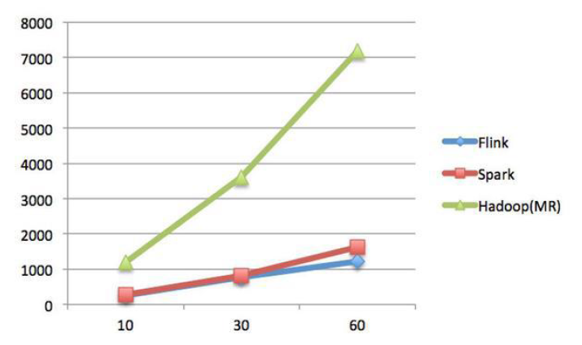

​	Spark 和Flink 全部都运行在Hadoop YARN 上，性能为Flink > Spark > Hadoop(MR)，迭代次数越多越明显，性能上，Flink 优于Spark 和Hadoop 最主要的原因是Flink 支持增量迭代，具有对迭代自动优化的功能

### Flink 和spark 的差异

|          |             SparkStreaming             |                            Flink                             |
| :------: | :------------------------------------: | :----------------------------------------------------------: |
|   定义   | 弹性的分布式数据集，并非真正的实时计算 | 真正的流计算，就像storm 一样；但flink 同时支持有限的数据流计算（批处理）和无限数据流计算（流处理） |
|  高容错  |                  沉重                  |                          非常轻量级                          |
| 内存管理 |         JVM 相关操作暴露给用户         |             Flink 在JVM 中实现的是自己的内存管理             |
| 程序调优 |         只有SQL 有自动优化机制         | 自动地优化一些场景，比如避免一些昂贵的操作（如shuffle 和sorts），还有一些中间缓存 |


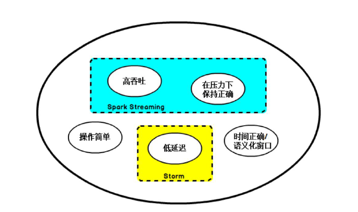

## 1.2 什么是Flink

​	Flink 起源于Stratosphere 项目，Stratosphere 是在2010~2014 年由3 所地处柏林的大学和欧洲的一些其他的大学共同进行的研究项目，2014 年4 月Stratosphere 的代码被复制并捐赠给了Apache 软件基金会，参加这个孵化项目的初始成员是Stratosphere 系统的核心开发人员，2014 年12 月，Flink 一跃成为Apache 软件基金会的顶级项目。

​	在德语中，Flink 一词表示快速和灵巧，项目采用一只松鼠的彩色图案作为logo，这不仅是因为松鼠具有快速和灵巧的特点，还因为柏林的松鼠有一种迷人的红棕色，而Flink 的松鼠logo拥有可爱的尾巴，尾巴的颜色与Apache 软件基金会的logo 颜色相呼应，也就是说，这是一只Apache 风格的松鼠。


​	Flink 主页在其顶部展示了该项目的理念：**“Apache Flink 是为分布式、高性能、随时可用以及准确的流处理应用程序打造的开源流处理框架”。**

​	Apache Flink 是一个框架和分布式处理引擎，用于对无界和有界数据流进行有状态计算。Flink 被设计在所有常见的集群环境中运行，以内存执行速度和任意规模来执行计算。

## 1.3 Flink 流处理特性

1) 支持高吞吐、低延迟、高性能的流处理

2) 支持带有事件时间的窗口（Window）操作

3) 支持有状态计算的Exactly-once 语义

4) 支持高度灵活的窗口（Window）操作，支持基于time、count、session，以及data-driven的窗口操作

5) 支持具有Backpressure 功能的持续流模型

6) 支持基于轻量级分布式快照（Snapshot）实现的容错

7) 一个运行时同时支持Batch on Streaming 处理和Streaming 处理

8) Flink 在JVM 内部实现了自己的内存管理

9) 支持迭代计算

10) 支持程序自动优化：避免特定情况下Shuffle、排序等昂贵操作，中间结果有必要进行缓存

## 1.4 Flink 基石

​	Flink 之所以能这么流行，离不开它最重要的四个基石：**Checkpoint、State、Time、Window。**

​	首先是Checkpoint 机制，这是Flink 最重要的一个特性。Flink 基于Chandy-Lamport 算法实现了一个分布式的一致性的快照，从而提供了一致性的语义。Chandy-Lamport 算法实际上在1985 年的时候已经被提出来，但并没有被很广泛的应用，而Flink 则把这个算法发扬光大了。Spark 最近在实现Continue streaming，Continue streaming 的目的是为了降低它处理的延时，其也需要提供这种一致性的语义，最终采用Chandy-Lamport 这个算法，说明Chandy-Lamport 算法在业界得到了一定的肯定。

​	提供了一致性的语义之后，Flink 为了让用户在编程时能够更轻松、更容易地去管理状态，还提供了一套非常简单明了的State API，包括里面的有ValueState、ListState、MapState，近期添加了BroadcastState，使用State API 能够自动享受到这种一致性的语义。除此之外，Flink 还实现了Watermark 的机制，能够支持基于事件的时间的处理，或者说基于系统时间的处理，能够容忍数据的延时、容忍数据的迟到、容忍乱序的数据。另外流计算中一般在对流数据进行操作之前都会先进行开窗，即基于一个什么样的窗口上做这个计算。Flink 提供了开箱即用的各种窗口，比如滑动窗口、滚动窗口、会话窗口以及非常灵活的自定义的窗口。


## 1.5 批处理与流处理

​	批处理的特点是有界、持久、大量，批处理非常适合需要访问全套记录才能完成的计算工作，一般用于离线统计。流处理的特点是无界、实时，流处理方式无需针对整个数据集执行操作，而是对通过系统传输的每个数据项执行操作，一般用于实时统计。在Spark 生态体系中，对于批处理和流处理采用了不同的技术框架，批处理由SparkSQL 实现，流处理由Spark Streaming 实现，这也是大部分框架采用的策略，使用独立的处理器实现批处理和流处理，而Flink 可以同时实现批处理和流处理。

​	Flink 是如何同时实现批处理与流处理的呢？答案是，**Flink 将批处理（即处理有限的静态数据）视作一种特殊的流处理。**

​	Flink 的核心计算架构是下图中的Flink Runtime 执行引擎，它是一个分布式系统，能够接受数据流程序并在一台或多台机器上以容错方式执行。

​	Flink Runtime 执行引擎可以作为YARN（Yet Another Resource Negotiator）的应用程序在集群上运行，也可以在Mesos 集群上运行，还可以在单机上运行（这对于调试Flink 应用程序来说非常有用）。

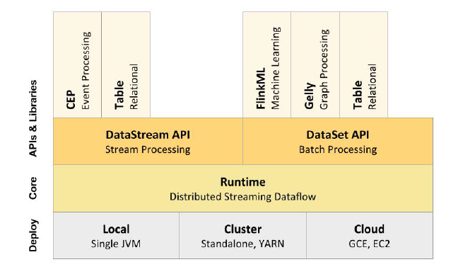

​	上图为Flink 技术栈的核心组成部分，值得一提的是，Flink 分别提供了面向流式处理的接口（DataStream API）和面向批处理的接口（DataSet API）。因此，Flink 既可以完成流处理，也可以完成批处理。Flink 支持的拓展库涉及机器学习（FlinkML）、复杂事件处理（CEP）、以及图计算（Gelly），还有分别针对流处理和批处理的Table API。能被Flink Runtime 执行引擎接受的程序很强大，但是这样的程序有着冗长的代码，编写起来也很费力，基于这个原因，Flink 提供了封装在Runtime 执行引擎之上的API，以帮助用户方便地生成流式计算程序。Flink 提供了用于流处理的DataStream API 和用于批处理的DataSetAPI。值得注意的是，尽管Flink Runtime 执行引擎是基于流处理的，但是DataSet API 先于DataStream API 被开发出来，这是因为工业界对无限流处理的需求在Flink 诞生之初并不大。

​	DataStream API 可以流畅地分析无限数据流，并且可以用Java 或者Scala 来实现。开发人员需要基于一个叫DataStream 的数据结构来开发，这个数据结构用于表示永不停止的分布式数据流。
​	

​	Flink 的分布式特点体现在它能够在成百上千台机器上运行，它将大型的计算任务分成许多小的部分，每个机器执行一部分。Flink 能够自动地确保发生机器故障或者其他错误时计算能够持续进行，或者在修复bug 或进行版本升级后有计划地再执行一次。这种能力使得开发人员不需要担心运行失败。Flink 本质上使用容错性数据流，这使得开发人员可以分析持续生成且永远不结束的数据（即流处理）。

# 2、Flink 架构体系

## 2.1 Flink 中的重要角⾊

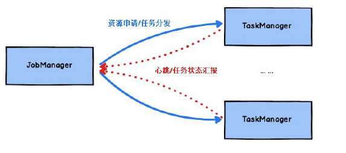

### JobManager 处理器：

​	也称之为Master，用于协调分布式执行，它们用来调度task，协调检查点，协调失败时恢复等。Flink 运行时至少存在一个master 处理器，如果配置高可用模式则会存在多个master 处理器，它们其中有一个是leader，而其他的都是standby。

### TaskManager 处理器：

​	也称之为Worker，用于执行一个dataflow 的task(或者特殊的subtask)、数据缓冲和datastream 的交换，Flink 运行时至少会存在一个worker 处理器。

## 2.2 无界数据流与有界数据流

### 无界数据流：

​	无界数据流有一个开始但是没有结束，它们不会在生成时终止并提供数据，必须连续处理无界流，也就是说必须在获取后立即处理event。对于无界数据流我们无法等待所有数据都到达，因为输入是无界的，并且在任何时间点都不会完成。处理无界数据通常要求以特定顺序（例如事件发生的顺序）获取event，以便能够推断结果完整性。

### 有界数据流：

​	有界数据流有明确定义的开始和结束，可以在执行任何计算之前通过获取所有数据来处理有界流，处理有界流不需要有序获取，因为可以始终对有界数据集进行排序，有界流的处理也称为批处理。


​	Apache Flink 是一个面向分布式数据流处理和批量数据处理的开源计算平台，它能够基于同一个Flink 运行时(Flink Runtime)，提供支持流处理和批处理两种类型应用的功能。现有的开源计算方案，会把流处理和批处理作为两种不同的应用类型，因为它们要实现的目标是完全不相同的：流处理一般需要支持低延迟、Exactly-once 保证，而批处理需要支持高吞吐、高效处理，所以在实现的时候通常是分别给出两套实现方法，或者通过一个独立的开源框架来实现其中每一种处理方案。例如，实现批处理的开源方案有MapReduce、Tez、Crunch、Spark，实现流处理的开源方案有Samza、Storm。

​	Flink 在实现流处理和批处理时，与传统的一些方案完全不同，它从另一个视角看待流处理和批处理，将二者统一起来：Flink 是完全支持流处理，也就是说作为流处理看待时输入数据流是无界的；批处理被作为一种特殊的流处理，只是它的输入数据流被定义为有界的。基于同一个Flink 运行时(Flink Runtime)，分别提供了流处理和批处理API，而这两种API 也是实现上层面向流处理、批处理类型应用框架的基础。


## 2.3 Flink 数据流编程模型

​	Flink 提供了不同的抽象级别以开发流式或批处理应用。

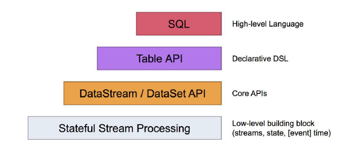

​	最底层级的抽象仅仅提供了有状态流，它将通过过程函数（Process Function）被嵌入到DataStream API 中。底层过程函数（Process Function） 与DataStream API 相集成，使其可以对某些特定的操作进行底层的抽象，它允许用户可以自由地处理来自一个或多个数据流的事件，并使用一致的容错的状态。除此之外，用户可以注册事件时间并处理时间回调，从而使程序可以处理复杂的计算。

​	实际上，大多数应用并不需要上述的底层抽象，而是针对核心API（Core APIs） 进行编程，比如DataStream API（有界或无界流数据）以及DataSet API（有界数据集）。这些API 为数据处理提供了通用的构建模块，比如由用户定义的多种形式的转换（transformations），连接（joins），聚合（aggregations），窗口操作（windows）等等。DataSet API 为有界数据集提供了额外的支持，例如循环与迭代。这些API 处理的数据类型以类（classes）的形式由各自的编程语言所表示。

​	Table API 是以表为中心的声明式编程，其中表可能会动态变化（在表达流数据时）。Table API 遵循（扩展的）关系模型：表有二维数据结构（schema）（类似于关系数据库中的表），同时API 提供可比较的操作，例如select、project、join、group-by、aggregate 等。Table API程序声明式地定义了什么逻辑操作应该执行，而不是准确地确定这些操作代码的看上去如何。尽管Table API 可以通过多种类型的用户自定义函数（UDF）进行扩展，其仍不如核心API 更具表达能力，但是使用起来却更加简洁（代码量更少）。除此之外，Table API 程序在执行之前会经过内置优化器进行优化。

​	你可以在表与DataStream/DataSet 之间无缝切换， 以允许程序将Table API 与DataStream 以及DataSet 混合使用。

​	Flink 提供的最高层级的抽象是SQL 。这一层抽象在语法与表达能力上与Table API 类似，但是是以SQL 查询表达式的形式表现程序。SQL 抽象与Table API 交互密切，同时SQL 查询可以直接在Table API 定义的表上执行。

| Spark                 | Flink                    |
| --------------------- | ------------------------ |
| RDD/DataFrame/DStream | DataSet/Table/DataStream |
| Transformation        | Transformation           |
| Action                | Sink                     |
| Task                  | subTask                  |
| Pipeline              | Oprator chains           |
| DAG                   | DataFlow Graph           |
| Master + Driver       | JobManager               |
| Worker + Executor     | TaskManager              |

## 2.4 Libraries 支持

支持机器学习（FlinkML）

支持图分析（Gelly）

支持关系数据处理（Table）

支持复杂事件处理（CEP）

# 3、Flink 集群搭建

Flink 支持多种安装模式。

1) local（本地）——单机模式，一般不使用
2) standalone——独立模式，Flink 自带集群，开发测试环境使用
3) yarn——计算资源统一由Hadoop YARN 管理，生产环境测试

## 3.1 standalone 集群环境

### 3.1.1 准备工作

1) jdk1.8 及以上【配置JAVA_HOME 环境变量】
2) ssh 免密码登录【集群内节点之间免密登录】

### 3.1.2 下载安装包

http://archive.apache.org/dist/flink/flink-1.10.0/flink-1.10.1-bin-scala_2.12.tgz

### 3.1.3 集群规划

服务器配置如下：

master(JobManager)+slave/worker(TaskManager)

hadoop01(master+slave)     	hadoop02(slave) 		hadoop03(slave)

### 3.1.4 步骤

1) 解压Flink 压缩包到指定目录

2) 配置Flink

3) 配置Slaves 节点

4) 分发Flink 到各个节点

5) 启动集群

6) 递交wordcount 程序测试

7) 查看Flink WebUI

### 3.1.5 具体操作

1) 上传Flink 压缩包到指定目录
2) 解压缩flink 到/opt/servers 目录

```
cd /opt/servers
tar -xvzf flink-1.10.1-bin-scala_2.12.tgz -C ../servers/
```

3) 修改安装目录下conf 文件夹内的flink-conf.yaml 配置文件，指定JobManager

```
cd /opt/servers/flink-1.10.1/conf/
```

创建目录

```
mkdir -p /opt/servers/flink-1.10.1/tmp
```

修改配置文件

```
#配置Master 的机器名（IP 地址）

jobmanager.rpc.address: hadoop01

#配置每个taskmanager 生成的临时文件夹

taskmanager.tmp.dirs: /opt/servers/flink-1.10.1/tmp
```

4) 修改安装目录下conf 文件夹内的slave 配置文件，指定TaskManager

```
hadoop01
hadoop02
hadoop03
```

5) 使用vi 修改/etc/profile 系统环境变量配置文件，添加HADOOP_CONF_DIR 目录

```
export HADOOP_CONF_DIR=/opt/servers/hadoop-2.7.7/etc/hadoop
```

YARN_CONF_DIR 或者HADOOP_CONF_DIR 必须将环境变量设置为读取YARN 和HDFS 配置

新版本需要增加hadoop的附加组件，下载一个jar包放在Flink的lib目录下

下载地址：<https://repo.maven.apache.org/maven2/org/apache/flink/flink-shaded-hadoop-2-uber/>


6) 分发/etc/profile 到其他两个节点

```
scp -r /etc/profile hadoop02:/etc
scp -r /etc/profile hadoop03:/etc
```

7) 每个节点重新加载环境变量

```
source /etc/profile
```

8) 将配置好的Flink 目录分发给其他的两台节点

```
cd /opt/servers
scp -r flink-1.10.1/ hadoop02:$PWD
scp -r flink-1.10.1/ hadoop03:$PWD
```

9) 启动Flink 集群

```
 cd /opt/servers/flink-1.10.1
 bin/start-cluster.sh
```

10) 通过jps 查看进程信息

```
--------------------- hadoop01 ----------------
86583 Jps
85963 StandaloneSessionClusterEntrypoint
86446 TaskManagerRunner
--------------------- hadoop03 ----------------
44099 Jps
43819 TaskManagerRunner
--------------------- hadoop03 ----------------
29461 TaskManagerRunner
29678 Jps
```

11) 启动HDFS 集群

```
start-all.sh
```

12) 在HDFS 中创建/test/input 目录

```
 hadoop fs -mkdir -p /test/input
```

13) 上传wordcount.txt 文件到HDFS /test/input 目录

```
 hadoop fs -put /root/wordcount.txt /test/input
```

14) 并运行测试任务

```
bin/flink run examples/batch/WordCount.jar --input hdfs://hadoop01:8020/test/input/wordcount --output hdfs://hadoop01:8020/test/output/001
```


15) 浏览Flink Web UI 界面

```
http://hadoop01:8081
```

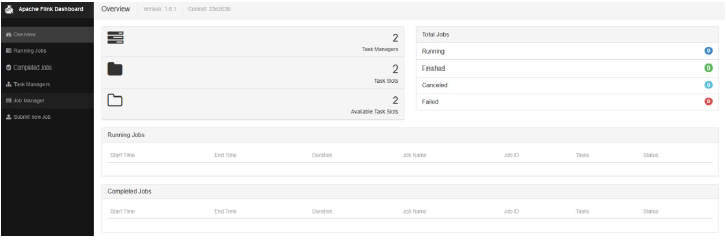

3.1.6 启动/停止flink 集群

```
启动：bin/start-cluster.sh
停止：bin/stop-cluster.sh
```

3.1.7 Flink 集群的重启或扩容

启动/停止jobmanager
如果集群中的jobmanager 进程挂了，执行下面命令启动

```
bin/jobmanager.sh start
bin/jobmanager.sh stop
```

启动/停止taskmanager
添加新的taskmanager 节点或者重启taskmanager 节点

```
bin/taskmanager.sh start
bin/taskmanager.sh stop
```


3.1.8 Standalone 集群架构

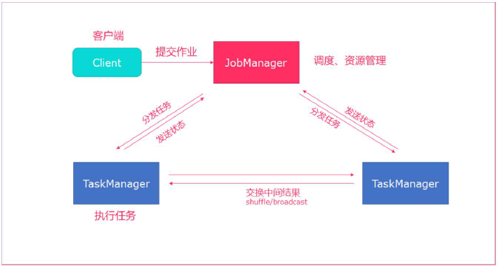

- client 客户端提交任务给JobManager
- JobManager 负责Flink 集群计算资源管理，并分发任务给TaskManager 执行
- TaskManager 定期向JobManager 汇报状态

## 3.2 高可用HA 模式

​	从上述架构图中，可发现JobManager 存在单点故障，一旦JobManager 出现意外，整个集群无法工作。所以，为了确保集群的高可用，需要搭建Flink 的HA。（如果是部署在YARN 上，部署YARN 的HA），我们这里演示如何搭建Standalone 模式HA。

### 3.2.1 HA 架构图

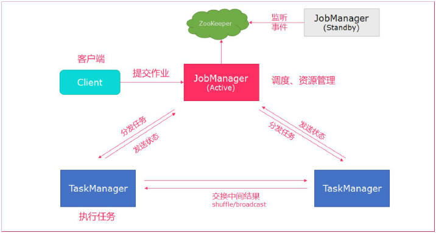

### 3.2.2 集群规划

master(JobManager)+slave/worker(TaskManager)
hadoop01(master+slave) hadoop02(master+slave) hadoop03(slave)

### 3.2.3 步骤

1) 在flink-conf.yaml 中添加zookeeper 配置

2) 将配置过的HA 的flink-conf.yaml 分发到另外两个节点

3) 分别到另外两个节点中修改flink-conf.yaml 中的配置

4) 在masters 配置文件中添加多个节点

5) 分发masters 配置文件到另外两个节点

6) 启动zookeeper 集群

7) 启动flink 集群

### 3.2.4 具体操作

1) 在flink-conf.yaml 中添加zookeeper 配置

```properties
#开启HA，使用文件系统作为快照存储
state.backend: filesystem
#默认为none，用于指定checkpoint 的data files 和meta data 存储的目录
state.checkpoints.dir: hdfs://hadoop01:8020/flink-checkpoints
#默认为none，用于指定savepoints 的默认目录
state.savepoints.dir: hdfs://hadoop01:8020/flink-checkpoints
#使用zookeeper 搭建高可用
high-availability: zookeeper
# 存储JobManager 的元数据到HDFS,用来恢复JobManager 所需的所有元数据
high-availability.storageDir: hdfs://hadoop01:8020/flink/ha/
high-availability.zookeeper.quorum: hadoop01:2181,hadoop02:2181,hadoop03:2181
```

2) 将配置过的HA 的flink-conf.yaml 分发到另外两个节点

```
cd /opt/servers/flink-1.10.1/conf/
scp -r flink-conf.yaml hadoop02:$PWD
scp -r flink-conf.yaml hadoop03:$PWD
```

3) 到节点2 中修改flink-conf.yaml 中的配置，将JobManager 设置为自己节点的名称

```
jobmanager.rpc.address: hadoop02
```

4) 在masters 配置文件中添加多个节点

```
hadoop01:8081
hadoop02:8081
```

5) 分发masters 配置文件到另外两个节点

```
cd /opt/servers/flink-1.10.1/conf/
scp -r masters hadoop02:$PWD
scp -r masters hadoop03:$PWD
```

6) 启动zookeeper 集群

三个节点启动zookeeper集群

```
bin/zkServer.sh start
```

7) 启动HDFS 集群

```
start-all.sh
```

8) 启动flink 集群

```
 bin/start-cluster.sh
```

```
Starting HA cluster with 2 masters.
Starting standalonesession daemon on host hadoop01.
Starting standalonesession daemon on host hadoop02.
Starting taskexecutor daemon on host hadoop01.
Starting taskexecutor daemon on host hadoop02.
Starting taskexecutor daemon on host hadoop03.
```

9) 分别查看两个节点的Flink Web UI

```
http://hadoop01:8081
http://hadoop02:8081
```

10) kill 掉一个节点，查看另外的一个节点的Web UI
注意事项

```
切记搭建HA，需要将第二个节点的jobmanager.rpc.address 修改为hadoop02
```

## 3.3 yarn 集群环境

​	在一个企业中，为了最大化的利用集群资源，一般都会在一个集群中同时运行多种类型的Workload。因此Flink 也支持在Yarn 上面运行；
​	flink on yarn 的前提是：hdfs、yarn 均启动

### 3.3.1 准备工作

1) jdk1.8 及以上【配置JAVA_HOME 环境变量】

2) ssh 免密码登录【集群内节点之间免密登录】

3) 至少hadoop2.3

4) hdfs & yarn

### 3.3.2 集群规划

无

### 3.3.3 修改hadoop 的配置参数

```
vim etc/hadoop/yarn-site.xml
```


添加：

```
<property>
<name>yarn.nodemanager.vmem-check-enabled</name>
<value>false</value>
</property>
```

​	是否启动一个线程检查每个任务正使用的虚拟内存量，如果任务超出分配值，则直接将其杀掉，默认是true。
​	在这里面我们需要关闭，因为对于flink 使用yarn 模式下，很容易内存超标，这个时候yarn会自动杀掉job

### 3.3.4 修改全局变量/etc/profile

添加：

```
export HADOOP_CONF_DIR=/export/servers/hadoop-2.7.7/etc/Hadoop
```


YARN_CONF_DIR 或者HADOOP_CONF_DIR 必须将环境变量设置为读取YARN 和HDFS 配置

新版本需要增加hadoop的附加组件，下载一个jar包放在Flink的lib目录下

下载地址：<https://repo.maven.apache.org/maven2/org/apache/flink/flink-shaded-hadoop-2-uber/>


3.3.5 Flink on Yarn 的运行机制

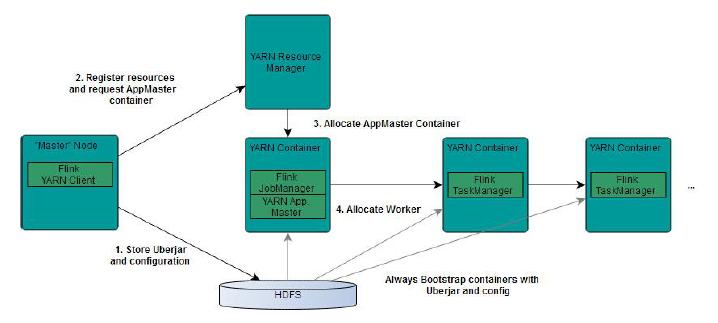

​	从图中可以看出，Yarn 的客户端需要获取hadoop 的配置信息，连接Yarn 的ResourceManager。
​	所以要有设置有YARN_CONF_DIR 或者HADOOP_CONF_DIR 或者HADOOP_CONF_PATH,只要设置了其中一个环境变量，就会被读取。如果读取上述的变量失败了，那么将会选择hadoop_home 的环境变量，都区成功将会尝试加载$HADOOP_HOME/etc/hadoop 的配置文件。
​	1、当启动一个Flink Yarn 会话时，客户端首先会检查本次请求的资源是否足够。资源足将会上传包含HDFS 配置信息和Flink 的jar 包到HDFS。
​	2、随后客户端会向Yarn 发起请求，启动applicationMaster,随后NodeManager 将会加载有配置信息和jar 包，一旦完成，ApplicationMaster(AM)便启动。
​	3、当JobManager and AM 成功启动时,他们都属于同一个container，从而AM 就能检索到JobManager 的地址。此时会生成新的Flink 配置信息以便TaskManagers 能够连接到JobManager。
​	同时，AM 也提供Flink 的WEB 接口。用户可并行执行多个Flink 会话。
​	4、随后，AM 将会开始为分发从HDFS 中下载的jar 以及配置文件的container 给TaskMangers.完成后Fink 就完全启动并等待接收提交的job.

### 3.3.6 Flink on Yarn 的两种使用方式

yarn-session 提供两种模式
1) 会话模式
使用Flink 中的yarn-session （ yarn 客户端） ， 会启动两个必要服务JobManager 和TaskManagers

客户端通过yarn-session 提交作业

yarn-session 会一直启动，不停地接收客户端提交的作用

有大量的小作业，适合使用这种方式

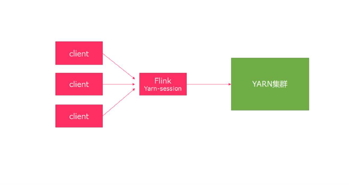

2) 分离模式

直接提交任务给YARN

大作业，适合使用这种方式

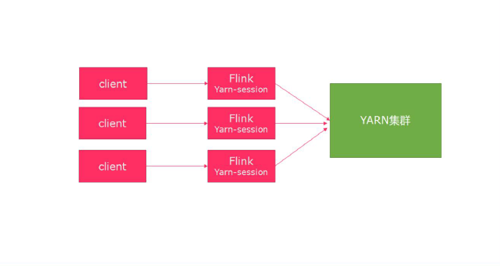

#### 3.3.6.1 第一种方式：YARN session

yarn-session.sh(开辟资源)+flink run(提交任务)

这种模式下会启动yarn session，并且会启动Flink 的两个必要服务：JobManager 和Task-managers，然后你可以向集群提交作业。同一个Session 中可以提交多个Flink 作业。需要注意的是，这种模式下Hadoop 的版本至少是2.2，而且必须安装了HDFS（因为启动YARN session的时候会向HDFS 上提交相关的jar 文件和配置文件）

通过./bin/yarn-session.sh 脚本启动YARN Session

脚本可以携带的参数：

```shell
Usage:
Required
-n,--container <arg> 分配多少个yarn 容器(=taskmanager 的数量)
Optional
-D <arg> 动态属性
-d,--detached 独立运行（以分离模式运行作业，不启动客户端进程，不打印YARN返回信息）
-id,--applicationId <arg> YARN 集群上的任务id，附着到一个后台运行的yarn
session 中
-j,--jar <arg> Path to Flink jar file
-jm,--jobManagerMemory <arg> JobManager 的内存[in MB]
-m,--jobmanager <host:port> 指定需要连接的jobmanager(主节点)地址
使用这个参数可以指定一个不同于配置文件中的jobmanager
-n,--container <arg> 分配多少个yarn 容器(=taskmanager 的数量)
-nm,--name <arg> 在YARN 上为一个自定义的应用设置一个名字
-q,--query 显示yarn 中可用的资源(内存, cpu 核数)
-qu,--queue <arg> 指定YARN 队列
-s,--slots <arg> 每个TaskManager 使用的slots 数量
-st,--streaming 在流模式下启动Flink
-tm,--taskManagerMemory <arg> 每个TaskManager 的内存[in MB]
-z,--zookeeperNamespace <arg> 针对HA 模式在zookeeper 上创建NameSpace
```

注意：
如果不想让Flink YARN 客户端始终运行，那么也可以启动分离的YARN 会话。该参数被称为-d 或--detached。

#####  启动：

```
bin/yarn-session.sh -n 2 -tm 800 -s 1 -d
```


​	上面的命令的意思是， 同时向Yarn 申请3 个container（ 即便只申请了两个， 因为ApplicationMaster 和Job Manager 有一个额外的容器。一旦将Flink 部署到YARN 群集中，它就会显示Job Manager 的连接详细信息），其中2 个Container 启动TaskManager（-n 2），每个TaskManager 拥有两个Task Slot（-s 2），并且向每个TaskManager 的Container 申请800M 的内存，以及一个ApplicationMaster（Job Manager）。

启动成功之后，控制台显示：

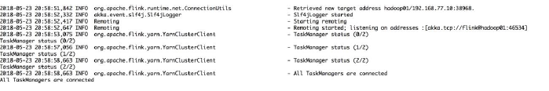

去yarn 页面：ip:8088 可以查看当前提交的flink session

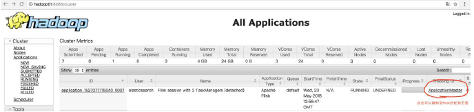

点击ApplicationMaster 进入任务页面：

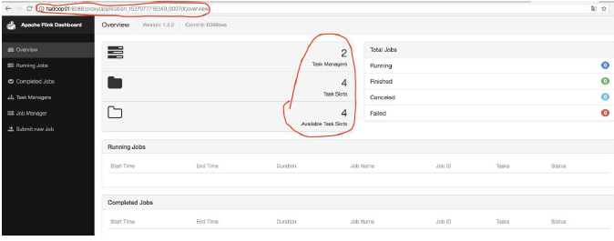

上面的页面就是使用：yarn-session.sh 提交后的任务页面；

##### 使用flink 提交任务

```
bin/flink run examples/batch/WordCount.jar
```

在控制台中可以看到wordCount.jar 计算出来的任务结果；

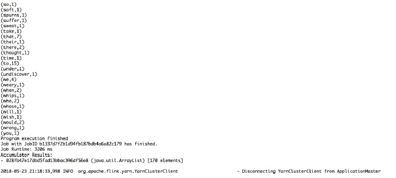

在yarn-session.sh 提交后的任务页面中也可以观察到当前提交的任务：

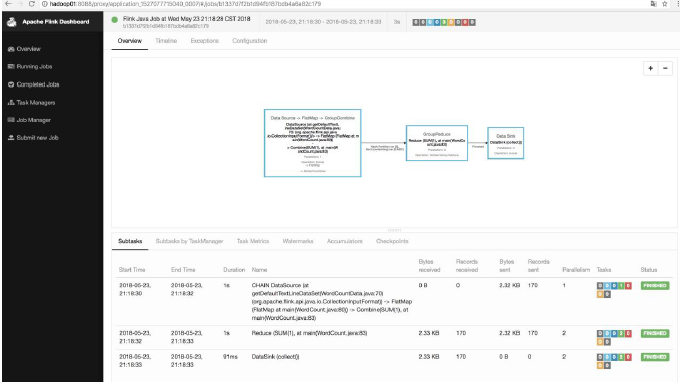

##### 停止当前任务：

```
yarn application -kill application_1527077715040_0007
```

#### 3.3.6.2 第二种方式：在YARN 上运行一个Flink 作业

​	上面的YARN session 是在Hadoop YARN 环境下启动一个Flink cluster 集群，里面的资源是可以共享给其他的Flink 作业。我们还可以在YARN 上启动一个Flink 作业，这里我们还是使用./bin/flink，但是不需要事先启动YARN session：

##### 使用flink 直接提交任务

```
bin/flink run -m yarn-cluster examples/batch/WordCount.jar
```


在8088 页面观察：

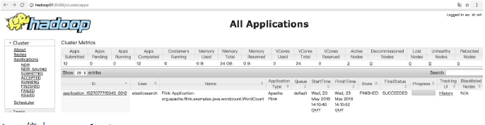

##### 停止yarn-cluster

```
yarn application -kill application 的ID
```


# 4、Flink 运行架构

## 4.1 任务提交流程

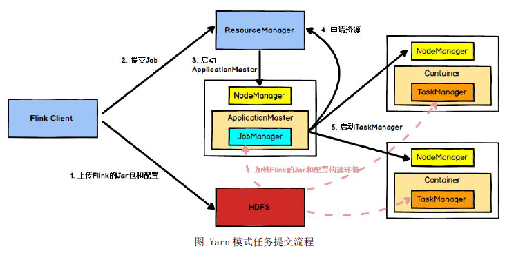

​	Flink 任务提交后，Client 向 HDFS  上传 Flink 的Jar 包和配置，之后向Yarn ResourceManager 提交任务， ResourceManager 分配Container 资源并通知对应的 NodeManager 启动 ApplicationMaster，ApplicationMaster 启动后加载 Flink 的 Jar 包和配置构建环境，然后启动 JobManager ， 之后ApplicationMaster 向ResourceManager 申请资源启动TaskManager ，ResourceManager 分配Container 资源后， 由ApplicationMaster 通知资源所在节点的NodeManager 启动TaskManager， NodeManager 加载Flink 的Jar 包和配置构建环境并启动TaskManager，TaskManager 启动后向JobManager 发送心跳包，并等待JobManager 向其分配任务。

## 4.2 任务调度原理

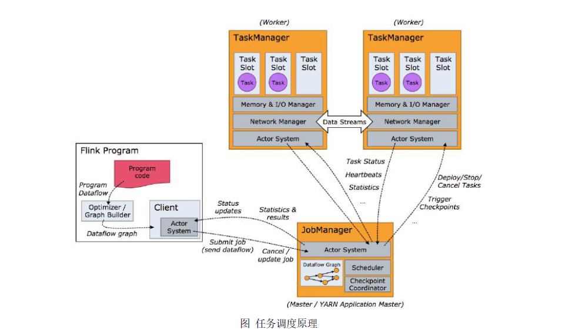

​	客户端不是运行时和程序执行的一部分，但它用于准备并发送dataflow 给Master，然后，客户端断开连接或者维持连接以等待接收计算结果，客户端可以以两种方式运行：要么作为Java/Scala 程序的一部分被程序触发执行，要么以命令行./bin/flink run 的方式执行。

## 4.3 Worker 与Slots

​	每一个worker(TaskManager)是一个JVM 进程，它可能会在独立的线程上执行一个或多个subtask。为了控制一个worker 能接收多少个task，worker 通过task slot 来进行控制（一个worker 至少有一个task slot）。每个task slot 表示TaskManager 拥有资源的一个固定大小的子集。假如一个TaskManager有三个slot，那么它会将其管理的内存分成三份给各个slot。资源slot 化意味着一个subtask将不需要跟来自其他job 的subtask 竞争被管理的内存，取而代之的是它将拥有一定数量的内存储备。需要注意的是，这里不会涉及到CPU 的隔离，slot 目前仅仅用来隔离task 的受管理的内存。
​	通过调整task slot 的数量， 允许用户定义subtask 之间如何互相隔离。如果一个TaskManager 一个slot，那将意味着每个task group 运行在独立的JVM 中（该JVM 可能是通过一个特定的容器启动的），而一TaskManager 多个slot 意味着更多的subtask 可以共享同一个JVM。而在同一个JVM 进程中的task 将共享TCP 连接（基于多路复用）和心跳消息。它们也可能共享数据集和数据结构，因此这减少了每个task 的负载。

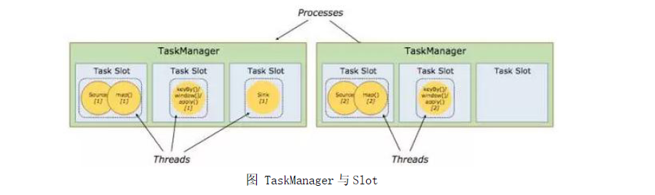

​	Task Slot 是静态的概念， 是指TaskManager 具有的并发执行能力， 可以通过参数taskmanager.numberOfTaskSlots 进行配置，而并行度parallelism 是动态概念，即TaskManager运行程序时实际使用的并发能力，可以通过参数parallelism.default 进行配置。也就是说，假设一共有3 个TaskManager，每一个TaskManager 中的分配3 个TaskSlot，也就是每个TaskManager 可以接收3 个task ， 一共9 个TaskSlot ， 如果我们设置parallelism.default=1，即运行程序默认的并行度为1，9 个TaskSlot 只用了1 个，有8 个空闲，因此，设置合适的并行度才能提高效率。

## 4.4 程序与数据流

​	Flink 程序的基础构建模块是流（streams） 与转换（transformations）（需要注意的是，Flink 的DataSet API 所使用的DataSets 其内部也是stream）。一个stream 可以看成一个中间结果，而一个transformations 是以一个或多个stream 作为输入的某种operation，该operation利用这些stream 进行计算从而产生一个或多个result stream。
​	在运行时，Flink 上运行的程序会被映射成streaming dataflows，它包含了streams 和transformations operators。每一个dataflow 以一个或多个sources 开始以一个或多个sinks结束。dataflow 类似于任意的有向无环图（DAG），当然特定形式的环可以通过iteration 构建。在大部分情况下，程序中的transformations 跟dataflow 中的operator 是一一对应的关系，但有时候，一个transformation 可能对应多个operator。

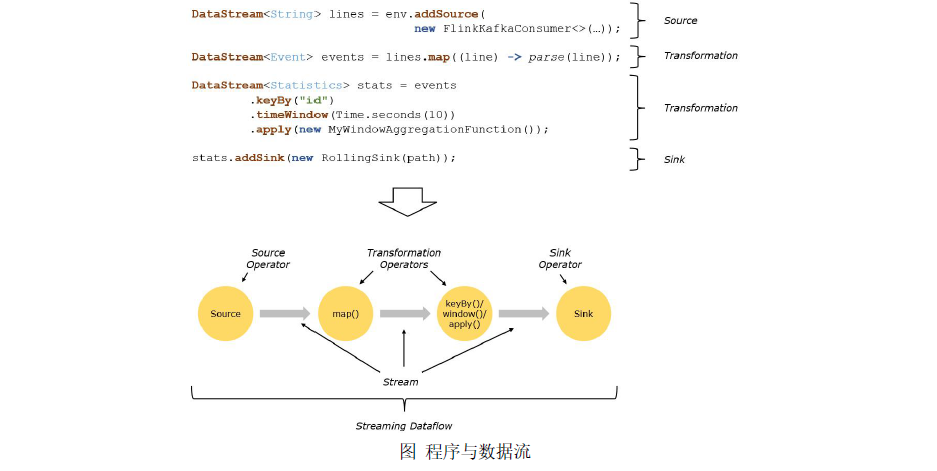

## 4.5 并行数据流

​	Flink 程序的执行具有并行、分布式的特性。在执行过程中，一个stream 包含一个或多个stream partition ，而每一个operator 包含一个或多个operator subtask，这些operator subtasks 在不同的线程、不同的物理机或不同的容器中彼此互不依赖得执行。
​	一个特定operator 的subtask 的个数被称之为其parallelism(并行度)。一个stream 的并行度总是等同于其producing operator 的并行度。一个程序中，不同的operator 可能具有不同的并行度。
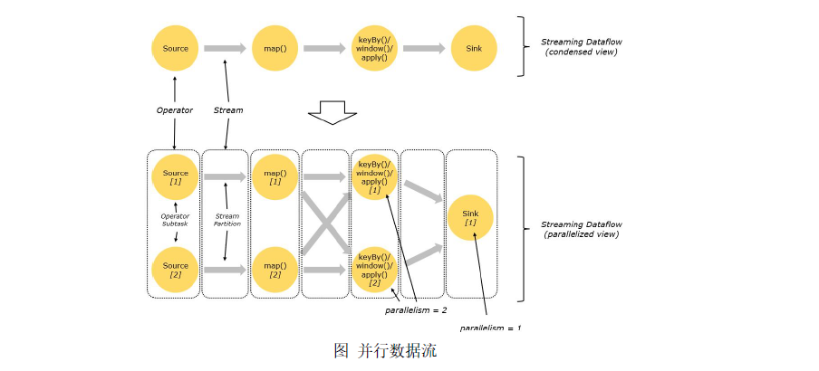

​	Stream 在operator 之间传输数据的形式可以是one-to-one(forwarding)的模式也可以是redistributing 的模式，具体是哪一种形式，取决于operator 的种类。

​	One-to-one：stream(比如在source 和map operator 之间)维护着分区以及元素的顺序。那意味着map operator 的subtask 看到的元素的个数以及顺序跟source operator 的subtask 生产的元素的个数、顺序相同，map、fliter、flatMap 等算子都是one-to-one 的对应关系。Redistributing：stream(map()跟keyBy/window 之间或者keyBy/window 跟sink 之间)的分区会发生改变。每一个operator subtask 依据所选择的transformation 发送数据到不同的目标subtask。例如，keyBy() 基于hashCode 重分区、broadcast 和rebalance 会随机重新分区，这些算子都会引起redistribute 过程，而redistribute 过程就类似于Spark 中的shuffle 过程。

## 4.6 task 与operator chains

​	出于分布式执行的目的，Flink 将operator 的subtask 链接在一起形成task，每个task 在一个线程中执行。将operators 链接成task 是非常有效的优化：它能减少线程之间的切换和基于缓存区的数据交换，在减少时延的同时提升吞吐量。链接的行为可以在编程API 中进行指定。

​	下面这幅图，展示了5 个subtask 以5 个并行的线程来执行：

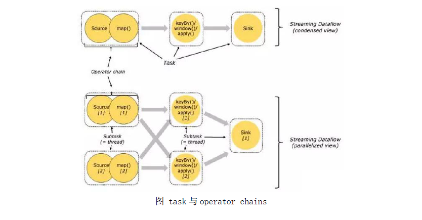

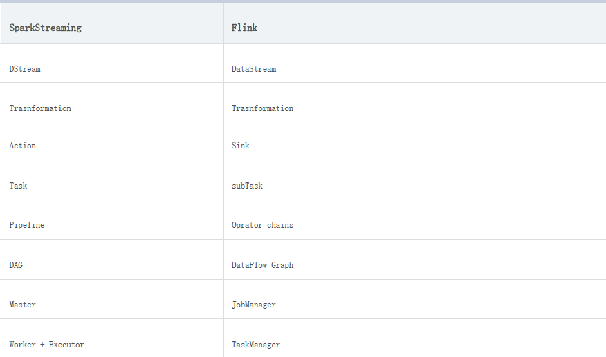

# 5、DataSet API 开发

## 5.1 入门案例

### 5.1.1 Flink 批处理程序的一般流程

1) 获取Flink 批处理执行环境

2) 构建source

3) 数据处理

4) 构建sink

### 5.1.2 JAVA示例

导入Flink 所需的Maven 依赖

```xml
		<dependency>
            <groupId>org.apache.flink</groupId>
            <artifactId>flink-core</artifactId>
            <version>1.10.1</version>
        </dependency>
        <dependency>
            <groupId>org.apache.flink</groupId>
            <artifactId>flink-java</artifactId>
            <version>1.10.1</version>
        </dependency>
        <dependency>
            <groupId>org.apache.flink</groupId>
            <artifactId>flink-streaming-java_2.12</artifactId>
            <version>1.10.1</version>
        </dependency>
```

使用java编写Flink 程序，用来统计单词的数量。

```java
package cn.tedu.flinktest;
 
import org.apache.flink.api.common.functions.FlatMapFunction;
import org.apache.flink.api.java.ExecutionEnvironment;
import org.apache.flink.api.java.operators.DataSource;
import org.apache.flink.api.java.tuple.Tuple2;
import org.apache.flink.util.Collector;
 
public class BatchWordCount {
    public static void main(String[] args) throws Exception {
        //1.获取执行环境
        ExecutionEnvironment env = ExecutionEnvironment.getExecutionEnvironment();
        //2.读取源文件
        DataSource<String> textFile = env.readTextFile("E:\\words.txt");
        //3.读取当前行，并进行切割
        textFile.flatMap(new FlatMapFunction<String, Tuple2<String,Integer>>() {
            public void flatMap(String s, Collector<Tuple2<String, Integer>> collector) throws Exception {
                String[] values = s.toLowerCase().split(" ");
                for (String value: values){
                    if (value.length()>0){
                        collector.collect(new Tuple2<String, Integer>(value,1));
                    }
                }
            }
        })
                //4.分组
                .groupBy(0)
                //5.求和
                .sum(1)
                //6.打印（sink）
                .print();
    }
}
```


### 5.1.3 Scala实例

使用scala编写Flink 程序，用来统计单词的数量。

### 5.1.3 步骤

1) IDEA 创建项目

2) 导入Flink 所需的Maven 依赖

3) 创建scala 单例对象，添加main 方法

4) 获取Flink 批处理运行环境

5) 构建一个collection 源

6) 使用flink 操作进行单词统计

7) 打印

### 5.1.4 实现

1) 在IDEA 中创建flink-base 项目
2) 导入Flink Maven 依赖

```xml
	<dependencies>
        <!-- 导入scala的依赖 -->
        <dependency>
            <groupId>org.scala-lang</groupId>
            <artifactId>scala-library</artifactId>
            <version>2.12.7</version>
        </dependency>
        <!-- 导入flink streaming和scala的依赖 -->
        <dependency>
            <groupId>org.apache.flink</groupId>
            <artifactId>flink-streaming-scala_2.12</artifactId>
            <version>1.10.1</version>
        </dependency>
        <!-- 导入flink和scala的依赖 -->
        <dependency>
            <groupId>org.apache.flink</groupId>
            <artifactId>flink-scala_2.12</artifactId>
            <version>1.10.1</version>
        </dependency>
        <!-- 指定flink-client API的版本 -->
        <dependency>
            <groupId>org.apache.flink</groupId>
            <artifactId>flink-clients_2.12</artifactId>
            <version>1.10.1</version>
        </dependency>
        <!-- 指定hadoop-client API的版本 -->
        <dependency>
            <groupId>org.apache.hadoop</groupId>
            <artifactId>hadoop-client</artifactId>
            <version>2.7.7</version>
        </dependency>
        <!-- 指定mysql-connector的依赖 -->
        <dependency>
            <groupId>mysql</groupId>
            <artifactId>mysql-connector-java</artifactId>
            <version>5.1.38</version>
        </dependency>
        <!-- 指定fastjson的依赖 -->
        <dependency>
            <groupId>com.alibaba</groupId>
            <artifactId>fastjson</artifactId>
            <version>1.2.60</version>
        </dependency>
        <dependency>
            <groupId>com.jayway.jsonpath</groupId>
            <artifactId>json-path</artifactId>
            <version>2.3.0</version>
        </dependency>
        <!-- 指定flink-connector-kafka的依赖 -->
        <dependency>
            <groupId>org.apache.flink</groupId>
            <artifactId>flink-connector-kafka_2.12</artifactId>
            <version>1.10.1</version>
        </dependency>
    </dependencies>
    <build>
        <sourceDirectory>src/main/scala</sourceDirectory>
        <testSourceDirectory>src/test/scala</testSourceDirectory>
        <plugins>

            <plugin>
                <groupId>org.apache.maven.plugins</groupId>
                <artifactId>maven-compiler-plugin</artifactId>
                <version>2.5.1</version>
                <configuration>
                    <source>${maven.compiler.source}</source>
                    <target>${maven.compiler.target}</target>
                    <!--<encoding>${project.build.sourceEncoding}</encoding>-->
                </configuration>
            </plugin>

            <plugin>
                <groupId>net.alchim31.maven</groupId>
                <artifactId>scala-maven-plugin</artifactId>
                <version>3.2.0</version>
                <executions>
                    <execution>
                        <goals>
                            <goal>compile</goal>
                            <goal>testCompile</goal>
                        </goals>
                        <configuration>
                            <args>
                                <!--<arg>-make:transitive</arg>-->
                                <arg>-dependencyfile</arg>
                                <arg>${project.build.directory}/.scala_dependencies</arg>
                            </args>

                        </configuration>
                    </execution>
                </executions>
            </plugin>
            <plugin>
                <groupId>org.apache.maven.plugins</groupId>
                <artifactId>maven-surefire-plugin</artifactId>
                <version>2.18.1</version>
                <configuration>
                    <useFile>false</useFile>
                    <disableXmlReport>true</disableXmlReport>
                    <includes>
                        <include>**/*Test.*</include>
                        <include>**/*Suite.*</include>
                    </includes>
                </configuration>
            </plugin>

            <plugin>
                <groupId>org.apache.maven.plugins</groupId>
                <artifactId>maven-shade-plugin</artifactId>
                <version>2.4</version>
                <executions>
                    <execution>
                        <phase>package</phase>
                        <goals>
                            <goal>shade</goal>
                        </goals>
                        <configuration>
                            <filters>
                                <filter>
                                    <artifact>*:*</artifact>
                                    <excludes>
                                        <!--
                                        zip -d learn_spark.jar META-INF/*.RSA META-INF/*.DSA META-INF/*.SF
                                        -->
                                        <exclude>META-INF/*.SF</exclude>
                                        <exclude>META-INF/*.DSA</exclude>
                                        <exclude>META-INF/*.RSA</exclude>
                                    </excludes>
                                </filter>
                            </filters>
                            <transformers>
                                <transformer implementation="org.apache.maven.plugins.shade.resource.ManifestResourceTransformer">
                                    <mainClass>cn.tedu.batch.BatchWordCount</mainClass>
                                </transformer>
                            </transformers>
                        </configuration>
                    </execution>
                </executions>
            </plugin>
        </plugins>
    </build>

```

3) 分别在main 和test 目录创建scala 文件夹

4) 创建object，添加main 方法

### 5.1.5 参考代码

```scala
package cn.tedu.batch

import org.apache.flink.api.scala.{DataSet, ExecutionEnvironment}

object BatchWordCount {

  def main(args: Array[String]): Unit = {
    

    //1.创建环境
    val env: ExecutionEnvironment = ExecutionEnvironment.getExecutionEnvironment
    //2.定义source
    val sourceDataSet: DataSet[String] = env.readTextFile("f:\\word.txt")
    //导入隐式转换
    import org.apache.flink.api.scala._
    //2.实现业务
    //指定这些数据的转换
    val splitsDataSet: DataSet[String] = sourceDataSet.flatMap(_.split(" "))
    val tupleDataSet = splitsDataSet.map((_, 1))
    val groupByDataSet: GroupedDataSet[(String, Int)] = tupleDataSet.groupBy(0)
    val sumDataSet: AggregateDataSet[(String, Int)] = groupByDataSet.sum(0)
    //3.定义sink
    sumDataSet.print()
      
    //sumDataSet.writeAsText("hdfs://hadoop01:8020/test/output/004")
    //env.execute

  }

}

```

### 5.1.6 将程序打包，提交到yarn

1）添加maven 打包插件

2）通过package或者install进行打包

执行成功后，在target 文件夹中生成jar 包；

3）上传jar 包，执行程序

```
bin/flink run -m yarn-cluster
/opt/servers/jar/flink-1.0-SNAPSHOT.jar
```


在yarn 的8088 页面可以观察到提交的程序：

## 5.2 输入数据集Data Sources

​	Data Sources 是什么呢？就字面意思其实就可以知道：数据来源。

​	Flink 做为一款流式计算框架，它可用来做批处理，即处理静态的数据集、历史的数据集；也可以用来做流处理，即实时的处理些实时数据流，实时的产生数据流结果，只要数据源源不断的过来，Flink 就能够一直计算下去，这个Data Sources 就是数据的来源地。
flink 在批处理中常见的source 主要有两大类。

1) 基于本地集合的source（Collection-based-source）

2) 基于文件的source（File-based-source）

### 5.2.1 基于本地集合的source（Collection-based-source）

在flink 最常见的创建DataSet 方式有三种。

1) 使用env.fromElements()，这种方式也支持Tuple，自定义对象等复合形式。

2) 使用env.fromCollection(),这种方式支持多种Collection 的具体类型

3) 使用env.generateSequence()方法创建基于Sequence 的DataSet

```scala
/**
* 读取集合中的批次数据
*/
object BatchFromCollection {
def main(args: Array[String]): Unit = {
//获取flink 执行环境
val env = ExecutionEnvironment.getExecutionEnvironment
//导入隐式转换
import org.apache.flink.api.scala._
//0.用element 创建DataSet(fromElements)
val ds0: DataSet[String] = env.fromElements("spark", "flink")
ds0.print()
//1.用Tuple 创建DataSet(fromElements)
val ds1: DataSet[(Int, String)] = env.fromElements((1, "spark"), (2, "flink"))
ds1.print()
//2.用Array 创建DataSet
val ds2: DataSet[String] = env.fromCollection(Array("spark", "flink"))
ds2.print()
//3.用ArrayBuffer 创建DataSet
val ds3: DataSet[String] = env.fromCollection(ArrayBuffer("spark", "flink"))
ds3.print()
//4.用List 创建DataSet
val ds4: DataSet[String] = env.fromCollection(List("spark", "flink"))
ds4.print()
//5.用List 创建DataSet
val ds5: DataSet[String] = env.fromCollection(ListBuffer("spark", "flink"))
ds5.print()
//6.用Vector 创建DataSet
val ds6: DataSet[String] = env.fromCollection(Vector("spark", "flink"))
ds6.print()
//7.用Queue 创建DataSet
val ds7: DataSet[String] = env.fromCollection(mutable.Queue("spark", "flink"))
ds7.print()
//8.用Stack 创建DataSet
val ds8: DataSet[String] = env.fromCollection(mutable.Stack("spark", "flink"))
ds8.print()
//9.用Stream 创建DataSet（Stream 相当于lazy List，避免在中间过程中生成不必要的集合）
val ds9: DataSet[String] = env.fromCollection(Stream("spark", "flink"))
ds9.print()
//10.用Seq 创建DataSet
val ds10: DataSet[String] = env.fromCollection(Seq("spark", "flink"))
ds10.print()
//11.用Set 创建DataSet
val ds11: DataSet[String] = env.fromCollection(Set("spark", "flink"))
ds11.print()
//12.用Iterable 创建DataSet
val ds12: DataSet[String] = env.fromCollection(Iterable("spark", "flink"))
ds12.print()
//13.用ArraySeq 创建DataSet
val ds13: DataSet[String] = env.fromCollection(mutable.ArraySeq("spark", "flink"))
ds13.print()
//14.用ArrayStack 创建DataSet
val ds14: DataSet[String] = env.fromCollection(mutable.ArrayStack("spark", "flink"))
ds14.print()
//15.用Map 创建DataSet
val ds15: DataSet[(Int, String)] = env.fromCollection(Map(1 -> "spark", 2 -> "flink"))
ds15.print()
//16.用Range 创建DataSet
val ds16: DataSet[Int] = env.fromCollection(Range(1, 9))
ds16.print()
//17.用fromElements 创建DataSet
val ds17: DataSet[Long] = env.generateSequence(1, 9)
ds17.print()
}
}
```

### 5.2.2 基于文件的source（File-based-source）

#### 5.2.2.1 读取本地文件

```scala
import org.apache.flink.api.scala.{DataSet, ExecutionEnvironment, GroupedDataSet}
/**
* 读取文件中的批次数据
*/
object BatchFromFile {
    def main(args: Array[String]): Unit = {
        //使用readTextFile 读取本地文件
        //初始化环境
        val environment: ExecutionEnvironment = ExecutionEnvironment.getExecutionEnvironment
        //加载数据
        val datas: DataSet[String] = environment.readTextFile("data.txt")

        //触发程序执行
        datas.print()
    }
}
```

#### 5.2.2.2 读取HDFS 数据

```scala
//加载数据
val datas: DataSet[String] = environment.readTextFile("hdfs://hadoop01:8020/README.txt")
datas.print()
```

#### 5.2.2.3 读取CSV 数据

```scala
case class Subject(subId:Int, subName:String)
//来自于本地的csv文件
val datas: DataSet[Subject] = env.readCsvFile[Subject]("/data/input/subject.csv")
datas.print()
```

#### 5.2.2.4读取压缩包数据

```scala
 //来自于压缩包
val gzDataSet: DataSet[String] = env.readTextFile("/data/input/wordcount.txt.gz")
gzDataSet.print()
```

