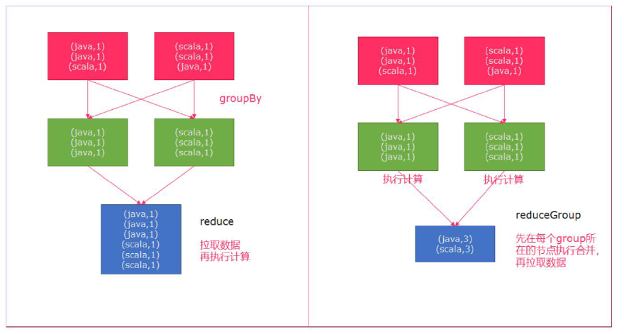
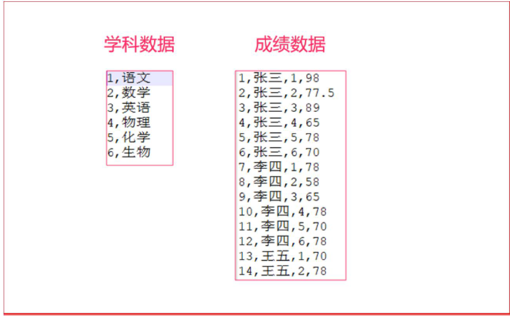
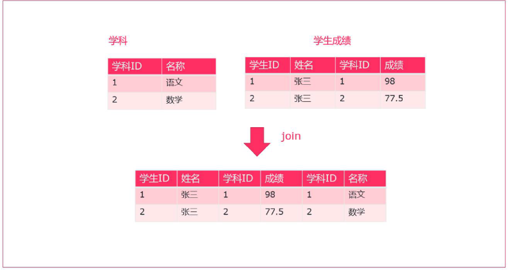
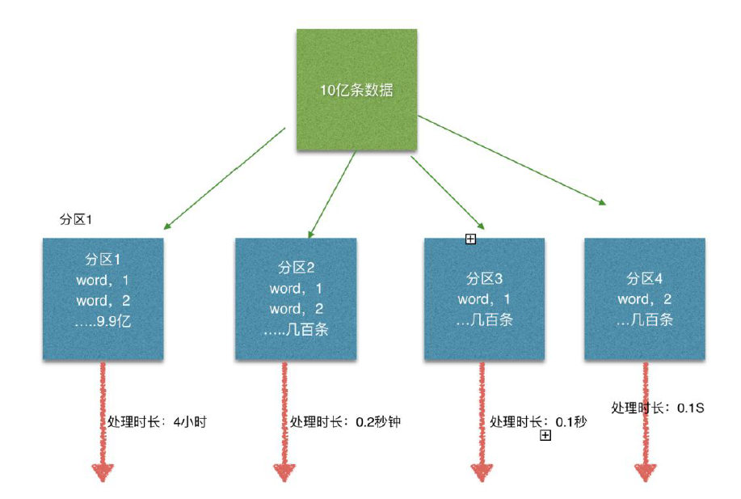
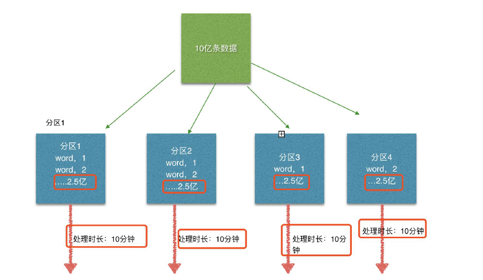
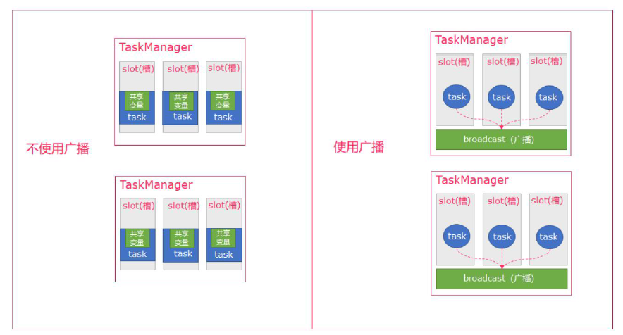

## 5.3 DateSet 的Transformation


| Transformation      | Description                                                  |
| ------------------- | ------------------------------------------------------------ |
| Map                 | 对集合元素，   进行一一遍历处理      data.map { x => x.toInt } |
| FlatMap             | 一个数据元生成多个数据元（可以为   0）      data.flatMap { str => str.split(" ") } |
| MapPartition        | 函数处理包含一个分区所有数据的“迭代器”   ， 可以生成任意数量的结果值。 每个分区中的元素数量取决于并行度和先前      的算子操作。      data.mapPartition { in => in map { (_, 1) } } |
| Filter              | 对集合元素，   进行一一遍历处理,只过滤满足条件的元素      data.filter { _ > 1000 } |
| Reduce              | 作用于整个   DataSet， 合并该数据集的元素。      data.reduce { _ + _ } |
| ReduceGroup         | 通过将此数据集中的所有元素传递给函数，   创建一个新的数据集。 该函数可以使用收集器输出零个或多个元素。 也可以作      用与完整数据集， 迭代器会返回完整数据集的元素      data.reduceGroup { elements => elements.sum } |
| Aggregate           | 对一组数据求聚合值，   聚合可以应用于完整数据集或分组数据集。 聚合转换只能应用于元组（Tuple） 数据集， 并且仅支持      字段位置键进行分组。 有一些常用的聚合算子， 提供以下内置聚合函数（Aggregations） ：      val input: DataSet[(Int, String, Double)] = // [...]      val output: DataSet[(Int, String, Doublr)] = input.aggregate(SUM,   0).aggregate(MIN, 2);      // 简化语法      val input: DataSet[(Int, String, Double)] = // [...]      val output: DataSet[(Int, String, Double)] = input.sum(0).min(2) |
| Distinct            | 对数据集中的元素除重并返回新的数据集。      data.distinct()  |
| Join                | 将两个   DataSet 连接生成一个新的 DataSet。      两个数据集指定的要连接的 key， 进行 join， 默认是一个 inner join。 可以使用 JoinFunction   将该组连接元素转化      为单个元素， 也可以使用 FlatJoinFunction 将该组元素转化为任意多个元素（包括 none） 。      // where("0") 表示使用 input1 的第一个字段连接      // equalTo("1") 表示使用 input2 的第二个字段， 判断等于 input1 的第一个字段的值      val result = input1.join(input2).where(0).equalTo(1)      可以通过 JoinHint 参数来指定运行时执行连接的方式。 参数描述了 join 是通过分区（partitioning） 还是广播      （broadcasting） 发生的， 以及使用算法是基于排序（sort-based） 的还是基于哈希（hash-based） 的。   如果没有指      定 JoinHint， 系统将尝试对输入大小进行评估， 并根据这些评估选择最佳策略。      // 广播 input1， 并使用 hash table 的方式      val result = input1.join(input2, JoinHint.BROADCAST_HASH_FIRST)      .where(0).equalTo(1)      // JoinHint 可选项：      // OPTIMIZER_CHOOSES， 由系统判断选择      // BROADCAST_HASH_FIRST， 第一个数据集构建哈希表并广播， 由第二个表扫描。 适用于第一个数据集较小的情况      // BROADCAST_HASH_SECOND， 适用于第二个数据集较小的情况      // REPARTITION_HASH_FIRST， 对两个数据同时进行分区， 并从第一个输入构建哈希表。 如果第一个输入小于第二个输入，      则此策略很好。      // REPARTITION_HASH_SECOND， 适用于第二个输入小于第一个输入。      // REPARTITION_SORT_MERGE， 对两个数据同时进行分区， 并对每个输入进行排序（除非数据已经分区或排序） 。   输入通过      已排序输入的流合并来连接。 如果已经对一个或两个输入进行过分区排序的情况， 则此策略很好。      // REPARTITION_HASH_FIRST 是系统使用的默认回退策略， 如果不能进行大小估计， 并且不能重新使用预先存在的分区和      排序顺序。      类似 Spark SQL 的 join 逻辑， 会根据要连接的两个数据的大小， 进行优化。 如果不是非常了解那种连接方式在什么场景      下更优， 建议由系统选择， 不要指定。 |
| OuterJoin           | 多两个数据集执行左连接（leftOuterJoin）   、 右连接（rightOuterJoin） 或全外连接（fullOuterJoin） 。 与 Join（inner      join） 的区别在于， 如果在另一侧没有找到匹配的数据， 则保存左侧（或右侧、 两侧） 的记录。      val joined = left.leftOuterJoin(right).where(0).equalTo(1) {      (left, right) =>      val a = if (left == null) "none" else left._1      (a, right)      } |
| CoGroup             | Reduce   操作的二维变体。 对一个或多个字段中的每个输入进行分组， 然后加入组。 每对组调用转换函数。      data1.coGroup(data2).where(0).equalTo(1) |
| Cross               | 构建两个输入数据集的笛卡尔积。   可选择使用 CrossFunction 将元素对转换为单个元素。      val data1: DataSet[Int] = // [...]      val data2: DataSet[String] = // [...]      val result: DataSet[(Int, String)] = data1.cross(data2)      Note: Cross is potentially a very compute-intensive operation which can   challenge even large compute clusters!      It is adviced to hint the system with the DataSet sizes by using   crossWithTiny() and crossWithHuge(). |
| Union               | 构建两个数据集的并集。      data.union(data2)                |
| Rebalance           | 均匀地重新负载数据集的并行分区以消除数据偏差。   后面只可以接类似 map 的算子操作。      val data1: DataSet[Int] = // [...]      val result: DataSet[(Int, String)] = data1.rebalance().map(...) |
| Hash-Partition      | 根据给定的   key 对数据集做 hash 分区。 可以是 position keys， expression keys 或者 key selector   functions。      val in: DataSet[(Int, String)] = // [...]      val result = in.partitionByHash(0).mapPartition { ... } |
| Range-Partition     | 根据给定的   key 对一个数据集进行 Range 分区。可以是 position keys，expression keys 或者 key selector   functions。      val in: DataSet[(Int, String)] = // [...]      val result = in.partitionByRange(0).mapPartition { ... } |
| Custom Partitioning | 手动指定数据分区。   此方法仅适用于单个字段的 key。      val in: DataSet[(Int, String)] = // [...]      val result = in.partitionCustom(partitioner: Partitioner[K], key) |
| Sort Partition      | 本地以指定的顺序在指定的字段上对数据集的所有分区进行排序。   可以指定 field position 或 filed expression。      val in: DataSet[(Int, String)] = // [...]      val result = in.sortPartition(1, Order.ASCENDING).mapPartition { ... } |
| First-n             | 返回数据集的前   n 个元素。 可以应用于任意数据集。      val in: DataSet[(Int, String)] = // [...]      // regular data set      val result1 = in.first(3)      // grouped data set      val result2 = in.groupBy(0).first(3)      // grouped-sorted data set      val result3 = in.groupBy(0).sortGroup(1, Order.ASCENDING).first(3) |


### 5.3.1 map 函数

将DataSet 中的每一个元素转换为另外一个元素

示例

```
使用map 操作，将以下数据
"1,张三", "2,李四", "3,王五", "4,赵六"
转换为一个scala 的样例类。
```

步骤
1) 获取ExecutionEnvironment 运行环境
2) 使用fromCollection 构建数据源
3) 创建一个User 样例类
4) 使用map 操作执行转换
5) 打印测试

参考代码

```scala
object BatchMapDemo {
def main(args: Array[String]): Unit = {
//获取执行环境
val env: ExecutionEnvironment = ExecutionEnvironment.getExecutionEnvironment
//获取数据源
val textDataSet: DataSet[String] = env.fromCollection(
List("1,张三", "2,李四", "3,王五", "4,赵六")
)
//将数据转换成样例类
val userDataSet = textDataSet.map(item=>{
val field = item.split(",")
User(field(0), field(1))
})
userDataSet.print()
}
//定义用户的样例类
case class User(id:String, name:String)
}
```

## 5.3.2 flatMap 函数

将DataSet 中的每一个元素转换为0...n 个元素

示例

分别将以下数据，转换成国家、省份、城市三个维度的数据。

将以下数据

```
张三,中国,江西省,南昌市
李四,中国,河北省,石家庄市
Tom,America,NewYork,Manhattan
```

转换为

```
张三,中国
张三,中国江西省
张三,中国江西省南昌市
```

思路
以上数据为一条转换为三条，显然，应当使用flatMap 来实现
分别在flatMap 函数中构建三个数据，并放入到一个列表中

```
姓名, 国家
姓名, 国家省份
姓名, 国家省份城市
```

步骤
1) 构建批处理运行环境
2) 构建本地集合数据源
3) 使用flatMap 将一条数据转换为三条数据
a. 使用逗号分隔字段
b. 分别构建国家、国家省份、国家省份城市三个元组
4) 打印输出

参考代码

```scala
object BatchFlatMapDemo {
def main(args: Array[String]): Unit = {
val env: ExecutionEnvironment = ExecutionEnvironment.getExecutionEnvironment
// 2. 构建本地集合数据源
val userDataSet = env.fromCollection(List(
"张三,中国,江西省,南昌市",
"李四,中国,河北省,石家庄市",
"Tom,America,NewYork,Manhattan"
))
val userAndressDataSet: DataSet[(String, String)] = userDataSet.flatMap(text=>{
val field = text.split(",")
/**
* * 张三,中国
* * 张三,中国江西省
* * 张三,中国江西省南昌市
*/
List(
(field(0), field(1)),
(field(0), field(1)+field(2)),
(field(0), field(1)+field(2)+field(3))
)
})
userAndressDataSet.print()
}
}
```

### 5.3.3 mapPartition 函数

将一个分区中的元素转换为另一个元素

示例

使用mapPartition 操作，将以下数据

```
"1,张三", "2,李四", "3,王五", "4,赵六"
```

转换为一个scala 的样例类。


步骤

1) 获取ExecutionEnvironment 运行环境

2) 使用fromCollection 构建数据源

3) 创建一个User 样例类

4) 使用mapPartition 操作执行转换

5) 打印测试

参考代码

```scala
object BatchMapPartitionDemo {
def main(args: Array[String]): Unit = {
//获取执行环境
val env: ExecutionEnvironment = ExecutionEnvironment.getExecutionEnvironment
//获取数据源
val textDataSet: DataSet[String] = env.fromCollection(
List("1,张三", "2,李四", "3,王五", "4,赵六")
)
//将数据转换成样例类
val userDataSet = textDataSet.mapPartition(iter=>{
//访问外部资源，初始化资源
iter.map(ele=>{
val fields = ele.split(",")
User(fields(0), fields(1))
})
})
userDataSet.print()
}
//定义用户的样例类
case class User(id:String, name:String)
}
```

mapPartition：

​	是一个分区一个分区拿出来的。

​	好处就是以后我们操作完数据了需要存储到mysql 中，这样做的好处就是几个分区拿几个连接，如果用map 的话，就是多少条数据拿多少个mysql 的连接。

### 5.3.4 filter 函数

​	过滤出来一些符合条件的元素

​	Filter 函数在实际生产中特别实用，数据处理阶段可以过滤掉大部分不符合业务的内容，可以极
大减轻整体flink 的运算压力

示例

过滤出来以下以h 开头的单词。

```
"hadoop", "hive", "spark", "flink"
```

步骤

1) 获取ExecutionEnvironment 运行环境

2) 使用fromCollection 构建数据源

3) 使用filter 操作执行过滤

4) 打印测试

参考代码

```scala
object BatchFilterDemo {
def main(args: Array[String]): Unit = {
//获取执行环境
val env = ExecutionEnvironment.getExecutionEnvironment
//获取数据
val textDataSet: DataSet[String] = env.fromCollection(List("hadoop", "hive", "spark", "flink"))
//数据过滤
textDataSet.filter(item=>item.startsWith("h")).print()
}
}
```

### 5.3.5 reduce 函数

可以对一个dataset 或者一个group 来进行聚合计算，最终聚合成一个元素

示例

请将以下元组数据，使用reduce 操作聚合成一个最终结果

```
("java" , 1) , ("java", 1) ,("java" , 1)
```

将上传元素数据转换为("java",3)

步骤

1) 获取ExecutionEnvironment 运行环境

2) 使用fromCollection 构建数据源

3) 使用reduce执行聚合操作

4) 打印测试

参考代码

```scala
object BatchReduceDemo {
    def main(args: Array[String]): Unit = {
    val env = ExecutionEnvironment.getExecutionEnvironment
    val textDataSet: DataSet[(String, Int)] = env.fromCollection(
    List(("java" , 1) , ("java", 1) ,("java" , 1))
    )
    val reduceDataSet: DataSet[(String, Int)] = textDataSet.reduce((t1, t2)=>(t1._1, t1._2+t2._2))
    reduceDataSet.print()
    }
}
```

### 5.3.6 reduceGroup

可以对一个dataset 或者一个group 来进行聚合计算，最终聚合成一个元素

reduce 和reduceGroup 的区别



​	首先groupBy 函数会将一个个的单词进行分组，分组后的数据被reduce 一个个的拉取过来，这种方式如果数据量大的情况下，拉取的数据会非常多，增加了网络IO

​	reduceGroup 是reduce 的一种优化方案；它会先分组reduce，然后在做整体的reduce；这样做的好处就是可以减少网络IO；
示例

请将以下元组数据，下按照单词使用groupBy 进行分组，再使用reduceGroup 操作进行单词计数

```
("java" , 1) , ("java", 1) ,("scala" , 1)
```

参考代码

```scala
object BatchReduceGroupDemo {
    def main(args: Array[String]): Unit = {
    val env = ExecutionEnvironment.getExecutionEnvironment
    val textDataSet: DataSet[(String, Int)] = env.fromCollection(
    List(("java" , 1) , ("java", 1) ,("java" , 1))
    )
    val reduceGroupDataSet: DataSet[(String, Int)] = textDataSet.groupbu(0).reduceGroup(iter => {
        iter.reduce((t1, t2) => {
            (t1._1, t1._2 + t2._2)
        })
    })
    reduceGroupDataSet.print()
    }
}
```

### 5.3.7 Aggregate

按照内置的方式来进行聚合。例如：SUM/MIN/MAX..

示例

请将以下元组数据，使用aggregate 操作进行单词统计

```
("java" , 1) , ("java", 1) ,("scala" , 1)
```

参考代码

Aggregate 只能作用于元组上

```scala
object BatchAggregateDemo {
    def main(args: Array[String]): Unit = {
        val env = ExecutionEnvironment.getExecutionEnvironment
        val textDataSet = env.fromCollection(List(("java" , 1) , ("java", 3) ,("scala" , 1)))
        val grouped = textDataSet.groupBy(0)
        val aggDataSet: AggregateDataSet[(String, Int)] = grouped.aggregate(Aggregations.MAX, 1)
        aggDataSet.print()
    }
}
```

### 5.3.8 minBy 和maxBy

获取指定字段的最大值、最小值

示例

请将以下元组数据，使用aggregate 操作进行单词统计

```
(1, "yuwen", 89.0) , (2, "shuxue", 92.2),(3, "yingyu", 89.99),(4, "wuli", 98.9),(1,"yuwen", 88.88),(1, "wuli", 93.00),(1, "yuwen", 94.3)
```

参考代码

```scala
/**
* 在数据集上进行聚合求最值（最大值、最小值）
* Aggregate 只能作用于元组上
*/
object BatchDemoAggregate {
    def main(args: Array[String]): Unit = {
        val env = ExecutionEnvironment.getExecutionEnvironment
        val data = new mutable.MutableList[(Int, String, Double)]
        data.+=((1, "yuwen", 89.0))
        data.+=((2, "shuxue", 92.2))
        data.+=((3, "yingyu", 89.99))
        data.+=((4, "wuli", 98.9))
        data.+=((1, "yuwen", 88.88))
        data.+=((1, "wuli", 93.00))
        data.+=((1, "yuwen", 94.3))
        //导入隐式转换
        import org.apache.flink.api.scala._
        //fromCollection 将数据转化成DataSet
        val input: DataSet[(Int, String, Double)] = env.fromCollection(Random.shuffle(data))
        input.print()
        println("===========获取指定字段分组后，某个字段的最大值==================")
        val output = input.groupBy(1).aggregate(Aggregations.MAX, 2)
        output.print()
        println("===========使用【MinBy】获取指定字段分组后，某个字段的最小值==================")
        // val input: DataSet[(Int, String, Double)] = env.fromCollection(Random.shuffle(data))
        val output2: DataSet[(Int, String, Double)] = input
        .groupBy(1)
        //求每个学科下的最小分数
        //minBy 的参数代表要求哪个字段的最小值
        .minBy(2)
        output2.print()
        println("===========使用【maxBy】获取指定字段分组后，某个字段的最大值==================")
        // val input: DataSet[(Int, String, Double)] = env.fromCollection(Random.shuffle(data))
        val output3: DataSet[(Int, String, Double)] = input
        .groupBy(1)
        //求每个学科下的最小分数
        //minBy 的参数代表要求哪个字段的最小值
        .maxBy(2)
        output3.print()
    }
}
```

### 5.3.9 distinct 去重

去除重复的数据

示例

请将以下元组数据，使用distinct 操作去除重复的单词

```
("java" , 1) , ("java", 1) ,("scala" , 1)
```

去重得到

```
("java", 1), ("scala", 1)
```

参考代码

```scala
object BatchDistinceDemo {
    def main(args: Array[String]): Unit = {
    val env = ExecutionEnvironment.getExecutionEnvironment
    val textDataSet: DataSet[(String, Int)] = env.fromCollection(List(("java" , 1) , ("java", 1) ,("scala" , 1)))
    textDataSet.distinct(1).print()
    }
}
```

### 5.3.10 Join

使用join 可以将两个DataSet 连接起来

示例：

在资料\测试数据源中，有两个csv 文件，有一个为score.csv ，一个为subject.csv ，分别保存了成绩数据以及学科数据



需要将这两个数据连接到一起，然后打印出来



```scala
object BatchJoinDemo {
    case class Subject(id:Int, name:String)
    case class Score(id:Int, stuName:String, subId:Int, score:Double)
    def main(args: Array[String]): Unit = {
    val env = ExecutionEnvironment.getExecutionEnvironment
    val subjectDataSet: DataSet[Subject] = env.readCsvFile[Subject]("./data/input/subject.csv")
    val scoreDataSet: DataSet[Score] = env.readCsvFile[Score]("./data/input/score.csv")
    //join 的替代方案：broadcast
    val joinDataSet: JoinDataSet[Score, Subject] = scoreDataSet.join(subjectDataSet).where(_.subId).equalTo(_.id)
    joinDataSet.print()
    }
}
```

优化join
通过给Flink 一些提示，可以使得你的join 更快，但是首先我们要简单了解一下Flink 如何执行join 的。
当Flink 处理批量数据的时候，每台机器只是存储了集群的部分数据。为了执行join，Flink 需要找到两个数据集的所有满足join 条件的数据。为了实现这个目标，Flink 需要将两个数据集有相同key 的数据发送到同一台机器上。有两种策略：

1. repartition-repartition strategy
    在该情况下，两个数据集都会使用key 进行重分区并使用通过网络传输。这就意味着假如数据集太大的话，网络传输数据集将耗费大量的时间。

2. broadcast-forward strategy
    在该情况下，一个数据集不动，另一个数据集会copy 到有第一个数据集部分数据的所有机器上。

  如果使用小数据集与大数据集进行join，可以选择broadcast-forward 策略，将小数据集广播，
  避免代价高的重分区。
  ds1.join(ds2, JoinHint.BROADCAST_HASH_FIRST)
  第二个参数就是提示，第一个数据集比第二个小。
  也可以使用下面几个提示：

  BROADCAST_HASH_FIRST: 第一个数据集是较小的数据集

  BROADCAST_HASH_SECOND: 第二个数据集是较小的数据集

  REPARTITION_HASH_FIRST: 第一个书记集是较小的数据集

  REPARTITION_HASH_SECOND: 第二个数据集是较小的数据集。

  REPARTITION_SORT_MERGE: 对数据集进行重分区，同时使用sort 和merge 策略。

  OPTIMIZER_CHOOSES: （默认的）Flink 的优化器决定两个数据集如何join。

### 5.3.11 Union

将多个DataSet 合并成一个DataSet

示例

将以下数据进行取并集操作

数据集1

```
"hadoop", "hive", "flume"
```


数据集2

```
"hadoop", "hive", "spark"
```

参考代码

```scala
object BatchUnionDemo {
    def main(args: Array[String]): Unit = {
        val env = ExecutionEnvironment.getExecutionEnvironment
        // 2. 使用`fromCollection`创建两个数据源
        val wordDataSet1 = env.fromCollection(List("hadoop", "hive", "flume"))
        val wordDataSet2 = env.fromCollection(List("hadoop", "hive", "spark"))
        val wordDataSet3 = env.fromElements("hadoop")
        val wordDataSet4 = env.fromElements("hadoop")
        wordDataSet1.union(wordDataSet2).print()
        wordDataSet3.union(wordDataSet4).print()
    }
}
```

### 5.3.12 Rebalance

​	Flink 也有数据倾斜的时候，比如当前有数据量大概10 亿条数据需要处理，在处理过程中可能会发生如图所示的状况：



​	这个时候本来总体数据量只需要10 分钟解决的问题，出现了数据倾斜，机器1 上的任务需要4 个小时才能完成，那么其他3 台机器执行完毕也要等待机器1 执行完毕后才算整体将任务完成；

​	所以在实际的工作中，出现这种情况比较好的解决方案就是本节课要讲解的—rebalance（内部使用round robin 方法将数据均匀打散。这对于数据倾斜时是很好的选择。）



举例：
1：在不使用rebalance 的情况下，观察每一个线程执行的任务特点

```scala
object BatchRebalanceDemo {
    def main(args: Array[String]): Unit = {
        val env = ExecutionEnvironment.getExecutionEnvironment
        val ds = env.generateSequence(0, 100)
        val rebalanced = ds.filter(_ > 8).rebalance

        val countsInPartition = rebalanced.map(new RichMapFunction[Long, (Int, Long)] {
       		def map(in: Long) = {
            //获取并行时子任务的编号getRuntimeContext.getIndexOfThisSubtask
            (getRuntimeContext.getIndexOfThisSubtask, in)
            }
        })
        countsInPartition.print()
    }
}
```

2：使用rebalance

```
增加
rebalanced.rebalance()
```

### 5.3.13 分区

#### 5.3.13.1 partitionByHash

按照指定的key 进行hash 分区

参考代码

```scala
object BatchHashPartitionDemo {
def main(args: Array[String]): Unit = {
/**
* 实现思路：
* 1. 构建批处理运行环境
* 2. 设置并行度为2
* 3. 使用fromCollection 构建测试数据集
* 4. 使用partitionByHash 按照字符串的hash 进行分区
* 5. 调用writeAsText 写入文件到data/parition_output 目录中
* 6. 打印测试
*/
//1. 构建批处理运行环境
val env: ExecutionEnvironment = ExecutionEnvironment.getExecutionEnvironment
/**
* 设置并行度三种设置方式
* 1：读取配置文件中的默认并行度设置
* 2：设置全局的并行度
* 3：对算子设置并行度
*/
//2. 设置并行度为2
env.setParallelism(5)
//3. 使用fromCollection 构建测试数据集
val textDataSet: DataSet[(Int, String)] = env.fromCollection(
List((1, "a"), (1, "b"), (1, "c"), (2, "a"), (2, "b"), (3, "a"), (3, "b"), (3, "c"), (4, "a"), (4, "a"),
(5, "a"), (5, "a"))
)
val partitionDataSet = textDataSet.partitionByHash(x => x._1)
val result = partitionDataSet.map(new RichMapFunction[(Int, String), (Int, (Int, String))] {
override def map(value: (Int, String)): (Int, (Int, String)) = {
(getRuntimeContext.getIndexOfThisSubtask, value)
}
})
//有多少个并行度就有多少个结果文件，可能结果文件中数据是空的
//partitionDataSet.writeAsText("./data/output/2")
result.print()
env.execute()
}
}
```

#### 5.3.13.2 Range-Partition

参考代码

```scala
object BatchRangePartitionDemo {
def main(args: Array[String]): Unit = {
//1. 构建批处理运行环境
val env: ExecutionEnvironment = ExecutionEnvironment.getExecutionEnvironment
//TODO Range-Partition
val data = new mutable.MutableList[(Int, Long, String)]
data.+=((1, 1L, "Hi"))
data.+=((2, 2L, "Hello"))
data.+=((3, 2L, "Hello world"))
data.+=((4, 3L, "Hello world, how are you?"))
data.+=((5, 3L, "I am fine."))
data.+=((6, 3L, "Luke Skywalker"))
data.+=((7, 4L, "Comment#1"))
data.+=((8, 4L, "Comment#2"))
data.+=((9, 4L, "Comment#3"))
data.+=((10, 4L, "Comment#4"))
data.+=((11, 5L, "Comment#5"))
data.+=((12, 5L, "Comment#6"))
data.+=((13, 5L, "Comment#7"))
data.+=((14, 5L, "Comment#8"))
data.+=((15, 5L, "Comment#9"))
data.+=((16, 6L, "Comment#10"))
data.+=((17, 6L, "Comment#11"))
data.+=((18, 6L, "Comment#12"))
data.+=((19, 6L, "Comment#13"))
data.+=((20, 6L, "Comment#14"))
data.+=((21, 6L, "Comment#15"))
val collection = env.fromCollection(Random.shuffle(data))
val unique = collection.partitionByRange(x => x._1).mapPartition(line => line.map{
x=>
(x._1 , x._2 , x._3)
})
unique.writeAsText("./data/output/rangePartition", WriteMode.OVERWRITE)
env.execute()
}
}
```

#### 5.3.13.3 sortPartition

根据指定的字段值进行分区的排序；

参考代码

```scala
object BatchSortPartitionDemo {
def main(args: Array[String]): Unit = {
//1. 构建批处理运行环境
val env: ExecutionEnvironment = ExecutionEnvironment.getExecutionEnvironment
val data = new mutable.MutableList[(Int, Long, String)]
data.+=((1, 1L, "Hi"))
data.+=((2, 2L, "Hello"))
data.+=((3, 2L, "Hello world"))
data.+=((4, 3L, "Hello world, how are you?"))
data.+=((5, 3L, "I am fine."))
data.+=((6, 3L, "Luke Skywalker"))
data.+=((7, 4L, "Comment#1"))
data.+=((8, 4L, "Comment#2"))
data.+=((9, 4L, "Comment#3"))
data.+=((10, 4L, "Comment#4"))
data.+=((11, 5L, "Comment#5"))
data.+=((12, 5L, "Comment#6"))
data.+=((13, 5L, "Comment#7"))
data.+=((14, 5L, "Comment#8"))
data.+=((15, 5L, "Comment#9"))
data.+=((16, 6L, "Comment#10"))
data.+=((17, 6L, "Comment#11"))
data.+=((18, 6L, "Comment#12"))
data.+=((19, 6L, "Comment#13"))
data.+=((20, 6L, "Comment#14"))
data.+=((21, 6L, "Comment#15"))
val ds = env.fromCollection(Random.shuffle(data))
val result = ds
.map { x => x }.setParallelism(2)
.sortPartition(1, Order.DESCENDING)//第一个参数代表按照哪个字段进行分区
.mapPartition(line => line)
.collect()
println(result)
}
}
```

## 5.4 数据输出Data Sinks

flink 在批处理中常见的sink

1) 基于本地集合的sink（Collection-based-sink）

2) 基于文件的sink（File-based-sink）

### 5.4.1 基于本地集合的sink（Collection-based-sink）

```scala
object BatchSinkCollection {
def main(args: Array[String]): Unit = {
//1.定义环境
val env = ExecutionEnvironment.getExecutionEnvironment
//2.定义数据stu(age,name,height)
val stu: DataSet[(Int, String, Double)] = env.fromElements(
(19, "zhangsan", 178.8),
(17, "lisi", 168.8),
(18, "wangwu", 184.8),
(21, "zhaoliu", 164.8)
)
//3. sink 到标准输出
stu.print
//3. sink 到标准error 输出
stu.printToErr()
//4. sink 到本地Collection
print(stu.collect())
//0.主意：不论是本地还是hdfs.若Parallelism>1 将把path 当成目录名称，若Parallelism=1 将把path 当成文件名。
val ds1: DataSet[Map[Int, String]] = env.fromElements(Map(1 -> "spark", 2 -> "flink"))
//1.TODO 写入到本地，文本文档,NO_OVERWRITE 模式下如果文件已经存在，则报错，OVERWRITE 模式下如果文件已经存在，则覆盖
ds1.setParallelism(1).writeAsText("test/data1/aa", WriteMode.OVERWRITE)
env.execute()
}
}
```

### 5.4.2 基于文件的sink（File-based-sink）

flink 支持多种存储设备上的文件，包括本地文件，hdfs 文件等。

flink 支持多种文件的存储格式，包括text 文件，CSV 文件等。

writeAsText()：TextOuputFormat - 将元素作为字符串写入行。字符串是通过调用每个元素的toString()方法获得的。

#### 5.4.2.1 将数据写入本地文件

```scala
val ds1: DataSet[Map[Int, String]] = env.fromElements(Map(1 -> "spark", 2 -> "flink"))
//写入到本地，文本文档,NO_OVERWRITE 模式下如果文件已经存在，则报错，OVERWRITE 模式下如果文件已经存在，则覆盖
ds1.setParallelism(1).writeAsText("test/data1/aa", WriteMode.OVERWRITE)
```

#### 5.4.2.2 将数据写入HDFS

```scala
val ds1: DataSet[Map[Int, String]] = env.fromElements(Map(1 -> "spark", 2 -> "flink"))
//1.TODO 写入到本地，文本文档,NO_OVERWRITE 模式下如果文件已经存在，则报错，OVERWRITE 模式下如果文件已经存在，则覆盖
ds1.setParallelism(1).writeAsText("hdfs://hadoop01:8020/a", WriteMode.OVERWRITE)
env.execute()
```

## 5.5 Flink 的广播变量

​	Flink 支持广播变量，就是将数据广播到具体的taskmanager 上，数据存储在内存中，这样可以减缓大量的shuffle 操作；

​	比如在数据join 阶段，不可避免的就是大量的shuffle 操作，我们可以把其中一个dataSet广播出去，一直加载到taskManager 的内存中，可以直接在内存中拿数据，避免了大量的shuffle，导致集群性能下降；

​	广播变量创建后，它可以运行在集群中的任何function 上，而不需要多次传递给集群节点。另外需要记住，不应该修改广播变量，这样才能确保每个节点获取到的值都是一致的。

​	一句话解释，可以理解为是一个公共的共享变量，我们可以把一个dataset 数据集广播出去，然后不同的task 在节点上都能够获取到，这个数据在每个节点上只会存在一份。如果不使用broadcast，则在每个节点中的每个task 中都需要拷贝一份dataset 数据集，比较浪费内存(也就是一个节点中可能会存在多份dataset 数据)。

​	注意：因为广播变量是要把dataset 广播到内存中，所以广播的数据量不能太大，否则会出现OOM 这样的问题

- Broadcast：Broadcast 是通过withBroadcastSet(dataset，string)来注册的
- Access：通过getRuntimeContext().getBroadcastVariable(String)访问广播变量



- 可以理解广播就是一个公共的共享变量
- 将一个数据集广播后，不同的Task 都可以在节点上获取到
- 每个节点只存一份
- 如果不使用广播，每一个Task 都会拷贝一份数据集，造成内存资源浪费

用法

在需要使用广播的操作后，使用withBroadcastSet 创建广播

在操作中，使用getRuntimeContext.getBroadcastVariable [广播数据类型] ( 广播名)获取广播变量

示例
创建一个学生数据集，包含以下数据

```
|学生ID | 姓名|
|------|------|
List((1, "张三"), (2, "李四"), (3, "王五"))
```

将该数据，发布到广播。
再创建一个成绩数据集，

```
|学生ID | 学科| 成绩|
|------|------|-----|
List( (1, "语文", 50),(2, "数学", 70), (3, "英文", 86))
```

请通过广播获取到学生姓名，将数据转换为

```
List( ("张三", "语文", 50),("李四", "数学", 70), ("王五", "英文", 86))
```

步骤
1) 获取批处理运行环境

2) 分别创建两个数据集

3) 使用RichMapFunction 对成绩数据集进行map 转换

4) 在数据集调用map 方法后，调用withBroadcastSet 将学生数据集创建广播

5) 实现RichMapFunction

a. 将成绩数据(学生ID，学科，成绩) -> (学生姓名，学科，成绩)

b. 重写open 方法中，获取广播数据

c. 导入scala.collection.JavaConverters._ 隐式转换

d. 将广播数据使用asScala 转换为Scala 集合，再使用toList 转换为scala List 集合

e. 在map 方法中使用广播进行转换

6) 打印测试


```scala
object BatchBroadcastDemo {
def main(args: Array[String]): Unit = {
//1. 获取批处理运行环境
val env: ExecutionEnvironment = ExecutionEnvironment.getExecutionEnvironment
//2. 分别创建两个数据集
//创建学生数据集
val stuDataSet: DataSet[(Int, String)] = env.fromCollection(
List((1, "张三"), (2, "李四"), (3, "王五"))
)
//创建成绩数据集
val socreDataSet: DataSet[(Int, String, Int)] = env.fromCollection(
List( (1, "语文", 50),(2, "数学", 70), (3, "英文", 86))
)
//3. 使用RichMapFunction 对成绩数据集进行map 转换
//返回值类型(学生名字，学科成名，成绩)
val result: DataSet[(String, String, Int)] = socreDataSet.map(new RichMapFunction[(Int, String, Int), (String,
String, Int)] {
//定义获取学生数据集的集合
var studentMap:Map[Int, String] = null
//初始化的时候被执行一次，在对象的生命周期中只被执行一次
override def open(parameters: Configuration): Unit = {
//因为获取到的广播变量中的数据类型是java 的集合类型，但是我们的代码是scala 因此需要将java 的集合转换成scala 的集合
//我们这里将list 转换成了map 对象，之所以能够转换是因为list 中的元素是对偶元祖，因此可以转换成kv 键值对类型
//之所以要转换，是因为后面好用，传递一个学生id，可以直接获取到学生的名字
import scala.collection.JavaConversions._
val studentList: util.List[(Int, String)] = getRuntimeContext.getBroadcastVariable[(Int,
String)]("student")
studentMap = studentList.toMap
}
//要对集合中的每个元素执行map 操作，也就是说集合中有多少元素，就被执行多少次
override def map(value: (Int, String, Int)): (String, String, Int) = {
//(Int, String, Int)=》（学生id，学科名字，学生成绩）
//返回值类型(学生名字，学科成名，成绩)
val stuId = value._1
val stuName = studentMap.getOrElse(stuId, "")
//(学生名字，学科成名，成绩)
(stuName, value._2, value._3)
}
}).withBroadcastSet(stuDataSet, "student")
result.print()
}
}
```

## 5.6 Flink Accumulators & Counters（了解）

Accumulator 即累加器，与Mapreduce counter 的应用场景差不多，都能很好地观察task在运行期间的数据变化
可以在Flink job 任务中的算子函数中操作累加器，但是只能在任务执行结束之后才能获得
累加器的最终结果。
Counter 是一个具体的累加器(Accumulator)实现
IntCounter, LongCounter 和DoubleCounter

步骤
1) 创建累加器

```
private IntCounter numLines = new IntCounter();
```

2) 注册累加器

```
getRuntimeContext().addAccumulator("num-lines", this.numLines);
```


3) 使用累加器

```
this.numLines.add(1);
```

4) 获取累加器的结果

```
myJobExecutionResult.getAccumulatorResult("num-lines")
```

代码参考

```scala
object BatchCounterDemo {
    def main(args: Array[String]): Unit = {
    //获取执行环境
  
    val env = ExecutionEnvironment.getExecutionEnvironment
    import org.apache.flink.api.scala._
    val data = env.fromElements("a","b","c","d")
    val res = data.map(new RichMapFunction[String,String] {
    //1：定义累加器
    val numLines = new IntCounter
    override def open(parameters: Configuration): Unit = {
    super.open(parameters)
    //2:注册累加器
    getRuntimeContext.addAccumulator("num-lines",this.numLines)
    }
    var sum = 0;
    override def map(value: String) = {
    //如果并行度为1，使用普通的累加求和即可，但是设置多个并行度，则普通的累加求和结果就不准了
    sum += 1;
    System.out.println("sum："+sum);
    this.numLines.add(1)
    value
    }
    }).setParallelism(1)
    // res.print();
    res.writeAsText("d:\\data\\count0")
    val jobResult = env.execute("BatchCounterDemo")
    // //3：获取累加器
    val num = jobResult.getAccumulatorResult[Int]("num-lines")
    println("num:"+num)
    }
}
```

## 5.7 Flink 的分布式缓存

​	Flink 提供了一个类似于Hadoop 的分布式缓存，让并行运行实例的函数可以在本地访问。这个功能可以被使用来分享外部静态的数据，例如：机器学习的逻辑回归模型等！

缓存的使用流程：

​	使用ExecutionEnvironment 实例对本地的或者远程的文件（例如：HDFS 上的文件）,为缓存文件指定一个名字注册该缓存文件！当程序执行时候，Flink 会自动将复制文件或者目录到所有worker 节点的本地文件系统中，函数可以根据名字去该节点的本地文件系统中检索该文件！

【注意】广播是将变量分发到各个worker 节点的内存上，分布式缓存是将文件缓存到各个worker 节点上；

用法

使用Flink 运行时环境的registerCachedFile 注册一个分布式缓存

在操作中，使用getRuntimeContext.getDistributedCache.getFile ( 文件名)获取分布式缓存

示例

创建一个成绩数据集

```
List( (1, "语文", 50),(2, "数学", 70), (3, "英文", 86))
```


请通过分布式缓存获取到学生姓名，将数据转换为

```
List( ("张三", "语文", 50),("李四", "数学", 70), ("王五", "英文", 86))
```


注： 资料\测试数据源\distribute_cache_student 文件保存了学生ID 以及学生姓名


```scala
object BatchDistrbutedCacheDemo {
  def main(args: Array[String]): Unit = {
    /**
     * 实现思路：
     * 1)将 distribute_cache_student 文件上传到HDFS / 目录下
     * 2)获取批处理运行环境
     * 3)创建成绩数据集
     * 4)对 成绩 数据集进行map转换，将（学生ID, 学科, 分数）转换为（学生姓名，学科，分数）
     *  a.RichMapFunction 的 open 方法中，获取分布式缓存数据
     *  b.在 map 方法中进行转换
     * 5)实现 open 方法
     *  a.使用 getRuntimeContext.getDistributedCache.getFile 获取分布式缓存文件
     *  b.使用 Scala.fromFile 读取文件，并获取行
     *  c.将文本转换为元组（学生ID，学生姓名），再转换为List
     * 6)实现 map 方法
     *  a.从分布式缓存中根据学生ID过滤出来学生
     *  b.获取学生姓名
     *  c.构建最终结果元组
     * 7)打印测试
     */

    val env: ExecutionEnvironment = ExecutionEnvironment.getExecutionEnvironment

    //注册需要缓存文件, 将文件复制到taskmanager的磁盘上
    env.registerCachedFile("hdfs://node01:8020/test/input/distribute_cache_student", "student")

    //创建成绩数据集
    val socreDataSet: DataSet[(Int, String, Int)] = env.fromCollection(
      List( (1, "语文", 50),(2, "数学", 70), (3, "英文", 86))
    )

    //4)对 成绩 数据集进行map转换，将（学生ID, 学科, 分数）转换为（学生姓名，学科，分数）
    val result: DataSet[(String, String, Int)] = socreDataSet.map(new RichMapFunction[(Int, String, Int), (String, String, Int)] {
      //定义获取到的学生数据集的集合（学生id, 学生名字）
      var studentMap: Map[Int, String] = null

      //这个方法只被调用一次，也就是对象被初始化的时候执行
      override def open(parameters: Configuration): Unit = {
        val file: File = getRuntimeContext.getDistributedCache.getFile("student")

        //因为缓存的是一个文件，所以获取到的肯定也是一个文件，接下来要读取文件中的内容
        val studentIter: Iterator[String] = Source.fromFile(file).getLines()
        //将字符串转换成map对象，方便后续使用
        studentMap = studentIter.map(line => {
          //因为文件中的数据是一行行的，通过，分割的字段
          val fields = line.split(",")
          //格式化后的数据：（学生id， 学生名字）
          (fields(0).toInt, fields(1))
        }).toMap
      }

      //map方法会被多次执行，因为socreDataSet有多少元素就被执行多少次
      override def map(value: (Int, String, Int)): (String, String, Int) = {
        //value: (学生id，学科名字，学科成绩)
        val stuId = value._1
        //根据学生id，找到学生的名字
        val stuName = studentMap.getOrElse(stuId, "")

        //将数据返回：("张三", "语文", 50)
        (stuName, value._2, value._3)
      }
    })

    result.print()

  }
}
```

