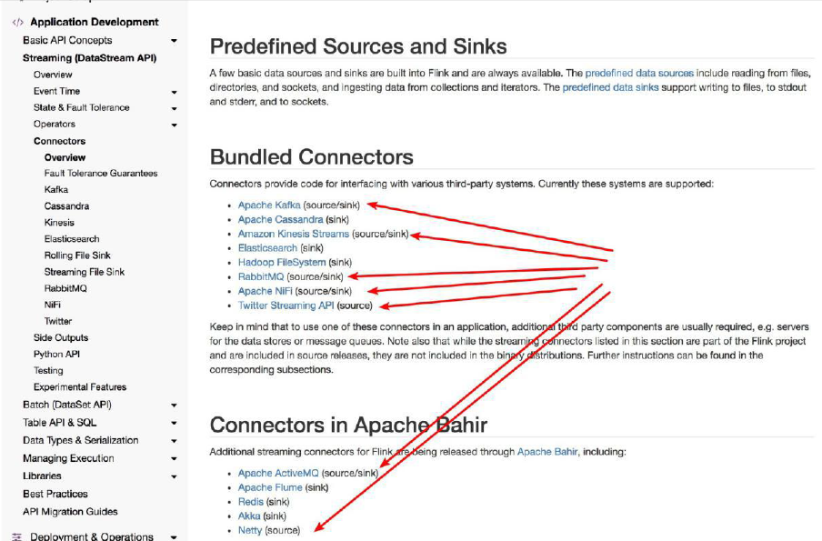
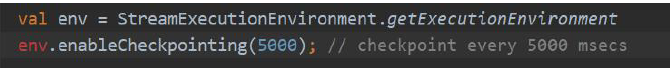
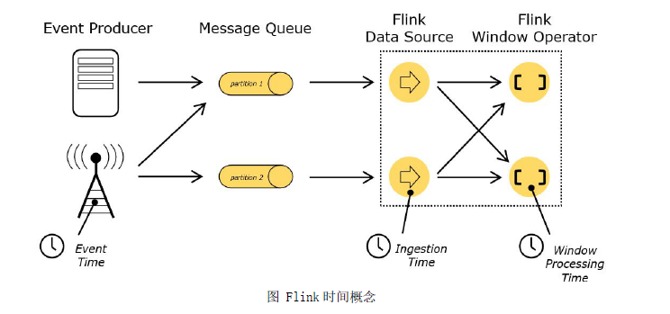
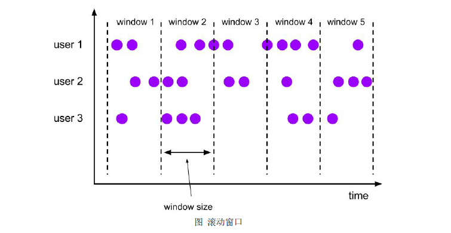
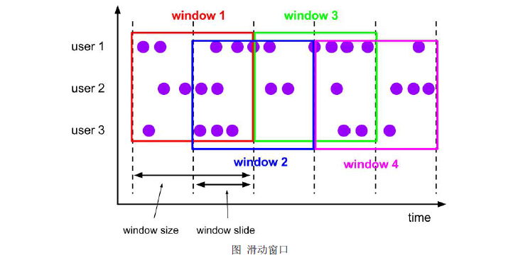
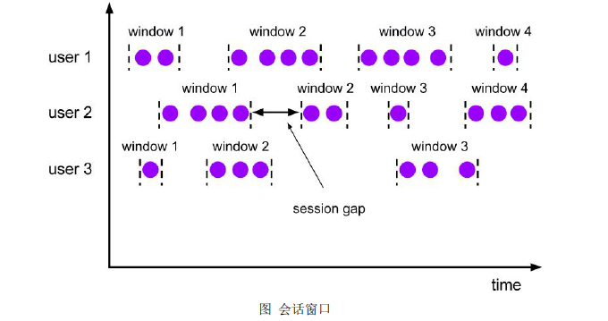
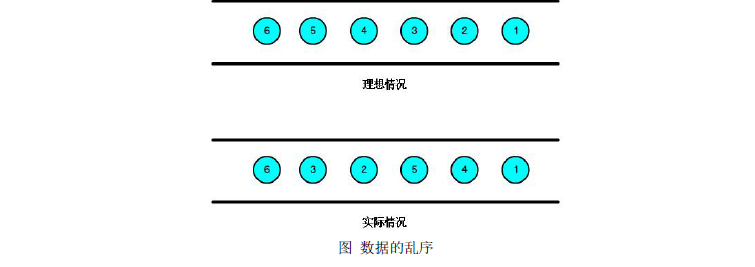
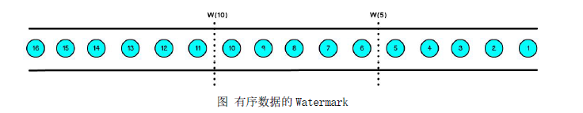
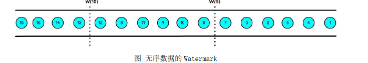
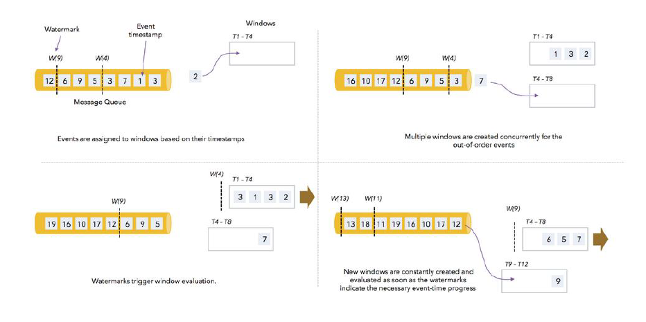

# 6、DataStream API 开发

## 6.1 入门案例

### 6.1.1 Flink 流处理程序的一般流程

1) 获取Flink 流处理执行环境

2) 构建source

3) 数据处理

4) 构建sink

## 6.1.2 示例

编写Flink 程序，用来统计单词的数量。

### 6.1.3 步骤

1) 获取Flink 批处理运行环境

2) 构建一个socket 源

3) 使用flink 操作进行单词统计

4) 打印

### 6.1.4 参考代码

```scala
object StreamWordCount {
    def main(args: Array[String]): Unit = {
    /**
    * 实现思路：
    * 1. 获取流处理运行环境
    * 2. 构建socket 流数据源，并指定IP 地址和端口号
    * 3. 对接收到的数据转换成单词元组
    * 4. 使用keyBy 进行分流（分组）
    * 5. 使用timeWinodw 指定窗口的长度（每5 秒计算一次）
    * 6. 使用sum 执行累加
    * 7. 打印输出
    * 8. 启动执行
    * 9. 在Linux 中，使用nc -lk 端口号监听端口，并发送单词
    */
    val env: StreamExecutionEnvironment = StreamExecutionEnvironment.getExecutionEnvironment
    env.setParallelism(1)
    //2. 构建socket 流数据源，并指定IP 地址和端口号
    val textDataStream: DataStream[String] = env.socketTextStream("hadoop01", 9999)
    //3. 对接收到的数据转换成单词元组
    val wordDataStream: DataStream[(String, Int)] = textDataStream.flatMap(_.split(" ")).map(_ -> 1)
    //4. 使用keyBy 进行分流（分组）
    //在批处理中针对于dataset， 如果分组需要使用groupby
    //在流处理中针对于datastream， 如果分组（分流）使用keyBy
    val groupedDataStream: KeyedStream[(String, Int), Tuple] = wordDataStream.keyBy(0)
    //5. 使用timeWinodw 指定窗口的长度（每5 秒计算一次）
    //spark-》reduceBykeyAndWindow
    val windowDataStream: WindowedStream[(String, Int), Tuple, TimeWindow] =
    groupedDataStream.timeWindow(Time.seconds(5))
    //6. 使用sum 执行累加
    val sumDataStream = windowDataStream.sum(1)
    sumDataStream.print()
    env.execute()
    }
}
```

注：安装netcat

```
yum install nc
```

## 6.2 输入数据集Data Sources

​	Flink 中你可以使用StreamExecutionEnvironment.addSource(source) 来为你的程序添加数据来源。

​	Flink 已经提供了若干实现好了的source functions ， 当然你也可以通过实现SourceFunction 来自定义非并行的source 或者实现ParallelSourceFunction 接口或者扩展RichParallelSourceFunction 来自定义并行的source。


### 6.2.1 Flink 在流处理上常见的Source

Flink 在流处理上常见的Source

Flink 在流处理上的source 和在批处理上的source 基本一致。大致有4 大类

**基于本地集合的source**（Collection-based-source）

**基于文件的source（File-based-source）**- 读取文本文件，即符合TextInputFormat 规范的文件，并将其作为字符串返回。

**基于网络套接字的source（Socket-based-source）**- 从socket 读取。元素可以用分隔符切分。

**自定义的source（Custom-source）**

### 6.2.2 基于集合的source

```scala
import org.apache.flink.streaming.api.scala.{DataStream, StreamExecutionEnvironment}
import scala.collection.immutable.{Queue, Stack}
import scala.collection.mutable
import scala.collection.mutable.{ArrayBuffer, ListBuffer}
import org.apache.flink.api.scala._
object StreamDataSourceDemo {
def main(args: Array[String]): Unit = {
val senv = StreamExecutionEnvironment.getExecutionEnvironment
//0.用element 创建DataStream(fromElements)
val ds0: DataStream[String] = senv.fromElements("spark", "flink")
ds0.print()
//1.用Tuple 创建DataStream(fromElements)
val ds1: DataStream[(Int, String)] = senv.fromElements((1, "spark"), (2, "flink"))
ds1.print()
//2.用Array 创建DataStream
val ds2: DataStream[String] = senv.fromCollection(Array("spark", "flink"))
ds2.print()
//3.用ArrayBuffer 创建DataStream
val ds3: DataStream[String] = senv.fromCollection(ArrayBuffer("spark", "flink"))
ds3.print()
//4.用List 创建DataStream
val ds4: DataStream[String] = senv.fromCollection(List("spark", "flink"))
ds4.print()
//5.用List 创建DataStream
val ds5: DataStream[String] = senv.fromCollection(ListBuffer("spark", "flink"))
ds5.print()
//6.用Vector 创建DataStream
val ds6: DataStream[String] = senv.fromCollection(Vector("spark", "flink"))
ds6.print()
//7.用Queue 创建DataStream
val ds7: DataStream[String] = senv.fromCollection(Queue("spark", "flink"))
ds7.print()
//8.用Stack 创建DataStream
val ds8: DataStream[String] = senv.fromCollection(Stack("spark", "flink"))
ds8.print()
//9.用Stream 创建DataStream（Stream 相当于lazy List，避免在中间过程中生成不必要的集合）
val ds9: DataStream[String] = senv.fromCollection(Stream("spark", "flink"))
ds9.print()
//10.用Seq 创建DataStream
val ds10: DataStream[String] = senv.fromCollection(Seq("spark", "flink"))
ds10.print()
//11.用Set 创建DataStream(不支持)
//val ds11: DataStream[String] = senv.fromCollection(Set("spark", "flink"))
//ds11.print()
//12.用Iterable 创建DataStream(不支持)
//val ds12: DataStream[String] = senv.fromCollection(Iterable("spark", "flink"))
//ds12.print()
//13.用ArraySeq 创建DataStream
val ds13: DataStream[String] = senv.fromCollection(mutable.ArraySeq("spark", "flink"))
ds13.print()
//14.用ArrayStack 创建DataStream
val ds14: DataStream[String] = senv.fromCollection(mutable.ArrayStack("spark", "flink"))
ds14.print()
//15.用Map 创建DataStream(不支持)
//val ds15: DataStream[(Int, String)] = senv.fromCollection(Map(1 -> "spark", 2 -> "flink"))
//ds15.print()
//16.用Range 创建DataStream
val ds16: DataStream[Int] = senv.fromCollection(Range(1, 9))
ds16.print()
//17.用fromElements 创建DataStream
val ds17: DataStream[Long] = senv.generateSequence(1, 9)
ds17.print()
    
    
env.execute()
}
}
```

### 6.2.3 基于文件的source（File-based-source）

```scala
//TODO 2.基于文件的source（File-based-source）
//0.创建运行环境
val env = StreamExecutionEnvironment.getExecutionEnvironment
//TODO 1.读取本地文件
val text1 = env.readTextFile("data2.csv")
text1.print()
//TODO 2.读取hdfs 文件
val text2 = env.readTextFile("hdfs://hadoop01:8020/input/test/word.txt")
text2.print()
env.execute()
```

### 6.2.4 基于网络套接字的source（Socket-based-source）

```
val source = env.socketTextStream("IP", PORT)
```

### 6.2.5 自定义的source（Custom-source）

​	除了预定义的Source 外，我们还可以通过实现SourceFunction 来自定义Source，然后通过StreamExecutionEnvironment.addSource(sourceFunction)添加进来。比如读取Kafka 数据的Source：

```
addSource(new FlinkKafkaConsumer<>);
```

### 6.2.6 基于kafka 的source 操作

addSource - 添加一个新的source function 。例如， 你可以addSource(new FlinkKafkaConsumer<>(…)) 以从Apache Kafka 读取数据。

上面几种的特点：

1) 基于集合：有界数据集，更偏向于本地测试用

2) 基于文件：适合监听文件修改并读取其内容

3) 基于Socket：监听主机的host port，从Socket 中获取数据

4) 自定义addSource：大多数的场景数据都是无界的，会源源不断的过来。比如去消费Kafka某个topic 上的数据，这时候就需要用到这个addSource，可能因为用的比较多的原因吧，Flink 直接提供FlinkKafkaConsumer 等类可供你直接使用。你可以去看看FlinkKafkaConsumerBase 这个基础类，它是Flink Kafka 消费的最根本的类。Flink 目前支持如下图里面常见的Source：



​	Flink 提供的Kafka 连接器，用于向Kafka 主题读取或写入数据。Flink Kafka Consumer集成了Flink 的检查点机制，可提供一次性处理语义。为实现这一目标，Flink 并不完全依赖kafka的消费者群体偏移跟踪，而是在内部跟踪和检查这些偏移。

#### 6.2.6.1 不同版本兼容介绍

| Flink版本 | Kafka版本 |
| --------- | --------- |
| 1.12.X    | 2.4.1     |
| 1.11.X    | 2.4.1     |
| 1.10.X    | 2.2.0     |
| 1.9.X     | 2.2.0     |
| 1.8.X     | 2.0.1     |
| 1.7.X     | 2.0.1     |
| 0.10.x    | 0.8.2.0   |
| 0.9.x     | 0.8.2.0   |

​	在Maven仓库网站<https://mvnrepository.com/>中，找到flink-connector-kafka的详情页面：<https://mvnrepository.com/artifact/org.apache.flink/flink-connector-kafka>

#### 6.2.6.2 构造函数参数说明

主题名称/主题名称列表

DeserializationSchema / KeyedDeserializationSchema 用于反序列化来自Kafka 的数据

Kafka 消费者的属性。需要以下属性：

“bootstrap.servers”（以逗号分隔的Kafka 经纪人名单）

“zookeeper.connect”（逗号分隔的Zookeeper 服务器列表）（仅Kafka 0.8 需要）

“group.id”消费者群组的ID

#### 6.2.6.3 反序列化Schema 类型

作用：对kafka 里获取的二进制数据进行反序列化

FlinkKafkaConsumer 需要知道如何将kafka 中的二进制数据转换成Java/Scala 对象

DeserialzationSchema 定义了该转换模式，通过T deserialize(byte[] message)

FlinkKafkaConsumer 从kafka 获取的每条消息都会通过DeserialzationSchema 的T deserialize(byte[] message)反序列化处理

反序列化Schema 类型(接口)

DeserialzationSchema(只反序列化value)

KeyedDeserializationSchema(反序列化key 和value)

#### 6.2.6.4 常用的反序列化shema


| Schema                                                       | 描述                                                         |
| ------------------------------------------------------------ | ------------------------------------------------------------ |
| SimpleStringSchema                                           | 可以将消息反序列化为字符串。 当我们接收到消息并且反序列化失败的时候， 会出现以下两种情况: <br>1) Flink 从 deserialize(..)方法中抛出异常， 这会导致 job 的失败， 然后 job 会重启； （没有开启 容错）<br/> 2) 在 deserialize(..) 方法出现失败的时候返回 null， 这会让 Flink Kafka consumer 默默的忽略 这条消息。 请注意， 如果配置了 checkpoint 为 enable， 由于 consumer 的失败容忍机制， 失败的消 息会被继续消费， 因此还会继续失败， 这就会导致 job 被不断自动重启 |
| JSONDeserializationSchema JSONKeyValueDeserializationSchema  | 可以把序列化后的 Json 反序列化成 ObjectNode， ObjectNode 可以通过 objectNode.get(“field” ).as(Int/String/…)() 来访问指定的字段 |
| TypeInformationSerializationSchema TypeInformationKeyValueSerializationSchema | (适合读写均是 flink 的场景)他们会基于 Flink 的 TypeInformation 来创建 schema。 这对于那些从 Flink 写入， 又从 Flink 读出的数据是很有用的。 这种 Flink-specific 的反序列化会比其他通用的序 列化方式带来更高的性能。 |


#### 6.2.6.5 Kafka Consumers 消费模式配置（影响从哪里开始消费）

| 消费模式                                                     | 说明                                                         |                                                              |
| ------------------------------------------------------------ | ------------------------------------------------------------ | ------------------------------------------------------------ |
| setStartFromEarliest                                         | 从对头开始， 最早的记录                                      | 内部的 consumer 递交到 kafka/zk 的偏移量将被忽略             |
| setStartFromLatest                                           | 从对尾开始， 最新的记录                                      | 内部的 consumer 递交到 kafka/zk 的偏移量将被忽略             |
| setStartFromGroupOffsets                                     | 默认值， 从当前消费组记录 的偏移量开始， 接着上次的 偏移量消费 | 以 consumer 递交到 kafka/zk 中的偏移量为起始位置开始消费， group.id 设置在 consumer 的 properties 里面； 如果没有找到记录的偏移量， 则使用 consumer 的 properties 的 auto.offset.reset 设置的策略 |
| setStartFromSpecificOffsets(Map<TopicPart ition, Long>的参数) | 从指定的具体位置开始消费                                     |                                                              |
| setStartFromTimestamp(long)                                  | 从指定的时间戳开始消费                                       | 对于每个分区， 时间戳大于或者等于指定时间戳的记录将用作起始位 置， 如果一个分区的最新时间早于时间戳， 那么只需要从最新记录中 读取该分区， 在此模式下， kafka/zk 中递交的偏移量将被忽略,时间 戳指的是 kafka 中消息自带的时间戳 |


简单理解：

​	如果是默认行为(setStartFromGroupOffsets),那么任务从检查点重启，按照重启前的offset 进行消费，如果直接重启不从检查点重启并且group.id 不变，程序会按照上次提交的offset 的位置继续消费。如果group.id 改变了，则程序按照auto.offset.reset 设置的属性进行消费。但是如果程序带有状态的算子，还是建议使用检查点重启。

如果是setStartFromEarliest()/ setStartFromLatest()：那么任务只会从最新或最老消费。

#### 6.2.6.6 flink 操作kafka 容错性

​	启用Flink 的检查点后，Flink Kafka Consumer 将使用主题中的记录，并以一致的方式定期检查其所有Kafka 偏移以及其他操作的状态。如果作业失败，Flink 会将流式程序恢复到最新检查点的状态，从存储在检查点中的偏移量开始重新使用来自Kafka 的消息数据。因此，设置检查点的间隔定义了程序在发生故障时最多可以返回多少。flink 在使用kafka 是要实现容错，需要在执行环境中启用拓扑的检查点：



​	如果未启用检查点，Kafka（kafka 0.9 以前）使用者将定期向Zookeeper 提交偏移量，kafka0.9 以后提交到broker，都是将topic 提交给__consumer_offsets 函数来执行

注意：如果flink 任务不通过检查点重启，而是直接重启（groupId 不变），可能会丢失数据。

​	原因：kafka 自动更新offset 时，fetch 到消息后就可以定期更新offset，无论是否消费成功。如果在kafka 更新offset 的间期内数据没有写入第三方介质，任务挂掉这部分数据就会丢失。

#### 6.2.6.7 Kafka 动态分区检测

​	对于有实时处理业务需求的企业，随着业务增长数据量也会同步增长，将导致原有的Kafka分区数不满足数据写入所需的并发度，需要扩展Kafka 的分区或者增加Kafka 的topic，这时就要求实时处理程序。	

​	SparkStreaming（与Kafka 0.10 版本结合支持动态分区检测）、Flink（创建一个线程，该线程会定期检测Kafka 新增分区，然后将其添加到kafkaFetcher 里） 都能动态发现新增topic 分区并消费处理新增分区的数据。

​	Spark 无需做任何配置就可动态发现Kafka 新增分区， 而Flink 需要将flink.partition-discovery.interval-millis 该属性设置为大于0 ，属性值为时间间隔单位为毫秒。

#### 6.2.6.8 使用案例

```scala
import java.util.Properties
import org.apache.flink.api.common.serialization.SimpleStringSchema
import org.apache.flink.streaming.api.scala.StreamExecutionEnvironment
import org.apache.flink.streaming.connectors.kafka.FlinkKafkaConsumer
import org.apache.flink.streaming.connectors.kafka.internals.KafkaTopicPartition
object StreamingKafkaSourceScala {
  def main(args: Array[String]): Unit = {
    val env = StreamExecutionEnvironment.getExecutionEnvironment
    //隐式转换
    import org.apache.flink.api.scala._
    //指定消费者主题
    val topic = "test"
    val props = new Properties();
    props.setProperty("bootstrap.servers","hadoop01:9092");
    props.setProperty("group.id","test");
    props.setProperty("key.deserializer", "org.apache.kafka.common.serialization.StringDeserializer");
    props.setProperty("value.deserializer", "org.apache.kafka.common.serialization.StringDeserializer");
    //动态感知kafka 主题分区的增加单位毫秒
    props.setProperty("flink.partition-discovery.interval-millis", "5000");
    val myConsumer = new FlinkKafkaConsumer[String](topic, new SimpleStringSchema(), props)
    /**
     * Map<KafkaTopicPartition, Long> Long 参数指定的offset 位置
     * KafkaTopicPartition 构造函数有两个参数，第一个为topic 名字，第二个为分区数
     * 获取offset 信息，可以用过Kafka 自带的kafka-consumer-groups.sh 脚本获取
     */
    val offsets = new java.util.HashMap[KafkaTopicPartition, java.lang.Long]();
    offsets.put(new KafkaTopicPartition(topic, 0), 11111111l);
    offsets.put(new KafkaTopicPartition(topic, 1), 222222l);
    offsets.put(new KafkaTopicPartition(topic, 2), 33333333l);
    /**
     * Flink 从topic 中最初的数据开始消费
     */
    myConsumer.setStartFromEarliest();
    /**
     * Flink 从topic 中指定的时间点开始消费，指定时间点之前的数据忽略
     */
    myConsumer.setStartFromTimestamp(1559801580000l);
    /**
     * Flink 从topic 中指定的offset 开始，这个比较复杂，需要手动指定offset
     */
    myConsumer.setStartFromSpecificOffsets(offsets);
    /**
     * Flink 从topic 中最新的数据开始消费
     */
    myConsumer.setStartFromLatest();
    /**
     * Flink 从topic 中指定的group 上次消费的位置开始消费，所以必须 配置group.id 参数
     */
    myConsumer.setStartFromGroupOffsets();
    //添加消费源
    val text = env.addSource(myConsumer)
    text.print()
    env.execute("StreamingFromCollectionScala")
  }
}
```

启动kafka服务

先启动zookeeper在启动kafka

```
cd /opt/servers/kafka_2.12-2.2.0
nohup bin/kafka-server-start.sh config/server.properties 2>&1 &
```

启动kafka生产者测试数据

```
cd /opt/servers/kafka_2.12-2.2.0
bin/kafka-console-producer.sh --broker-list hadoop01:9092,hadoop02:9092,hadoop03:9092 --topic test
```

查看偏移量

```
kafka-consumer-groups.sh --bootstrap-server hadoop01:9092 --group test --describe
```

## 6.3 DataStream 的Transformation

和dataset 一样，dataStream 也包括一系列的Transformation 操作：
https://ci.apache.org/projects/flink/flink-docs-release-1.10/dev/stream/operators/index.html

| Transformation                                               | Description                                                  |
| ------------------------------------------------------------ | ------------------------------------------------------------ |
| Map      DataStream→DataStream                               | Takes   one element and produces one element. A map function that doubles the values   of the input stream:      dataStream.map { x => x * 2 } |
| FlatMap      DataStream→DataStream                           | 采用一个数据元并生成零个，   一个或多个数据元。 将句子分割为单词的 flatmap 函数：      dataStream.flatMap { str => str.split(" ") } |
| Filter      DataStream→DataStream                            | 计算每个数据元的布尔函数，   并保存函数返回 true 的数据元。 过滤掉零值的过滤器：      dataStream.filter { _ != 0 } |
| KeyBy      DataStream→KeyedStream                            | 逻辑上将流分区为不相交的分区。   具有相同 Keys 的所有记录都分配给同一分区。 在内部， keyBy（） 是使用散列分区      实现的。 指定键有不同的方法。      此转换返回 KeyedStream， 其中包括使用被 Keys 化状态所需的 KeyedStream。      dataStream.keyBy("someKey") // Key by field   "someKey"      dataStream.keyBy(0) // Key by the first element of a Tuple |
| Reduce      KeyedStream→DataStream                           | 被   Keys 化数据流上的“滚动” Reduce。 将当前数据元与最后一个 Reduce 的值组合并发出新值。      reduce 函数， 用于创建部分和的流：      keyedStream.reduce { _ + _ } |
| Fold      KeyedStream→DataStream                             | 具有初始值的被   Keys 化数据流上的“滚动” 折叠。 将当前数据元与最后折叠的值组合并发出新值。      折叠函数， 当应用于序列（1,2,3,4,5） 时， 发出序列“start-1” ， “start-1-2” ， “start-1-2-3” ,.   ..      val result: DataStream[String] = keyedStream.fold("start")((str,   i) => { str + "-" + i }) |
| Aggregations      KeyedStream→DataStream                     | 在被   Keys 化数据流上滚动聚合。 min 和 minBy 之间的差异是 min 返回最小值， 而 minBy 返回该字段中具有最小值的数      据元（max 和 maxBy 相同） 。      keyedStream.sum(0);      keyedStream.sum("key");      keyedStream.min(0);      keyedStream.min("key");      keyedStream.max(0);      keyedStream.max("key");      keyedStream.minBy(0);      keyedStream.minBy("key");      keyedStream.maxBy(0);      keyedStream.maxBy("key"); |
| Window      KeyedStream→WindowedStream                       | 可以在已经分区的   KeyedStream 上定义 Windows。 Windows 根据某些特征（例如， 在最后 5 秒内到达的数据）对每个 Keys      中的数据进行分组。 有关窗口的完整说明， 请参见   windows。      dataStream.keyBy(0).window(TumblingEventTimeWindows.of(Time.seconds(5))); // Last 5 seconds of data |
| WindowAll      DataStream→AllWindowedStream                  | Windows   可以在常规 DataStream 上定义。 Windows 根据某些特征（例如， 在最后 5 秒内到达的数据） 对所有流事件进      行分组。 有关窗口的完整说明， 请参见   windows。      警告： 在许多情况下， 这是非并行转换。 所有记录将收集在 windowAll 算子的一个任务中。      dataStream.windowAll(TumblingEventTimeWindows.of(Time.seconds(5))); // Last 5 seconds of data |
| Window Apply      WindowedStream→DataStream      AllWindowedStream→DataStream | 将一般函数应用于整个窗口。   下面是一个手动求和窗口数据元的函数。      注意： 如果您正在使用 windowAll 转换， 则需要使用 AllWindowFunction。      windowedStream.apply { WindowFunction }// applying an AllWindowFunction on   non-keyed window stream      allWindowedStream.apply { AllWindowFunction } |
| Window Reduce      WindowedStream→DataStream                 | 将函数缩减函数应用于窗口并返回缩小的值。      windowedStream.reduce { _ + _ } |
| Window Fold      WindowedStream→DataStream                   | 将函数折叠函数应用于窗口并返回折叠值。   示例函数应用于序列（1,2,3,4,5） 时， 将序列折叠为字符串      “start-1-2-3-4-5” ：      val result: DataStream[String] = windowedStream.fold("start",   (str, i) => { str + "-" + i }) |
| Windows 上的聚合      WindowedStream→DataStream              | 聚合窗口的内容。min   和 minBy 之间的差异是 min 返回最小值，而 minBy 返回该字段中具有最小值的数据元（max 和 maxBy      相同） 。      windowedStream.sum(0);windowedStream.sum("key");windowedStream.min(0);windowedStream.min("key");window      edStream.max(0);windowedStream.max("key");windowedStream.minBy(0);windowedStream.minBy("key");windowed      Stream.maxBy(0);windowedStream.maxBy("key"); |
| Union                                                        | 两个或多个数据流的联合，   创建包含来自所有流的所有数据元的新流。 注意： 如果将数据流与自身联合， 则会在结果 |
| DataStream *→DataStream                                      | 流中获取两次数据元。      dataStream.union(otherStream1,   otherStream2, ...); |
| Window Join      DataStream， DataStream→      DataStream    | 在给定   Keys 和公共窗口上连接两个数据流。      dataStream.join(otherStream)      .where(<key   selector>).equalTo(<key   selector>)      .window(TumblingEventTimeWindows.of(Time.seconds(3)))      .apply (new   JoinFunction () {...}); |
| Interval Join      KeyedStream， KeyedStream→      DataStream | 在给定的时间间隔内使用公共   Keys 关联两个被 Key 化的数据流的两个数据元 e1 和 e2，以便 e1.timestamp + lowerBound      <= e2.timestamp <= e1.timestamp + upperBound      // this will join the two streams so that// key1 ==   key2 && leftTs - 2 < rightTs < leftTs + 2keyedStre      am.intervalJoin(otherKeyedStream)      .between(Time.milliseconds(-2), Time.milliseconds(2)) // lower and upper bound      .upperBoundExclusive(true) // optional      .lowerBoundExclusive(true) // optional      .process(new IntervalJoinFunction() {...}); |
| Window CoGroup      DataStream， DataStream→      DataStream | 在给定   Keys 和公共窗口上对两个数据流进行 Cogroup。      dataStream.coGroup(otherStream)      .where(0).equalTo(1)      .window(TumblingEventTimeWindows.of(Time.seconds(3)))      .apply (new   CoGroupFunction () {...}); |
| Connect      DataStream， DataStream→      ConnectedStreams  | “连接”   两个保存其类型的数据流。 连接允许两个流之间的共享状态。      DataStream<Integer> someStream = //...DataStream<String> otherStream = //...ConnectedStreams<Integer,      String> connectedStreams = someStream.connect(otherStream); |
| CoMap， CoFlatMap      ConnectedStreams→DataStream           | 类似于连接数据流上的   map 和 flatMap      connectedStreams.map(      (_ : Int) => true,      (_ : String) => false)connectedStreams.flatMap(      (_ : Int) => true,      (_ : String) => false) |
| Split      DataStream→SplitStream                            | 根据某些标准将流拆分为两个或更多个流。      val split = someDataStream.split(      (num: Int) =>      (num % 2) match {      case 0 => List("even")      case 1 => List("odd")      }) |
| Select      SplitStream→DataStream                           | 从拆分流中选择一个或多个流。      SplitStream<Integer> split;DataStream<Integer> even = split.select("even");DataStream<Integer> odd = s      plit.select("odd");DataStream<Integer>   all = split.select("even","odd"); |
| Iterate      DataStream→IterativeStream→      DataStream     | 通过将一个   算子的输出重定向到某个先前的 算子， 在流中创建“反馈” 循环。 这对于定义不断更新模型的算法特别      有用。 以下代码以流开头并连续应用迭代体。 大于 0 的数据元将被发送回反馈通道， 其余数据元将向下游转发。 有关      完整说明， 请参阅迭代。      initialStream.iterate {      iteration => {      val iterationBody = iteration.map {/*do something*/}      (iterationBody.filter(_ > 0), iterationBody.filter(_ <= 0))      }} |
| Extract Timestamps      DataStream→DataStream                | 从记录中提取时间戳，   以便使用使用事件时间语义的窗口。 查看活动时间。      stream.assignTimestamps (new TimeStampExtractor() {...}); |

### 6.3.1Connect

​	用来将两个dataStream 组装成一个ConnectedStreams。

​	而且这个connectedStream 的组成结构就是保留原有的dataStream 的结构体；这样我们就可以把不同的数据组装成同一个结构。

```scala
object StreamingDemoConnectScala {
    def main(args: Array[String]): Unit = {
        val env = StreamExecutionEnvironment.getExecutionEnvironment
        //隐式转换
        val text1 = env.addSource(new MyNoParallelSourceScala)
        val text2 = env.addSource(new MyNoParallelSourceScala)
        val text2_str = text2.map("str" + _)
        val connectedStreams = text1.connect(text2_str)
        val result = connectedStreams.map(line1 => {
        line1
        }, line2 => {
        	line2
        })
        result.print().setParallelism(1)
        env.execute("StreamingDemoWithMyNoParallelSourceScala")
    }
        /**
        * 创建自定义并行度为1 的source
        * 实现从1 开始产生递增数字
        */
        class MyNoParallelSourceScala extends SourceFunction[Long]{
        	var count = 1L
        	var isRunning = true
        	override def run(ctx: SourceContext[Long]) = {
                while(isRunning){
                ctx.collect(count)
                count+=1
                Thread.sleep(1000)
                }
            }
            override def cancel() = {
            isRunning = false
            }
    }
}
```

### 6.3.2 Split 和select

Split 就是将一个DataStream 分成两个或者多个DataStream

Select 就是获取分流后对应的数据

```scala
object StreamSplitDemo {
    def main(args: Array[String]): Unit = {
        val env = StreamExecutionEnvironment.getExecutionEnvironment
        env.setParallelism(1)
        val elements: DataStream[Int] = env.fromElements(1,2,3,4,5,6)
        //数据分流
        val split_data = elements.split(
        (num: Int) => (num % 2) match {
        case 0 => List("even")
        case 1 => List("odd")
        }
        )
        //获取分流后的数据
        val select: DataStream[Int] = split_data.select("even")
        select.print()
        env.execute()
    }
}
```

## 6.4 数据输出Data Sinks

### 6.4.1 将数据sink 到本地文件(参考批处理)

### 6.4.2 Sink 到本地集合(参考批处理)

### 6.4.3 Sink 到HDFS(参考批处理)

### 6.4.4 sink 到kafka（重点）

导入maven

```xml
<!-- 指定json/xml 转对象的依赖包-->
<dependency>
    <groupId>com.fasterxml.jackson.core</groupId>
    <artifactId>jackson-core</artifactId>
    <version>2.9.9</version>
</dependency>
<dependency>
    <groupId>com.fasterxml.jackson.core</groupId>
    <artifactId>jackson-databind</artifactId>
    <version>2.9.9</version>
</dependency>
<dependency>
    <groupId>com.fasterxml.jackson.module</groupId>
    <artifactId>jackson-module-scala_2.12</artifactId>
    <version>2.9.9</version>
</dependency>
```

```scala

import org.apache.flink.api.common.serialization.SimpleStringSchema
import org.apache.flink.streaming.api.scala.{DataStream, StreamExecutionEnvironment}
import org.apache.flink.streaming.connectors.kafka.FlinkKafkaProducer
import org.apache.flink.streaming.connectors.kafka.internals.KeyedSerializationSchemaWrapper

import com.fasterxml.jackson.databind.ObjectMapper
import com.fasterxml.jackson.module.scala.DefaultScalaModule

object StreamKafkaSink {
    val sinkTopic = "test"
    //样例类
    case class Student(id: Int, name: String, addr: String, sex: String)
    val mapper: ObjectMapper = new ObjectMapper()
    //将对象转换成字符串
    def toJsonString(T: Object): String = {
        mapper.registerModule(DefaultScalaModule)
        mapper.writeValueAsString(T)
    }
    def main(args: Array[String]): Unit = {
    //1.创建流执行环境
    val env = StreamExecutionEnvironment.getExecutionEnvironment
    //2.准备数据
    val dataStream: DataStream[Student] = env.fromElements(
    Student(8, "xiaoming", "beijing biejing", "female")
    )
    //将student 转换成字符串
    val studentStream: DataStream[String] = dataStream.map(student =>
    toJsonString(student) // 这里需要显示SerializerFeature 中的某一个，否则会报同时匹配两个方法的错误
    )
    //studentStream.print()
    val prop = new Properties()
    prop.setProperty("bootstrap.servers", "hadoop01:9092")
    val myProducer = new FlinkKafkaProducer[String](sinkTopic, new KeyedSerializationSchemaWrapper[String](new
    SimpleStringSchema()), prop)
    studentStream.addSink(myProducer)
    studentStream.print()
    env.execute("Flink add sink")
    }
}
```

### 6.4.5 sink 到mysql

```scala
import java.sql.{Connection, DriverManager, PreparedStatement}
import org.apache.flink.streaming.api.scala.{DataStream, StreamExecutionEnvironment}
import org.apache.flink.api.scala._
import org.apache.flink.configuration.Configuration
import org.apache.flink.streaming.api.functions.sink.RichSinkFunction

object MysqlSink {
	case class Student(id:Int , name:String , addr:String , sex:String)
    def main(args: Array[String]): Unit = {
        //1.创建流执行环境
        val env = StreamExecutionEnvironment.getExecutionEnvironment
        //2.准备数据
        val dataStream:DataStream[Student] = env.fromElements(
        Student(8, "xiaoming", "beijing biejing", "female")
        // Student(6, "daming", "tainjing tianjin", "male "),
        // Student(7, "daqiang ", "shanghai shanghai", "female")
        )
        //3.将数据写入到自定义的sink 中（这里是mysql）
        dataStream.addSink(new StudentSinkToMysql)
        //4.触发流执行
        env.execute()
    }
    class StudentSinkToMysql extends RichSinkFunction[Student]{
        private var connection:Connection = null
        private var ps:PreparedStatement = null
        override def open(parameters: Configuration): Unit = {
            val driver = "com.mysql.jdbc.Driver"
            val url = "jdbc:mysql://hadoop01:3306/test"
            val username = "root"
            val password = "root"
            //1:加载驱动
            Class.forName(driver)
            //2：创建连接
            connection = DriverManager.getConnection(url , username , password)
            val sql = "insert into student(id , name , addr , sex) values(?,?,?,?);"
            //3:获得执行语句
            ps = connection.prepareStatement(sql)
    	}
        //关闭连接操作
        override def close(): Unit = {
            if(connection != null){
            connection.close()
            }
            if(ps != null){
            ps.close()
            }
        }
        //每个元素的插入，都要触发一次invoke，这里主要进行invoke 插入
        override def invoke(stu: Student): Unit = {
            try{
                //4.组装数据，执行插入操作
                ps.setInt(1, stu.id)
                ps.setString(2, stu.name)
                ps.setString(3, stu.addr)
                ps.setString(4, stu.sex)
                ps.executeUpdate()
            }catch {
                case e:Exception => println(e.getMessage)
            }
        }
  	}
}
```


## 6.5 Time 与Window

### 6.5.1 Time

在Flink 的流式处理中，会涉及到时间的不同概念，如下图所示：



Event Time：是事件创建的时间。它通常由事件中的时间戳描述，例如采集的日志数据中，每一条日志都会记录自己的生成时间，Flink 通过时间戳分配器访问事件时间戳。

Ingestion Time：是数据进入Flink 的时间。

Processing Time：是每一个执行基于时间操作的算子的本地系统时间，与机器相关，默认的时间属性就是Processing Time。

例如，一条日志进入Flink 的时间为2019-08-12 10:00:00.123，到达Window 的系统时间为

2019-08-12 10:00:01.234，日志的内容如下：

```
2019-08-02 18:37:15.624 INFO Fail over to rm2
```


​	对于业务来说，要统计1min 内的故障日志个数，哪个时间是最有意义的？—— eventTime，因为我们要根据日志的生成时间进行统计。

### 6.5.2 Window

#### 6.5.2.1 Window 概述

​	streaming 流式计算是一种被设计用于处理无限数据集的数据处理引擎，而无限数据集是指一种不断增长的本质上无限的数据集，而window 是一种切割无限数据为有限块进行处理的手段。Window 是无限数据流处理的核心，Window 将一个无限的stream 拆分成有限大小的”buckets”桶，我们可以在这些桶上做计算操作。

#### 6.5.2.2 Window 类型

Window 可以分成两类：

1) CountWindow：按照指定的数据条数生成一个Window，与时间无关。

2) TimeWindow：按照时间生成Window。

对于TimeWindow，可以根据窗口实现原理的不同分成三类：滚动窗口（Tumbling Window）、滑动窗口（Sliding Window）和会话窗口（Session Window）。

##### 1) 滚动窗口（Tumbling Windows）

将数据依据固定的窗口长度对数据进行切片。

特点：时间对齐，窗口长度固定，没有重叠。

滚动窗口分配器将每个元素分配到一个指定窗口大小的窗口中，滚动窗口有一个固定的大小，并且不会出现重叠。例如：如果你指定了一个5 分钟大小的滚动窗口，窗口的创建如下图所示：



适用场景：适合做BI 统计等（做每个时间段的聚合计算）。

##### 2) 滑动窗口（Sliding Windows）

滑动窗口是固定窗口的更广义的一种形式，滑动窗口由固定的窗口长度和滑动间隔组成。

特点：时间对齐，窗口长度固定，有重叠。

滑动窗口分配器将元素分配到固定长度的窗口中，与滚动窗口类似，窗口的大小由窗口大小参数来配置，另一个窗口滑动参数控制滑动窗口开始的频率。因此，滑动窗口如果滑动参数小于窗口大小的话，窗口是可以重叠的，在这种情况下元素会被分配到多个窗口中。

例如，你有10 分钟的窗口和5 分钟的滑动，那么每个窗口中5 分钟的窗口里包含着上个10分钟产生的数据，如下图所示：


适用场景：对最近一个时间段内的统计（求某接口最近5min 的失败率来决定是否要报警）。

##### 3) 会话窗口（Session Windows）

​	由一系列事件组合一个指定时间长度的timeout 间隙组成，类似于web 应用的session，也就是一段时间没有接收到新数据就会生成新的窗口。

特点：时间无对齐。

​	session 窗口分配器通过session 活动来对元素进行分组，session 窗口跟滚动窗口和滑动窗口相比，不会有重叠和固定的开始时间和结束时间的情况，相反，当它在一个固定的时间周期内不再收到元素，即非活动间隔产生，那个这个窗口就会关闭。一个session 窗口通过一个session 间隔来配置，这个session 间隔定义了非活跃周期的长度，当这个非活跃周期产生，那么当前的session 将关闭并且后续的元素将被分配到新的session 窗口中去。



### 6.5.3 Window API

#### 6.5.3.1 CountWindow

CountWindow 根据窗口中相同key 元素的数量来触发执行，执行时只计算元素数量达到窗口大小的key 对应的结果。
注意：CountWindow 的window_size 指的是相同Key 的元素的个数，不是输入的所有元素的总数。

##### 1) 滚动窗口

默认的CountWindow 是一个滚动窗口，只需要指定窗口大小即可，当元素数量达到窗口大小时，就会触发窗口的执行。

```scala
import org.apache.flink.streaming.api.scala.StreamExecutionEnvironment
import org.apache.flink.api.scala._
object StreamCountWindow {
def main(args: Array[String]): Unit = {
// 获取执行环境
val env = StreamExecutionEnvironment.getExecutionEnvironment
// 创建SocketSource
val stream = env.socketTextStream("hadoop01", 9999)
// 对stream 进行处理并按key 聚合
val streamKeyBy = stream.map(item => (item.split(" ")(0), item.split(" ")(1).toLong)).keyBy(0)
// 引入滚动窗口
// 这里的5 指的是5 个相同key 的元素计算一次
val streamWindow = streamKeyBy.countWindow(5)
// 执行聚合操作
val streamReduce = streamWindow.reduce(
(item1, item2) => (item1._1, item1._2 + item2._2)
)
// 将聚合数据写入文件
streamReduce.print()
// 执行程序
env.execute("TumblingWindow")
}
}
```

##### 2) 滑动窗口

​	滑动窗口和滚动窗口的函数名是完全一致的，只是在传参数时需要传入两个参数，一个是window_size，一个是sliding_size。
​	下面代码中的sliding_size 设置为了2，也就是说，每收到两个相同key 的数据就计算一次，每一次计算的window 范围是5 个元素。

```scala
// 获取执行环境
val env = StreamExecutionEnvironment.getExecutionEnvironment
// 创建SocketSource
val stream = env.socketTextStream("localhost", 11111)
// 对stream 进行处理并按key 聚合
val streamKeyBy = stream.map(item => (item.split(" ")(0), item.split(" ")(1).toLong)).keyBy(0)
// 引入滚动窗口
// 当相同key 的元素个数达到2 个时，触发窗口计算，计算的窗口范围为5
val streamWindow = streamKeyBy.countWindow(5,2)
// 执行聚合操作
val streamReduce = streamWindow.reduce(
(item1, item2) => (item1._1, item1._2 + item2._2)
)
// 将聚合数据写入文件
streamReduce.print()
// 执行程序
env.execute("TumblingWindow")
```

#### 6.5.3.2 TimeWindow

TimeWindow 是将指定时间范围内的所有数据组成一个window，一次对一个window 里面的所有数据进行计算。

##### 1) 滚动窗口

Flink 默认的时间窗口根据Processing Time 进行窗口的划分，将Flink 获取到的数据根据进入Flink 的时间划分到不同的窗口中。

```scala
import org.apache.flink.streaming.api.scala.StreamExecutionEnvironment
import org.apache.flink.api.scala._
object StreamTimeWindow {
def main(args: Array[String]): Unit = {
// 获取执行环境
val env = StreamExecutionEnvironment.getExecutionEnvironment
// 创建SocketSource
val stream = env.socketTextStream("hadoop01", 9999)
// 对stream 进行处理并按key 聚合
val streamKeyBy = stream.map(item => (item.split(" ")(0), item.split(" ")(1).toLong)).keyBy(0)
// 引入滚动窗口
val streamWindow = streamKeyBy.timeWindow(Time.seconds(5))
// 执行聚合操作
val streamReduce = streamWindow.reduce(
(item1, item2) => (item1._1, item1._2 + item2._2)
)
// 将聚合数据写入文件
streamReduce.print()
// 执行程序
env.execute("TumblingWindow")
}
}
```

时间间隔可以通过Time.milliseconds(x)，Time.seconds(x)，Time.minutes(x)等其中的一个来指定。

##### 2) 滑动窗口（SlidingEventTimeWindows）

滑动窗口和滚动窗口的函数名是完全一致的，只是在传参数时需要传入两个参数，一个是window_size，一个是sliding_size。
下面代码中的sliding_size 设置为了2s，也就是说，窗口每2s 就计算一次，每一次计算的window 范围是5s 内的所有元素。

```scala
// 获取执行环境
val env = StreamExecutionEnvironment.getExecutionEnvironment
// 创建SocketSource
val stream = env.socketTextStream("localhost", 11111)
// 对stream 进行处理并按key 聚合
val streamKeyBy = stream.map(item => (item, 1)).keyBy(0)
// 引入滑动窗口
val streamWindow = streamKeyBy.timeWindow(Time.seconds(5), Time.seconds(2))
// 执行聚合操作
val streamReduce = streamWindow.reduce(
(item1, item2) => (item1._1, item1._2 + item2._2)
)
// 将聚合数据写入文件
streamReduce.print()
// 执行程序
env.execute("TumblingWindow")
```

时间间隔可以通过Time.milliseconds(x)，Time.seconds(x)，Time.minutes(x)等其中的一个来指定。

#### 6.5.3.3 Window Reduce

WindowedStream → DataStream：给window 赋一个reduce 功能的函数，并返回一个聚合的结果。

```scala
import org.apache.flink.streaming.api.scala.StreamExecutionEnvironment
import org.apache.flink.api.scala._
import org.apache.flink.streaming.api.windowing.time.Time
object StreamWindowReduce {
def main(args: Array[String]): Unit = {
// 获取执行环境
val env = StreamExecutionEnvironment.getExecutionEnvironment
// 创建SocketSource
val stream = env.socketTextStream("hadoop01", 9999)
// 对stream 进行处理并按key 聚合
val streamKeyBy = stream.flatMap(_.split(" ")).map(item => (item, 1)).keyBy(0)
// 引入时间窗口
val streamWindow = streamKeyBy.timeWindow(Time.seconds(5))
// 执行聚合操作
val streamReduce = streamWindow.reduce(
(item1, item2) => (item1._1, item1._2 + item2._2)
)
// 将聚合数据写入文件
streamReduce.print()
// 执行程序
env.execute("StreamWindowReduce")
}
}
```

#### 6.5.3.4 Window Apply

apply 方法可以进行一些自定义处理，通过匿名内部类的方法来实现。当有一些复杂计算时使用。

用法

1) 实现一个WindowFunction 类

2) 指定该类的泛型为[输入数据类型, 输出数据类型, keyBy 中使用分组字段的类型, 窗口类型]

示例

使用apply 方法来实现单词统计

步骤

1) 获取流处理运行环境

2) 构建socket 流数据源，并指定IP 地址和端口号

3) 对接收到的数据转换成单词元组

4) 使用keyBy 进行分流（分组）

5) 使用timeWinodw 指定窗口的长度（每3 秒计算一次）

6) 实现一个WindowFunction 匿名内部类

​	a. apply 方法中实现聚合计算

​	b. 使用Collector.collect 收集数据

7) 打印输出

8) 启动执行

9) 在Linux 中，使用nc -lk 端口号监听端口，并发送单词

```SCALA
import org.apache.flink.api.java.tuple.Tuple
import org.apache.flink.streaming.api.scala._
import org.apache.flink.streaming.api.scala.function.RichWindowFunction
import org.apache.flink.streaming.api.windowing.time.Time
import org.apache.flink.streaming.api.windowing.windows.TimeWindow
import org.apache.flink.util.Collector
/**
* 使用apply 实现单词统计
* apply 方法可以进行一些自定义处理，通过匿名内部类的方法来实现。当有一些复杂计算时使用。
*/
object StreamWindowApplyDemo {
    def main(args: Array[String]): Unit = {
    /**
    * 实现思路：
    * 1. 获取流处理运行环境
    * 2. 构建socket 流数据源，并指定IP 地址和端口号
    * 3. 对接收到的数据转换成单词元组
    * 4. 使用keyBy 进行分流（分组）
    * 5. 使用timeWinodw 指定窗口的长度（每3 秒计算一次）
    * 6. 实现一个WindowFunction 匿名内部类
    * 在apply 方法中实现聚合计算
    * 使用Collector.collect 收集数据
    * 7. 打印输出
    * 8. 启动执行
    * 9. 在Linux 中，使用nc -lk 端口号监听端口，并发送单词
    */
    //1. 获取流处理运行环境
    val env = StreamExecutionEnvironment.getExecutionEnvironment
    //2. 构建socket 流数据源，并指定IP 地址和端口号
    val textDataStream = env.socketTextStream("hadoop01", 9999).flatMap(_.split(" "))
    //3. 对接收到的数据转换成单词元组
    val wordDataStream = textDataStream.map(_->1)
    //4. 使用keyBy 进行分流（分组）
    val groupedDataStream: KeyedStream[(String, Int), String] = wordDataStream.keyBy(_._1)
    //5. 使用timeWinodw 指定窗口的长度（每3 秒计算一次）
    val windowDataStream: WindowedStream[(String, Int), String, TimeWindow] =
    groupedDataStream.timeWindow(Time.seconds(3))
    //6. 实现一个WindowFunction 匿名内部类
    val reduceDatStream: DataStream[(String, Int)] = windowDataStream.apply(new RichWindowFunction[(String, Int),
    (String, Int), String, TimeWindow] {
    //在apply 方法中实现数据的聚合
        override def apply(key: String, window: TimeWindow, input: Iterable[(String, Int)], out: Collector[(String, Int)]):
        Unit = {
            println("hello world")
            val tuple = input.reduce((t1, t2) => {
            (t1._1, t1._2 + t2._2)
            })
            //将要返回的数据收集起来，发送回去
            out.collect(tuple)
        }
    })
    reduceDatStream.print()
    env.execute()
    }
}
```

## 6.6 EventTime 与Window

### 6.6.1 EventTime 的引入

​	在Flink 的流式处理中，绝大部分的业务都会使用eventTime，一般只在eventTime 无法使用时，才会被迫使用ProcessingTime 或者IngestionTime。如果要使用EventTime，那么需要引入EventTime 的时间属性，引入方式如下所示：

```scala
val env = StreamExecutionEnvironment.getExecutionEnvironment
// 从调用时刻开始给env 创建的每一个stream 追加时间特征
env.setStreamTimeCharacteristic(TimeCharacteristic.EventTime)
```

### 6.6.2 Watermark

#### 6.6.2.1 基本概念

​	我们知道，流处理从事件产生，到流经source，再到operator，中间是有一个过程和时间的，虽然大部分情况下，流到operator 的数据都是按照事件产生的时间顺序来的，但是也不排除由于网络、背压等原因，导致乱序的产生，所谓乱序，就是指Flink 接收到的事件的先后顺序不是严格按照事件的Event Time 顺序排列的。



​	那么此时出现一个问题， 一旦出现乱序， 如果只根据 eventTime 决定 window 的运行， 我们不能明确数据是否全部到位， 但又不能无限期的等下去， 此时必须要有个机制来保证一个特定的时间后， 必须触发 window 去进行计算了， 这个特别的机制， 就是 Watermark。

​	Watermark 是一种衡量 Event Time 进展的机制， 它是数据本身的一个隐藏属性， 数据本身携带着对应的 Watermark。

​	Watermark 是用于处理乱序事件的， 而正确的处理乱序事件， 通常用 Watermark 机制结合window 来实现。

​	数据流中的 Watermark 用于表示 timestamp 小于 Watermark 的数据， 都已经到达了。 因此，window 的执行也是由 Watermark 触发的。

​	Watermark 可以理解成一个延迟触发机制， 我们可以设置 Watermark 的延时时长 t， 每次系统会校验已经到达的数据中最大的 maxEventTime， 然后认定 eventTime 小于 maxEventTime - t的所有数据都已经到达， 如果有窗口的停止时间等于 maxEventTime – t， 那么这个窗口被触发执行。	

​	有序流的 Watermarker 如下图所示： 



​	乱序流的Watermarker 如下图所示：



​	当Flink 接收到每一条数据时，都会产生一条Watermark，这条Watermark 就等于当前所有到达数据中的maxEventTime - 延迟时长，也就是说，Watermark 是由数据携带的，一旦数据携带的Watermark 比当前未触发的窗口的停止时间要晚，那么就会触发相应窗口的执行。由于Watermark 是由数据携带的，因此，如果运行过程中无法获取新的数据，那么没有被触发的窗口将永远都不被触发。

​	上图中，我们设置的允许最大延迟到达时间为2s，所以时间戳为7s 的事件对应的Watermark是5s，时间戳为12s 的事件的Watermark 是10s，如果我们的窗口1 是1s~5s，窗口2 是6s~10s，那么时间戳为7s 的事件到达时的Watermarker 恰好触发窗口1，时间戳为12s 的事件到达时的Watermark 恰好触发窗口2。

#### 6.6.2.2 Watermark 的引入

```scala
val env = StreamExecutionEnvironment.getExecutionEnvironment
// 从调用时刻开始给env 创建的每一个stream 追加时间特征
env.setStreamTimeCharacteristic(TimeCharacteristic.EventTime)
val stream = env.readTextFile("eventTest.txt").assignTimestampsAndWatermarks(
    new BoundedOutOfOrdernessTimestampExtractor[String](Time.milliseconds(200)) {
        override def extractTimestamp(t: String): Long = {
            // EventTime 是日志生成时间，我们从日志中解析EventTime
            t.split(" ")(0).toLong
        }
	}
)
```

### 6.6.3 EventTimeWindow API

​	当使用EventTimeWindow 时，所有的Window 在EventTime 的时间轴上进行划分，也就是说，在Window 启动后，会根据初始的EventTime 时间每隔一段时间划分一个窗口，如果Window 大小是3 秒，那么1 分钟内会把Window 划分为如下的形式：

```
[00:00:00,00:00:03)
[00:00:03,00:00:06)
...
[00:00:57,00:01:00)
```

如果Window 大小是10 秒，则Window 会被分为如下的形式：

```
[00:00:00,00:00:10)
[00:00:10,00:00:20)
...
[00:00:50,00:01:00)
```

​	注意，窗口是左闭右开的，形式为：[window_start_time,window_end_time)。

​	Window 的设定无关数据本身，而是系统定义好了的，也就是说，Window 会一直按照指定的时间间隔进行划分，不论这个Window 中有没有数据，EventTime 在这个Window 期间的数据会进入这个Window。

​	Window 会不断产生，属于这个Window 范围的数据会被不断加入到Window 中，所有未被触发的Window 都会等待触发，只要Window 还没触发，属于这个Window 范围的数据就会一直被加入到Window 中，直到Window 被触发才会停止数据的追加，而当Window 触发之后才接受到的属于被触发Window 的数据会被丢弃。
Window 会在以下的条件满足时被触发执行：

-  watermark 时间>= window_end_time；
- 在[window_start_time,window_end_time)中有数据存在。

我们通过下图来说明Watermark、EventTime 和Window 的关系。

## 

#### 6.6.3.1 滚动窗口（TumblingEventTimeWindows）

```scala
// 获取执行环境
val env = StreamExecutionEnvironment.getExecutionEnvironment
env.setStreamTimeCharacteristic(TimeCharacteristic.EventTime)
// 创建SocketSource
val stream = env.socketTextStream("localhost", 11111)
// 对stream 进行处理并按key 聚合
val streamKeyBy = stream.assignTimestampsAndWatermarks(
new BoundedOutOfOrdernessTimestampExtractor[String](Time.milliseconds(3000)) {
override def extractTimestamp(element: String): Long = {
val sysTime = element.split(" ")(0).toLong
println(sysTime)
sysTime
}}).map(item => (item.split(" ")(1), 1)).keyBy(0)
// 引入滚动窗口
val streamWindow = streamKeyBy.window(TumblingEventTimeWindows.of(Time.seconds(10)))
// 执行聚合操作
val streamReduce = streamWindow.reduce(
(item1, item2) => (item1._1, item1._2 + item2._2)
)
// 将聚合数据写入文件
streamReduce.print
```

结果是按照Event Time 的时间窗口计算得出的，而无关系统的时间（包括输入的快慢）。

#### 6.6.3.2 滑动窗口（SlidingEventTimeWindows）

```scala
// 获取执行环境
val env = StreamExecutionEnvironment.getExecutionEnvironment
env.setStreamTimeCharacteristic(TimeCharacteristic.EventTime)
// 创建SocketSource
val stream = env.socketTextStream("localhost", 11111)
// 对stream 进行处理并按key 聚合
val streamKeyBy = stream.assignTimestampsAndWatermarks(
new BoundedOutOfOrdernessTimestampExtractor[String](Time.milliseconds(0)) {
override def extractTimestamp(element: String): Long = {
val sysTime = element.split(" ")(0).toLong
println(sysTime)
sysTime
}}).map(item => (item.split(" ")(1), 1)).keyBy(0)
// 引入滑动窗口
val streamWindow = streamKeyBy.window(SlidingEventTimeWindows.of(Time.seconds(10), Time.seconds(5)))
// 执行聚合操作
val streamReduce = streamWindow.reduce(
(item1, item2) => (item1._1, item1._2 + item2._2)
)
// 将聚合数据写入文件
streamReduce.print
// 执行程序
env.execute("TumblingWindow")
```

#### 6.6.3.3 会话窗口（EventTimeSessionWindows）

​	相邻两次数据的EventTime 的时间差超过指定的时间间隔就会触发执行。如果加入Watermark，那么当触发执行时，所有满足时间间隔而还没有触发的Window 会同时触发执行。

```scala
// 获取执行环境
val env = StreamExecutionEnvironment.getExecutionEnvironment
env.setStreamTimeCharacteristic(TimeCharacteristic.EventTime)
// 创建SocketSource
val stream = env.socketTextStream("localhost", 11111)
// 对stream 进行处理并按key 聚合
val streamKeyBy = stream.assignTimestampsAndWatermarks(
new BoundedOutOfOrdernessTimestampExtractor[String](Time.milliseconds(0)) {
override def extractTimestamp(element: String): Long = {
val sysTime = element.split(" ")(0).toLong
println(sysTime)
sysTime
}}).map(item => (item.split(" ")(1), 1)).keyBy(0)
// 引入会话窗口
val streamWindow = streamKeyBy.window(EventTimeSessionWindows.withGap(Time.seconds(5)))
// 执行聚合操作
val streamReduce = streamWindow.reduce(
(item1, item2) => (item1._1, item1._2 + item2._2)
)
// 将聚合数据写入文件
streamReduce.print
// 执行程序
env.execute("TumblingWindow")
```

### 6.6.4 Flink 对于迟到数据的处理

​	waterMark 和Window 机制解决了流式数据的乱序问题，对于因为延迟而顺序有误的数据，可以根据eventTime 进行业务处理，对于延迟的数据Flink 也有自己的解决办法，主要的办法是给定一个允许延迟的时间，在该时间范围内仍可以接受处理延迟数据。

设置允许延迟的时间是通过allowedLateness(lateness: Time)设置

保存延迟数据则是通过sideOutputLateData(outputTag: OutputTag[T])保存

获取延迟数据是通过DataStream.getSideOutput(tag: OutputTag[X])获取

下面先分别讲解这几个方法，再给出具体的实例加深理解

#### 6.6.4.1 allowedLateness(lateness: Time)

```scala
def allowedLateness(lateness: Time): WindowedStream[T, K, W] = {
    javaStream.allowedLateness(lateness)
    this
}
```

​	该方法传入一个Time 值，设置允许数据迟到的时间，这个时间和waterMark 中的时间概念不同。再来回顾一下：

​	waterMark=数据的事件时间-允许乱序时间值

​	随着新数据的到来，waterMark 的值会更新为最新数据事件时间-允许乱序时间值，但是如果这时候来了一条历史数据，waterMark 值则不会更新。总的来说，waterMark 是为了能接收到尽可能多的乱序数据。

​	那这里的Time 值呢？主要是为了等待迟到的数据，在一定时间范围内，如果属于该窗口的数据到来，仍会进行计算，后面会对计算方式仔细说明

​	注意：该方法只针对于基于event-time 的窗口，如果是基于processing-time，并且指定了非零的time 值则会抛出异常

#### 6.6.4.2 sideOutputLateData(outputTag: OutputTag[T])

```scala
def sideOutputLateData(outputTag: OutputTag[T]): WindowedStream[T, K, W] = {
javaStream.sideOutputLateData(outputTag)
this
}
```

​	该方法是将迟来的数据保存至给定的outputTag 参数，而OutputTag 则是用来标记延迟数据的一个对象。

#### 6.6.4.3 DataStream.getSideOutput(tag: OutputTag[X])

​	通过window 等操作返回的DataStream 调用该方法，传入标记延迟数据的对象来获取延迟的数据

#### 6.6.4.4 对延迟数据的理解

​	延迟数据是指：
​	在当前窗口【假设窗口范围为10-15】已经计算之后，又来了一个属于该窗口的数据【假设事件时间为13】，这时候仍会触发window 操作，这种数据就称为延迟数据。

​	那么问题来了，延迟时间怎么计算呢？

​	假设窗口范围为10-15，延迟时间为2s，则只要waterMark<15+2，并且属于该窗口，就能触发window 操作。而如果来了一条数据使得waterMark>=15+2，10-15 这个窗口就不能再触发window操作。

#### 6.6.4.5 代码实例

```scala
 val lateData = new OutputTag[(String,Int)]("late")
    //数据分流
 val groupedDataStream = wordAndOneDataStream.keyBy(0)

 val windowDataSource: WindowedStream[(String, Int), Tuple, TimeWindow] =
      groupedDataStream
        .window(TumblingEventTimeWindows.of(Time.seconds(5)))
        .allowedLateness(Time.seconds(2L))
        .sideOutputLateData(lateData)
 val result = windowDataSource.reduce((item1, item2) => (item1._1, item1._2 + item2._2))

	// 将聚合数据写入文件
    val late: DataStream[(String, Int)] = result.getSideOutput(lateData)
    late.print(">>>")
    result.print()
```

