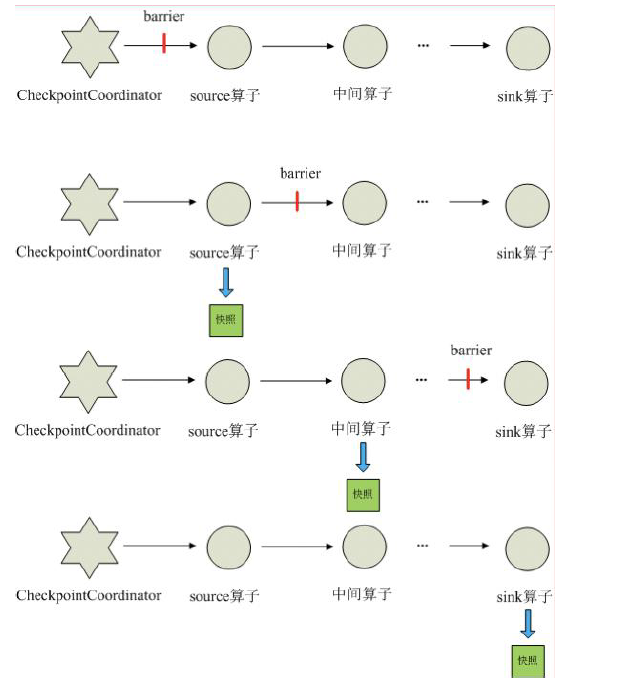
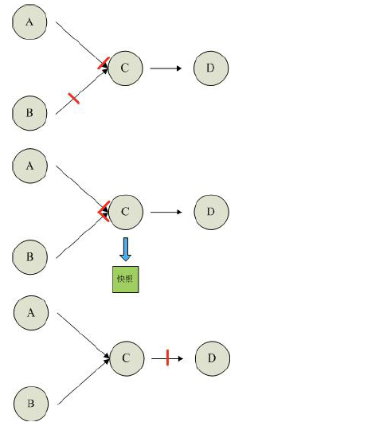

## 6.8 Flink 的容错

### 6.8.1 Checkpoint 介绍

​	Checkpoint 是Flink 实现容错机制最核心的功能，也是flink 的四大基石之一，它能够根据配置周期性地基于Stream 中各个Operator/task 的状态来生成快照，从而将这些状态数据定期持久化存储下来，当Flink 程序一旦意外崩溃时，重新运行程序时可以有选择地从这些快照进行恢复，从而修正因为故障带来的程序数据异常。

​	快照的核心概念之一是barrier。这些barrier 被注入数据流并与记录一起作为数据流的一部分向下流动。barriers 永远不会超过记录，数据流严格有序，barrier 将数据流中的记录隔离成一系列的记录集合，并将一些集合中的数据加入到当前的快照中，而另一些数据加入到下一个快照中。

每个barrier 都带有快照的ID，并且barrier 之前的记录都进入了该快照。barriers 不会中断流处理，非常轻量级。来自不同快照的多个barrier 可以同时在流中出现，这意味着多个快照可能并发地发生。

​	每个需要checkpoint 的应用在启动时， Flink 的JobManager 为其创建一个CheckpointCoordinator(检查点协调器)，CheckpointCoordinator 全权负责本应用的快照制作。



1) CheckpointCoordinator 周期性的向该流应用的所有source 算子发送barrier。

2) 当某个source 算子收到一个barrier 时，便暂停数据处理过程，然后将自己的当前状态制作成快照，并保存到指定的持久化存储中，最后向CheckpointCoordinator 报告自己快照制作情况，同时向自身所有下游算子广播该barrier，恢复数据处理。

3) 下游算子收到barrier 之后，会暂停自己的数据处理过程，然后将自身的相关状态制作成快照，并保存到指定的持久化存储中，最后向CheckpointCoordinator 报告自身快照情况，同时向自身所有下游算子广播该barrier，恢复数据处理。

4) 每个算子按照步骤3 不断制作快照并向下游广播，直到最后barrier 传递到sink 算子，快照制作完成。

5) 当CheckpointCoordinator 收到所有算子的报告之后，认为该周期的快照制作成功; 否则，如果在规定的时间内没有收到所有算子的报告，则认为本周期快照制作失败

​	如果一个算子有两个输入源，则暂时阻塞先收到barrier 的输入源，等到第二个输入源相同编号的barrier 到来时，再制作自身快照并向下游广播该barrier。具体如下图所示



1) 假设算子C 有A 和B 两个输入源

2) 在第i 个快照周期中，由于某些原因(如处理时延、网络时延等)输入源A 发出的barrier先到来，这时算子C 暂时将输入源A 的输入通道阻塞，仅收输入源B 的数据。

3) 当输入源B 发出的barrier 到来时，算子C 制作自身快照并向CheckpointCoordinator 报告自身的快照制作情况，然后将两个barrier 合并为一个，向下游所有的算子广播。

4) 当由于某些原因出现故障时，CheckpointCoordinator 通知流图上所有算子统一恢复到某个周期的checkpoint 状态，然后恢复数据流处理。分布式checkpoint 机制保证了数据仅被处理一次(Exactly Once)。

### 6.8.2 持久化存储

目前，Checkpoint 持久化存储可以使用如下三种:

#### 6.8.2.1 MemStateBackend（默认）

​	该持久化存储主要将快照数据保存到JobManager 的内存中，仅适合作为测试以及快照的数据量非常小时使用，并不推荐用作大规模商业部署。

​	MemoryStateBackend 的局限性（建议不要使用）：

​	默认情况下，每个状态的大小限制为5 MB。可以在MemoryStateBackend 的构造函数中增加此值。

​	无论配置的最大状态大小如何，状态都不能大于akka 帧的大小（请参阅配置）。

​	聚合状态必须适合JobManager 内存。

​	建议MemoryStateBackend 用于：

​	本地开发和调试

​	状态很少的作业，例如仅包含一次记录功能的作业（Map，FlatMap，Filter，...），kafka的消费者需要很少的状态。

​	注意：建议不要将快照保存到内存中，因为会导致数据丢失或者jobmanager 服务器的压力增加

#### 6.8.2.2 FsStateBackend（建议使用）

​	该持久化存储主要将快照数据保存到文件系统中，目前支持的文件系统主要是HDFS 和本地文件。如果使用HDFS，则初始化FsStateBackend 时，需要传入以“hdfs://”开头的路径(即: new FsStateBackend("hdfs:///hacluster/checkpoint"))， 如果使用本地文件，则需要传入以“file://”开头的路径(即:new FsStateBackend("file:///Data"))。在分布式情况下，不推荐使用本地文件。如果某个算子在节点A 上失败，在节点B 上恢复，使用本地文件时，在B上无法读取节点A 上的数据，导致状态恢复失败。

建议FsStateBackend：

​	具有大状态，长窗口，大键/ 值状态的作业。

​	所有高可用性设置。

#### 6.8.2.3 RocksDBStateBackend

​	RocksDBStatBackend 介于本地文件和HDFS 之间，平时使用RocksDB 的功能，将数据持久化到本地文件中，当制作快照时，将本地数据制作成快照，并持久化到FsStateBackend 中(FsStateBackend 不必用户特别指明，只需在初始化时传入HDFS 或本地路径即可，如new RocksDBStateBackend("hdfs:///hacluster/checkpoint") 或new RocksDBStateBackend("file:///Data"))。

​	如果用户使用自定义窗口(window)，不推荐用户使用RocksDBStateBackend。在自定义窗口中，状态以ListState 的形式保存在StatBackend 中，如果一个key 值中有多个value 值，则RocksDB 读取该种ListState 非常缓慢，影响性能。用户可以根据应用的具体情况选择FsStateBackend+HDFS 或RocksStateBackend+HDFS。

#### 6.8.2.4 语法

```scala
val env = StreamExecutionEnvironment.getExecutionEnvironment()
// start a checkpoint every 1000 ms
env.enableCheckpointing(1000)
// advanced options:
// 设置checkpoint 的执行模式，最多执行一次或者至少执行一次
env.getCheckpointConfig.setCheckpointingMode(CheckpointingMode.EXACTLY_ONCE)
// 设置checkpoint 的超时时间
env.getCheckpointConfig.setCheckpointTimeout(60000)
// 如果在只做快照过程中出现错误，是否让整体任务失败：true 是 /false 不是
env.getCheckpointConfig.setFailTasksOnCheckpointingErrors(false)
//设置同一时间有多少个checkpoint 可以同时执行
env.getCheckpointConfig.setMaxConcurrentCheckpoints(1)
```

#### 6.8.2.5 修改State Backend 的两种方式

第一种：单任务调整

修改当前任务代码

```scala
env.setStateBackend(new FsStateBackend("hdfs://node01:8020/flink/checkpoints"));
或者new MemoryStateBackend()
或者new RocksDBStateBackend(filebackend, true);【需要添加第三方依赖】
```

第二种：全局调整

修改flink-conf.yaml

```yaml
state.backend: filesystem
state.checkpoints.dir: hdfs://namenode:9000/flink/checkpoints
```

注意： state.backend 的值可以是下面几种： jobmanager(MemoryStateBackend),
filesystem(FsStateBackend), rocksdb(RocksDBStateBackend)

```xml
<dependency>
    <groupId>org.apache.flink</groupId>
    <artifactId>flink-statebackend-rocksdb_2.12</artifactId>
    <version>1.10.1</version>
</dependency>
```

### 6.8.3 Checkpoint 的高级选项

默认checkpoint 功能是disabled 的，想要使用的时候需要先启用checkpoint 开启之后，默认的checkPointMode 是Exactly-once

//配置一秒钟开启一个checkpoint

```scala
env.enableCheckpointing(1000)
```

//指定checkpoint 的执行模式

```scala
env.getCheckpointConfig.setCheckpointingMode(CheckpointingMode.EXACTLY_ONCE)
```

CheckpointingMode.EXACTLY_ONCE：默认值

CheckpointingMode.AT_LEAST_ONCE：至少一次

一般情况下选择CheckpointingMode.EXACTLY_ONCE，除非场景要求极低的延迟（几毫秒）

注意：如果需要保证EXACTLY_ONCE，source 和sink 要求必须同时保证EXACTLY_ONCE

//如果程序被cancle，保留以前做的checkpoint

```scala
env.getCheckpointConfig.enableExternalizedCheckpoints(ExternalizedCheckpointCleanup.RETAIN_ON_CANCELLATION)
```

默认情况下，检查点不被保留，仅用于在故障中恢复作业，可以启用外部持久化检查点，同时指定保留策略:

**ExternalizedCheckpointCleanup.RETAIN_ON_CANCELLATION:**	在作业取消时保留检查点，注意，在这种情况下，您必须在取消后手动清理检查点状态

**ExternalizedCheckpointCleanup.DELETE_ON_CANCELLATION**：当作业在被cancel 时，删除检查点，检查点仅在作业失败时可用

//设置checkpoint 超时时间

```scala
env.getCheckpointConfig.setCheckpointTimeout(60000)
```


Checkpointing 的超时时间，超时时间内没有完成则被终止

```scala
env.getCheckpointConfig.setMinPauseBetweenCheckpoints(500)
```


Checkpointing 最小时间间隔，用于指定上一个checkpoint 完成之后最小等多久可以触发另一个checkpoint，当指定这个参数时，maxConcurrentCheckpoints 的值为1

//设置同一个时间是否可以有多个checkpoint 执行

```scala
env.getCheckpointConfig.setMaxConcurrentCheckpoints(1)
```

指定运行中的checkpoint 最多可以有多少个

```scala
env.getCheckpointConfig.setFailOnCheckpointingErrors(true)
```

用于指定在checkpoint 发生异常的时候，是否应该fail 该task，默认是true，如果设置为false，则task 会拒绝checkpoint 然后继续运行


代码示例

```scala
import org.apache.flink.runtime.state.filesystem.FsStateBackend
import org.apache.flink.streaming.api.scala.StreamExecutionEnvironment
import org.apache.flink.api.scala._
import org.apache.flink.streaming.api.CheckpointingMode
import org.apache.flink.streaming.api.environment.CheckpointConfig.ExternalizedCheckpointCleanup

/**
 * 检查点的测试
 */
object StreamCheckPointDemo {
  def main(args: Array[String]): Unit = {
    /**
     * 初始化执行环境
     */
    val env: StreamExecutionEnvironment = StreamExecutionEnvironment.getExecutionEnvironment

    //默认情况下checkpoint是没有开启的，如果想开启的话
    //开启checkpoint的时候，设置checkpoint的周期，每5秒钟做一次checkpoint
    env.enableCheckpointing(5000)

    //指定快照的保存后端，默认是保存在内存中，但是不建议使用
    //将快照保存到本地文件或者hdfs
    //env.setStateBackend(new FsStateBackend("file:///D:/workspace/day04/output/ck"))
    env.setStateBackend(new FsStateBackend(args(0)))

    //如果程序被cancle，保留以前做的checkpoint
    //DELETE_ON_CANCELLATION：当作业被取消时，删除外部的checkpoint，只有当作业失败时，检查点状态才可用
    //RETAIN_ON_CANCELLATION：当作业被取消时，保留外部的checkpoint，注意在这个情况下，需要手动清理checkpoint的状态
    env.getCheckpointConfig.enableExternalizedCheckpoints(ExternalizedCheckpointCleanup.RETAIN_ON_CANCELLATION)

    //指定以后存储多少个checkpoint目录
    env.getCheckpointConfig.setMaxConcurrentCheckpoints(2)

    //构建数据源
    val lines = env.socketTextStream(args(1), args(2).toInt)

    val result = lines.flatMap(_.split(" ")).map(_->1).keyBy(0).sum(1)

    result.print()

    env.execute()
  }
}
```


### 6.8.4 Flink 的重启策略

​	Flink 支持不同的重启策略，这些重启策略控制着job 失败后如何重启。集群可以通过默认的重启策略来重启，这个默认的重启策略通常在未指定重启策略的情况下使用，而如果Job 提交的时候指定了重启策略，这个重启策略就会覆盖掉集群的默认重启策略。

#### 6.8.4.1 概览

​	默认的重启策略是通过Flink 的flink-conf.yaml 来指定的，这个配置参数restart-strategy定义了哪种策略会被采用。如果checkpoint 未启动，就会采用no restart 策略，如果启动了checkpoint机制，但是未指定重启策略的话，就会采用fixed-delay 策略，重试Integer.MAX_VALUE 次。请参考下面的可用重启策略来了解哪些值是支持的。

​	每个重启策略都有自己的参数来控制它的行为，这些值也可以在配置文件中设置，每个重启策略的描述都包含着各自的配置值信息。

| 重启策略     | 重启策略值   | 说明             |
| ------------ | ------------ | ---------------- |
| Fixed delay  | fixed-delay  | 固定延迟重启策略 |
| Failure rate | failure-rate | 失败率重启策略   |
| No restart   | None         | 无重启策略       |

​	除了定义一个默认的重启策略之外，你还可以为每一个Job 指定它自己的重启策略，这个重启策略可以在ExecutionEnvironment 中调用setRestartStrategy()方法来程序化地调用，主意这种方式同样适用于StreamExecutionEnvironment。

​	下面的例子展示了我们如何为我们的Job 设置一个固定延迟重启策略，一旦有失败，系统就会尝试每10 秒重启一次，重启3 次。

```scala
val env = ExecutionEnvironment.getExecutionEnvironment()
env.setRestartStrategy(RestartStrategies.fixedDelayRestart(
3, // 重启次数
Time.of(10, TimeUnit.SECONDS) // 延迟时间间隔
))
```

#### 6.8.4.2 固定延迟重启策略(Fixed Delay Restart Strategy)

​	固定延迟重启策略会尝试一个给定的次数来重启Job，如果超过了最大的重启次数，Job 最终将失败。在连续的两次重启尝试之间，重启策略会等待一个固定的时间。
​	重启策略可以配置flink-conf.yaml 的下面配置参数来启用，作为默认的重启策略:

```
restart-strategy: fixed-delay
```

| 配置参数                              | 描述                                                         | 默认值                                           |
| ------------------------------------- | ------------------------------------------------------------ | ------------------------------------------------ |
| restart-strategy.fixed-delay.attempts | 在 Job 最终宣告失败之前， Flink 尝试执行的次数               | 1， 如果启用 checkpoint 的话是 Integer.MAX_VALUE |
| restart-strategy.fixed-delay.delay    | 延迟重启意味着一个执行失败之后， 并不会立即重启， 而是 要等待一段时间。 | akka.ask.timeout,如 果启用checkpoint的话 是 1s   |

第一种： 全局配置 flink-conf.yaml 

```yaml
restart-strategy: fixed-delay
restart-strategy.fixed-delay.attempts: 3
restart-strategy.fixed-delay.delay: 10 s
```

第二种：应用代码设置

```scala
val env = ExecutionEnvironment.getExecutionEnvironment()
No restart None 无重启策略
env.setRestartStrategy(RestartStrategies.fixedDelayRestart(
3, // 重启次数
Time.of(10, TimeUnit.SECONDS) // 重启时间间隔
))
```


#### 6.8.4.3 失败率重启策略

​	失败率重启策略在Job 失败后会重启，但是超过失败率后，Job 会最终被认定失败。在两个连续的重启尝试之间，重启策略会等待一个固定的时间。

​	失败率重启策略可以在flink-conf.yaml 中设置下面的配置参数来启用:

```
restart-strategy:failure-rate
```

| 配置参数                                                | 描述                                       | 默认值            |
| ------------------------------------------------------- | ------------------------------------------ | ----------------- |
| restart-strategy.failure-rate.max-failures-per-interval | 在一个 Job 认定为失败之前， 最大的重启次数 | 1                 |
| restart-strategy.failure-rate.failure-rate-interval     | 计算失败率的时间间隔                       | 1 分钟            |
| restart-strategy.failure-rate.delay                     | 两次连续重启尝试之间的时间间隔             | akka.ask.ti meout |

第一种：全局配置flink-conf.yaml

```
restart-strategy: failure-rate
restart-strategy.failure-rate.max-failures-per-interval: 3
restart-strategy.failure-rate.failure-rate-interval: 5 min
restart-strategy.failure-rate.delay: 10 s
```

第二种：应用代码设置

```scala
val env = ExecutionEnvironment.getExecutionEnvironment()
env.setRestartStrategy(RestartStrategies.failureRateRestart(
3, // 每个测量时间间隔最大失败次数
Time.of(5, TimeUnit.MINUTES), //失败率测量的时间间隔
Time.of(10, TimeUnit.SECONDS) // 两次连续重启尝试的时间间隔
))
```

#### 6.8.4.4 无重启策略

Job 直接失败，不会尝试进行重启

第一种：全局配置flink-conf.yaml

```yaml
restart-strategy: none
```

第二种：应用代码设置

```scala
ExecutionEnvironment env = ExecutionEnvironment.getExecutionEnvironment();
env.setRestartStrategy(RestartStrategies.noRestart());
```


#### 6.8.4.5代码示例

```scala
import org.apache.flink.api.common.restartstrategy.RestartStrategies
import org.apache.flink.api.common.time.Time
import org.apache.flink.runtime.state.filesystem.FsStateBackend
import org.apache.flink.streaming.api.environment.CheckpointConfig.ExternalizedCheckpointCleanup
import org.apache.flink.streaming.api.scala.StreamExecutionEnvironment
import org.apache.flink.api.scala._

/**
 * 固定延迟重启策略
 */
object FixDelayRestartStrategiesDemo {
  def main(args: Array[String]): Unit = {
    /**
     * 初始化执行环境
     */
    val env: StreamExecutionEnvironment = StreamExecutionEnvironment.getExecutionEnvironment

    //默认情况下checkpoint是没有开启的，如果想开启的话
    //开启checkpoint的时候，设置checkpoint的周期，每5秒钟做一次checkpoint
    env.enableCheckpointing(5000)

    //指定快照的保存后端，默认是保存在内存中，但是不建议使用
    //将快照保存到本地文件或者hdfs
    //env.setStateBackend(new FsStateBackend("file:///D:/workspace/day04/output/ck"))
    env.setStateBackend(new FsStateBackend(args(0)))

    //如果程序被cancle，保留以前做的checkpoint
    //DELETE_ON_CANCELLATION：当作业被取消时，删除外部的checkpoint，只有当作业失败时，检查点状态才可用
    //RETAIN_ON_CANCELLATION：当作业被取消时，保留外部的checkpoint，注意在这个情况下，需要手动清理checkpoint的状态
    env.getCheckpointConfig.enableExternalizedCheckpoints(ExternalizedCheckpointCleanup.RETAIN_ON_CANCELLATION)

    //指定以后存储多少个checkpoint目录
    env.getCheckpointConfig.setMaxConcurrentCheckpoints(2)

    /**
     * 设置重启策略，默认的重启策略是不停的重启
     * 固定延迟重启策略: 程序出现异常的时候，重启3次，每次延迟5秒钟重启，超过3次，程序退出
     */
    //env.setRestartStrategy(RestartStrategies.fixedDelayRestart(3, 5000))

    //失败率重启策略：
    //程序在1分钟内失败三次，则程序退出，每次重启失败延时启动时间
    env.setRestartStrategy(RestartStrategies.failureRateRestart(3, Time.minutes(1), Time.seconds(5)))

    //构建数据源
    val lines = env.socketTextStream(args(1), args(2).toInt)

    //val result = lines.flatMap(_.split(" ")).map(_->1).keyBy(0).sum(1)
    val result = lines.flatMap(_.split(" ")).map(word=>{
      if(word.equals("laowang")){
        throw  new RuntimeException("老王来了，程序重启！")
      }
      (word, 1)
    }).keyBy(0).sum(1)

    result.print()

    env.execute()
  }
}
```

