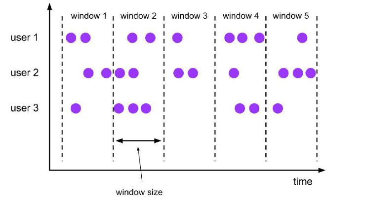
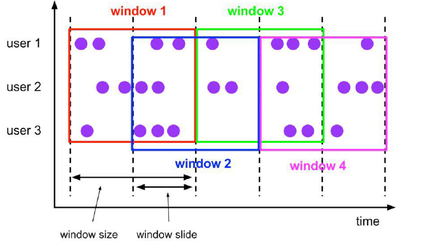
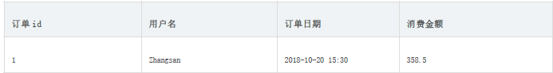

## 6.9 Flink 的状态管理

​	我们前面写的word count 的例子，没有包含状态管理。如果一个task 在处理过程中挂掉了，那么它在内存中的状态都会丢失，所有的数据都需要重新计算。从容错和消息处理的语义上(at least once, exactly once)，Flink 引入了state 和checkpoint。

​	【因此可以说flink 因为引入了**state** 和**checkpoint** 所以才支持的exactly once】

首先区分一下两个概念

**state**

​	state 一般指一个具体的task/operator 的状态

​	【state 数据默认保存在java 的堆内存中，TaskManager 节点的内存中】

​	【operator 表示一些算子在运行的过程中会产生的一些中间结果】

**checkpoint**

​	checkpoint【可以理解为checkpoint 是把state 数据定时持久化存储了】，则表示了一个Flink Job 在一个特定时刻的一份全局状态快照，即包含了所有task/operator 的状态

注意：task（subTask）是Flink 中执行的基本单位。operator 指算子(transformation)。

State 可以被记录，在失败的情况下数据还可以恢复

Flink 中有两种基本类型的State

- Keyed State
- Operator State

Keyed State 和Operator State，可以以两种形式存在：

- 原始状态(raw state)
- 托管状态(managed state)

托管状态是由Flink 框架管理的状态

【我们说operator 算子保存了数据的中间结果，中间结果保存在什么类型中，如果我们这里是托管状态，则由flink 框架自行管理】

原始状态由用户自行管理状态具体的数据结构，框架在做checkpoint 的时候，使用byte[]来读写状态内容，对其内部数据结构一无所知。

通常在DataStream 上的状态推荐使用托管的状态，当实现一个用户自定义的operator 时，会使用到原始状态。

### 6.9.1 State-Keyed State

​	基于KeyedStream 上的状态。这个状态是跟特定的key 绑定的，对KeyedStream 流上的每一个key，
都对应一个state, 比如：stream.keyBy(…)

​	KeyBy 之后的Operator State,可以理解为分区过的Operator State。

​	每个并行keyed Operator 的每个实例的每个key 都有一个Keyed State ， 即<parallel-operator-instance,key> 就是一个唯一的状态， 由于每个key 属于一个keyed Operator 的并行实例，因此我们将其简单的理解为<operator,key>。


保存state 的数据结构

**ValueState<T>**：即类型为T 的单值状态。这个状态与对应的key 绑定，是最简单的状态了。它可以通过update 方法更新状态值，通过value()方法获取状态值

**ListState<T>：**即key 上的状态值为一个列表。可以通过add 方法往列表中附加值；也可以通过get()方法返回一个Iterable<T>来遍历状态值

**ReducingState<T>：**这种状态通过用户传入的reduceFunction，每次调用add 方法添加值的时候，会调用reduceFunction，最后合并到一个单一的状态值

**MapState<UK, UV>**：即状态值为一个map。用户通过put 或putAll 方法添加元素


​	需要注意的是，以上所述的State 对象，仅仅用于与状态进行交互（更新、删除、清空等），而真正的状态值，有可能是存在内存、磁盘、或者其他分布式存储系统中。相当于我们只是持有了这个状态的句柄


```scala
import org.apache.flink.api.common.restartstrategy.RestartStrategies
import org.apache.flink.api.java.tuple.Tuple
import org.apache.flink.runtime.state.filesystem.FsStateBackend
import org.apache.flink.streaming.api.environment.CheckpointConfig.ExternalizedCheckpointCleanup
import org.apache.flink.streaming.api.scala.{DataStream, KeyedStream, StreamExecutionEnvironment}

/**
 * 编写一个基于keyedstate的实例（单词统计）
 */
object StreamMapWithStateDemo {
  def main(args: Array[String]): Unit = {

    /**
     * 初始化执行环境
     */
    val env: StreamExecutionEnvironment = StreamExecutionEnvironment.getExecutionEnvironment

    //默认情况下checkpoint是没有开启的，如果想开启的话
    //开启checkpoint的时候，设置checkpoint的周期，每5秒钟做一次checkpoint
    env.enableCheckpointing(5000)

    env.setParallelism(1)

    //指定快照的保存后端，默认是保存在内存中，但是不建议使用
    //将快照保存到本地文件或者hdfs
    //env.setStateBackend(new FsStateBackend("file:///D:/workspace/day04/output/ck"))
    env.setStateBackend(new FsStateBackend(args(0)))

    //如果程序被cancle，保留以前做的checkpoint
    //DELETE_ON_CANCELLATION：当作业被取消时，删除外部的checkpoint，只有当作业失败时，检查点状态才可用
    //RETAIN_ON_CANCELLATION：当作业被取消时，保留外部的checkpoint，注意在这个情况下，需要手动清理checkpoint的状态
    env.getCheckpointConfig.enableExternalizedCheckpoints(ExternalizedCheckpointCleanup.RETAIN_ON_CANCELLATION)

    //指定以后存储多少个checkpoint目录
    env.getCheckpointConfig.setMaxConcurrentCheckpoints(2)

    /**
     * 设置重启策略，默认的重启策略是不停的重启
     * 固定延迟重启策略: 程序出现异常的时候，重启3次，每次延迟5秒钟重启，超过3次，程序退出
     */
    env.setRestartStrategy(RestartStrategies.fixedDelayRestart(2, 5000))

    /**
     * 构建数据源
     */
    val lines: DataStream[String] = env.socketTextStream(args(1), args(2).toInt)

    import org.apache.flink.api.scala._

    //对数据进行分流操作
    val keyedDataStream: KeyedStream[(String, Int), Tuple] = lines.flatMap(_.split(" ")).map(word=>{
      if("hadoop".equals(word)){
        println(1/0)
      }
      (word, 1)
    }).keyBy(0)

    //in：是集合中的每个元素（spark， 1）
    //count: 历史的keyby后的单词数量（spark， 200）
    //要求返回值：((spark, 201), Options[s])， Options[s]：他就是state的值，就是当前累加出来的最新的单词数量
    //实际返回值：(spark, 201)
    val result: DataStream[(String, Int)] = keyedDataStream.mapWithState((in: (String, Int), count: Option[Int]) => {
      count match {
        //有历史数据
        case Some(s) => {
          //历史值和当前值进行累加，获取到最新的值
          val latest: Int = s + in._2
          //result就是累加后的单词数量（当前+历史）
          val result: (String, Int) = (in._1, latest)
          //这里就是更新历史状态，以供后续使用
          val state: Option[Int] = Some(latest)
          //result：本次计算返回的结果
          //state: 更新的最新状态
          (result, state)
        }
        //没有历史数据
        case None => {
          ((in._1, in._2), Some(in._2))
        }
      }
    })

    result.print()

    env.execute(this.getClass.getSimpleName)
  }
}
```

### 6.9.2 State-Operator State

​	与Key 无关的State，与Operator 绑定的state，整个operator 只对应一个state

​	保存state 的数据结构

​	**ListState<T>**

​**CheckpointedFunction**

CheckpointedFunction提供两种不同的状态分发方案：Even-split和 Union,该接口提供了两个方法。

Even-split：表示系统在故障恢复时，会将operator-state的元素均分给所有的operator实例，每个operator实例将获取到整个operator-state的sub-list数据。

Union：表示系统在故障恢复时，每一个operator实例可以获取到整个operator-state的全部数据。

```
1  void snapshotState(FunctionSnapshotContext context) throws Exception;
2  void initializeState(FunctionInitializationContext context) throws Exception;
```

snapshotState()：调用checkpoint()的时候，系统会调用snapshotState()对状态做快照
initializeState()：第一次启动或者从上一次状态恢复的时候，系统会调用initializeState()

样例：进行wordCount统计，在统计到一定数据阈值的情况下，才输出到下一个算子或者外围系统。

代码示例：

```scala
var env=StreamExecutionEnvironment.getExecutionEnvironment
	env.socketTextStream("hadoop01",9999)
		.flatMap(_.split(" "))
		.map((_,1))
		.keyBy(0)
		.sum(1)
		.addSink(new BufferingSink(5))
env.execute("operator_state")

class BufferingSink(threshold: Int = 0) extends SinkFunction[(String, Int)]  with CheckpointedFunction  {
    var listState:ListState[(String,Int)]=_
    val bufferedElements = ListBuffer[(String, Int)]()
    //负责将数据输出到外围系统
    override def invoke(value: (String, Int)): Unit = {
         if("hadoop".equals(value._1)){
            println(1/0)
          }
        bufferedElements += value
        if(bufferedElements.size == threshold){
            for(ele <- bufferedElements){
                println(ele)
            }
            bufferedElements.clear()
        }
    }
    //是在savepoint|checkpoint时候将数据持久化
    override def snapshotState(context: FunctionSnapshotContext): Unit = {
        listState.clear()
        for(ele <- bufferedElements){
            listState.add(ele)
        }
    }
    //状态恢复|初始化 创建状态
    override def initializeState(context: FunctionInitializationContext): Unit = {
        val lsd = new ListStateDescriptor[(String, Int)]("buffered-elements",createTypeInformation[(String,Int)])
        //context.getOperatorStateStore.getUnionState(lsd)      //Union方案
        listState=context.getOperatorStateStore.getListState(lsd)   //Even-split方案
        if(context.isRestored){
            import scala.collection.JavaConverters._
            for(element <- listState.get().asScala) {
                bufferedElements += element
            }
        }
    }
}

```

## 6.10 Flink - End-to-End Exactly-Once 语义

​	2017 年12 月Apache Flink 社区发布了1.4 版本。该版本正式引入了一个里程碑式的功能：

​	两阶段提交Sink，即TwoPhaseCommitSinkFunction。该SinkFunction 提取并封装了两阶段提交协议中的公共逻辑，自此Flink 搭配特定source 和sink（特别是0.11 版本Kafka）搭建精确一次处理语义(exactly-once semantics) 应用成为了可能。作为一个抽象类TwoPhaseCommitSinkFunction 提供了一个抽象层供用户自行实现特定方法来支持exactly-once semantics。

​	当谈及仅一次处理时，我们真正想表达的是每条输入消息只会影响最终结果一次！【译者：影响应用状态一次，而非被处理一次】即使出现机器故障或软件崩溃，Flink 也要保证不会有数据被重复处理或压根就没有被处理从而影响状态。长久以来Flink 一直宣称支持exactly-once semantics 是指在一个Flink 应用内部。在过去的几年间，Flink 开发出了checkpointing 机制，而它则是提供这种应用内仅一次处理的基石。

简单来说，一个Flink checkpoint 是一个一致性快照，它包含：

1. 应用的当前状态
2. 消费的输入流位置

​	Flink 会定期地产生checkpointcoordinate 并且把这些checkpoint 写入到一个持久化存储上，比如HDFS。这个写入过程是异步的，这就意味着Flink 即使在checkpointing 过程中也是不断处理输入数据的。

​	如果出现机器或软件故障，Flink 应用重启后会从最新成功完成的checkpoint 中恢复——重置应用状态并回滚状态到checkpoint 中输入流的正确位置，之后再开始执行数据处理，就好像该故障或崩溃从未发生过一般。

### 6.10.1 Kafka 来实现End-to-End Exactly-Once 语义

```scala
import java.util.Properties
import org.apache.flink.api.common.serialization.SimpleStringSchema
import org.apache.flink.streaming.api.CheckpointingMode
import org.apache.flink.streaming.api.environment.CheckpointConfig
import org.apache.flink.streaming.api.scala.StreamExecutionEnvironment
import org.apache.flink.streaming.connectors.kafka.FlinkKafkaProducer011
import org.apache.flink.streaming.util.serialization.KeyedSerializationSchemaWrapper
/**
* Kafka Producer 的容错-Kafka 0.9 and 0.10
* 如果Flink 开启了checkpoint，针对FlinkKafkaProducer09 和FlinkKafkaProducer010 可以提供at-least-once 的语义，还需要
配置下面两个参数
* •setLogFailuresOnly(false)
* •setFlushOnCheckpoint(true)
*
* 注意：建议修改kafka 生产者的重试次数
* retries【这个参数的值默认是0】
*
* Kafka Producer 的容错-Kafka 0.11
* 如果Flink 开启了checkpoint，针对FlinkKafkaProducer011 就可以提供exactly-once 的语义
* 但是需要选择具体的语义
* •Semantic.NONE
* •Semantic.AT_LEAST_ONCE【默认】
* •Semantic.EXACTLY_ONCE
*/
object StreamingKafkaSinkScala {
def main(args: Array[String]): Unit = {
val env = StreamExecutionEnvironment.getExecutionEnvironment
//隐式转换
import org.apache.flink.api.scala._
//checkpoint 配置
env.enableCheckpointing(5000)
env.getCheckpointConfig.setCheckpointingMode(CheckpointingMode.EXACTLY_ONCE)
env.getCheckpointConfig.setMinPauseBetweenCheckpoints(500)
env.getCheckpointConfig.setCheckpointTimeout(60000)
env.getCheckpointConfig.setMaxConcurrentCheckpoints(1)
env.getCheckpointConfig.enableExternalizedCheckpoints(CheckpointConfig.ExternalizedCheckpointCleanup.RETAIN_ON_CANCEL
LATION)
val text = env.socketTextStream("hadoop01", 9999)
val topic = "test"
val prop = new Properties()
prop.setProperty("bootstrap.servers", "hadoop01:9092")
//设置事务超时时间，也可在kafka 配置中设置
prop.setProperty("transaction.timeout.ms",60000*15+"");
//使用至少一次语义的形式
//val myProducer = new FlinkKafkaProducer<>(brokerList, topic, new SimpleStringSchema());
//使用支持仅一次语义的形式
val myProducer =
new FlinkKafkaProducer[String](topic, new KeyedSerializationSchemaWrapper[String](new SimpleStringSchema), prop,
FlinkKafkaProducer.Semantic.EXACTLY_ONCE);
text.addSink(myProducer)
env.execute("StreamingKafkaSinkScala")
}
}
```

### 

# 7、flink-SQL 开发

## 7.1 背景

Flink SQL 是Flink 实时计算为简化计算模型，降低用户使用实时计算门槛而设计的一套符合标准SQL 语义的开发语言。

自2015 年开始，阿里巴巴开始调研开源流计算引擎，最终决定基于Flink 打造新一代计算引擎，针对Flink 存在的不足进行优化和改进，并且在2019 年初将最终代码开源，也就是我们熟知的Blink。Blink 在原来的Flink 基础上最显著的一个贡献就是Flink SQL 的实现。Flink SQL 是面向用户的API 层，在我们传统的流式计算领域，比如Storm、Spark Streaming 都会提供一些Function 或者Datastream API，用户通过Java 或Scala 写业务逻辑，这种方式虽然灵活，但有一些不足，比如具备一定门槛且调优较难，随着版本的不断更新，API 也出现了很多不兼容的地方。

在这个背景下，毫无疑问，SQL 就成了我们最佳选择，之所以选择将SQL 作为核心API，是因为其具有几个非常重要的特点：

SQL 属于设定式语言，用户只要表达清楚需求即可，不需要了解具体做法；

SQL 可优化，内置多种查询优化器，这些查询优化器可为SQL 翻译出最优执行计划；

SQL 易于理解，不同行业和领域的人都懂，学习成本较低；

SQL 非常稳定，在数据库30 多年的历史中，SQL 本身变化较少；

流与批的统一，Flink 底层Runtime 本身就是一个流与批统一的引擎，而SQL 可以做到API 层的流与批统一。

## 7.2 Flink SQL 常用算子

### 7.2.1 SELECT

SELECT 用于从DataSet/DataStream 中选择数据，用于筛选出某些列。

示例：

```
SELECT * FROM Table；// 取出表中的所有列
SELECT name，age FROM Table；// 取出表中name 和age 两列
```

与此同时SELECT 语句中可以使用函数和别名，例如我们上面提到的WordCount 中：

```
SELECT word, COUNT(word) FROM table GROUP BY word;
```

### 7.2.2 WHERE

WHERE 用于从数据集/流中过滤数据，与SELECT 一起使用，用于根据某些条件对关系做水平分割，即选择符合条件的记录。

示例：

```
SELECT name，age FROM Table where name LIKE ‘% 小明%’；
SELECT * FROM Table WHERE age = 20；
```

​	WHERE 是从原数据中进行过滤，那么在WHERE 条件中，Flink SQL 同样支持=、<、>、<>、>=、<=，以及AND、OR 等表达式的组合，最终满足过滤条件的数据会被选择出来。并且WHERE 可以结合IN、NOT IN 联合使用。举个例子：

```
SELECT name, age
FROM Table
WHERE name IN (SELECT name FROM Table2)
```

### 7.2.3 DISTINCT

DISTINCT 用于从数据集/流中去重根据SELECT 的结果进行去重。
示例：

```
SELECT DISTINCT name FROM Table;
```


​	对于流式查询，计算查询结果所需的State 可能会无限增长，用户需要自己控制查询的状态范围，以防止状态过大。

### 7.2.4 GROUP BY

GROUP BY 是对数据进行分组操作。例如我们需要计算成绩明细表中，每个学生的总分。
示例：

```
SELECT name, SUM(score) as TotalScore FROM Table GROUP BY name;
```

### 7.2.5 UNION 和UNION ALL

UNION 用于将两个结果集合并起来，要求两个结果集字段完全一致，包括字段类型、字段顺序。
不同于UNION ALL 的是，UNION 会对结果数据去重。
示例：

```
SELECT * FROM T1 UNION (ALL) SELECT * FROM T2；
```

### 7.2.6 JOIN

JOIN 用于把来自两个表的数据联合起来形成结果表，Flink 支持的JOIN 类型包括：

JOIN - INNER JOIN
LEFT JOIN - LEFT OUTER JOIN
RIGHT JOIN - RIGHT OUTER JOIN
FULL JOIN - FULL OUTER JOIN

这里的JOIN 的语义和我们在关系型数据库中使用的JOIN 语义一致。

示例：

JOIN（将订单表数据和商品表进行关联）

```
SELECT * FROM Orders INNER JOIN Product ON Orders.productId = Product.id
```

LEFT JOIN 与JOIN 的区别是当右表没有与左边相JOIN 的数据时候，右边对应的字段补NULL输出，RIGHT JOIN 相当于LEFT JOIN 左右两个表交互一下位置。FULL JOIN 相当于RIGHT JOIN和LEFT JOIN 之后进行UNION ALL 操作。
示例：

```
SELECT * FROM Orders LEFT JOIN Product ON Orders.productId = Product.id
SELECT * FROM Orders RIGHT JOIN Product ON Orders.productId = Product.id
SELECT * FROM Orders FULL OUTER JOIN Product ON Orders.productId = Product.id
```

### 7.2.7 Group Window

根据窗口数据划分的不同，目前Apache Flink 有如下3 种Bounded Window：

Tumble，滚动窗口，窗口数据有固定的大小，窗口数据无叠加；

Hop，滑动窗口，窗口数据有固定大小，并且有固定的窗口重建频率，窗口数据有叠加；

Session，会话窗口，窗口数据没有固定的大小，根据窗口数据活跃程度划分窗口，窗口数据无叠加。

#### Tumble Window

Tumble 滚动窗口有固定大小，窗口数据不重叠，具体语义如下：



Tumble 滚动窗口对应的语法如下：

```
SELECT
[gk],
[TUMBLE_START(timeCol, size)],
[TUMBLE_END(timeCol, size)],
agg1(col1),
...
aggn(colN)
FROM Tab1
GROUP BY [gk], TUMBLE(timeCol, size)
```

其中：
[gk] 决定了是否需要按照字段进行聚合；
TUMBLE_START 代表窗口开始时间；
TUMBLE_END 代表窗口结束时间；
timeCol 是流表中表示时间字段；
size 表示窗口的大小，如秒、分钟、小时、天。

举个例子，假如我们要计算每个人每天的订单量，按照user 进行聚合分组：

```
SELECT user, TUMBLE_START(rowtime, INTERVAL ‘1’ DAY) as wStart, SUM(amount) FROM Orders
GROUP BY TUMBLE(rowtime, INTERVAL ‘1’ DAY), user;
```

#### Hop Window

Hop 滑动窗口和滚动窗口类似，窗口有固定的size，与滚动窗口不同的是滑动窗口可以通过slide 参数控制滑动窗口的新建频率。因此当slide 值小于窗口size 的值的时候多个滑动窗口会重叠，具体语义如下：



Hop 滑动窗口对应语法如下：

```
SELECT
[gk],
[HOP_START(timeCol, slide, size)] ,
[HOP_END(timeCol, slide, size)],
agg1(col1),
...
aggN(colN)
FROM Tab1
GROUP BY [gk], HOP(timeCol, slide, size)
```

每次字段的意思和Tumble 窗口类似：

[gk] 决定了是否需要按照字段进行聚合；

HOP_START 表示窗口开始时间；

HOP_END 表示窗口结束时间；

timeCol 表示流表中表示时间字段；

slide 表示每次窗口滑动的大小；

size 表示整个窗口的大小，如秒、分钟、小时、天。

举例说明，我们要每过一小时计算一次过去24 小时内每个商品的销量：

```
SELECT product, SUM(amount) FROM Orders GROUP BY HOP(rowtime, INTERVAL '1' HOUR, INTERVAL
'1' DAY), product
```

#### Session Window

会话时间窗口没有固定的持续时间，但它们的界限由interval 不活动时间定义，即如果在定义的间隙期间没有出现事件，则会话窗口关闭。

Session 会话窗口对应语法如下：

```
SELECT
[gk],
SESSION_START(timeCol, gap) AS winStart,
SESSION_END(timeCol, gap) AS winEnd,
agg1(col1),
...
aggn(colN)
FROM Tab1
GROUP BY [gk], SESSION(timeCol, gap)
```

[gk] 决定了是否需要按照字段进行聚合；

SESSION_START 表示窗口开始时间；

SESSION_END 表示窗口结束时间；

timeCol 表示流表中表示时间字段；

gap 表示窗口数据非活跃周期的时长。

例如，我们需要计算每个用户访问时间12 小时内的订单量：

```
SELECT user, SESSION_START(rowtime, INTERVAL ‘12’ HOUR) AS sStart,
SESSION_ROWTIME(rowtime, INTERVAL ‘12’ HOUR) AS sEnd, SUM(amount) FROM Orders GROUP
BY SESSION(rowtime, INTERVAL ‘12’ HOUR), user
```

Table API 和SQL 捆绑在flink-table Maven 工件中。必须将以下依赖项添加到你的项目才能使用Table API 和SQL：

```
<dependency>
  <groupId>org.apache.flink</groupId>
  <artifactId>flink-table-api-scala-bridge_2.12</artifactId>
  <version>1.10.1</version>
</dependency>
<dependency>
  <groupId>org.apache.flink</groupId>
  <artifactId>flink-table-planner-blink_2.12</artifactId>
  <version>1.10.1</version>
</dependency>
<dependency>
  <groupId>org.apache.flink</groupId>
  <artifactId>flink-table-common</artifactId>
  <version>1.10.1</version>
</dependency>
<dependency>
  <groupId>org.apache.flink</groupId>
  <artifactId>flink-table-planner_2.12</artifactId>
  <version>1.10.1</version>
</dependency>
```

另外，你需要为Flink 的Scala 批处理或流式API 添加依赖项。对于批量查询，您需要添加：

```
<dependency>
<groupId>org.apache.flink</groupId>
<artifactId>flink-scala_2.12</artifactId>
<version>1.10.1</version>
</dependency>
```

## 7.3 Flink SQL 实战应用

### 7.3.1 批数据SQL

用法

1) 构建Table 运行环境

2) 将DataSet 注册为一张表

3) 使用Table 运行环境的sqlQuery 方法来执行SQL 语句

示例
使用Flink SQL 统计用户消费订单的总金额、最大金额、最小金额、订单总数。



测试数据（订单ID、用户名、订单日期、订单金额）

```
(1,"zhangsan","2018-10-20 15:30",358.5),
(2,"zhangsan","2018-10-20 16:30",131.5),
(3,"lisi","2018-10-20 16:30",127.5),
(4,"lisi","2018-10-20 16:30",328.5),
(5,"lisi","2018-10-20 16:30",432.5),
(6,"zhaoliu","2018-10-20 22:30",451.0),
(7,"zhaoliu","2018-10-20 22:30",362.0),
(8,"zhaoliu","2018-10-20 22:30",364.0),
(9,"zhaoliu","2018-10-20 22:30",341.0)
```

步骤

1) 获取一个批处理运行环境

2) 获取一个Table 运行环境

3) 创建一个样例类Order 用来映射数据（订单名、用户名、订单日期、订单金额）

4) 基于本地Order 集合创建一个DataSet source

5) 使用Table 运行环境将DataSet 注册为一张表

6) 使用SQL 语句来操作数据（统计用户消费订单的总金额、最大金额、最小金额、订单总数）

7) 使用TableEnv.toDataSet 将Table 转换为DataSet

8) 打印测试

参考代码

```scala
import org.apache.flink.api.scala.ExecutionEnvironment
import org.apache.flink.table.api.{Table, TableEnvironment}
import org.apache.flink.table.api.scala.BatchTableEnvironment
import org.apache.flink.api.scala._
import org.apache.flink.types.Row
/**
订单id 用户名订单日期消费金额
1 Zhangsan 2018-10-20 15:30 358.5
* 使用Flink SQL 统计用户消费订单的总金额、最大金额、最小金额、订单总数。
*/
object BatchFlinkSqlDemo {
//3. 创建一个样例类Order 用来映射数据（订单名、用户名、订单日期、订单金额）
case class Order(id:Int, userName:String, createTime:String, money:Double)
def main(args: Array[String]): Unit = {
/**
* 实现思路：
* 1. 获取一个批处理运行环境
* 2. 获取一个Table 运行环境
* 3. 创建一个样例类Order 用来映射数据（订单名、用户名、订单日期、订单金额）
* 4. 基于本地Order 集合创建一个DataSet source
* 5. 使用Table 运行环境将DataSet 注册为一张表
* 6. 使用SQL 语句来操作数据（统计用户消费订单的总金额、最大金额、最小金额、订单总数）
* 7. 使用TableEnv.toDataSet 将Table 转换为DataSet
* 8. 打印测试
*/
//1. 获取一个批处理运行环境
val env: ExecutionEnvironment = ExecutionEnvironment.getExecutionEnvironment
//2. 获取一个Table 运行环境
val tabEnv: BatchTableEnvironment = BatchTableEnvironment.create(env)
//4. 基于本地Order 集合创建一个DataSet source
val orderDataSet: DataSet[Order] = env.fromElements(
Order(1, "zhangsan", "2018-10-20 15:30", 358.5),
Order(2, "zhangsan", "2018-10-20 16:30", 131.5),
Order(3, "lisi", "2018-10-20 16:30", 127.5),
Order(4, "lisi", "2018-10-20 16:30", 328.5),
Order(5, "lisi", "2018-10-20 16:30", 432.5),
Order(6, "zhaoliu", "2018-10-20 22:30", 451.0),
Order(7, "zhaoliu", "2018-10-20 22:30", 362.0),
Order(8, "zhaoliu", "2018-10-20 22:30", 364.0),
Order(9, "zhaoliu", "2018-10-20 22:30", 341.0)
)
//5. 使用Table 运行环境将DataSet 注册为一张表
tabEnv.createTemporaryView("t_order", orderDataSet)
//6. 使用SQL 语句来操作数据（统计用户消费订单的总金额、最大金额、最小金额、订单总数）
//用户消费订单的总金额、最大金额、最小金额、订单总数。
val sql =
"""
| select
| userName,
| sum(money) totalMoney,
| max(money) maxMoney,
| min(money) minMoney,
| count(1) totalCount
| from t_order
| group by userName
|""".stripMargin
//7. 使用TableEnv.toDataSet 将Table 转换为DataSet
val table: Table = tabEnv.sqlQuery(sql)
table.printSchema()
tabEnv.toDataSet[Row](table).print()
env.execute("BatchFlinkSqlDemo")
}
}
```

### 7.3.2 流数据SQL

流处理中也可以支持SQL。但是需要注意以下几点：

1) 要使用流处理的SQL，必须要添加水印时间
2) 使用registerDataStream 注册表的时候，使用' 来指定字段
3) 注册表的时候，必须要指定一个rowtime，否则无法在SQL 中使用窗口
4) 必须要导入import org.apache.flink.table.api.scala._ 隐式参数
5) SQL 中使用tumble(时间列名, interval '时间' sencond) 来进行定义窗口

示例

使用Flink SQL 来统计5 秒内用户的订单总数、订单的最大金额、订单的最小金额。

步骤

1) 获取流处理运行环境
2) 获取Table 运行环境
3) 设置处理时间为EventTime
4) 创建一个订单样例类Order ，包含四个字段（订单ID、用户ID、订单金额、时间戳）
5) 创建一个自定义数据源

a. 使用for 循环生成1000 个订单
b. 随机生成订单ID（UUID）
c. 随机生成用户ID（0-2）
d. 随机生成订单金额（0-100）
e. 时间戳为当前系统时间
f. 每隔1 秒生成一个订单

6) 添加水印，允许延迟2 秒
7) 导入import org.apache.flink.table.api.scala._ 隐式参数
8) 使用registerDataStream 注册表，并分别指定字段，还要指定rowtime 字段
9) 编写SQL 语句统计用户订单总数、最大金额、最小金额
分组时要使用tumble(时间列, interval '窗口时间' second) 来创建窗口
10) 使用tableEnv.sqlQuery 执行sql 语句
11) 将SQL 的执行结果转换成DataStream 再打印出来
12) 启动流处理程序


```scala
import java.util.UUID
import java.util.concurrent.TimeUnit
import org.apache.flink.streaming.api.TimeCharacteristic
import org.apache.flink.streaming.api.functions.source.{RichSourceFunction, SourceFunction}
import org.apache.flink.streaming.api.scala.{DataStream, StreamExecutionEnvironment}
import org.apache.flink.table.api.{Table, TableEnvironment}
import org.apache.flink.api.scala._
import org.apache.flink.streaming.api.functions.AssignerWithPeriodicWatermarks
import org.apache.flink.streaming.api.functions.timestamps.BoundedOutOfOrdernessTimestampExtractor
import org.apache.flink.streaming.api.watermark.Watermark
import org.apache.flink.streaming.api.windowing.time.Time
import org.apache.flink.types.Row
import scala.util.Random
/**
* 需求：
* 使用Flink SQL 来统计5 秒内用户的订单总数、订单的最大金额、订单的最小金额
*
* timestamp 是关键字不能作为字段的名字（关键字不能作为字段名字）
*/
object StreamFlinkSqlDemo {
/**
* 1. 获取流处理运行环境
* 2. 获取Table 运行环境
* 3. 设置处理时间为EventTime
* 4. 创建一个订单样例类Order ，包含四个字段（订单ID、用户ID、订单金额、时间戳）
* 5. 创建一个自定义数据源
* 使用for 循环生成1000 个订单
* 随机生成订单ID（UUID）
* 随机生成用户ID（0-2）
* 随机生成订单金额（0-100）
* 时间戳为当前系统时间
* 每隔1 秒生成一个订单
* 6. 添加水印，允许延迟2 秒
* 7. 导入import org.apache.flink.table.api.scala._ 隐式参数
* 8. 使用registerDataStream 注册表，并分别指定字段，还要指定rowtime 字段
* 9. 编写SQL 语句统计用户订单总数、最大金额、最小金额
* 分组时要使用tumble(时间列, interval '窗口时间' second) 来创建窗口
* 10. 使用tableEnv.sqlQuery 执行sql 语句
* 11. 将SQL 的执行结果转换成DataStream 再打印出来
* 12. 启动流处理程序
*/
// 3. 创建一个订单样例类`Order`，包含四个字段（订单ID、用户ID、订单金额、时间戳）
case class Order(orderId:String, userId:Int, money:Long, createTime:Long)
def main(args: Array[String]): Unit = {
// 1. 创建流处理运行环境
val env: StreamExecutionEnvironment = StreamExecutionEnvironment.getExecutionEnvironment
// 2. 设置处理时间为`EventTime`
env.setStreamTimeCharacteristic(TimeCharacteristic.EventTime)
//获取table 的运行环境
val tableEnv = StreamTableEnvironment.create(env)
// 4. 创建一个自定义数据源
val orderDataStream = env.addSource(new RichSourceFunction[Order] {
var isRunning = true
override def run(ctx: SourceFunction.SourceContext[Order]): Unit = {
// - 随机生成订单ID（UUID）
// - 随机生成用户ID（0-2）
// - 随机生成订单金额（0-100）
// - 时间戳为当前系统时间
// - 每隔1 秒生成一个订单
for (i <- 0 until 1000 if isRunning) {
val order = Order(UUID.randomUUID().toString, Random.nextInt(3), Random.nextInt(101),
System.currentTimeMillis())
TimeUnit.SECONDS.sleep(1)
ctx.collect(order)
}
}
override def cancel(): Unit = { isRunning = false }
})
// 5. 添加水印，允许延迟2 秒
val watermarkDataStream = orderDataStream.assignTimestampsAndWatermarks(
new BoundedOutOfOrdernessTimestampExtractor[Order](Time.seconds(2)) {
override def extractTimestamp(element: Order): Long = {
val eventTime = element.createTime
eventTime
}
}
)
// 6. 导入`import org.apache.flink.table.api.scala._`隐式参数
// 7. 使用`registerDataStream`注册表，并分别指定字段，还要指定rowtime 字段
import org.apache.flink.table.api.scala._
tableEnv.createTemporaryView("t_order", watermarkDataStream, 'orderId, 'userId, 'money,'createTime.rowtime)
// 8. 编写SQL 语句统计用户订单总数、最大金额、最小金额
// - 分组时要使用`tumble(时间列, interval '窗口时间' second)`来创建窗口
val sql =
"""
|select
| userId,
| count(1) as totalCount,
| max(money) as maxMoney,
| min(money) as minMoney
| from
| t_order
| group by
| tumble(createTime, interval '5' second),
| userId
""".stripMargin
// 9. 使用`tableEnv.sqlQuery`执行sql 语句
val table: Table = tableEnv.sqlQuery(sql)
// 10. 将SQL 的执行结果转换成DataStream 再打印出来
table.toRetractStream[Row].print()
env.execute("StreamSQLApp")
}
}
```

